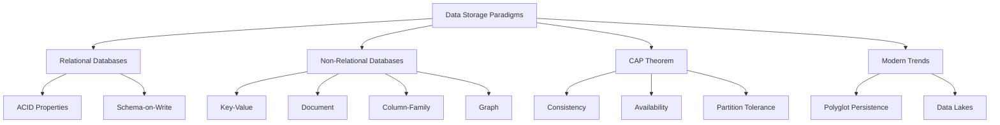

# Migration in progress
# W01 : Foundations of Data Storage Paradigms

Data storage is the foundation of any data-driven application. Choosing the right storage paradigm depends on the nature of the data, access patterns, consistency requirements, and scalability needs. This lesson explores the evolution of data storage, contrasts relational and non-relational models, introduces the CAP theorem, and outlines modern hybrid approaches. Understanding these fundamentals is critical for designing efficient data pipelines and architectures.

## Relational Databases (RDBMS)

Relational databases have been the standard for decades, organizing data into tables with rows and columns.

### Core Characteristics

-   **Structured Schema**: Data must conform to a predefined schema (tables, columns, types).
-   **SQL Interface**: Uses Structured Query Language for querying and manipulation.
-   **Relationships**: Supports foreign keys to link tables (One-to-One, One-to-Many, Many-to-Many).
-   **Normalization**: Reduces redundancy by splitting data into related tables.

### ACID Properties

Relational databases guarantee ACID transactions, ensuring reliability for critical operations.

-   **Atomicity**: Transactions are all-or-nothing. If one part fails, the entire transaction rolls back.
-   **Consistency**: Data moves from one valid state to another, enforcing constraints.
-   **Isolation**: Concurrent transactions do not interfere with each other.
-   **Durability**: Once committed, data persists even in case of system failure.

### Use Cases

-   Financial systems (banking, payments).
-   Inventory management.
-   Enterprise Resource Planning (ERP).
-   Any application requiring strong consistency and complex joins.

> [!Important]
> **Schema-on-Write**: In RDBMS, you define the structure before inserting data. This ensures data quality but reduces flexibility. Changing the schema later (e.g., adding a column) can be expensive and disruptive in large systems.

## Non-Relational Databases (NoSQL)

NoSQL databases emerged to handle big data, real-time web apps, and unstructured data. They sacrifice some relational features for scalability and flexibility.

### Key-Value Stores

-   Simplest model: Unique key maps to a value.
-   Extremely fast read/write operations.
-   Examples: Amazon DynamoDB, Redis.
-   Use Case: Session storage, caching, user profiles.

### Document Stores

-   Store data as documents (JSON, BSON, XML).
-   Schema-less or flexible schema.
-   Nested structures allow storing related data together.
-   Examples: MongoDB, Amazon DocumentDB.
-   Use Case: Content management, catalogs, user data with varying attributes.

### Column-Family Stores

-   Store data in columns rather than rows.
-   Optimized for queries over large datasets.
-   Highly scalable and distributed.
-   Examples: Apache Cassandra, Amazon Keyspaces.
-   Use Case: Time-series data, logging, analytics.

### Graph Databases

-   Store data as nodes (entities) and edges (relationships).
-   Optimized for traversing relationships.
-   Examples: Neo4j, Amazon Neptune.
-   Use Case: Social networks, recommendation engines, fraud detection.

| Type | Data Model | Best For | Example |
|---|---|---|---|
| Key-Value | Key -> Value | High-speed lookup | Redis |
| Document | JSON/BSON | Flexible schema | MongoDB |
| Column-Family | Columns | Large-scale analytics | Cassandra |
| Graph | Nodes/Edges | Complex relationships | Neo4j |

> [!Tip]
> **Schema-on-Read**: NoSQL databases often use schema-on-read, meaning structure is applied when data is queried, not when it is stored. This allows rapid ingestion of varied data formats but shifts validation responsibility to the application layer.

## The CAP Theorem

The CAP theorem states that a distributed data store can only provide two of the following three guarantees simultaneously.

### Consistency (C)

-   Every read receives the most recent write or an error.
-   All nodes see the same data at the same time.
-   Critical for financial transactions.

### Availability (A)

-   Every request receives a response, without guarantee that it contains the most recent write.
-   The system remains operational even if some nodes fail.
-   Critical for user-facing web applications.

### Partition Tolerance (P)

-   The system continues to operate despite arbitrary message loss or failure of part of the system.
-   Essential for distributed systems across networks.

### Trade-offs

-   **CP (Consistency + Partition Tolerance)**: System ensures data accuracy but may become unavailable during network partitions. Example: HBase, MongoDB (default).
-   **AP (Availability + Partition Tolerance)**: System remains available but may return stale data during partitions. Example: Cassandra, DynamoDB.
-   **CA (Consistency + A