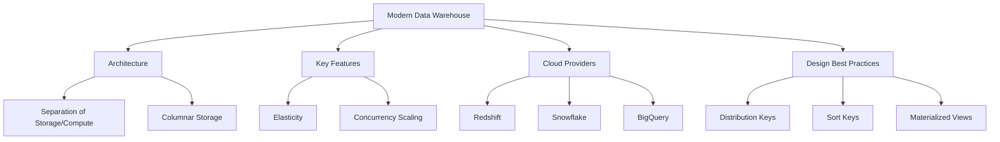
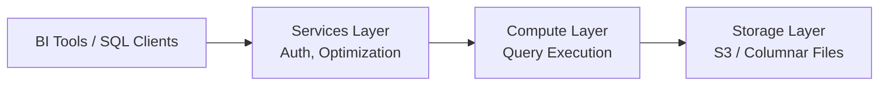

# Migration in progress
# Lesson: Modern Data Warehousing

Modern data warehousing has evolved from on-premise, hardware-bound appliances to cloud-native, serverless platforms that separate storage from compute. This lesson explores the architecture of modern data warehouses, key features like elasticity and concurrency scaling, major cloud providers, and best practices for design and performance optimization. Understanding these concepts is essential for building scalable analytics solutions.

## Evolution from Traditional to Modern

Traditional data warehouses were monolithic appliances where storage and compute were tightly coupled. Scaling required buying more hardware, leading to over-provisioning and high costs.

### Traditional Limitations

-   **Coupled Architecture**: Adding storage meant adding compute, and vice versa.
-   **Fixed Capacity**: Difficult to handle spiky workloads; either under-utilized or bottlenecked.
-   **High Maintenance**: Required dedicated DBAs for patching, tuning, and backups.
-   **Data Silos**: Hard to integrate with external data sources or data lakes.

### Modern Cloud-Native Advantages

-   **Decoupled Storage and Compute**: Scale storage and processing power independently.
-   **Serverless Options**: Pay only for queries run or resources used, no infrastructure management.
-   **Elasticity**: Automatically scale up during peak loads and down during idle times.
-   **Unified Data Platform**: Seamless integration with data lakes, streaming, and machine learning tools.

> [!Important]
> **Storage is cheap, compute is expensive**: Modern architectures leverage cheap object storage (S3, Blob) for historical data and spin up powerful compute clusters only when needed for querying. This model drastically reduces total cost of ownership.

## Core Architecture of Modern Warehouses

Most modern cloud data warehouses share a similar three-layer architecture.

### 1. Storage Layer

-   Built on durable, low-cost object storage (e.g., Amazon S3, Google Cloud Storage).
-   Uses columnar file formats (Parquet, ORC) for efficient compression and scanning.
-   Data is replicated across multiple availability zones for durability.
-   Separated from compute, allowing multiple compute clusters to access the same data.

### 2. Compute Layer

-   Stateless processing engines that execute SQL queries.
-   Can scale horizontally by adding more nodes or vertically by increasing node size.
-   In serverless models, compute resources are provisioned automatically per query.
-   Supports parallel processing for fast aggregation of large datasets.

### 3. Services Layer

-   Handles authentication, authorization, and metadata management.
-   Manages query optimization, compilation, and scheduling.
-   Provides interfaces for BI tools, SQL clients, and APIs.
-   Ensures security and governance across the platform.

## Key Features of Modern Warehouses

### Elasticity and Auto-Scaling

-   **Auto-Scale**: Automatically adds or removes compute nodes based on workload demand.
-   **Multi-Cluster**: Allows multiple independent clusters to query the same data simultaneously without contention.
-   **Benefit**: Handles sudden spikes in user activity or batch loading without manual intervention.

### Concurrency Scaling

-   Adds temporary capacity to handle hundreds of concurrent users.
-   Routes queries to additional clusters seamlessly.
-   Ensures consistent performance even during peak reporting hours.
-   Charged only for the time extra capacity is used.

### Zero-Copy Cloning

-   Creates instant copies of databases or tables without duplicating physical data.
-   Uses metadata pointers to reference existing storage blocks.
-   Ideal for development, testing, and disaster recovery scenarios.
-   Saves significant storage costs and time.

### Data Sharing

-   Securely shares live data with other accounts or organizations without moving it.
-   Provider maintains control; consumer sees real-time updates.
-   Eliminates complex ETL pipelines for external reporting.
-   Enables data marketplaces and partner ecosystems.

## Major Cloud Data Warehouses

### Amazon Redshift

-   **Architecture**: Massively Parallel Processing (MPP).
-   **Features**: Redshift Spectrum (query S3 directly), Auto-copy, Machine Learning integration.
-   **Best For**: AWS-centric ecosystems, large-scale enterprise warehousing.
-   **Pricing**: Node-based or Serverless (Redshift Serverless).

### Snowflake

-   **Architecture**: Multi-cluster shared data architecture.
-   **Features**: True separation of storage/compute, Zero-copy cloning, Secure Data Sharing.
-   **Best For**: Multi-cloud strategies, ease of use, rapid scaling.
-   **Pricing**: Credits based on compute usage; storage billed separately.

### Google BigQuery

-   **Architecture**: Serverless, fully managed.
-   **Features**: No infrastructure management, built-in ML (BigQuery ML), GIS support.
-   **Best For**: Serverless simplicity, massive scale, Google Cloud users.
-   **Pricing**: On-demand (per TB scanned) or Flat-rate