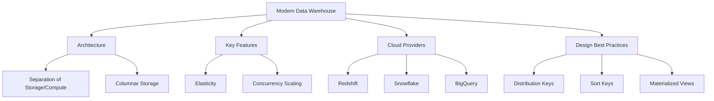
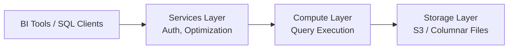

# Lesson: Modern Data Warehousing

Modern data warehousing has evolved from on-premise, hardware-bound appliances to cloud-native, serverless platforms that separate storage from compute. This lesson explores the architecture of modern data warehouses, key features like elasticity and concurrency scaling, major cloud providers, and best practices for design and performance optimization. Understanding these concepts is essential for building scalable analytics solutions.

## Evolution from Traditional to Modern

Traditional data warehouses were monolithic appliances where storage and compute were tightly coupled. Scaling required buying more hardware, leading to over-provisioning and high costs.

### Traditional Limitations

-   **Coupled Architecture**: Adding storage meant adding compute, and vice versa.
-   **Fixed Capacity**: Difficult to handle spiky workloads; either under-utilized or bottlenecked.
-   **High Maintenance**: Required dedicated DBAs for patching, tuning, and backups.
-   **Data Silos**: Hard to integrate with external data sources or data lakes.

### Modern Cloud-Native Advantages

-   **Decoupled Storage and Compute**: Scale storage and processing power independently.
-   **Serverless Options**: Pay only for queries run or resources used, no infrastructure management.
-   **Elasticity**: Automatically scale up during peak loads and down during idle times.
-   **Unified Data Platform**: Seamless integration with data lakes, streaming, and machine learning tools.

> [!Important]
> **Storage is cheap, compute is expensive**: Modern architectures leverage cheap object storage (S3, Blob) for historical data and spin up powerful compute clusters only when needed for querying. This model drastically reduces total cost of ownership.

## Core Architecture of Modern Warehouses

Most modern cloud data warehouses share a similar three-layer architecture.

### 1. Storage Layer

-   Built on durable, low-cost object storage (e.g., Amazon S3, Google Cloud Storage).
-   Uses columnar file formats (Parquet, ORC) for efficient compression and scanning.
-   Data is replicated across multiple availability zones for durability.
-   Separated from compute, allowing multiple compute clusters to access the same data.

### 2. Compute Layer

-   Stateless processing engines that execute SQL queries.
-   Can scale horizontally by adding more nodes or vertically by increasing node size.
-   In serverless models, compute resources are provisioned automatically per query.
-   Supports parallel processing for fast aggregation of large datasets.

### 3. Services Layer

-   Handles authentication, authorization, and metadata management.
-   Manages query optimization, compilation, and scheduling.
-   Provides interfaces for BI tools, SQL clients, and APIs.
-   Ensures security and governance across the platform.

## Key Features of Modern Warehouses

### Elasticity and Auto-Scaling

-   **Auto-Scale**: Automatically adds or removes compute nodes based on workload demand.
-   **Multi-Cluster**: Allows multiple independent clusters to query the same data simultaneously without contention.
-   **Benefit**: Handles sudden spikes in user activity or batch loading without manual intervention.

### Concurrency Scaling

-   Adds temporary capacity to handle hundreds of concurrent users.
-   Routes queries to additional clusters seamlessly.
-   Ensures consistent performance even during peak reporting hours.
-   Charged only for the time extra capacity is used.

### Zero-Copy Cloning

-   Creates instant copies of databases or tables without duplicating physical data.
-   Uses metadata pointers to reference existing storage blocks.
-   Ideal for development, testing, and disaster recovery scenarios.
-   Saves significant storage costs and time.

### Data Sharing

-   Securely shares live data with other accounts or organizations without moving it.
-   Provider maintains control; consumer sees real-time updates.
-   Eliminates complex ETL pipelines for external reporting.
-   Enables data marketplaces and partner ecosystems.

## Major Cloud Data Warehouses

### Amazon Redshift

-   **Architecture**: Massively Parallel Processing (MPP).
-   **Features**: Redshift Spectrum (query S3 directly), Auto-copy, Machine Learning integration.
-   **Best For**: AWS-centric ecosystems, large-scale enterprise warehousing.
-   **Pricing**: Node-based or Serverless (Redshift Serverless).

### Snowflake

-   **Architecture**: Multi-cluster shared data architecture.
-   **Features**: True separation of storage/compute, Zero-copy cloning, Secure Data Sharing.
-   **Best For**: Multi-cloud strategies, ease of use, rapid scaling.
-   **Pricing**: Credits based on compute usage; storage billed separately.

### Google BigQuery

-   **Architecture**: Serverless, fully managed.
-   **Features**: No infrastructure management, built-in ML (BigQuery ML), GIS support.
-   **Best For**: Serverless simplicity, massive scale, Google Cloud users.
-   **Pricing**: On-demand (per TB scanned) or Flat-rate (slots).

| Feature | Redshift | Snowflake | BigQuery |
|---|---|---|---|
| **Management** | Managed / Serverless | Fully Managed | Fully Serverless |
| **Scaling** | Manual / Auto | Auto / Multi-Cluster | Automatic |
| **Storage** | Local / S3 Spectrum | Internal / External | Internal / Cloud Storage |
| **Language** | SQL (PostgreSQL compatible) | SQL | SQL (Google Standard) |
| **Unique Strength** | Deep AWS Integration | Data Sharing / Cloning | Zero Ops / ML Integration |

## Design Best Practices

Even in modern cloud warehouses, poor design leads to slow queries and high costs.

### Distribution Keys (DistKeys)

-   Determines how data is distributed across nodes in an MPP system.
-   **KEY**: Distributes rows with the same value to the same node. Optimizes joins.
-   **ALL**: Copies small tables to all nodes. Good for dimension tables.
-   **EVEN**: Random distribution. Default if no key specified.
-   **Goal**: Minimize data movement (shuffling) during joins.

### Sort Keys

-   Determines the order in which data is stored on disk.
-   **Range Scan**: If you frequently filter by `date`, sort by `date`. The engine can skip blocks that don't match.
-   **Compound vs. Interleaved**: Compound sorts by multiple columns in order; Interleaved allows flexibility for different query patterns.
-   **Benefit**: Improves query performance via zone map pruning.

### Materialized Views

-   Pre-computed results of complex queries stored as physical tables.
-   Automatically refreshed when underlying data changes.
-   Drastically speeds up recurring reports and dashboards.
-   Trade-off: Increased storage cost and write overhead.

### Partitioning and Clustering

-   **Partitioning**: Physically separates data into folders (e.g., by year/month). Essential for big data.
-   **Clustering**: Organizes data within partitions based on column values.
-   **Benefit**: Reduces the amount of data scanned per query, lowering cost and latency.

> [!Tip]
> **Analyze Query Performance**: Use system tables (e.g., `STL_QUERY` in Redshift) to identify slow queries. Look for high "rows scanned" vs. "rows returned" ratios. Adjust sort keys and distribution styles accordingly.

## Assessment Preparation

### Practice Questions

1.  What is the primary benefit of separating storage and compute?
2.  Explain how concurrency scaling improves user experience.
3.  Compare Amazon Redshift, Snowflake, and Google BigQuery.
4.  What is Zero-Copy Cloning and why is it useful?
5.  How do Distribution Keys affect join performance?
6.  Why are Sort Keys important for query optimization?
7.  What is the difference between a standard view and a materialized view?
8.  How does columnar storage contribute to warehouse performance?
9.  What is Redshift Spectrum or Snowflake External Tables?
10. Why is partitioning critical for large datasets?

### Scenario Questions

**Scenario 1: Spiky Retail Reporting**
Retailer has heavy reporting on Monday mornings but low usage rest of week.

-   **Solution**: Use Auto-Scaling or Serverless warehouse.
-   **Benefit**: Scale up for Monday rush, scale down to minimal capacity afterward.
-   **Cost**: Pay only for peak usage time, not idle capacity.

**Scenario 2: Development Environment Setup**
Need to test schema changes without affecting production.

-   **Solution**: Use Zero-Copy Cloning to create instant dev copy of prod database.
-   **Benefit**: No data duplication cost; instant setup; safe isolation.
-   **Process**: Clone prod -> Test changes -> Drop clone when done.

**Scenario 3: Cross-Company Data Sharing**
Supplier wants to share inventory levels with retailer securely.

-   **Solution**: Use Secure Data Sharing (Snowflake Share or Redshift Data Sharing).
-   **Benefit**: No ETL pipeline needed; retailer sees live data; supplier retains control.
-   **Security**: Grant access to specific accounts; no data movement.

**Scenario 4: Slow Join Queries**
Joins between large fact table and dimension table are slow.

-   **Diagnosis**: Data is shuffling across nodes during join.
-   **Fix**: Set Distribution Key on join column for both tables.
-   **Result**: Co-locate related rows on same nodes; eliminate network transfer.

**Scenario 5: High Cost of Scanning**
BigQuery bill is high due to full table scans.

-   **Fix**: Implement Partitioning by date and Clustering by customer ID.
-   **Benefit**: Queries only scan relevant partitions/blocks.
-   **Optimization**: Avoid `SELECT *`; select only necessary columns.

## Key Takeaways

-   Modern warehouses decouple storage and compute for flexibility and cost efficiency.
-   Elasticity and concurrency scaling handle variable workloads automatically.
-   Redshift, Snowflake, and BigQuery are leading cloud-native solutions.
-   Zero-copy cloning enables rapid development and testing without storage penalties.
-   Distribution Keys optimize data placement for joins; Sort Keys optimize scanning.
-   Materialized views speed up recurring complex queries.
-   Partitioning and clustering reduce data scanned, lowering cost and latency.
-   Secure data sharing eliminates complex ETL for external partners.
-   Columnar storage and compression are fundamental to analytical performance.
-   Continuous monitoring and tuning are required for optimal performance.

> [!Important]
> **Design for your query patterns**: There is no single "best" distribution or sort key. Analyze your most frequent and expensive queries. Optimize for the 80% of workloads that drive the most cost and latency. Use automation where possible, but understand the underlying mechanics to troubleshoot effectively. Modern warehouses are powerful, but they still require thoughtful data modeling.
