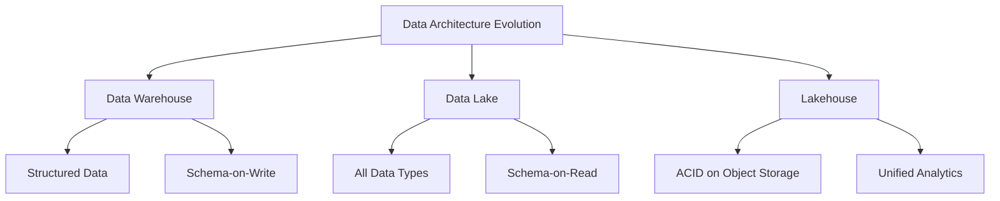
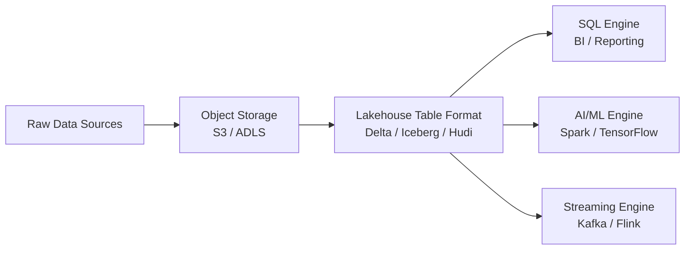

# W03 : Data Lakes and Lakehouse Foundations

As data volume, variety, and velocity increase, traditional data warehouses struggle to handle unstructured data and raw ingestion. Data Lakes emerged as a solution for storing massive amounts of raw data, but they often lacked governance and performance. The Lakehouse architecture combines the best of both worlds: the flexibility and scale of Data Lakes with the management and performance of Data Warehouses. This lesson explores these architectures, their components, and the technologies that enable them.

## The Data Lake

A Data Lake is a centralized repository that allows you to store all your structured and unstructured data at any scale. You can store your data as-is, without having to first structure the data, and run different types of analytics—from dashboards and visualizations to big data processing, real-time analytics, and machine learning.

### Core Characteristics

-   **Raw Storage**: Stores data in its native format (JSON, CSV, Parquet, images, logs).
-   **Schema-on-Read**: Structure is applied only when data is queried or analyzed.
-   **Scalability**: Built on object storage (e.g., Amazon S3, Azure Blob), offering virtually unlimited capacity.
-   **Cost-Effective**: Significantly cheaper per gigabyte than traditional warehouse storage.
-   **Flexibility**: Supports diverse workloads: BI, ML, AI, and real-time analytics.

### Challenges of Traditional Data Lakes

-   **Data Swamps**: Without governance, lakes become disorganized repositories of unused data.
-   **Poor Performance**: Querying raw files directly is slower than optimized warehouse formats.
-   **Lack of ACID**: No support for transactions; concurrent writes can corrupt data.
-   **Security & Governance**: Harder to enforce fine-grained access control on raw files.

> [!Important]
> **A Data Lake is not just a dump**: It requires strict metadata management, cataloging, and lifecycle policies. Without these, it becomes a "Data Swamp" where data is inaccessible, untrusted, and costly to maintain.

## The Lakehouse Architecture

The Lakehouse is a new paradigm that implements a data management structure similar to a data warehouse directly on top of low-cost cloud storage in open formats.

### Key Principles

-   **ACID Transactions**: Ensures data integrity and consistency using transaction logs (like Delta Log or Iceberg Metadata).
-   **Schema Enforcement & Governance**: Supports schema evolution and validation while maintaining flexibility.
-   **Open Formats**: Uses standard file formats like Parquet and ORC, avoiding vendor lock-in.
-   **Unified Storage**: One copy of data serves both BI (SQL) and AI/ML (Python/R) workloads.
-   **Decoupled Compute**: Multiple engines (Spark, Presto, Trino) can query the same data simultaneously.

### Benefits over Traditional Architectures

| Feature | Data Warehouse | Data Lake | Lakehouse |
|---|---|---|---|
| **Data Type** | Structured Only | All Types | All Types |
| **Cost** | High | Low | Low |
| **Reliability** | High (ACID) | Low | High (ACID) |
| **Performance** | High | Variable | High (Optimized) |
| **Use Cases** | BI / Reporting | ML / Raw Storage | BI + ML + AI |
| **Vendor Lock-in** | High | Low | Low (Open Formats) |

## Enabling Technologies: Table Formats

The magic of the Lakehouse lies in the table format layer, which adds a metadata layer on top of raw files to provide database-like features.

### Apache Delta Lake

-   Developed by Databricks.
-   Adds ACID transactions to Spark jobs.
-   Supports schema enforcement and evolution.
-   Features: Time Travel (query historical versions), Upserts/Merges.
-   Strong integration with Spark ecosystem.

### Apache Iceberg

-   Developed by Netflix.
-   Focuses on huge analytic tables with high partitioning.
-   Hidden partitioning: Users don’t need to know physical layout.
-   Strong community support across multiple engines (Spark, Trino, Flink).
-   Vendor-neutral design.

### Apache Hudi (Hadoop Upserts Deletes and Incrementals)

-   Developed by Uber.
-   Optimized for streaming data and incremental processing.
-   Excellent support for upserts (update+insert) on large datasets.
-   Indexes for fast lookups and record-level operations.

> [!Tip]
> **Choose based on ecosystem**: If you are heavily invested in Databricks/Spark, Delta Lake is seamless. If you use multiple query engines (Trino, Snowflake, Spark), Iceberg offers broader compatibility. If you have heavy streaming upsert needs, consider Hudi.

## Data Lake vs. Data Warehouse vs. Lakehouse

Understanding when to use each architecture is critical.

### When to Use a Data Warehouse

-   Strictly structured data.
-   High-concurrency BI reporting.
-   Regulatory compliance requiring strict governance out-of-the-box.
-   Small to medium data volumes where cost is less of a concern.

### When to Use a Data Lake

-   Storing raw, unstructured data (images, video, logs).
-   Long-term archival and compliance retention.
-   Experimental data science where schema is unknown.
-   Lowest possible storage cost is the primary driver.

### When to Use a Lakehouse

-   Need to run both BI and ML on the same data.
-   Require ACID transactions on low-cost object storage.
-   Want to avoid ETL duplication between Lake and Warehouse.
-   Need open formats to avoid vendor lock-in.
-   Handling large-scale semi-structured data (JSON, IoT).

## Best Practices for Lakehouse Implementation

### Governance and Cataloging

-   Use a Data Catalog (e.g., AWS Glue, Unity Catalog) to track metadata.
-   Define clear ownership and stewardship for datasets.
-   Implement fine-grained access control (row/column level security).

### Data Quality and Validation

-   Implement automated data quality checks at ingestion.
-   Use schema enforcement to prevent bad data from entering tables.
-   Monitor data freshness and completeness.

### Lifecycle Management

-   Automate tiering: Move hot data to high-performance storage, cold data to archive.
-   Use Time Travel features to audit changes and recover from errors.
-   Compact small files regularly to improve query performance.

### Security

-   Encrypt data at rest and in transit.
-   Use IAM roles and policies for access management.
-   Mask sensitive data (PII) before broad access.

## Assessment Preparation

### Practice Questions

1.  What is the primary difference between Schema-on-Write and Schema-on-Read?
2.  Why did Data Lakes often become "Data Swamps"?
3.  How does a Lakehouse provide ACID transactions on object storage?
4.  Compare Delta Lake, Iceberg, and Hudi.
5.  What are the benefits of open file formats like Parquet?
6.  Why is decoupled compute important in a Lakehouse?
7.  When would you choose a traditional Data Warehouse over a Lakehouse?
8.  What is Time Travel in the context of Delta Lake/Iceberg?
9.  How does a Lakehouse reduce ETL complexity?
10. What role does a Data Catalog play in a Lakehouse?

### Scenario Questions

**Scenario 1: Unified Analytics Platform**
Company wants to stop maintaining separate systems for BI and Data Science.

-   **Solution**: Implement a Lakehouse architecture.
-   **Storage**: S3 with Delta Lake format.
-   **Compute**: Databricks or Spark for ML; SQL Warehouse for BI.
-   **Benefit**: Single source of truth; no data duplication; consistent metrics.

**Scenario 2: IoT Data Ingestion**
Millions of sensors send JSON data every second. Needs real-time analysis and historical reporting.

-   **Solution**: Lakehouse with streaming support (Delta Live Tables or Hudi).
-   **Ingestion**: Kafka to Spark Streaming.
-   **Storage**: Append-only JSON converted to Parquet/Delta.
-   **Query**: Real-time dashboards via Trino/Presto; Historical via SQL.

**Scenario 3: Regulatory Compliance**
Bank needs to store raw transaction logs for 7 years and query them for audits.

-   **Solution**: Data Lake with Lakehouse governance.
-   **Storage**: S3 Glacier for archiving; Standard for recent data.
-   **Governance**: Unity Catalog for audit trails and access control.
-   **Feature**: Time Travel to reconstruct state at any point in time for auditors.

**Scenario 4: Cost Optimization**
Current Data Warehouse costs are skyrocketing due to storage growth.

-   **Solution**: Migrate historical data to a Lakehouse on S3.
-   **Process**: Keep recent hot data in Warehouse; move cold data to Lakehouse.
-   **Query**: Use Federation or External Tables to query both seamlessly.
-   **Result**: Lower storage costs while maintaining query capability.

**Scenario 5: Avoiding Vendor Lock-in**
Startup wants flexibility to switch cloud providers in the future.

-   **Solution**: Open Lakehouse architecture.
-   **Format**: Apache Iceberg or Delta Lake (open source).
-   **Storage**: S3-compatible object storage.
-   **Compute**: Open-source Spark or Trino.
-   **Benefit**: Data remains portable; can switch compute engines or clouds easily.

## Key Takeaways

-   Data Lakes store raw data at scale but lack governance and performance.
-   Lakehouses combine Data Lake flexibility with Data Warehouse reliability (ACID).
-   Table formats (Delta, Iceberg, Hudi) add metadata layers to enable database features on object storage.
-   Open formats prevent vendor lock-in and enable multi-engine access.
-   Schema-on-Read allows flexibility; Schema Enforcement ensures quality.
-   Unified storage reduces ETL complexity and data duplication.
-   Governance and Cataloging are critical to prevent Data Swamps.
-   Time Travel enables auditing and error recovery.
-   Decoupled compute allows scaling processing power independently of storage.
-   Choose architecture based on data type, workload, and cost requirements.

> [!Important]
> **The Lakehouse is the future of enterprise data**: It resolves the tension between agility (Lake) and reliability (Warehouse). By adopting open standards and robust governance, organizations can build scalable, cost-effective, and versatile data platforms that support both traditional BI and modern AI/ML initiatives. Start with strong metadata management to ensure your Lakehouse remains a valuable asset, not a swamp.
