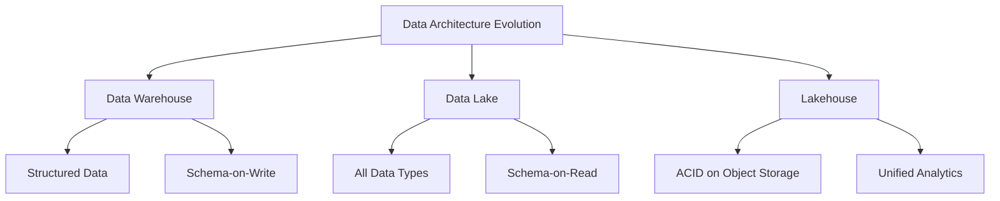
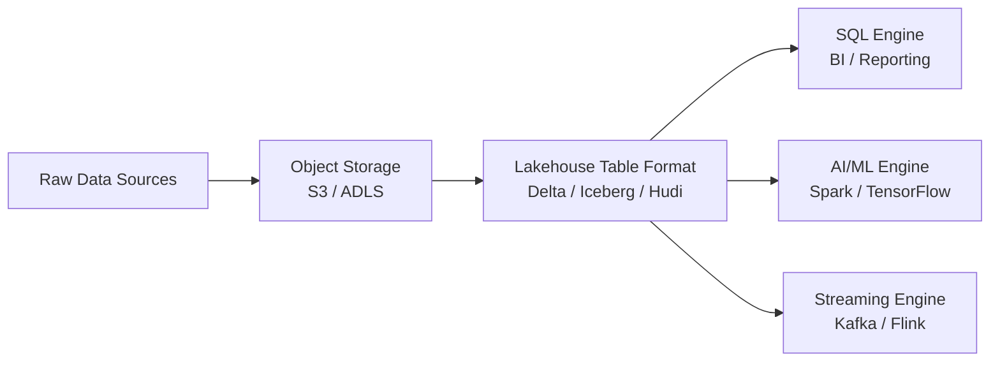

# Migration in progress
# W03 : Data Lakes and Lakehouse Foundations

As data volume, variety, and velocity increase, traditional data warehouses struggle to handle unstructured data and raw ingestion. Data Lakes emerged as a solution for storing massive amounts of raw data, but they often lacked governance and performance. The Lakehouse architecture combines the best of both worlds: the flexibility and scale of Data Lakes with the management and performance of Data Warehouses. This lesson explores these architectures, their components, and the technologies that enable them.

## The Data Lake

A Data Lake is a centralized repository that allows you to store all your structured and unstructured data at any scale. You can store your data as-is, without having to first structure the data, and run different types of analytics—from dashboards and visualizations to big data processing, real-time analytics, and machine learning.

### Core Characteristics

-   **Raw Storage**: Stores data in its native format (JSON, CSV, Parquet, images, logs).
-   **Schema-on-Read**: Structure is applied only when data is queried or analyzed.
-   **Scalability**: Built on object storage (e.g., Amazon S3, Azure Blob), offering virtually unlimited capacity.
-   **Cost-Effective**: Significantly cheaper per gigabyte than traditional warehouse storage.
-   **Flexibility**: Supports diverse workloads: BI, ML, AI, and real-time analytics.

### Challenges of Traditional Data Lakes

-   **Data Swamps**: Without governance, lakes become disorganized repositories of unused data.
-   **Poor Performance**: Querying raw files directly is slower than optimized warehouse formats.
-   **Lack of ACID**: No support for transactions; concurrent writes can corrupt data.
-   **Security & Governance**: Harder to enforce fine-grained access control on raw files.

> [!Important]
> **A Data Lake is not just a dump**: It requires strict metadata management, cataloging, and lifecycle policies. Without these, it becomes a "Data Swamp" where data is inaccessible, untrusted, and costly to maintain.

## The Lakehouse Architecture

The Lakehouse is a new paradigm that implements a data management structure similar to a data warehouse directly on top of low-cost cloud storage in open formats.

### Key Principles

-   **ACID Transactions**: Ensures data integrity and consistency using transaction logs (like Delta Log or Iceberg Metadata).
-   **Schema Enforcement & Governance**: Supports schema evolution and validation while maintaining flexibility.
-   **Open Formats**: Uses standard file formats like Parquet and ORC, avoiding vendor lock-in.
-   **Unified Storage**: One copy of data serves both BI (SQL) and AI/ML (Python/R) workloads.
-   **Decoupled Compute**: Multiple engines (Spark, Presto, Trino) can query the same data simultaneously.

### Benefits over Traditional Architectures

| Feature | Data Warehouse | Data Lake | Lakehouse |
|---|---|---|---|
| **Data Type** | Structured Only | All Types | All Types |
| **Cost** | High | Low | Low |
| **Reliability** | High (ACID) | Low | High (ACID) |
| **Performance** | High | Variable | High (Optimized) |
| **Use Cases** | BI / Reporting | ML / Raw Storage | BI + ML + AI |
| **Vendor Lock-in** | High | Low | Low (Open Formats) |

## Enabling Technologies: Table Formats

The magic of the Lakehouse lies in the table format layer, which adds a metadata layer on top of raw files to provide database-like features.

### Apache Delta Lake

-   Developed by Databricks.
-   Adds ACID transactions to Spark jobs.
-   Supports schema enforcement and evolution.
-   Features: Time Travel (query historical versions), Upserts/Merges.
-   Strong integration with Spark ecosystem.

### Apache Iceberg

-   Developed by Netflix.
-   Focuses on huge analytic tables with high partitioning.
-   Hidden partitioning: Users don’t need to know physical layout.
-   Strong community support across multiple engines (Spark, Trino, Flink).
-   Vendor-neutral design.

### Apache Hudi (Hadoop Upserts Deletes and Incrementals)

-   Developed by Uber.
-   Optimized for streaming data and incremental processing.
-   Excellent support for upserts (update+insert) on large datasets.
-   Indexes for fast lookups and record-level operations.

> [!Tip]
> **Choose based on ecosystem**: If you are heavily invested in Databricks/Spark, Delta Lake is seamless. If you use multiple query engines (Trino, Snowflake, Spark), Iceberg offers broader compatibility. If you have heavy streaming upsert needs, consider Hudi.

## Data Lake vs. Data Warehouse vs. Lakehouse

Understanding when to use each architecture is critical.

### When to Use a Data Warehouse

-   Strictly structured data.
-   High-concurrency BI reporting.
-   Regulatory compliance requiring strict gover