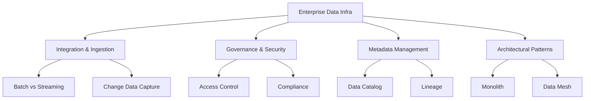

# Migration in progress
# W04 : Data Infrastructure in the Enterprise

# Lesson: Data Infrastructure in the Enterprise

Enterprise data infrastructure moves beyond individual tools to encompass a holistic ecosystem of technologies, processes, and governance frameworks. It involves integrating disparate data sources, ensuring security and compliance, managing metadata, and enabling self-service analytics at scale. This lesson explores the components of modern enterprise data platforms, the role of Data Mesh, governance strategies, and best practices for building scalable, secure, and reliable data systems.

## Core Components of Enterprise Data Infrastructure

A robust enterprise platform consists of several interconnected layers.

### 1. Ingestion and Integration

-   **Batch Processing**: Moving large volumes of data at scheduled intervals (e.g., nightly ETL). Tools: AWS Glue, Apache Airflow.
-   **Streaming Ingestion**: Real-time data capture from logs, IoT, or transactions. Tools: Kafka, Kinesis, Pub/Sub.
-   **Change Data Capture (CDC)**: Capturing row-level changes in databases to keep downstream systems in sync without heavy queries. Tools: Debezium, AWS DMS.
-   **API Integration**: Connecting SaaS applications (Salesforce, Workday) via REST/GraphQL APIs.

### 2. Storage and Compute

-   **Multi-Tier Storage**: Hot (SSD), Warm (HDD), Cold (Archive) storage policies to optimize cost.
-   **Compute Engines**: Specialized engines for different workloads (Spark for ML, Presto for ad-hoc SQL, Flink for streaming).
-   **Orchestration**: Managing dependencies and scheduling of complex workflows.

### 3. Governance and Security

-   **Identity and Access Management (IAM)**: Role-based access control (RBAC) and attribute-based access control (ABAC).
-   **Encryption**: Data at rest (KMS) and in transit (TLS).
-   **Audit Logging**: Tracking who accessed what data and when.
-   **Compliance**: Adhering to GDPR, HIPAA, CCPA through data masking and retention policies.

### 4. Metadata and Discovery

-   **Data Catalog**: Centralized inventory of data assets with business glossaries.
-   **Data Lineage**: Visualizing where data comes from, how it transforms, and where it goes.
-   **Search and Discovery**: Enabling users to find relevant datasets easily.

> [!Important]
> **Infrastructure is not just technology**: It includes people and processes. Without clear ownership, governance, and documentation, even the most advanced tech stack will fail to deliver value. Enterprise infrastructure must be designed for usability, not just engineering efficiency.

## Architectural Patterns: From Monolith to Mesh

### Traditional Centralized Model

-   **Structure**: A central data team manages all ingestion, transformation, and delivery.
-   **Pros**: Consistent standards, centralized governance.
-   **Cons**: Bottlenecks, slow delivery, lack of domain knowledge, "ticket-driven" culture.

### Data Fabric

-   **Concept**: An integrated layer of data connectors, graph, ML, and semantic models that actively discovers and orchestrates data across hybrid environments.
-   **Focus**: Automation and intelligent integration.

### Data Mesh

-   **Concept**: A socio-technical approach that decentralizes data ownership to domain-oriented teams (e.g., Sales, Logistics, Finance).
-   **Four Principles**:
    1.  **Domain Ownership**: Teams own their data as a product.
    2.  **Data as a Product**: Data must be discoverable, addressable, trustworthy, and interoperable.
    3.  **Self-Serve Data Platform**: Central team provides infrastructure tools so domains can build independently.
    4.  **Federated Computational Governance**: Global standards (security, interoperability) enforced locally by domains.

| Feature | Centralized Warehouse | Data Mesh |
|---|---|---|
| **Ownership** | Central Data Team | Domain Teams |
| **Structure** | Monolithic | Distributed |
| **Speed** | Slow (Bottlenecked) | Fast (Autonomous) |
| **Governance** | Top-Down | Federated |
| **Best For** | Small/Medium Orgs | Large, Complex Enterprises |

> [!Tip]
> **Data Mesh is not for everyone**: It requires significant cultural change and mature engineering practices. Start with a centralized or hybrid model and evolve toward Mesh as organizational complexity grows.

## Data Governance in the Enterprise

Governance ensures data is accurate, secure, and compliant.

### Data Quality Frameworks

-   **Dimensions**: Accuracy, Completeness, Consistency, Timeliness, Uniqueness, Validity.
-   **Automation**: Use tools like Great Expectations or dbt tests to validate data at every pipeline stage.
-   **Monitoring**: Alert on anomalies (e.g., sudden drop in row count, null spikes).

### Master Data Management (MDM)

-   Creates a single source of truth for critical entities (Customer, Product, Employee).
-   Resolves duplicates and inconsistencies across systems.
-   Essential for accurate reporting and customer experience.

### Policy Enforcement

-   **Tagging**: Classify data by sensitivity (Public, Internal, Confidential, PII).
-   **Masking**: Dynamically hide sensitive fields based on user roles.
-   **Retention**: Automate deletion of data past its legal 