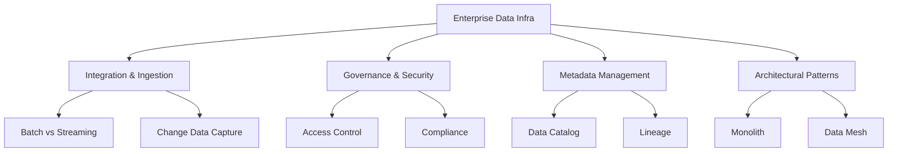
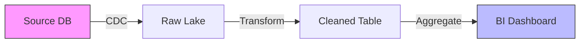

# W04 : Data Infrastructure in the Enterprise

# Lesson: Data Infrastructure in the Enterprise

Enterprise data infrastructure moves beyond individual tools to encompass a holistic ecosystem of technologies, processes, and governance frameworks. It involves integrating disparate data sources, ensuring security and compliance, managing metadata, and enabling self-service analytics at scale. This lesson explores the components of modern enterprise data platforms, the role of Data Mesh, governance strategies, and best practices for building scalable, secure, and reliable data systems.

## Core Components of Enterprise Data Infrastructure

A robust enterprise platform consists of several interconnected layers.

### 1. Ingestion and Integration

-   **Batch Processing**: Moving large volumes of data at scheduled intervals (e.g., nightly ETL). Tools: AWS Glue, Apache Airflow.
-   **Streaming Ingestion**: Real-time data capture from logs, IoT, or transactions. Tools: Kafka, Kinesis, Pub/Sub.
-   **Change Data Capture (CDC)**: Capturing row-level changes in databases to keep downstream systems in sync without heavy queries. Tools: Debezium, AWS DMS.
-   **API Integration**: Connecting SaaS applications (Salesforce, Workday) via REST/GraphQL APIs.

### 2. Storage and Compute

-   **Multi-Tier Storage**: Hot (SSD), Warm (HDD), Cold (Archive) storage policies to optimize cost.
-   **Compute Engines**: Specialized engines for different workloads (Spark for ML, Presto for ad-hoc SQL, Flink for streaming).
-   **Orchestration**: Managing dependencies and scheduling of complex workflows.

### 3. Governance and Security

-   **Identity and Access Management (IAM)**: Role-based access control (RBAC) and attribute-based access control (ABAC).
-   **Encryption**: Data at rest (KMS) and in transit (TLS).
-   **Audit Logging**: Tracking who accessed what data and when.
-   **Compliance**: Adhering to GDPR, HIPAA, CCPA through data masking and retention policies.

### 4. Metadata and Discovery

-   **Data Catalog**: Centralized inventory of data assets with business glossaries.
-   **Data Lineage**: Visualizing where data comes from, how it transforms, and where it goes.
-   **Search and Discovery**: Enabling users to find relevant datasets easily.

> [!Important]
> **Infrastructure is not just technology**: It includes people and processes. Without clear ownership, governance, and documentation, even the most advanced tech stack will fail to deliver value. Enterprise infrastructure must be designed for usability, not just engineering efficiency.

## Architectural Patterns: From Monolith to Mesh

### Traditional Centralized Model

-   **Structure**: A central data team manages all ingestion, transformation, and delivery.
-   **Pros**: Consistent standards, centralized governance.
-   **Cons**: Bottlenecks, slow delivery, lack of domain knowledge, "ticket-driven" culture.

### Data Fabric

-   **Concept**: An integrated layer of data connectors, graph, ML, and semantic models that actively discovers and orchestrates data across hybrid environments.
-   **Focus**: Automation and intelligent integration.

### Data Mesh

-   **Concept**: A socio-technical approach that decentralizes data ownership to domain-oriented teams (e.g., Sales, Logistics, Finance).
-   **Four Principles**:
    1.  **Domain Ownership**: Teams own their data as a product.
    2.  **Data as a Product**: Data must be discoverable, addressable, trustworthy, and interoperable.
    3.  **Self-Serve Data Platform**: Central team provides infrastructure tools so domains can build independently.
    4.  **Federated Computational Governance**: Global standards (security, interoperability) enforced locally by domains.

| Feature | Centralized Warehouse | Data Mesh |
|---|---|---|
| **Ownership** | Central Data Team | Domain Teams |
| **Structure** | Monolithic | Distributed |
| **Speed** | Slow (Bottlenecked) | Fast (Autonomous) |
| **Governance** | Top-Down | Federated |
| **Best For** | Small/Medium Orgs | Large, Complex Enterprises |

> [!Tip]
> **Data Mesh is not for everyone**: It requires significant cultural change and mature engineering practices. Start with a centralized or hybrid model and evolve toward Mesh as organizational complexity grows.

## Data Governance in the Enterprise

Governance ensures data is accurate, secure, and compliant.

### Data Quality Frameworks

-   **Dimensions**: Accuracy, Completeness, Consistency, Timeliness, Uniqueness, Validity.
-   **Automation**: Use tools like Great Expectations or dbt tests to validate data at every pipeline stage.
-   **Monitoring**: Alert on anomalies (e.g., sudden drop in row count, null spikes).

### Master Data Management (MDM)

-   Creates a single source of truth for critical entities (Customer, Product, Employee).
-   Resolves duplicates and inconsistencies across systems.
-   Essential for accurate reporting and customer experience.

### Policy Enforcement

-   **Tagging**: Classify data by sensitivity (Public, Internal, Confidential, PII).
-   **Masking**: Dynamically hide sensitive fields based on user roles.
-   **Retention**: Automate deletion of data past its legal retention period.

## Metadata Management and Lineage

Metadata is "data about data." It is the backbone of discoverability and trust.

### Active Metadata

-   Instead of static documentation, active metadata drives automation.
-   Example: If a table is marked "PII," the platform automatically applies encryption and restricts access.
-   Example: If a pipeline fails, lineage maps identify downstream dashboards affected.

### Data Lineage

-   **Technical Lineage**: Shows code-level transformations (Table A -> Script B -> Table C).
-   **Business Lineage**: Shows logical flow of business concepts (Revenue Source -> Net Sales).
-   **Impact Analysis**: Helps assess risk before changing upstream schemas.

## Best Practices for Enterprise Infrastructure

### Scalability and Performance

-   **Decouple Storage and Compute**: Allow independent scaling.
-   **Partitioning**: Organize data by date or region to speed up queries.
-   **Caching**: Use in-memory stores (Redis) for frequently accessed reference data.

### Reliability and Resilience

-   **Idempotency**: Ensure pipelines can be rerun without duplicating data.
-   **Dead Letter Queues**: Capture failed records for manual review instead of stopping the pipeline.
-   **Disaster Recovery**: Regular backups and cross-region replication.

### Cost Management

-   **FinOps**: Tag resources by project/team for chargeback.
-   **Auto-Scaling**: Shut down dev/test clusters when not in use.
-   **Storage Tiering**: Move old data to cheaper archival storage.

### Self-Service Enablement

-   Provide curated, high-quality "Gold" datasets for business users.
-   Offer SQL interfaces and BI tool integrations.
-   Reduce dependency on data engineers for simple queries.

## Assessment Preparation

### Practice Questions

1.  What are the four principles of Data Mesh?
2.  How does Change Data Capture (CDC) differ from batch extraction?
3.  Why is metadata management critical in enterprise environments?
4.  Explain the difference between technical and business lineage.
5.  What is the role of a Data Catalog?
6.  How does Data Fabric differ from Data Mesh?
7.  Why is idempotency important in data pipelines?
8.  What are the key dimensions of data quality?
9.  How does federated governance work in a Data Mesh?
10. What is Master Data Management (MDM) and why is it needed?

### Scenario Questions

**Scenario 1: Bottlenecked Data Team**
Central data team is overwhelmed with requests from 10 different departments.

-   **Solution**: Transition toward Data Mesh.
-   **Action**: Empower domain teams (Sales, Marketing) to manage their own data products.
-   **Support**: Central team builds self-serve platform (infrastructure, templates).
-   **Governance**: Establish global standards for security and format.

**Scenario 2: Regulatory Audit Failure**
Auditors cannot trace where a specific report number came from.

-   **Problem**: Lack of data lineage.
-   **Solution**: Implement automated lineage tracking (e.g., OpenLineage).
-   **Tool**: Integrate with catalog to visualize end-to-end flow.
-   **Outcome**: Auditors can click through from dashboard back to source system.

**Scenario 3: Poor Data Quality**
Marketing campaigns fail due to incorrect customer email addresses.

-   **Problem**: No validation at ingestion.
-   **Solution**: Implement data quality tests (Great Expectations/dbt) in pipeline.
-   **Process**: Block bad data from entering "Gold" tables; alert engineers.
-   **MDM**: Cleanse and deduplicate customer records centrally.

**Scenario 4: High Cloud Costs**
Data warehouse bill is 3x budget due to unused compute clusters.

-   **Solution**: Implement FinOps practices.
-   **Action**: Auto-suspend idle clusters. Use serverless options.
-   **Tagging**: Identify top spenders and optimize their queries.
-   **Tiering**: Move historical data to cold storage.

**Scenario 5: Siloed Data Sources**
Salesforce and ERP data do not match, causing reporting conflicts.

-   **Problem**: Lack of Master Data Management.
-   **Solution**: Implement MDM hub for "Customer" entity.
-   **Process**: Define golden record rules; sync to downstream systems.
-   **Result**: Single view of customer across all applications.

## Key Takeaways

-   Enterprise infrastructure integrates ingestion, storage, governance, and metadata.
-   Data Mesh decentralizes ownership to domain teams for scalability.
-   CDC enables real-time synchronization without impacting source systems.
-   Governance ensures security, compliance, and data quality.
-   Metadata and lineage are essential for trust and discoverability.
-   Master Data Management resolves inconsistencies across systems.
-   Idempotency and dead letter queues ensure pipeline reliability.
-   Self-service platforms empower business users while maintaining control.
-   FinOps practices are critical for managing cloud data costs.
-   Architecture must evolve with organizational maturity and complexity.

> [!Important]
> **Culture eats architecture for breakfast**: You can build the most sophisticated Data Mesh or Lakehouse, but if teams don't collaborate or value data quality, it will fail. Invest in training, clear communication, and shared goals. Technology enables the strategy, but people execute it. Start with strong governance and metadata foundations to support whatever architectural pattern you choose.
