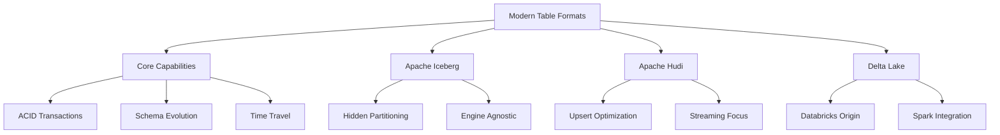

# W05: Modern Table Formats - Iceberg, Hudi, Delta Lake

As data architectures evolved from Data Lakes to Lakehouses, a critical gap emerged: object storage (like S3) is immutable and lacks transaction support. Modern table formats solve this by adding a metadata layer on top of raw files, enabling ACID transactions, schema evolution, and time travel. This lesson compares the three leading open-table formats—Apache Iceberg, Apache Hudi, and Delta Lake—and guides you in choosing the right one for your workload.

## Why Do We Need Modern Table Formats?

Traditional Data Lakes stored data as flat files (CSV, JSON, Parquet). While cheap and scalable, they suffered from significant limitations:

1.  **No Atomicity**: If a write job failed halfway, you ended up with partial/corrupt data.
2.  **No Updates/Deletes**: Updating a single record required rewriting the entire file or partition.
3.  **Schema Rigidity**: Adding a column often broke downstream readers.
4.  **Small File Problem**: Streaming ingestion created thousands of tiny files, slowing down queries.
5.  **Partitioning Complexity**: Users had to know the physical directory structure to query efficiently.

Modern table formats introduce a **metadata layer** that tracks file locations, versions, and schemas, effectively turning object storage into a reliable database.

## Core Capabilities Shared by All Three

Regardless of the specific format, all three provide these essential Lakehouse features:

-   **ACID Transactions**: Ensure data consistency during concurrent reads and writes.
-   **Schema Evolution**: Allow adding, dropping, or renaming columns without breaking existing pipelines.
-   **Time Travel**: Query data as it existed at a specific point in time (useful for auditing and reproducibility).
-   **Upserts/Merges**: Efficiently update existing records or insert new ones based on a key.
-   **Compaction**: Automatically merge small files into larger ones for better query performance.

## Apache Iceberg

Developed by Netflix and now an Apache Top-Level Project, Iceberg was designed for huge analytic tables where performance and engine interoperability are critical.

### Key Features

-   **Hidden Partitioning**: Users define logical partitions (e.g., `date`), but Iceberg manages the physical layout. It can evolve partition schemes without rewriting data.
-   **Manifest Files**: Uses a tree-like metadata structure (Snapshot -> Manifest List -> Manifest File -> Data File) to quickly prune irrelevant data.
-   **Engine Agnostic**: Strong support across Spark, Trino, Presto, Flink, and Hive.
-   **Vendor Neutral**: Not tied to any specific cloud or company.

### Best For

-   Multi-engine environments (e.g., using Spark for ETL and Trino for BI).
-   Large-scale historical analytics.
-   Organizations wanting to avoid vendor lock-in.

> [!Tip]
> **Iceberg’s Hidden Partitioning is a game-changer**: In traditional systems, if you change how you partition data (e.g., from `year/month` to `date`), you must rewrite all data. Iceberg allows you to change partition specs logically without touching the underlying files.

## Apache Hudi (Hadoop Upserts Deletes and Incrementals)

Developed by Uber, Hudi was built to solve the problem of ingesting streaming data into Hadoop/S3 while supporting fast upserts.

### Key Features

-   **Indexing**: Maintains indexes to locate records quickly for upserts, making it highly efficient for row-level updates.
-   **Two Table Types**:
    -   **Copy-on-Write (CoW)**: Optimized for read-heavy workloads; rewrites files on update.
    -   **Merge-on-Read (MoR)**: Optimized for write-heavy/streaming workloads; logs updates separately and merges them at read time.
-   **Incremental Processing**: Natively supports reading only changed data since the last commit, ideal for incremental ETL.

### Best For

-   High-frequency streaming ingestion with frequent updates.
-   Use cases requiring low-latency upserts (e.g., order status updates).
-   Incremental data pipelines.

## Delta Lake

Developed by Databricks and donated to the Linux Foundation, Delta Lake is tightly integrated with the Apache Spark ecosystem.

### Key Features

-   **Transaction Log**: Uses a single JSON log file (`_delta_log`) to track commits, making it simple and robust.
-   **Optimize Command**: Built-in tools for Z-Ordering (co-localizing related data) and compaction.
-   **Unity Catalog Integration**: Seamless governance and security when used within the Databricks platform.
-   **Spark Native**: Performance is highly optimized for Spark jobs.

### Best For

-   Organizations heavily invested in Databricks or Spark.
-   Teams seeking simplicity and ease of setup.
-   Workloads involving complex ML pipelines alongside SQL analytics.

> [!Important]
> **Delta Lake is more than just a format**: It is part of a broader ecosystem. If you use Databricks, Delta offers the smoothest experience. However, it is increasingly supported by other engines like Trino and Presto through connectors.

## Comparison Matrix

| Feature | Apache Iceberg | Apache Hudi | Delta Lake |
|---|---|---|---|
| **Origin** | Netflix | Uber | Databricks |
| **Primary Strength** | Engine Interoperability | Upsert/Streaming Performance | Spark Integration & Simplicity |
| **Partitioning** | Hidden/Evolvable | Explicit | Explicit |
| **Metadata Structure** | Tree (Manifests) | Timeline/Index | Linear Log (JSON) |
| **Update Strategy** | Merge-on-Read / Copy-on-Write | CoW / MoR | Copy-on-Write (mostly) |
| **Community** | Rapidly Growing, Vendor-Neutral | Strong in Streaming | Large, Databricks-backed |
| **Best Engine Fit** | Trino, Spark, Flink | Spark, Flink | Spark |

## Choosing the Right Format

### Choose Apache Iceberg If:
-   You use multiple query engines (e.g., Spark for ETL, Trino for BI, Flink for streaming).
-   You want to avoid vendor lock-in.
-   You have massive tables and need advanced partition evolution.

### Choose Apache Hudi If:
-   Your primary workload is high-volume streaming with frequent row-level updates.
-   You need incremental pull capabilities for downstream systems.
-   Low-latency upserts are critical (e.g., real-time dashboards).

### Choose Delta Lake If:
-   You are already using Databricks or Apache Spark extensively.
-   You prefer simplicity and quick setup.
-   You want tight integration with MLflow and Unity Catalog.

## Assessment Preparation

### Practice Questions

1.  What problem do modern table formats solve in Data Lakes?
2.  Explain the concept of "Hidden Partitioning" in Iceberg.
3.  What is the difference between Copy-on-Write and Merge-on-Read in Hudi?
4.  How does Delta Lake track transactions?
5.  Why is Time Travel useful in a Lakehouse architecture?
6.  Which format is most suitable for a multi-engine environment?
7.  How do these formats handle the "small file problem"?
8.  What is Schema Evolution and why is it important?
9.  Compare the metadata structures of Iceberg and Delta Lake.
10. When would you choose Hudi over Iceberg?

### Scenario Questions

**Scenario 1: Multi-Tool Analytics**
Company uses Spark for engineering, Trino for BI, and Flink for streaming.

-   **Choice**: Apache Iceberg.
-   **Reason**: Best-in-class support for all three engines. Vendor-neutral.
-   **Benefit**: Engineers, analysts, and stream processors can all read/write the same data efficiently.

**Scenario 2: Real-Time Order Tracking**
E-commerce platform needs to update order status every few seconds.

-   **Choice**: Apache Hudi (Merge-on-Read).
-   **Reason**: Optimized for frequent upserts and low-latency reads.
-   **Benefit**: Fast updates without rewriting entire files; incremental processing for downstream apps.

**Scenario 3: Databricks Shop**
Startup builds entire data platform on Databricks.

-   **Choice**: Delta Lake.
-   **Reason**: Native integration, optimized performance, simple management.
-   **Benefit**: Seamless experience with Unity Catalog, MLflow, and Spark.

**Scenario 4: Regulatory Audit**
Financial firm needs to reconstruct data state from 6 months ago.

-   **Choice**: Any (Iceberg/Hudi/Delta).
-   **Feature**: Time Travel.
-   **Action**: Query table `AS OF TIMESTAMP '2023-01-01'`.
-   **Benefit**: Exact reproduction of historical data for auditors without maintaining separate backups.

**Scenario 5: Changing Partition Strategy**
Data volume grew, and monthly partitions are too large. Need daily partitions.

-   **Choice**: Apache Iceberg.
-   **Feature**: Hidden Partitioning / Partition Evolution.
-   **Action**: Update partition spec in metadata.
-   **Benefit**: No need to rewrite terabytes of historical data; new writes use new scheme, old reads still work.

## Key Takeaways

-   Modern table formats add ACID transactions and metadata management to object storage.
-   Iceberg excels in multi-engine interoperability and hidden partitioning.
-   Hudi is optimized for streaming ingestion and frequent upserts.
-   Delta Lake offers simplicity and deep integration with Spark/Databricks.
-   All three support Schema Evolution, Time Travel, and Compaction.
-   Choice depends on your existing ecosystem, workload patterns (batch vs. stream), and engine preferences.
-   Avoid vendor lock-in by considering open standards like Iceberg.
-   Metadata management is key to performance and reliability.
-   These formats enable the true Lakehouse architecture.
-   Understand the trade-offs between Copy-on-Write and Merge-on-Read strategies.

> [!Important]
> **The format is just the foundation**: Choosing Iceberg, Hudi, or Delta is critical, but success also depends on proper compaction strategies, partition design, and governance. Monitor file sizes and metadata overhead. Regularly compact small files to maintain query performance. The right format enables reliability, but good operational practices ensure scalability.
