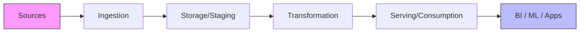
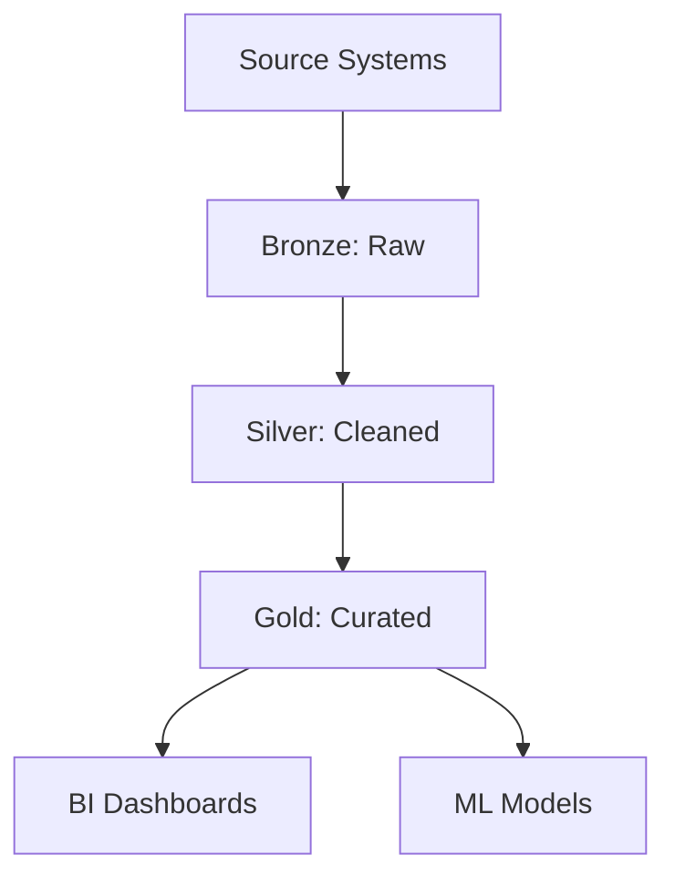

# W06: Standard Data Pipeline Architecture

A data pipeline is a series of automated processes that move and transform data from source systems to destination systems for analysis or operational use. This lesson breaks down the standard components of a modern data pipeline, compares architectural patterns like ETL and ELT, and explores design principles for building reliable, scalable, and maintainable data flows. Understanding these fundamentals is essential for designing robust data infrastructure.

## Core Components of a Data Pipeline

Every data pipeline, regardless of complexity, consists of five fundamental stages.

### 1. Data Sources

-   **Databases**: Relational (PostgreSQL, MySQL) and NoSQL (MongoDB, DynamoDB).
-   **Applications**: SaaS platforms (Salesforce, HubSpot) via APIs.
-   **Logs & Events**: Web server logs, clickstreams, IoT sensor data.
-   **Files**: CSV, JSON, Parquet files dropped in storage buckets.

### 2. Ingestion

-   **Batch Ingestion**: Moving large volumes of data at scheduled intervals (e.g., nightly). Tools: AWS Glue, Apache Airflow, Sqoop.
-   **Streaming Ingestion**: Continuous real-time data capture. Tools: Kafka, Kinesis, Pub/Sub.
-   **Change Data Capture (CDC)**: Capturing row-level changes in databases to minimize load on source systems. Tools: Debezium, AWS DMS.

### 3. Storage and Staging

-   **Raw Zone (Bronze)**: Stores data exactly as it arrived from sources. Immutable and append-only.
-   **Cleaned Zone (Silver)**: Data is validated, deduplicated, and standardized. Schema is enforced.
-   **Curated Zone (Gold)**: Aggregated, business-ready data modeled for specific use cases (e.g., star schema).
-   **Technology**: Data Lakes (S3, ADLS), Data Warehouses (Redshift, Snowflake), or Lakehouses (Delta/Iceberg).

### 4. Transformation

-   **Cleaning**: Handling nulls, fixing formats, standardizing codes.
-   **Enrichment**: Joining with reference data or external APIs.
-   **Aggregation**: Summarizing data for reporting (e.g., daily sales totals).
-   **Tools**: SQL, dbt (data build tool), Spark, Pandas, DataFlow.

### 5. Serving and Consumption

-   **Business Intelligence**: Dashboards and reports (Tableau, PowerBI, Looker).
-   **Machine Learning**: Feature stores for model training and inference.
-   **Reverse ETL**: Pushing processed data back into operational systems (e.g., sending customer segments to Salesforce).
-   **APIs**: Exposing data to applications via REST or GraphQL endpoints.

## ETL vs. ELT Architectures

The order of operations defines the architectural pattern.

### ETL (Extract, Transform, Load)

-   **Process**: Data is transformed in a separate processing engine *before* being loaded into the target database.
-   **Pros**: Reduces storage costs by loading only clean data; good for legacy on-premise warehouses with limited compute.
-   **Cons**: Bottleneck at transformation stage; rigid schema requirements early in the process; harder to reprocess raw data.
-   **Use Case**: Legacy systems, strict compliance where sensitive data must be masked before storage.

### ELT (Extract, Load, Transform)

-   **Process**: Raw data is loaded directly into the target system (usually a cloud warehouse or lake), and transformation happens there using its own compute power.
-   **Pros**: Leverages scalable cloud compute; preserves raw data for future reprocessing; faster time-to-insight; flexible schema evolution.
-   **Cons**: Requires robust governance to prevent "data swamps"; storage costs may be higher due to raw data retention.
-   **Use Case**: Modern cloud data warehouses (Snowflake, BigQuery, Redshift) and Data Lakes.

> [!Important]
> **ELT is the modern standard**: Cloud storage is cheap, and cloud compute is elastic. Loading raw data first allows you to change your mind about transformations later without going back to the source system. It supports agility and reproducibility.

## The Medallion Architecture

A popular design pattern for organizing data in Lakehouses, popularized by Databricks.

### Bronze Layer (Raw)

-   **Content**: Exact copy of source data.
-   **Format**: Often JSON, Avro, or CSV.
-   **Purpose**: Audit trail, reprocessing, historical recovery.
-   **Quality**: Unvalidated, may contain duplicates or errors.

### Silver Layer (Cleaned)

-   **Content**: Filtered, cleaned, and enriched data.
-   **Format**: Optimized columnar formats (Parquet, Delta).
-   **Purpose**: Enterprise-wide view of entities (e.g., unified customer table).
-   **Quality**: Validated schema, deduplicated, standardized.

### Gold Layer (Curated)

-   **Content**: Aggregated, business-level metrics.
-   **Format**: Star schemas, wide tables for BI.
-   **Purpose**: Specific departmental needs (Sales, Finance, Marketing).
-   **Quality**: High-trust, ready for consumption.

## Design Principles for Robust Pipelines

### Idempotency

-   Running the same pipeline multiple times produces the same result.
-   Critical for retry logic when failures occur.
-   Achieved by using `MERGE` statements or overwriting partitions instead of appending blindly.

### Fault Tolerance and Retries

-   Design pipelines to handle transient failures (network blips, API timeouts).
-   Implement exponential backoff for retries.
-   Use Dead Letter Queues (DLQ) to capture failed records for manual inspection without stopping the whole pipeline.

### Observability and Monitoring

-   **Data Quality Checks**: Validate row counts, null percentages, and unique constraints at each stage.
-   **Lineage Tracking**: Know where data comes from and where it goes.
-   **Alerting**: Notify engineers of pipeline failures or data anomalies immediately.

### Scalability

-   Decouple ingestion from transformation to allow independent scaling.
-   Use distributed processing frameworks (Spark, Flink) for large volumes.
-   Partition data effectively to parallelize processing.

### Security and Governance

-   Encrypt data at rest and in transit.
-   Mask PII (Personally Identifiable Information) early in the pipeline.
-   Implement Role-Based Access Control (RBAC) for downstream consumers.

## Assessment Preparation

### Practice Questions

1.  What are the five core components of a data pipeline?
2.  Explain the difference between ETL and ELT. Why is ELT preferred in the cloud?
3.  Describe the Medallion Architecture (Bronze, Silver, Gold).
4.  Why is idempotency important in data pipelines?
5.  What is Change Data Capture (CDC) and when should you use it?
6.  How do Dead Letter Queues improve pipeline reliability?
7.  What is Reverse ETL and how does it differ from traditional ETL?
8.  Why is storing raw data (Bronze layer) beneficial?
9.  What are common data quality checks implemented in pipelines?
10. How does partitioning improve pipeline performance?

### Scenario Questions

**Scenario 1: Legacy Migration to Cloud**
Moving from on-prem Oracle to Snowflake.

-   **Pattern**: ELT.
-   **Process**: Extract from Oracle using CDC, load raw JSON into Snowflake Stage, transform using SQL/dbt inside Snowflake.
-   **Benefit**: Leverages Snowflake’s scalable compute; simplifies architecture.

**Scenario 2: Real-Time Fraud Detection**
Credit card transactions need instant scoring.

-   **Pattern**: Streaming Pipeline.
-   **Process**: Kafka ingests transactions -> Spark Streaming enriches with user history -> ML Model scores risk -> Alert if high risk.
-   **Latency**: Sub-second processing required.
-   **Storage**: Store results in NoSQL for quick lookup.

**Scenario 3: Data Quality Crisis**
Reports show incorrect revenue numbers due to duplicate orders.

-   **Fix**: Add deduplication step in Silver layer.
-   **Tool**: Use window functions in SQL or Spark to identify and remove duplicates based on Order ID and Timestamp.
-   **Prevention**: Implement automated data quality tests (e.g., "Order ID must be unique") in the pipeline. Fail pipeline if test fails.

**Scenario 4: Re-processing Historical Data**
Business logic changed, need to recalculate last year’s metrics.

-   **Advantage**: Bronze layer has all raw historical data.
-   **Action**: Replay transformation logic on Bronze data to regenerate Silver/Gold layers.
-   **Benefit**: No need to contact source systems again; fast and reproducible.

**Scenario 5: Syncing Customer Segments**
Marketing wants to send emails to "High Value" customers identified in the data warehouse.

-   **Pattern**: Reverse ETL.
-   **Process**: Query Gold layer for segment -> Push list to Salesforce/HubSpot via API.
-   **Tool**: Hightouch, Census, or custom Python script.
-   **Benefit**: Activates data for operational use without manual exports.

## Key Takeaways

-   Data pipelines move data from sources to consumption through ingestion, storage, transformation, and serving.
-   ELT is preferred over ETL in modern cloud architectures for flexibility and speed.
-   Medallion Architecture (Bronze/Silver/Gold) organizes data by quality and readiness.
-   Idempotency ensures pipelines can be safely retried after failures.
-   CDC enables efficient, real-time synchronization of database changes.
-   Dead Letter Queues handle bad data without stopping the pipeline.
-   Observability and data quality checks are critical for trust.
-   Reverse ETL brings insights back into operational applications.
-   Security and governance must be built into every stage.
-   Design for scalability and fault tolerance from day one.

> [!Important]
> **Pipelines are products**: Treat your data pipelines with the same rigor as software applications. Version control your code, test your transformations, monitor your performance, and document your logic. A broken pipeline stops business decisions. Build resilience, automate recovery, and prioritize data quality at every step. The goal is not just moving data, but delivering trusted value.
