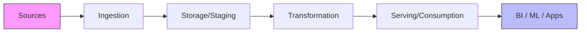

# Migration in progress
# W06: Standard Data Pipeline Architecture

A data pipeline is a series of automated processes that move and transform data from source systems to destination systems for analysis or operational use. This lesson breaks down the standard components of a modern data pipeline, compares architectural patterns like ETL and ELT, and explores design principles for building reliable, scalable, and maintainable data flows. Understanding these fundamentals is essential for designing robust data infrastructure.



## Core Components of a Data Pipeline

Every data pipeline, regardless of complexity, consists of five fundamental stages.

### 1. Data Sources

-   **Databases**: Relational (PostgreSQL, MySQL) and NoSQL (MongoDB, DynamoDB).
-   **Applications**: SaaS platforms (Salesforce, HubSpot) via APIs.
-   **Logs & Events**: Web server logs, clickstreams, IoT sensor data.
-   **Files**: CSV, JSON, Parquet files dropped in storage buckets.

### 2. Ingestion

-   **Batch Ingestion**: Moving large volumes of data at scheduled intervals (e.g., nightly). Tools: AWS Glue, Apache Airflow, Sqoop.
-   **Streaming Ingestion**: Continuous real-time data capture. Tools: Kafka, Kinesis, Pub/Sub.
-   **Change Data Capture (CDC)**: Capturing row-level changes in databases to minimize load on source systems. Tools: Debezium, AWS DMS.

### 3. Storage and Staging

-   **Raw Zone (Bronze)**: Stores data exactly as it arrived from sources. Immutable and append-only.
-   **Cleaned Zone (Silver)**: Data is validated, deduplicated, and standardized. Schema is enforced.
-   **Curated Zone (Gold)**: Aggregated, business-ready data modeled for specific use cases (e.g., star schema).
-   **Technology**: Data Lakes (S3, ADLS), Data Warehouses (Redshift, Snowflake), or Lakehouses (Delta/Iceberg).

### 4. Transformation

-   **Cleaning**: Handling nulls, fixing formats, standardizing codes.
-   **Enrichment**: Joining with reference data or external APIs.
-   **Aggregation**: Summarizing data for reporting (e.g., daily sales totals).
-   **Tools**: SQL, dbt (data build tool), Spark, Pandas, DataFlow.

### 5. Serving and Consumption

-   **Business Intelligence**: Dashboards and reports (Tableau, PowerBI, Looker).
-   **Machine Learning**: Feature stores for model training and inference.
-   **Reverse ETL**: Pushing processed data back into operational systems (e.g., sending customer segments to Salesforce).
-   **APIs**: Exposing data to applications via REST or GraphQL endpoints.

## ETL vs. ELT Architectures

The order of operations defines the architectural pattern.

### ETL (Extract, Transform, Load)

-   **Process**: Data is transformed in a separate processing engine *before* being loaded into the target database.
-   **Pros**: Reduces storage costs by loading only clean data; good for legacy on-premise warehouses with limited compute.
-   **Cons**: Bottleneck at transformation stage; rigid schema requirements early in the process; harder to reprocess raw data.
-   **Use Case**: Legacy systems, strict compliance where sensitive data must be masked before storage.

### ELT (Extract, Load, Transform)

-   **Process**: Raw data is loaded directly into the target system (usually a cloud warehouse or lake), and transformation happens there using its own compute power.
-   **Pros**: Leverages scalable cloud compute; preserves raw data for future reprocessing; faster time-to-insight; flexible schema evolution.
-   **Cons**: Requires robust governance to prevent "data swamps"; storage costs may be higher due to raw data retention.
-   **Use Case**: Modern cloud data warehouses (Snowflake, BigQuery, Redshift) and Data Lakes.

> [!Important]
> **ELT is the modern standard**: Cloud storage is cheap, and cloud compute is elastic. Loading raw data first allows you to change your mind about transformations later without going back to the source system. It supports agility and reproducibility.

## The Medallion Architecture

A popular design pattern for organizing data in Lakehouses, popularized by Databricks.

### Bronze Layer (Raw)

-   **Content**: Exact copy of source data.
-   **Format**: Often JSON, Avro, or CSV.
-   **Purpose**: Audit trail, reprocessing, historical recovery.
-   **Quality**: Unvalidated, may contain duplicates or errors.

### Silver Layer (Cleaned)

-   **Content**: Filtered, cleaned, and enriched data.
-   **Format**: Optimized columnar formats (Parquet, Delta).
-   **Purpose**: Enterprise-wide view of entities (e.g., unified customer table).
-   **Quality**: Validated schema, deduplicated, standardized.

### Gold Layer (Curated)

-   **Content**: Aggregated, business-level metrics.
-   **Format**: Star schemas, wide tables for BI.
-   **Purpose**: Specific departmental needs (Sales, Finance, Marketing).
-   **Quality**: High-trust, ready for consumption.

```mermaid
flowchart TD
    A[Source Systems] --> B[Bronze: Raw]
    B