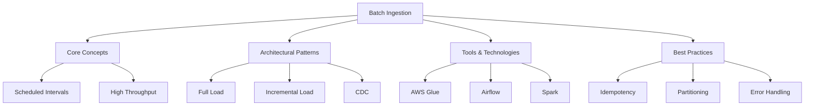

# Migration in progress
# W07: Batch Data Ingestion

# Lesson: Batch Data Ingestion

Batch data ingestion is the process of moving large volumes of data from source systems to a destination (such as a Data Lake or Warehouse) at scheduled intervals. Unlike streaming, which processes data record-by-record in real-time, batch processing handles data in chunks or "batches." This lesson covers the core concepts, architectural patterns, tools, and best practices for building efficient and reliable batch ingestion pipelines.

## Core Concepts of Batch Ingestion

Batch ingestion is characterized by its periodic nature and ability to handle massive datasets efficiently.

### Key Characteristics

-   **Latency**: High latency (minutes to hours). Data is not available immediately after creation.
-   **Throughput**: Optimized for high volume. Processes millions of records in a single job.
-   **Scheduling**: Jobs run on fixed schedules (e.g., hourly, daily, weekly).
-   **Resource Efficiency**: Can leverage off-peak computing resources to reduce costs.
-   **Complexity**: Simpler to implement and debug than streaming systems.

### When to Use Batch Ingestion

-   Historical data migration.
-   Daily reporting and business intelligence dashboards.
-   Machine learning model training (which often requires full datasets).
-   Systems where real-time data is not critical.
-   Source systems that cannot support continuous extraction (e.g., legacy mainframes).

> [!Important]
> **Batch is not obsolete**: While streaming gets attention, 80% of enterprise data workloads are still batch-oriented. It is cost-effective, reliable, and sufficient for most analytical use cases. Do not over-engineer with streaming if daily updates meet business needs.

## Architectural Patterns

How you extract and load data defines the efficiency of your pipeline.

### Full Load (Snapshot)

-   **Process**: Extracts the entire dataset from the source every time the job runs.
-   **Pros**: Simplest to implement; no need to track changes.
-   **Cons**: Inefficient for large tables; high load on source system; slow.
-   **Use Case**: Small reference tables (e.g., Country Codes, Product Categories).

### Incremental Load (Delta)

-   **Process**: Extracts only new or modified records since the last run.
-   **Mechanism**: Uses a "watermark" column (e.g., `last_updated_timestamp` or `incremental_id`).
-   **Pros**: Efficient; low impact on source; faster execution.
-   **Cons**: Requires source system to have reliable timestamp/ID columns; complex logic for deletes.
-   **Use Case**: Large transactional tables (e.g., Orders, Logs).

### Change Data Capture (CDC)

-   **Process**: Captures row-level changes (Insert, Update, Delete) from database transaction logs.
-   **Tools**: Debezium, AWS DMS, GoldenGate.
-   **Pros**: Near real-time; captures deletes; minimal source impact.
-   **Cons**: Complex setup; requires access to transaction logs; schema drift handling.
-   **Use Case**: Critical databases requiring accurate sync without polling.

| Pattern | Complexity | Source Load | Latency | Handles Deletes? |
|---|---|---|---|---|
| **Full Load** | Low | High | High | Yes (Overwrite) |
| **Incremental** | Medium | Low | Medium | No (Usually) |
| **CDC** | High | Very Low | Low | Yes |

## Tools and Technologies

### Orchestration

-   **Apache Airflow**: Open-source platform to programmatically author, schedule, and monitor workflows. Uses Python DAGs (Directed Acyclic Graphs).
-   **AWS Step Functions**: Serverless workflow service for coordinating distributed applications.
-   **Azure Data Factory / Google Cloud Composer**: Managed orchestration services for their respective clouds.

### Extraction and Transformation

-   **Apache Spark**: Distributed computing engine for large-scale data processing. Excellent for complex transformations during ingestion.
-   **AWS Glue**: Serverless ETL service that uses Spark under the hood. Includes a Data Catalog.
-   **dbt (data build tool)**: Primarily for transformation inside the warehouse, but increasingly used for ELT workflows.

### Storage

-   **Data Lakes**: Amazon S3, Azure Blob Storage, Google Cloud Storage. Ideal for raw batch dumps.
-   **Data Warehouses**: Snowflake, Redshift, BigQuery. Ideal for structured batch loads ready for analysis.

## Best Practices for Batch Ingestion

### Idempotency

-   **Definition**: Running the same job multiple times produces the same result.
-   **Implementation**: Use `MERGE` statements or overwrite partitions instead of appending blindly.
-   **Why**: If a job fails halfway and is restarted, you don’t want duplicate records.

### Par