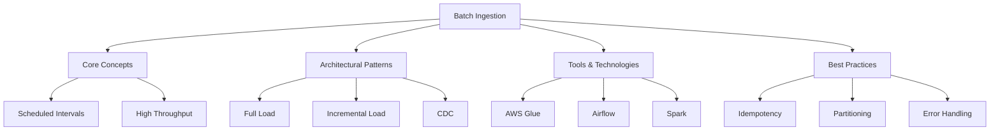
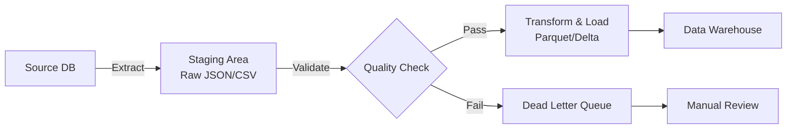

# W07: Batch Data Ingestion

# Lesson: Batch Data Ingestion

Batch data ingestion is the process of moving large volumes of data from source systems to a destination (such as a Data Lake or Warehouse) at scheduled intervals. Unlike streaming, which processes data record-by-record in real-time, batch processing handles data in chunks or "batches." This lesson covers the core concepts, architectural patterns, tools, and best practices for building efficient and reliable batch ingestion pipelines.

## Core Concepts of Batch Ingestion

Batch ingestion is characterized by its periodic nature and ability to handle massive datasets efficiently.

### Key Characteristics

-   **Latency**: High latency (minutes to hours). Data is not available immediately after creation.
-   **Throughput**: Optimized for high volume. Processes millions of records in a single job.
-   **Scheduling**: Jobs run on fixed schedules (e.g., hourly, daily, weekly).
-   **Resource Efficiency**: Can leverage off-peak computing resources to reduce costs.
-   **Complexity**: Simpler to implement and debug than streaming systems.

### When to Use Batch Ingestion

-   Historical data migration.
-   Daily reporting and business intelligence dashboards.
-   Machine learning model training (which often requires full datasets).
-   Systems where real-time data is not critical.
-   Source systems that cannot support continuous extraction (e.g., legacy mainframes).

> [!Important]
> **Batch is not obsolete**: While streaming gets attention, 80% of enterprise data workloads are still batch-oriented. It is cost-effective, reliable, and sufficient for most analytical use cases. Do not over-engineer with streaming if daily updates meet business needs.

## Architectural Patterns

How you extract and load data defines the efficiency of your pipeline.

### Full Load (Snapshot)

-   **Process**: Extracts the entire dataset from the source every time the job runs.
-   **Pros**: Simplest to implement; no need to track changes.
-   **Cons**: Inefficient for large tables; high load on source system; slow.
-   **Use Case**: Small reference tables (e.g., Country Codes, Product Categories).

### Incremental Load (Delta)

-   **Process**: Extracts only new or modified records since the last run.
-   **Mechanism**: Uses a "watermark" column (e.g., `last_updated_timestamp` or `incremental_id`).
-   **Pros**: Efficient; low impact on source; faster execution.
-   **Cons**: Requires source system to have reliable timestamp/ID columns; complex logic for deletes.
-   **Use Case**: Large transactional tables (e.g., Orders, Logs).

### Change Data Capture (CDC)

-   **Process**: Captures row-level changes (Insert, Update, Delete) from database transaction logs.
-   **Tools**: Debezium, AWS DMS, GoldenGate.
-   **Pros**: Near real-time; captures deletes; minimal source impact.
-   **Cons**: Complex setup; requires access to transaction logs; schema drift handling.
-   **Use Case**: Critical databases requiring accurate sync without polling.

| Pattern | Complexity | Source Load | Latency | Handles Deletes? |
|---|---|---|---|---|
| **Full Load** | Low | High | High | Yes (Overwrite) |
| **Incremental** | Medium | Low | Medium | No (Usually) |
| **CDC** | High | Very Low | Low | Yes |

## Tools and Technologies

### Orchestration

-   **Apache Airflow**: Open-source platform to programmatically author, schedule, and monitor workflows. Uses Python DAGs (Directed Acyclic Graphs).
-   **AWS Step Functions**: Serverless workflow service for coordinating distributed applications.
-   **Azure Data Factory / Google Cloud Composer**: Managed orchestration services for their respective clouds.

### Extraction and Transformation

-   **Apache Spark**: Distributed computing engine for large-scale data processing. Excellent for complex transformations during ingestion.
-   **AWS Glue**: Serverless ETL service that uses Spark under the hood. Includes a Data Catalog.
-   **dbt (data build tool)**: Primarily for transformation inside the warehouse, but increasingly used for ELT workflows.

### Storage

-   **Data Lakes**: Amazon S3, Azure Blob Storage, Google Cloud Storage. Ideal for raw batch dumps.
-   **Data Warehouses**: Snowflake, Redshift, BigQuery. Ideal for structured batch loads ready for analysis.

## Best Practices for Batch Ingestion

### Idempotency

-   **Definition**: Running the same job multiple times produces the same result.
-   **Implementation**: Use `MERGE` statements or overwrite partitions instead of appending blindly.
-   **Why**: If a job fails halfway and is restarted, you don’t want duplicate records.

### Partitioning

-   **Strategy**: Organize data in storage by date (e.g., `s3://bucket/data/year=2023/month=10/day=25/`).
-   **Benefit**: Allows queries and jobs to read only relevant partitions, reducing I/O and cost.
-   **Tip**: Avoid partitioning by high-cardinality columns (e.g., User ID) as it creates too many small files.

### Error Handling and Dead Letter Queues

-   **Validation**: Check schema and data quality before loading.
-   **DLQ**: Send failed records to a separate location (e.g., S3 bucket) for manual inspection.
-   **Alerting**: Notify engineers via Slack/Email if a batch job fails or data quality checks fail.

### Schema Evolution

-   **Challenge**: Source systems change columns (add/remove/rename).
-   **Solution**: Use flexible formats like Parquet or Delta Lake that support schema evolution.
-   **Process**: Detect schema changes during ingestion and update the target table metadata automatically.

### Monitoring and Observability

-   **Metrics**: Track job duration, rows processed, data volume, and failure rates.
-   **Lineage**: Document where data comes from and how it transforms.
-   **Logs**: Centralize logs for debugging failed jobs.

## Assessment Preparation

### Practice Questions

1.  What is the primary difference between batch and streaming ingestion?
2.  Explain the concept of idempotency in batch pipelines.
3.  Compare Full Load vs. Incremental Load. When would you use each?
4.  What is Change Data Capture (CDC) and why is it useful?
5.  How does partitioning improve batch ingestion performance?
6.  What role does Apache Airflow play in data pipelines?
7.  Why is storing raw data in a staging area beneficial?
8.  What is a Dead Letter Queue and how does it help reliability?
9.  How do you handle schema changes in batch ingestion?
10. List three metrics you should monitor for batch jobs.

### Scenario Questions

**Scenario 1: Daily Sales Report**
Retailer needs daily sales totals from 50 stores.

-   **Pattern**: Incremental Load.
-   **Schedule**: Run nightly at 2 AM.
-   **Logic**: Extract orders where `date = yesterday`.
-   **Storage**: Load into Snowflake fact table.
-   **Benefit**: Fast, efficient, meets daily reporting need.

**Scenario 2: Legacy Mainframe Migration**
Bank needs to move 10 years of historical customer data.

-   **Pattern**: Full Load (One-time).
-   **Tool**: AWS Glue or Spark.
-   **Process**: Extract flat files from mainframe, transform to Parquet, load into S3 Data Lake.
-   **Challenge**: Handling complex legacy encodings and missing fields.
-   **Validation**: Row count reconciliation between source and target.

**Scenario 3: Frequent Updates to Product Catalog**
E-commerce site updates prices and inventory every hour.

-   **Pattern**: CDC or Incremental Load with Upsert.
-   **Tool**: Debezium or AWS DMS.
-   **Process**: Capture changes in SQL Server, apply to Delta Lake table.
-   **Benefit**: Keeps catalog fresh without full reloads; handles price changes accurately.

**Scenario 4: Job Failure Due to Bad Data**
Pipeline fails because a new column appeared in source CSV.

-   **Fix**: Implement schema evolution in ingestion script.
-   **Prevention**: Add schema validation step before processing.
-   **Recovery**: Move bad file to DLQ; alert engineer; fix script; rerun.
-   **Tool**: Use Great Expectations or dbt tests.

**Scenario 5: Duplicate Records After Retry**
Job crashed and was retried, causing double counts in reports.

-   **Problem**: Lack of idempotency.
-   **Fix**: Change load strategy from `APPEND` to `OVERWRITE` for the specific partition.
-   **Alternative**: Use `MERGE` statement with unique key to update existing records.
-   **Test**: Simulate failure and retry to verify no duplicates.

## Key Takeaways

-   Batch ingestion processes large volumes of data at scheduled intervals.
-   It is cost-effective and sufficient for most analytical workloads.
-   Full Load is simple but inefficient; Incremental Load is efficient but complex.
-   CDC provides near real-time sync with minimal source impact.
-   Idempotency is critical to prevent duplicates during retries.
-   Partitioning by date optimizes storage and query performance.
-   Dead Letter Queues isolate bad data without stopping the pipeline.
-   Schema evolution handles source changes gracefully.
-   Orchestration tools like Airflow manage dependencies and scheduling.
-   Monitor job health, data quality, and lineage for reliability.

> [!Important]
> **Start simple, then optimize**: Begin with a simple Full Load or Incremental pattern. Only introduce CDC or complex orchestration when necessary. Focus on data quality and idempotency first. A reliable batch pipeline is better than a fragile real-time one. Understand your data’s volume and velocity before choosing the ingestion strategy.
