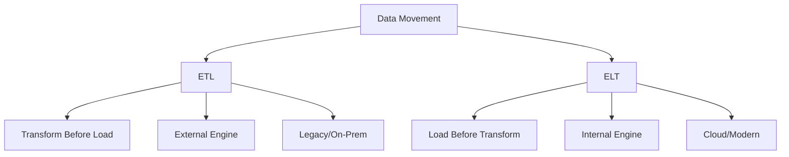
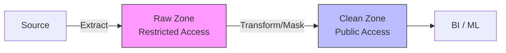

# W08: ELT vs. ETL Methodologies

# Lesson: ELT vs. ETL Methodologies

The debate between ETL (Extract, Transform, Load) and ELT (Extract, Load, Transform) is central to modern data architecture. While both methodologies move data from sources to destinations, the order of operations fundamentally changes performance, flexibility, and cost structures. This lesson contrasts these approaches, explains why the cloud has shifted the industry toward ELT, and provides guidance on when to use each.

## ETL (Extract, Transform, Load)

ETL is the traditional approach where data is transformed in a separate processing engine before being loaded into the target database.

### The Process

1.  **Extract**: Pull data from source systems (databases, APIs, files).
2.  **Transform**: Clean, aggregate, join, and format data in an intermediate processing layer (e.g., Informatica, Talend, custom Spark jobs).
3.  **Load**: Write the final, clean data into the target Data Warehouse.

### Characteristics

-   **Compute Location**: Transformation happens outside the destination database.
-   **Schema-on-Write**: Data must conform to the target schema before loading.
-   **Data Volume**: Only clean, necessary data is stored in the warehouse.
-   **Governance**: High control over what enters the system; sensitive data can be masked before storage.

### Pros and Cons

| Pros | Cons |
|---|---|
| Strong security/compliance (masking before load) | Rigid; hard to change transformations later |
| Reduced storage costs (only clean data stored) | Slow; transformation is a bottleneck |
| Mature tooling for legacy systems | Raw data is lost; hard to reprocess |
| Good for small-to-medium datasets | Complex maintenance of ETL scripts |

> [!Important]
> **ETL throws away raw data**: Once data is transformed and loaded, the original context is often lost. If business logic changes, you cannot simply re-run the transformation because the raw source data is no longer in your warehouse. You must go back to the source system, which may be slow or unavailable.

## ELT (Extract, Load, Transform)

ELT is the modern cloud-native approach where raw data is loaded directly into the target system, and transformation happens inside the destination using its own compute power.

### The Process

1.  **Extract**: Pull data from source systems.
2.  **Load**: Dump raw data directly into the Data Lake or Cloud Warehouse (e.g., Snowflake, BigQuery, Redshift).
3.  **Transform**: Use SQL or code within the warehouse to clean and model data (e.g., using dbt).

### Characteristics

-   **Compute Location**: Transformation happens inside the destination database.
-   **Schema-on-Read**: Raw data is stored first; structure is applied when queried.
-   **Data Volume**: Stores everything, including raw historical data.
-   **Flexibility**: Business logic can be changed and reapplied instantly without re-extracting.

### Pros and Cons

| Pros | Cons |
|---|---|
| Fast ingestion; no transformation bottleneck | Requires robust governance to prevent "data swamps" |
| Preserves raw data for future reprocessing | Storage costs may be higher (but cheap in cloud) |
| Leverages scalable cloud compute | Security risks if PII is loaded raw |
| Agile; easy to change business logic | Requires powerful destination database |

> [!Tip]
> **ELT enables agility**: Because raw data is preserved, analysts can experiment with new metrics without waiting for engineering teams to update ETL pipelines. It shifts the power of transformation from engineers to analysts using SQL.

## Why the Shift to ELT?

Three technological trends drove the industry from ETL to ELT.

### 1. Cheap Cloud Storage

-   In on-premise environments, storage was expensive. ETL minimized storage by loading only clean data.
-   In the cloud (S3, Blob), storage is negligible in cost. Storing raw data is affordable.

### 2. Scalable Cloud Compute

-   Traditional warehouses had limited compute. Heavy transformations slowed them down.
-   Cloud warehouses (Snowflake, BigQuery) separate storage from compute. You can spin up massive clusters for transformation and shut them down afterward.

### 3. Rise of SQL-Based Transformation Tools

-   Tools like **dbt (data build tool)** allow analysts to write modular, tested SQL transformations that run directly inside the warehouse.
-   This eliminated the need for complex, proprietary ETL scripting languages.

## Comparison Matrix

| Feature | ETL | ELT |
|---|---|---|
| **Order** | Extract → Transform → Load | Extract → Load → Transform |
| **Hardware** | Requires separate transformation server | Uses destination database compute |
| **Data State** | Only clean data loaded | Raw + Clean data loaded |
| **Flexibility** | Low (rigid schema) | High (schema-on-read) |
| **Time to Insight** | Slow (upfront modeling) | Fast (load now, model later) |
| **Security** | High (mask before load) | Medium (must mask in warehouse) |
| **Best For** | Legacy, strict compliance, small data | Cloud, big data, agile analytics |

## When to Use Which?

### Use ETL When:

-   **Strict Compliance**: GDPR/HIPAA requires PII to be masked or removed before it touches your storage.
-   **Legacy Systems**: On-premise warehouses with limited compute power.
-   **Small Data Volumes**: Where transformation overhead is minimal.
-   **Real-Time Needs**: Sometimes ETL streams are easier to manage for simple real-time dashboards than complex ELT batches.

### Use ELT When:

-   **Cloud-Native Architecture**: Using Snowflake, BigQuery, Redshift, or Databricks.
-   **Large/Unstructured Data**: Need to store raw logs, JSON, or IoT data.
-   **Agile Analytics**: Business requirements change frequently; need to reprocess history easily.
-   **Data Science**: ML models often need raw, unaggregated data that ETL would have discarded.

## Modern Hybrid Approaches

In practice, most enterprises use a hybrid model.

### ELT with Pre-Processing

-   Light transformation (e.g., format conversion, basic filtering) happens during ingestion.
-   Heavy business logic (aggregations, joins) happens in the warehouse.
-   Example: Convert CSV to Parquet during load, then use dbt for modeling.

### Secure ELT

-   Load raw data into a restricted "Raw" zone with strict access controls.
-   Transform and mask PII in a "Clean" zone accessible to broader teams.
-   Combines ELT flexibility with ETL-like security governance.

## Assessment Preparation

### Practice Questions

1.  What does ETL stand for and how does it differ from ELT?
2.  Why did cloud computing drive the adoption of ELT?
3.  What is the main disadvantage of ETL regarding historical data?
4.  How does dbt facilitate ELT workflows?
5.  When is ETL still preferred over ELT?
6.  Explain the concept of Schema-on-Write vs. Schema-on-Read.
7.  What are the security risks of ELT and how do you mitigate them?
8.  Why is storage cost less of a concern in ELT?
9.  Describe a hybrid ETL/ELT approach.
10. How does ELT improve time-to-insight for analysts?

### Scenario Questions

**Scenario 1: Healthcare Provider**
Must comply with HIPAA; patient names cannot be stored in analytics warehouse.

-   **Choice**: ETL (or Secure ELT).
-   **Process**: Mask/Hash patient names in intermediate layer before loading.
-   **Reason**: Compliance requires PII removal before storage.
-   **Tool**: Informatica or custom Spark job.

**Scenario 2: E-Commerce Startup**
Rapidly changing product categories; needs flexible reporting.

-   **Choice**: ELT.
-   **Process**: Load raw JSON from app into Snowflake. Use dbt to model.
-   **Reason**: Easy to adjust models as categories change; raw data preserved.
-   **Benefit**: Analysts can self-serve without engineering help.

**Scenario 3: Legacy Bank Migration**
Moving from mainframe to cloud; limited bandwidth.

-   **Choice**: Hybrid.
-   **Process**: Filter and compress data on-premise (Light ETL). Load to S3. Transform in Cloud (ELT).
-   **Reason**: Reduces data transfer volume; leverages cloud scale for heavy lifting.

**Scenario 4: Marketing Analytics**
Needs to combine Facebook Ads, Google Ads, and CRM data.

-   **Choice**: ELT.
-   **Process**: Use Fivetran/Stitch to load all raw data to BigQuery. Use dbt to join.
-   **Reason**: Fast setup; easy to add new sources; raw data available for attribution modeling.

**Scenario 5: Real-Time Inventory**
Warehouse needs up-to-the-minute stock levels.

-   **Choice**: Streaming ETL (or CDC).
-   **Process**: Capture DB changes, transform lightly, load to operational DB.
-   **Reason**: Batch ELT is too slow; need low latency.
-   **Note**: This is a special case where traditional batch ELT is unsuitable.

## Key Takeaways

-   ETL transforms before loading; ELT loads before transforming.
-   ETL is rigid but secure; ELT is flexible and agile.
-   Cloud storage and compute scalability made ELT viable.
-   ELT preserves raw data, enabling reproducibility and reprocessing.
-   dbt is the standard tool for ELT transformations.
-   ETL is still used for strict compliance and legacy systems.
-   Security in ELT requires careful access control and masking in the warehouse.
-   Hybrid approaches combine light pre-processing with heavy cloud transformation.
-   Choose based on data volume, compliance needs, and organizational agility.
-   ELT empowers analysts; ETL relies on engineers.

> [!Important]
> **ELT is not just "lazy ETL"**: It is a strategic shift that recognizes storage is cheap and compute is elastic. By keeping raw data, you future-proof your architecture. However, without governance, ELT leads to chaos. Invest in data cataloging, quality testing, and access control to make ELT successful. The goal is to balance speed with trust.
