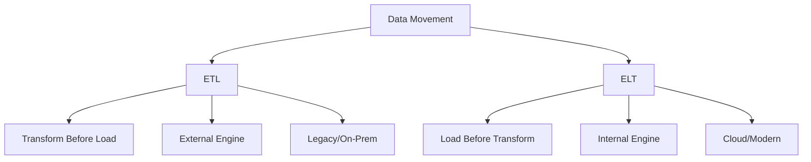

# Migration in progress
# W08: ELT vs. ETL Methodologies

# Lesson: ELT vs. ETL Methodologies

The debate between ETL (Extract, Transform, Load) and ELT (Extract, Load, Transform) is central to modern data architecture. While both methodologies move data from sources to destinations, the order of operations fundamentally changes performance, flexibility, and cost structures. This lesson contrasts these approaches, explains why the cloud has shifted the industry toward ELT, and provides guidance on when to use each.

## ETL (Extract, Transform, Load)

ETL is the traditional approach where data is transformed in a separate processing engine before being loaded into the target database.

### The Process

1.  **Extract**: Pull data from source systems (databases, APIs, files).
2.  **Transform**: Clean, aggregate, join, and format data in an intermediate processing layer (e.g., Informatica, Talend, custom Spark jobs).
3.  **Load**: Write the final, clean data into the target Data Warehouse.

### Characteristics

-   **Compute Location**: Transformation happens outside the destination database.
-   **Schema-on-Write**: Data must conform to the target schema before loading.
-   **Data Volume**: Only clean, necessary data is stored in the warehouse.
-   **Governance**: High control over what enters the system; sensitive data can be masked before storage.

### Pros and Cons

| Pros | Cons |
|---|---|
| Strong security/compliance (masking before load) | Rigid; hard to change transformations later |
| Reduced storage costs (only clean data stored) | Slow; transformation is a bottleneck |
| Mature tooling for legacy systems | Raw data is lost; hard to reprocess |
| Good for small-to-medium datasets | Complex maintenance of ETL scripts |

> [!Important]
> **ETL throws away raw data**: Once data is transformed and loaded, the original context is often lost. If business logic changes, you cannot simply re-run the transformation because the raw source data is no longer in your warehouse. You must go back to the source system, which may be slow or unavailable.

## ELT (Extract, Load, Transform)

ELT is the modern cloud-native approach where raw data is loaded directly into the target system, and transformation happens inside the destination using its own compute power.

### The Process

1.  **Extract**: Pull data from source systems.
2.  **Load**: Dump raw data directly into the Data Lake or Cloud Warehouse (e.g., Snowflake, BigQuery, Redshift).
3.  **Transform**: Use SQL or code within the warehouse to clean and model data (e.g., using dbt).

### Characteristics

-   **Compute Location**: Transformation happens inside the destination database.
-   **Schema-on-Read**: Raw data is stored first; structure is applied when queried.
-   **Data Volume**: Stores everything, including raw historical data.
-   **Flexibility**: Business logic can be changed and reapplied instantly without re-extracting.

### Pros and Cons

| Pros | Cons |
|---|---|
| Fast ingestion; no transformation bottleneck | Requires robust governance to prevent "data swamps" |
| Preserves raw data for future reprocessing | Storage costs may be higher (but cheap in cloud) |
| Leverages scalable cloud compute | Security risks if PII is loaded raw |
| Agile; easy to change business logic | Requires powerful destination database |

> [!Tip]
> **ELT enables agility**: Because raw data is preserved, analysts can experiment with new metrics without waiting for engineering teams to update ETL pipelines. It shifts the power of transformation from engineers to analysts using SQL.

## Why the Shift to ELT?

Three technological trends drove the industry from ETL to ELT.

### 1. Cheap Cloud Storage

-   In on-premise environments, storage was expensive. ETL minimized storage by loading only clean data.
-   In the cloud (S3, Blob), storage is negligible in cost. Storing raw data is affordable.

### 2. Scalable Cloud Compute

-   Traditional warehouses had limited compute. Heavy transformations slowed them down.
-   Cloud warehouses (Snowflake, BigQuery) separate storage from compute. You can spin up massive clusters for transformation and shut them down afterward.

### 3. Rise of SQL-Based Transformation Tools

-   Tools like **dbt (data build tool)** allow analysts to write modular, tested SQL transformations that run directly inside the warehouse.
-   This eliminated the need for complex, proprietary ETL scripting languages.

## Comparison Matrix

| Feature | ETL | ELT |
|---|---|---|
| **Order** | Extract → Transform → Load | Extract → Load → Transform |
| **Hardware** | Requires separate transformation server | Uses destination database compute |
| **Data State** | Only clean data loaded | Raw + Clean data loaded |
| **Flexibility** | Low (rigid schema) | High (schema-on-read) |
| **Time to Insight** | Slow (upfront modeling) | Fast (load now, m