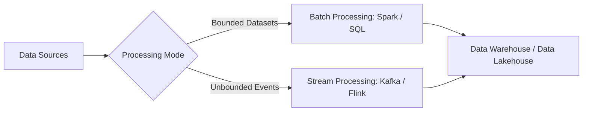
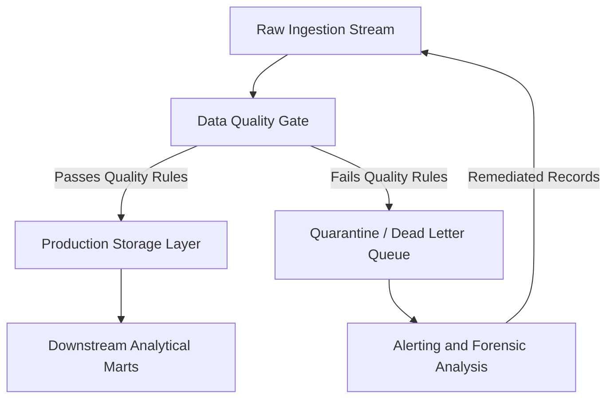

# W09: Data Transformation, Processing, and Data Quality

**Trimester 2: Data Stores and Pipelines - Week 9: Data Transformation, Processing, and Data Quality**

Data pipelines require robust transformation layers, scalable processing engines, and systematic quality assurance to deliver trustworthy analytical data. Modern data engineering architectures separate raw ingestion from downstream modeling while continuously validating data against strict operational criteria. This module examines transformation techniques, compares batch and streaming processing models, establishes core data quality dimensions, and implements defensive pipeline architectures.

**Data Transformation Paradigms and Mechanics**

- **Structural Transformations** modify table organization through pivot operations, column unnesting, flattening hierarchical JSON objects, and array explosions.
- **Normalization** eliminates update anomalies and reduces redundant attributes by decomposing entities into third normal form (3NF) relational tables.
- **Denormalization** merges dimension tables directly into fact tables or wide flattened tables to eliminate expensive joins during high-concurrency analytical reads.
- **Type Casting and Standardization** enforces uniform data primitives, converts disparate timezone strings to UTC timestamps, and strips non-numeric characters from numerical fields.
- **Data Enrichment** combines incoming event payloads with master reference tables, lookup caches, or external geolocation and currency conversion APIs.
- *Idempotence* defines the design principle where executing a transformation job multiple times over the exact same input produces identical state outputs.

> [!Tip]
> **Idempotent transformations**: Designing transformation logic so that rerunning operations on identical input data yields the exact same state prevents duplicate downstream records during pipeline retries.

**Processing Architectures: Batch versus Stream Processing**

- **Batch Processing** executes computations over bounded, historical datasets collected over discrete time intervals such as hourly, daily, or weekly runs.
- **Stream Processing** handles unbounded, continuous event flows with minimal latency using event-by-event evaluation or micro-batch windows.
- **Micro-Batching** buffers incoming real-time records into tiny time-based slices, combining stream ingestion simplicity with batch-oriented fault-recovery mechanisms.
- *Windowing* allows stateful aggregations across streaming data using tumbling windows, sliding windows, or session windows bounded by periods of user inactivity.
- **Watermarking** tracks event-time progress in streaming engines, allowing pipelines to process delayed or out-of-order records before finalizing window calculations.

| Dimension | Batch Processing | Micro-Batch Processing | Continuous Stream Processing |
|---|---|---|---|
| Latency | Minutes to hours | 100 milliseconds to minutes | Sub-second (single-digit milliseconds) |
| Data Boundary | Bounded datasets | Micro-sliced bounded batches | Unbounded continuous data |
| Primary Engines | Apache Spark, Trino, Snowflake | Spark Structured Streaming | Apache Flink, Kafka Streams |
| Fault Tolerance | Re-execute failed task or batch | Recompute micro-batch via lineage | Distributed checkpointing and savepoints |
| Infrastructure Cost | Low to moderate; scales to zero | Moderate continuous compute | High; continuous cluster allocation |
| State Management | External storage or memory cache | Ephemeral micro-batch state | Persistent distributed state backends (RocksDB) |

> [!Important]
> **Processing paradigm trade-off**: Continuous streaming minimizes event latency at the expense of higher infrastructure overhead and complex out-of-order state handling.

**Core Data Quality Dimensions and Frameworks**

- **Accuracy** measures whether recorded data values conform to real-world entities or authoritative external sources of truth.
- **Completeness** evaluates the proportion of non-null, non-missing values relative to expected total schema requirements.
- **Consistency** ensures that identical data values match across independent tables, operational databases, and reporting systems without discrepancy.
- **Timeliness** evaluates the latency between when an event occurs in the real world and when it becomes available for querying in analytical storage.
- **Validity** verifies that attribute values follow predefined business rules, allowable syntax, structural formats, and acceptable domain ranges.
- **Uniqueness** confirms that no duplicate entities exist within a primary key column or defined composite natural key set.

| Quality Dimension | Business Failure Example | Automated Verification Technique |
|---|---|---|
| Accuracy | Negative account balances for standard credit accounts | Cross-table ledger reconciliation assertions |
| Completeness | Customer shipping addresses missing postal zip codes | Null percentage threshold tests |
| Consistency | Active status listed in CRM but terminated in billing | Foreign key join integrity and reconciliation scripts |
| Timeliness | Clickstream events landing 36 hours after user visits | Ingestion watermark lag metric checks |
| Validity | Age field populated with negative values or strings | Schema type validation and regex range constraints |
| Uniqueness | Duplicate transaction identifiers generated on retry | Group-by count assertions over primary keys |

> [!Important]
> **Quality dimension coverage**: High completeness metrics do not guarantee data accuracy, requiring independent validation rules across all dimensions.

**Data Quality Testing and Validation Tools**

- **Great Expectations** provides a declarative Python framework to define expectation suites, generate human-readable Data Docs, and trigger automated checkpoints.
- **PyDeequ** brings Apache Spark integration for Amazon Deequ, computing distributed data quality metrics and enforcing scalable constraints over petabyte-scale DataFrames.
- **Soda Core** offers lightweight, SQL-based data reliability checks configured through simple YAML files, integrating directly into CI/CD deployment pipelines.
- **dbt Core Tests** execute generic assertions such as unique, not null, relationships, and accepted values, alongside bespoke singular SQL validation models.
- Python data quality rules execute as blocking validation tasks before loading steps or as asynchronous monitors publishing health alerts to messaging webhooks.

> [!Tip]
> **In-pipeline assertions**: Embedding automated Great Expectations checkpoints directly before loading stages prevents corrupted datasets from contaminating production tables.

**Data Quality Architecture: Circuit Breakers and Quarantine Patterns**

- **Pipeline Circuit Breakers** halt execution immediately when catastrophic data corruption occurs, preventing bad inputs from overwriting downstream production tables.
- **Quarantine Tables** isolate anomalous rows failing validation rules into a dedicated staging schema while permitting valid rows to continue processing.
- **Dead Letter Queues (DLQ)** capture unparseable, malformed streaming messages, storing raw payloads alongside failure error codes for forensic review.
- *Schema Drift Protection* prevents silent data loss by rejecting unexpected column drops or dynamically routing modified schemas to an ingestion staging area.
- Automated reconciliation tasks audit record counts between source extraction logs and target ingestion tables to detect record loss during processing.

> [!Important]
> **Dead letter isolation**: Diverting non-compliant records into quarantine storage preserves pipeline uptime while maintaining an audit trail for forensic remediation.

**Real-World Case Study: Financial Fraud and Settlement Pipeline**

- **Context**: A global payments gateway processes 12,000 transactions per second across credit cards, bank transfers, and digital wallets.
- **Processing Implementation**: Ingestion utilizes Kafka and Apache Flink for real-time fraud scoring with sliding five-minute velocity windows. Settled transaction batches are written hourly to Apache Iceberg tables using Apache Spark.
- **Quality Gates Applied**: Flink streaming checks validate currency format codes and assert that transaction amounts exceed zero. Records failing checks route immediately to an AWS SQS Dead Letter Queue.
- **Reconciliation Mechanism**: An end-of-day Spark batch job verifies that total processed transactional sums match aggregate settlement ledger statements provided by banking partners.
- **Observed Result**: Diverting invalid transactions to a quarantine layer eliminated automated chargeback failures while preserving a 99.99 percent pipeline uptime SLA.

> [!Tip]
> **Dual-track verification**: Reconciling real-time stream anomalies against end-of-day batch totals ensures zero undetected discrepancies across transactional accounts.

**Assessment Preparation**

- Practice Scenario 1: An e-commerce platform encounters duplicate order IDs when mobile applications retry network requests after timeouts. Describe how an idempotent transformation layer and uniqueness validation rules eliminate double-counted revenue.
- Practice Scenario 2: A streaming pipeline consumes clickstream JSON logs where 3 percent of incoming events contain corrupted timestamps caused by client-side clock drift. Contrast halting the entire pipeline versus routing the corrupted events to a dead letter queue.
- Practice Question 1: What is the operational distinction between data validity and data accuracy when verifying customer email addresses?
- Practice Question 2: Why are tumbling windows preferred over sliding windows when aggregating hourly active user counts for financial billing?

> [!Tip]
> **Failure isolation strategy**: Evaluation questions frequently test the balance between stopping a pipeline entirely versus routing bad records to dead letter queues.

**Key Takeaways**

- Data transformation reconciles raw operational formats into structured, performant models using normalization, denormalization, and idempotent logic.
- Batch processing optimizes throughput for bounded datasets, whereas streaming architectures deliver low-latency processing for continuous event flows.
- Data quality relies on six core dimensions: accuracy, completeness, consistency, timeliness, validity, and uniqueness.
- Frameworks like Great Expectations and PyDeequ integrate programmatic validation directly into pipeline build stages and runtime schedules.
- Defensive architectures utilize dead letter queues and quarantine layers to protect production stores without disrupting ongoing pipeline operations.

> [!Important]
> **Automated data governance**: Modern data architectures maintain pipeline trust by treating data quality tests as blocking integration gates rather than passive monitoring reports.
