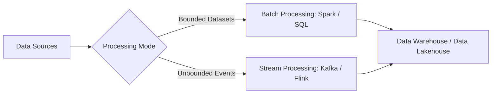

# Migration in progress
# W09: Data Transformation, Processing, and Data Quality

**Trimester 2: Data Stores and Pipelines - Week 9: Data Transformation, Processing, and Data Quality**

Data pipelines require robust transformation layers, scalable processing engines, and systematic quality assurance to deliver trustworthy analytical data. Modern data engineering architectures separate raw ingestion from downstream modeling while continuously validating data against strict operational criteria. This module examines transformation techniques, compares batch and streaming processing models, establishes core data quality dimensions, and implements defensive pipeline architectures.

**Data Transformation Paradigms and Mechanics**

- **Structural Transformations** modify table organization through pivot operations, column unnesting, flattening hierarchical JSON objects, and array explosions.
- **Normalization** eliminates update anomalies and reduces redundant attributes by decomposing entities into third normal form (3NF) relational tables.
- **Denormalization** merges dimension tables directly into fact tables or wide flattened tables to eliminate expensive joins during high-concurrency analytical reads.
- **Type Casting and Standardization** enforces uniform data primitives, converts disparate timezone strings to UTC timestamps, and strips non-numeric characters from numerical fields.
- **Data Enrichment** combines incoming event payloads with master reference tables, lookup caches, or external geolocation and currency conversion APIs.
- *Idempotence* defines the design principle where executing a transformation job multiple times over the exact same input produces identical state outputs.

> [!Tip]
> **Idempotent transformations**: Designing transformation logic so that rerunning operations on identical input data yields the exact same state prevents duplicate downstream records during pipeline retries.

**Processing Architectures: Batch versus Stream Processing**

- **Batch Processing** executes computations over bounded, historical datasets collected over discrete time intervals such as hourly, daily, or weekly runs.
- **Stream Processing** handles unbounded, continuous event flows with minimal latency using event-by-event evaluation or micro-batch windows.
- **Micro-Batching** buffers incoming real-time records into tiny time-based slices, combining stream ingestion simplicity with batch-oriented fault-recovery mechanisms.
- *Windowing* allows stateful aggregations across streaming data using tumbling windows, sliding windows, or session windows bounded by periods of user inactivity.
- **Watermarking** tracks event-time progress in streaming engines, allowing pipelines to process delayed or out-of-order records before finalizing window calculations.

| Dimension | Batch Processing | Micro-Batch Processing | Continuous Stream Processing |
|---|---|---|---|
| Latency | Minutes to hours | 100 milliseconds to minutes | Sub-second (single-digit milliseconds) |
| Data Boundary | Bounded datasets | Micro-sliced bounded batches | Unbounded continuous data |
| Primary Engines | Apache Spark, Trino, Snowflake | Spark Structured Streaming | Apache Flink, Kafka Streams |
| Fault Tolerance | Re-execute failed task or batch | Recompute micro-batch via lineage | Distributed checkpointing and savepoints |
| Infrastructure Cost | Low to moderate; scales to zero | Moderate continuous compute | High; continuous cluster allocation |
| State Management | External storage or memory cache | Ephemeral micro-batch state | Persistent distributed state backends (RocksDB) |

> [!Important]
> **Processing paradigm trade-off**: Continuous streaming minimizes event latency at the expense of higher infrastructure overhead and complex out-of-order state handling.

**Core Data Quality Dimensions and Frameworks**

- **Accuracy** measures whether recorded data values conform to real-world entities or authoritative external sources of truth.
- **Completeness** evaluates the proportion of non-null, non-missing values relative to expected total schema requirements.
- **Consistency** ensures that identical data values match across independent tables, operational databases, and reporting systems without discrepancy.
- **Timeliness** evaluates the latency between when an event occurs in the real world and when it becomes available for querying in analytical storage.
- **Validity** verifies that attribute values follow predefined business rules, allowable syntax, structural formats, and acceptable domain ranges.
- **Uniqueness** confirms that no duplicate entities exist within a primary key column or defined composite natural key set.

| Quality Dimension | Business Failure Example | Automated Verification Technique |
|---|---|---|
| Accuracy | Negative account balances for standard credit accounts | Cross-table ledger reconciliation assertions |
| Completeness | Customer shipping addresses missing postal zip codes | Null percentage threshold tests |
| Consistency | Active status listed in CRM but terminated in billing | Foreign key join integrity and reconciliation scripts |
| Timeliness | Clickstream events landing 36 hours after user visits | Ingestion watermark lag metric checks |
| Validity | Age field populated with negative values or strings | Schema type validation and regex range constraints |
| Uniqueness | Duplicate transaction identifiers generated on retry | Group-by count assertions over primary keys |

> [!Important]
> **Quali