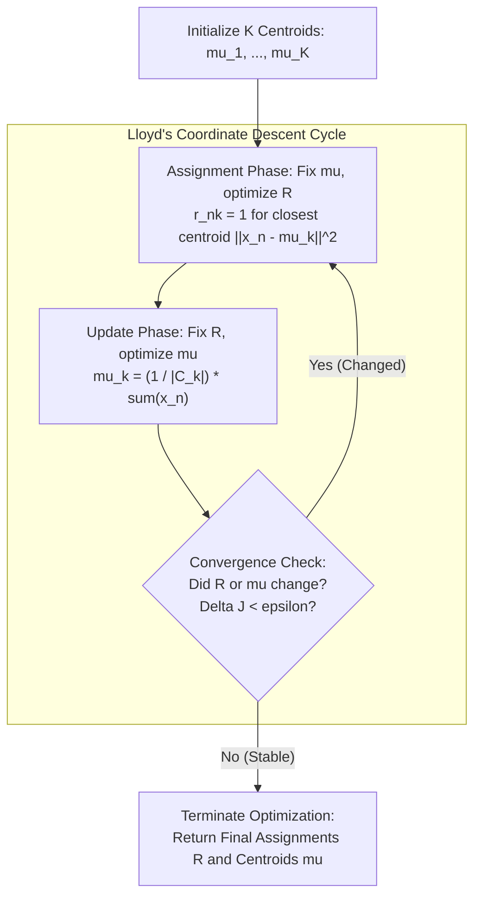
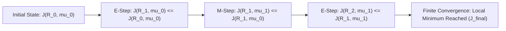

# Lesson 1: The K-Means Algorithm: Mechanics,...

## The K-Means Algorithm: Mechanics, Objective Function, and Convergence

K-Means clustering serves as the foundational iterative algorithm for partitioning unlabeled continuous data into cohesive, non-overlapping groups. The algorithm models clustering as an optimization problem that minimizes the squared Euclidean distance between data observations and their assigned group prototypes. By alternating between discrete sample assignment and continuous centroid recalculation, K-Means executes coordinate descent over a non-convex objective function to guarantee convergence to a local minimum.

## The K-Means Objective Function and Distortion Measure

### The Mathematical Formulation of Within-Cluster Sum of Squares (WCSS)

- Let $\mathcal{D} = \{x_1, x_2, \dots, x_N\}$ denote an unlabeled dataset containing $N$ observation vectors in $D$-dimensional real space: $x_n \in \mathbb{R}^D$.
- The user specifies an integer hyperparameter $K \in \mathbb{Z}^+$, defining the target cardinality of disjoint clusters: $\mathcal{C} = \{C_1, C_2, \dots, C_K\}$.
- Each cluster $C_k$ is represented geometrically by a continuous prototype vector termed the **centroid**: $\mu_k \in \mathbb{R}^D$.
- Define a binary cluster indicator matrix $R \in \{0, 1\}^{N \times K}$ where entry $r_{nk}$ denotes assignment:
  $$r_{nk} = \begin{cases} 1 & \text{if observation } x_n \text{ is assigned to cluster } C_k \\ 0 & \text{otherwise} \end{cases}$$
- The assignments enforce a strict **partitional constraint**: each observation belongs to exactly one cluster at any given iteration:
  $$\sum_{k=1}^K r_{nk} = 1 \quad \forall n \in \{1, \dots, N\}$$
- The objective function, termed the **distortion measure**, **inertia**, or **Within-Cluster Sum of Squares (WCSS)**, calculates the total squared Euclidean distance from every point to its assigned centroid:
  $$J(R, \mu) = \sum_{n=1}^N \sum_{k=1}^K r_{nk} \|x_n - \mu_k\|_2^2$$

### The Geometry of Squared Euclidean Distance

- The objective evaluates the squared $L_2$ norm, expanding component-wise across all $D$ dimensions:
  $$\|x_n - \mu_k\|_2^2 = \sum_{d=1}^D (x_{nd} - \mu_{kd})^2$$
- Squaring the distance penalizes distant observations quadratically, forcing cluster centroids to position near dense geometric concentrations of points.
- The objective function is non-convex with respect to both sets of parameters simultaneously ($R$ and $\mu$), creating an optimization terrain characterized by multiple distinct local minima.

> [!Important]
> **The WCSS objective enforces hard, exclusive clustering**: the binary indicator matrix $R$ partitions observations into mutually exclusive sets, measuring compactness via cumulative squared Euclidean distances to centroid prototypes.

## The Iterative Mechanics of Lloyd's Algorithm

### Step 1: The Assignment Phase (Coordinate Descent on $R$)

- Lloyd's algorithm minimizes the global distortion $J(R, \mu)$ using two-step **alternating coordinate descent**.
- In the assignment phase, the centroid prototypes $\mu = \{\mu_1, \dots, \mu_K\}$ remain fixed, optimizing $J$ strictly with respect to assignment matrix $R$.
- Because each observation's assignment is decoupled from the others, the summation decomposes across points:
  $$\min_R J(R, \mu) = \sum_{n=1}^N \left( \min_{r_n} \sum_{k=1}^K r_{nk} \|x_n - \mu_k\|_2^2 \right)$$
- To minimize the inner sum subject to $\sum_k r_{nk} = 1$, the indicator variable sets to one for the specific centroid that yields the smallest Euclidean distance:
  $$r_{nk} = \begin{cases} 1 & \text{if } k = \arg\min_j \|x_n - \mu_j\|_2^2 \\ 0 & \text{otherwise} \end{cases}$$
- Ties between equidistant centroids resolve arbitrarily by choosing the lowest index.
- Geometrically, this phase partitions the continuous input space into a **Voronoi tessellation**, where the boundary between any adjacent pair of clusters forms an orthogonal bisecting hyperplane:
  $$\|x - \mu_j\|_2^2 = \|x - \mu_k\|_2^2$$

### Step 2: The Centroid Update Phase (Coordinate Descent on $\mu$)

- In the update phase, cluster assignments $R$ remain fixed, optimizing $J$ strictly with respect to continuous centroid vectors $\mu$.
- The objective function decomposes into $K$ independent sub-problems:
  $$\min_\mu J(R, \mu) = \sum_{k=1}^K \left( \sum_{n=1}^N r_{nk} \|x_n - \mu_k\|_2^2 \right)$$
- Because the squared Euclidean distance is smooth and convex with respect to $\mu_k$, evaluating the first partial derivative isolates the global minimum:
  $$\frac{\partial J}{\partial \mu_k} = 2 \sum_{n=1}^N r_{nk} (\mu_k - x_n) = 0$$
- Solving for $\mu_k$ yields the **sample arithmetic mean**:
  $$2 \mu_k \sum_{n=1}^N r_{nk} - 2 \sum_{n=1}^N r_{nk} x_n = 0 \implies \mu_k \sum_{n=1}^N r_{nk} = \sum_{n=1}^N r_{nk} x_n$$
  $$\mu_k = \frac{\sum_{n=1}^N r_{nk} x_n}{\sum_{n=1}^N r_{nk}} = \frac{1}{|C_k|} \sum_{x_n \in C_k} x_n$$
  where $|C_k| = \sum_n r_{nk}$ represents the total observation count currently assigned to cluster $k$.

> [!Tip]
> **The arithmetic mean minimizes squared Euclidean distance**: the update phase sets each centroid to the center of mass of its assigned points, which provides the unique mathematical minimum for quadratic error.

## Monotonic Convergence and the Local Minima Problem

### Formal Proof of Monotonic Decrease

- Let $J^{(t)} = J(R^{(t)}, \mu^{(t)})$ represent the distortion value at iteration $t$.
- In the assignment phase, setting $R^{(t+1)}$ reassigns each point $x_n$ to its nearest current centroid $\mu^{(t)}$, guaranteeing that distortion cannot increase:
  $$J(R^{(t+1)}, \mu^{(t)}) \le J(R^{(t)}, \mu^{(t)})$$
- In the update phase, setting $\mu^{(t+1)}$ to the sample mean of assignments $R^{(t+1)}$ minimizes the quadratic sum, guaranteeing that distortion cannot increase:
  $$J(R^{(t+1)}, \mu^{(t+1)}) \le J(R^{(t+1)}, \mu^{(t)})$$
- Combining both inequalities yields a strictly non-increasing sequence:
  $$J(R^{(t+1)}, \mu^{(t+1)}) \le J(R^{(t)}, \mu^{(t)})$$

### Proof of Finite Termination

- The number of unique cluster assignment configurations $R$ across $N$ data points into $K$ clusters is finite, bounded by $K^N$.
- The distortion objective is bounded below by zero: $J(R, \mu) \ge 0$.
- Because each iteration either decreases the objective function or leaves it unchanged, and because the configuration space is finite, the algorithm cannot cycle between configurations.
- Lloyd's algorithm must terminate in a **finite number of steps**.

### Convergence Criteria and Termination Thresholds

- Practical implementations terminate optimization when any of three conditions is met:
  1. **Strict Assignment Stability:** No data point changes its cluster assignment between consecutive iterations ($R^{(t+1)} = R^{(t)}$).
  2. **Centroid Displacement Floor:** The maximum Euclidean shift across all centroids falls below a numerical tolerance threshold:
     $$\max_k \|\mu_k^{(t+1)} - \mu_k^{(t)}\|_2 < \epsilon_{\text{tol}}$$
  3. **Relative Distortion Plateau:** The relative drop in the objective function between iterations becomes negligible:
     $$\frac{|J^{(t)} - J^{(t+1)}|}{J^{(t)}} < \tau$$

### Suboptimal Local Minima and Starting Sensitivity

- Monotonic decrease guarantees convergence to a **local stationary minimum**, not the global optimum.
- The final partition depends heavily on initial centroid coordinates.
- Suboptimal initial placements can cause centroids to become trapped:
  - Splitting a dense single cluster into multiple sub-clusters.
  - Merging two distinct separated clusters into a single shared centroid.
- Resolving local minima requires executing multiple random restarts ($n_{\text{init}} \in [10, 50]$) and retaining the partition that yields the lowest final distortion $J$.

> [!Important]
> **Convergence is guaranteed, but global optimality is not**: Lloyd's algorithm decreases distortion monotonically to terminate in finite steps, but its sensitivity to initial coordinates makes multiple random restarts necessary.

## Computational Complexity and Memory Requirements

### Time Complexity per Iteration

- The computational cost of Lloyd's algorithm divides into two operational components per iteration:
  - **Assignment Step:** Evaluates squared Euclidean distances between all $N$ data points and all $K$ centroids across $D$ dimensions:
    $$\text{Cost}_{\text{assign}} = N \times K \times D \text{ operations} \in O(NKD)$$
  - **Update Step:** Sums all $N$ vectors across $D$ dimensions to recalculate $K$ sample means:
    $$\text{Cost}_{\text{update}} = N \times D \text{ operations} \in O(ND)$$
- Because $K \ge 1$, the assignment step dominates, yielding an overall per-iteration time complexity of:
  $$T_{\text{iteration}} \in O(NKD)$$

### Total Execution Complexity Across Epochs

- If the algorithm executes $I$ iterations before satisfying convergence thresholds, the total computational complexity evaluates as:
  $$T_{\text{total}} \in O(I \cdot N \cdot K \cdot D)$$
- In practice, the required iteration count $I$ is much smaller than $N$ (typically $I \in [10, 100]$), making K-Means computationally linear in dataset size $N$.
- The linear scaling $O(N)$ makes K-Means significantly faster than hierarchical clustering algorithms, which scale quadratically ($O(N^2)$) or cubically ($O(N^3)$).

### Memory Consumption and High-Dimensional Footprints

- Storing the empirical dataset requires $N \times D$ floating-point entries: $O(ND)$ memory.
- Storing the centroid prototypes requires $K \times D$ entries: $O(KD)$ memory.
- Storing the cluster assignments requires an integer array of length $N$: $O(N)$ memory.
- Total memory footprint scales as $O(ND + KD)$, allowing the algorithm to execute within standard RAM for moderate datasets.
- When dimensionality $D$ is very large ($D > 10,000$), computing pairwise Euclidean distances encounters the **curse of dimensionality**, where distances between all pairs of points concentrate toward a uniform value, degrading clustering stability.

> [!Tip]
> **K-Means scales linearly with dataset size**: with a time complexity of $O(I \cdot N \cdot K \cdot D)$, K-Means processes large datasets significantly faster than hierarchical clustering algorithms that require $O(N^2)$ distance matrices.

## Comparative Matrix of Optimization Phases and Degenerate States

| Execution Phase | Operational Target | Mathematical Formulation | Time Complexity | Geometric Interpretation | Degenerate State / Hazard |
|---|---|---|---|---|---|
| **Assignment Phase (E-Step)** | Optimize assignment indicators $R$ | $r_{nk} = \mathbf{1}[k = \arg\min_j \|x_n - \mu_j\|^2]$ | $O(NKD)$ | Partitions space into a Voronoi diagram | Centroid straddling; boundary oscillation |
| **Update Phase (M-Step)** | Optimize prototype vectors $\mu$ | $\mu_k = \frac{1}{|C_k|} \sum_{x_n \in C_k} x_n$ | $O(ND)$ | Shifts prototypes to cluster centers of mass | **Empty cluster** ($|C_k| = 0$, division by zero) |
| **Random Restart Protocol** | Avoid poor local minima | $\arg\min_{\text{run}} J_{\text{final}}$ over $n_{\text{init}}$ runs | $n_{\text{init}} \times O(INKD)$ | Samples different initial basins | Wasted computation on duplicate basins |
| **Convergence Check** | Halt iterative cycle | Check if $R^{(t+1)} = R^{(t)}$ or $\Delta \mu < \epsilon$ | $O(N)$ or $O(KD)$ | Confirms arrival at a stationary point | Premature stopping under loose tolerance $\epsilon$ |

### Handling the Empty Cluster Degeneracy

- An **empty cluster** occurs during the assignment phase when a centroid $\mu_k$ is positioned such that no observation in $\mathcal{D}$ identifies it as its closest center ($|C_k| = \sum_n r_{nk} = 0$).
- In the subsequent update phase, computing $\mu_k = \frac{\sum r_{nk} x_n}{0}$ triggers a division-by-zero exception.
- Production implementations resolve empty clusters using two standard fallback protocols:
  1. **Furthest Point Reassignment:** Identify the observation $x_{\text{max}}$ in the dataset that has the largest squared distance to its assigned centroid, and reassign the empty centroid directly to its coordinates: $\mu_k \leftarrow x_{\text{max}}$.
  2. **Cluster Splitting:** Identify the cluster exhibiting the highest internal variance (distortion) and split its members, allocating the empty centroid to share the dense cluster.

> [!Important]
> **Empty clusters require active reassignment**: if an update step yields $|C_k| = 0$, standard libraries prevent division-by-zero errors by reassigning the dead centroid to the data observation exhibiting the highest current error.

## Key Takeaways

- **The K-Means objective minimizes WCSS distortion**: $J = \sum_n \sum_k r_{nk} \|x_n - \mu_k\|_2^2$ measures cluster compactness using cumulative squared Euclidean distances.
- **Lloyd's algorithm executes coordinate descent**: it alternates between discrete assignment (E-step) and sample mean calculation (M-step).
- **The assignment step creates Voronoi cells**: each observation assigns to its nearest centroid, establishing linear bisecting hyperplanes between clusters.
- **Centroids update as sample arithmetic means**: setting prototypes to cluster centers of mass provides the exact mathematical minimum for the quadratic distance objective.
- **Convergence is monotonic and finite**: because distortion decreases on every step and the number of valid partitions ($K^N$) is finite, the algorithm terminates without oscillating.
- **Monotonicity guarantees local optimality, not global**: K-Means is sensitive to initial centroid coordinates, requiring multiple random restarts to avoid poor local minima.
- **Total computational complexity is linear in sample size**: evaluating $O(I \cdot N \cdot K \cdot D)$ operations allows K-Means to scale to large datasets where $O(N^2)$ methods fail.
- **Empty clusters trigger division-by-zero errors**, requiring algorithms to reassign orphaned centroids to the observations exhibiting the highest distortion.

> [!Tip]
> The foundational rule of K-Means mechanics: **alternate assignments to minimize distance, and average points to center prototypes**; this coordinate descent loop ensures rapid, monotonic convergence to a local minimum while preserving linear computational efficiency across sample size.
