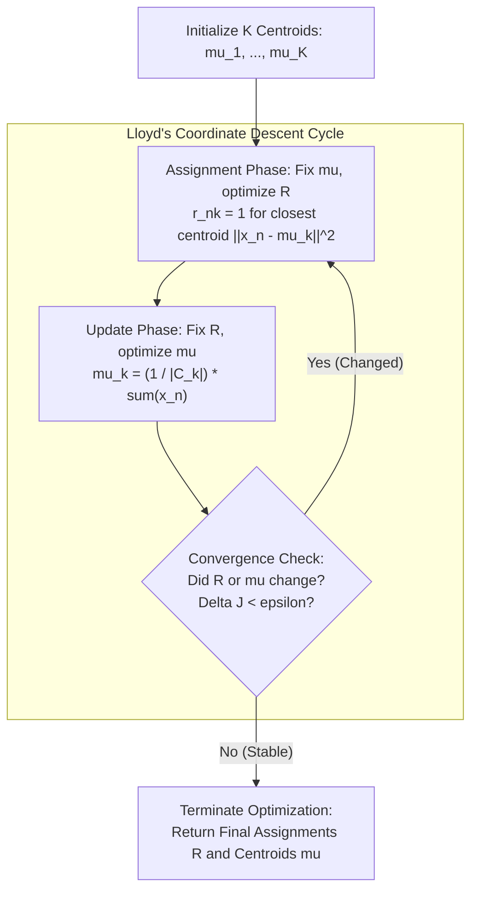

# Migration in progress
# Lesson 1: The K-Means Algorithm: Mechanics,...

## The K-Means Algorithm: Mechanics, Objective Function, and Convergence

K-Means clustering serves as the foundational iterative algorithm for partitioning unlabeled continuous data into cohesive, non-overlapping groups. The algorithm models clustering as an optimization problem that minimizes the squared Euclidean distance between data observations and their assigned group prototypes. By alternating between discrete sample assignment and continuous centroid recalculation, K-Means executes coordinate descent over a non-convex objective function to guarantee convergence to a local minimum.

## The K-Means Objective Function and Distortion Measure

### The Mathematical Formulation of Within-Cluster Sum of Squares (WCSS)

- Let $\mathcal{D} = \{x_1, x_2, \dots, x_N\}$ denote an unlabeled dataset containing $N$ observation vectors in $D$-dimensional real space: $x_n \in \mathbb{R}^D$.
- The user specifies an integer hyperparameter $K \in \mathbb{Z}^+$, defining the target cardinality of disjoint clusters: $\mathcal{C} = \{C_1, C_2, \dots, C_K\}$.
- Each cluster $C_k$ is represented geometrically by a continuous prototype vector termed the **centroid**: $\mu_k \in \mathbb{R}^D$.
- Define a binary cluster indicator matrix $R \in \{0, 1\}^{N \times K}$ where entry $r_{nk}$ denotes assignment:
  $$r_{nk} = \begin{cases} 1 & \text{if observation } x_n \text{ is assigned to cluster } C_k \\ 0 & \text{otherwise} \end{cases}$$
- The assignments enforce a strict **partitional constraint**: each observation belongs to exactly one cluster at any given iteration:
  $$\sum_{k=1}^K r_{nk} = 1 \quad \forall n \in \{1, \dots, N\}$$
- The objective function, termed the **distortion measure**, **inertia**, or **Within-Cluster Sum of Squares (WCSS)**, calculates the total squared Euclidean distance from every point to its assigned centroid:
  $$J(R, \mu) = \sum_{n=1}^N \sum_{k=1}^K r_{nk} \|x_n - \mu_k\|_2^2$$

### The Geometry of Squared Euclidean Distance

- The objective evaluates the squared $L_2$ norm, expanding component-wise across all $D$ dimensions:
  $$\|x_n - \mu_k\|_2^2 = \sum_{d=1}^D (x_{nd} - \mu_{kd})^2$$
- Squaring the distance penalizes distant observations quadratically, forcing cluster centroids to position near dense geometric concentrations of points.
- The objective function is non-convex with respect to both sets of parameters simultaneously ($R$ and $\mu$), creating an optimization terrain characterized by multiple distinct local minima.

> [!Important]
> **The WCSS objective enforces hard, exclusive clustering**: the binary indicator matrix $R$ partitions observations into mutually exclusive sets, measuring compactness via cumulative squared Euclidean distances to centroid prototypes.

## The Iterative Mechanics of Lloyd's Algorithm

### Step 1: The Assignment Phase (Coordinate Descent on $R$)

- Lloyd's algorithm minimizes the global distortion $J(R, \mu)$ using two-step **alternating coordinate descent**.
- In the assignment phase, the centroid prototypes $\mu = \{\mu_1, \dots, \mu_K\}$ remain fixed, optimizing $J$ strictly with respect to assignment matrix $R$.
- Because each observation's assignment is decoupled from the others, the summation decomposes across points:
  $$\min_R J(R, \mu) = \sum_{n=1}^N \left( \min_{r_n} \sum_{k=1}^K r_{nk} \|x_n - \mu_k\|_2^2 \right)$$
- To minimize the inner sum subject to $\sum_k r_{nk} = 1$, the indicator variable sets to one for the specific centroid that yields the smallest Euclidean distance:
  $$r_{nk} = \begin{cases} 1 & \text{if } k = \arg\min_j \|x_n - \mu_j\|_2^2 \\ 0 & \text{otherwise} \end{cases}$$
- Ties between equidistant centroids resolve arbitrarily by choosing the lowest index.
- Geometrically, this phase partitions the continuous input space into a **Voronoi tessellation**, where the boundary between any adjacent pair of clusters forms an orthogonal bisecting hyperplane:
  $$\|x - \mu_j\|_2^2 = \|x - \mu_k\|_2^2$$

### Step 2: The Centroid Update Phase (Coordinate Descent on $\mu$)

- In the update phase, cluster assignments $R$ remain fixed, optimizing $J$ strictly with respect to continuous centroid vectors $\mu$.
- The objective function decomposes into $K$ independent sub-problems:
  $$\min_\mu J(R, \mu) = \sum_{k=1}^K \left( \sum_{n=1}^N r_{nk} \|x_n - \mu_k\|_2^2 \right)$$
- Because the squared Euclidean distance is smooth and convex with respect to $\mu_k$, evaluating the first partial derivative isolates the global minimum:
  $$\frac{\partial J}{\partial \mu_k} = 2 \sum_{n=1}^N r_{nk} (\mu_k - x_n) = 0$$
- Solving for $\mu_k$ yields the **sample arithmetic mean**:
  $$2 \mu_k \sum_{n=1}^N r_{nk} - 2 \sum_{n=1}^N r_{nk} x_n = 0 \implies \mu_k \sum_{n=1}^N r_{nk} = \sum_{n=1}^N r_{nk} x_n$$
  $$\mu_k = \frac{\sum_{n=1}^N r_{nk} x_n}{\sum_{n=1}^N r_{nk}} = \frac{1}{|C_k|} \sum_{x_n \in C_k} x_n$$
  where $|C_k| = \sum_n r_{nk}$ represents the total observation count currently assigned to cluster $k$.

> [!Tip]
> **The arithmetic mean minimizes squared Euclidean distance**: the update phase sets each centroid to the center of mass of its assigned points, which provides the unique mathematical minimum for quadratic error.

## Monotonic Convergence and the Local Minima Problem

### Formal Proof of Monotonic Decrease

- Let $J^{(t)} = J(R^{(t)}, \mu^{(t)})$ represent the distortion value at iteration $t$.
- In the assignment phase, setting $R^{(t+1)}$ reassigns each point $x_n$ to its nearest current centroid $\mu^{(t)}$, guaranteeing that distortion cannot increase:
  $$J(R^{(t+1)}, \mu^{(t)}) \le J(R^{(t)}, \mu^{(t)})$$
- In the update phase, setting $\mu^{(t+1)}$ to the sample mean of assignments $R^{(t+1)}$ minimizes the quadratic sum, guaranteeing that distortion cannot increase:
  $$J(R^{(t+1)}, \mu^{(t+1)}) \le J(R^{(t+1)}, \mu^{(t)})$$
- Combining both inequalities yields a strictly non-increasing sequence:
  $$J(R^{(t+1)}, \mu^{(t+1)}) \le J(R^{(t)}, \mu^{(t)})$$

### Proof of Finite Termination

- The number of unique cluster assignment configurations $R$ across $N$ data points into $K$ clusters is finite, bounded by $K^N$.
- The distortion objective is bounded below by zero: $J(R, \mu) \ge 0$.
- Because each iteration either decreases the objective function or leaves it unchanged, and because the configuration space is finite, the algorithm cannot cycle between configurations.
- Lloyd's algorithm must terminate in a **finite number of steps**.

### Convergence Criteria and Termination Thresholds

- Practical implementations terminate optimization when any of three conditions is met:
  1. **Strict Assignment Stability:** No data point changes its cluster assignment between consecutive iterations ($R^{(t+1)} = R^{(t)}$).
  2. **Centroid Displacement Floor:** The maximum Euclidean shift across all centroids falls below a numerical tolerance threshold:
     $$\max_k \|\mu_k^{(t+1)} - \mu_k^{(t)}\|_2 < \epsilon_{