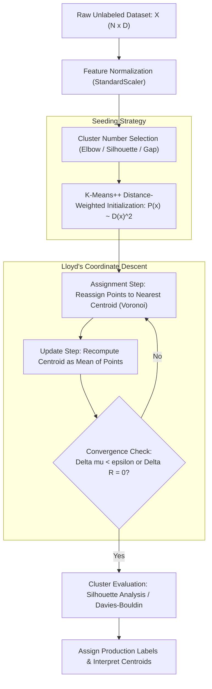

# Lesson 2: Summary and Assessment

## K-Means Clustering: Module Summary and Assessment

Unsupervised clustering algorithms discover latent groupings within datasets without relying on target labels. K-Means clustering serves as the benchmark partitional method, minimizing the Within-Cluster Sum of Squares (WCSS) through iterative coordinate descent. Analyzing the mathematical mechanics of Lloyd's algorithm, the probabilistic guarantees of K-Means++ seeding, unsupervised metric validation, and geometric boundary constraints equips machine learning practitioners to partition unlabeled data, handle large streaming datasets, and diagnose clustering failures.

## Synthesis of Core Week 10 Foundations

### The Distortion Objective and Partitional Geometry

- **Unsupervised objective:** K-Means partitions $N$ observations into $K$ disjoint subsets $\mathcal{C} = \{C_1, \dots, C_K\}$, minimizing the cumulative squared Euclidean distance between points and cluster prototypes:
  $$J(R, \mu) = \sum_{n=1}^N \sum_{k=1}^K r_{nk} \|x_n - \mu_k\|_2^2$$
  where $r_{nk} \in \{0, 1\}$ enforces an exclusive partitional constraint ($\sum_k r_{nk} = 1$).
- **Combinatorial intractability:** Global minimization of $J(R, \mu)$ across all $S(N, K)$ possible partitions is **NP-hard**, necessitating heuristic optimization procedures that discover local minima.
- **Euclidean geometry:** The squared $L_2$ norm metric restricts K-Means to discovering convex, spherical clusters, drawing orthogonal bisecting hyperplanes between adjacent centroid prototypes.

### Alternating Coordinate Descent and Local Convergence

- **The Expectation-Maximization loop (Lloyd's Algorithm):**
  - **Assignment Step (E-step):** Fixes centroids $\mu$ and optimizes assignments $R$. Each point assigns to its nearest centroid ($r_{nk} = \mathbf{1}[k = \arg\min_j \|x_n - \mu_j\|^2]$), carving the feature space into a **Voronoi tessellation**.
  - **Update Step (M-step):** Fixes assignments $R$ and optimizes centroids $\mu$. Setting the gradient $\nabla_{\mu_k} J = 0$ reveals that the optimal prototype equals the exact **arithmetic mean** of all assigned points ($\mu_k = \frac{1}{|C_k|} \sum x_n$).
- **Monotonic finite convergence:** The assignment step cannot increase distortion, and the update step strictly minimizes quadratic error. Because distortion decreases monotonically on a finite partition space ($K^N$), Lloyd's algorithm must terminate in a finite number of iterations without cycling.
- **Local minima vulnerability:** Monotonic convergence guarantees arrival at a local stationary minimum; uncalibrated starting points cause centroids to become trapped in suboptimal configurations, requiring multiple restarts.

### Probabilistic Seeding and Metric Validation

- **K-Means++ initialization:** Replaces uniform random centroid selection with a distance-weighted probability distribution proportional to squared shortest distances:
  $$P(x) = \frac{D(x)^2}{\sum D(x')^2}$$
  This spreads initial centroids across the feature space, establishing a theoretical $O(\log K)$ approximation bound relative to optimal clustering.
- **Determining optimal $K$:**
  - **The Elbow Method:** Tracks the marginal drop in WCSS ($J$), selecting the inflection elbow where adding centroids yields diminishing returns.
  - **Silhouette Analysis:** Compares intra-cluster compactness ($a(i)$) against nearest-cluster separation ($b(i)$) on a normalized scale from $-1.0$ to $+1.0$.
  - **The Gap Statistic:** Compares empirical log-distortion against a uniform null reference distribution, identifying genuine clustering structure and confirming unclustered distributions ($K=1$).

> [!Tip]
> **Lloyd's algorithm executes coordinate descent**: alternating between discrete Voronoi assignment and sample mean calculation minimizes distortion monotonically, terminating in finite steps at a local stationary point.

## The End-to-End Unsupervised Clustering Pipeline

> [!Important]
> **Feature standardization is mandatory**: because K-Means computes squared Euclidean distances, unscaled features with large numerical ranges dominate distance calculations, distorting cluster shapes along unnormalized dimensions.

## Comprehensive Clustering Algorithms and Validation Matrix

| Clustering Algorithm | Prototype Representation | Distance Metric Supported | Computational Complexity per Step | Outlier Sensitivity | Handling Non-Convex Geometry |
|---|---|---|---|---|---|
| **Standard K-Means (Lloyd)** | Arithmetic mean vector ($\mu \in \mathbb{R}^D$) | Squared Euclidean ($L_2$ only) | $O(N \cdot K \cdot D)$ | High (quadratic pull toward outliers) | Fails; bisects non-convex shapes linearly |
| **K-Means++** | Distance-weighted mean seeding | Squared Euclidean ($L_2$ only) | Initialization: $O(NKD)$ + Lloyd's cost | High during Lloyd iterations | Fails; restricted to spherical clusters |
| **K-Medoids (PAM)** | Actual data instance (medoid $m \in \mathcal{D}$) | Arbitrary (Manhattan $L_1$, Cosine, Gower) | $O(K(N - K)^2)$ | Low (median equivalent; highly robust) | Fails; restricted by distance metric |
| **Mini-Batch K-Means** | Moving average across mini-batches | Squared Euclidean ($L_2$ only) | $O(m \cdot K \cdot D)$ | Moderate to High | Fails; produces spherical partitions |
| **DBSCAN** | Core points and density connectivity | Arbitrary continuous distance | $O(N \log N)$ to $O(N^2)$ | Completely robust (labels outliers as noise) | Excels; separates concentric rings and moons |

### Unsupervised Cluster Evaluation Metrics Comparison

| Validation Metric | Governing Mathematical Formulation | Numerical Range | Optimal Direction | Primary Evaluation Strength |
|---|---|---|---|---|
| **Inertia / WCSS ($J$)** | $\sum_n \sum_k r_{nk} \|x_n - \mu_k\|_2^2$ | $[0, \; \infty)$ | Lower (inflection point) | Simple to compute; identifies natural compression boundaries |
| **Silhouette Score ($s$)** | $\frac{1}{N} \sum_i \frac{b(i) - a(i)}{\max(a(i), b(i))}$ | $[-1.0, \; +1.0]$ | **Maximize** (highest score) | Balances compactness against separation; bounded interpretation |
| **Davies-Bouldin Index** | $\frac{1}{K} \sum_i \max_{j \neq i} \left( \frac{\sigma_i + \sigma_j}{d(\mu_i, \mu_j)} \right)$ | $[0, \; \infty)$ | **Minimize** (lowest score) | Evaluates worst-case cluster similarity; computationally fast |
| **Calinski-Harabasz** | $\frac{\text{Tr}(B_K) / (K - 1)}{\text{Tr}(W_K) / (N - K)}$ | $[0, \; \infty)$ | **Maximize** (highest score) | Fast variance ratio; favors dense, well-separated clusters |
| **Gap Statistic** | $\mathbb{E}^*[\ln(J_K)] - \ln(J_K)$ | $(-\infty, \; \infty)$ | Exceeds null threshold | Compares against uniform noise; reliably identifies $K=1$ |

> [!Tip]
> **Combine complementary metrics**: plot the Elbow curve to observe distortion drops, then evaluate the Silhouette Score and Davies-Bouldin Index to confirm cluster cohesion and separation.

## Assessment Preparation

### Conceptual Review Questions

- **Question 1 (Mathematical Proof of Monotonic Decrease):** Prove that the Within-Cluster Sum of Squares objective function $J(R, \mu)$ cannot increase between consecutive iterations of Lloyd's algorithm.
  - *Answer:* Let $J^{(t)} = J(R^{(t)}, \mu^{(t)})$ represent distortion at step $t$. During the assignment phase, centroids $\mu^{(t)}$ remain fixed while each point $x_n$ reassigns to the centroid minimizing squared Euclidean distance: $r_{nk}^{(t+1)} = \mathbf{1}[k = \arg\min_j \|x_n - \mu_j^{(t)}\|^2]$. Because reassigning a point to a closer or identical centroid cannot increase distance, $J(R^{(t+1)}, \mu^{(t)}) \le J(R^{(t)}, \mu^{(t)})$. During the update phase, assignments $R^{(t+1)}$ remain fixed while centroids update. Differentiating $J$ with respect to $\mu_k$ yields $\nabla_{\mu_k} J = 0$ when $\mu_k$ equals the arithmetic mean of assigned points. Because the squared Euclidean function is convex, the arithmetic mean provides the unique global minimum for that assignment, ensuring $J(R^{(t+1)}, \mu^{(t+1)}) \le J(R^{(t+1)}, \mu^{(t)})$. Chaining both inequalities yields $J(R^{(t+1)}, \mu^{(t+1)}) \le J(R^{(t)}, \mu^{(t)})$, proving monotonic decrease.
- **Question 2 (Mechanics of K-Means++ Seeding):** How does K-Means++ probabilistic distance weighting prevent the sub-optimal cluster splitting caused by standard uniform random initialization?
  - *Answer:* Standard uniform initialization samples centroids with equal probability ($\frac{1}{N}$), often selecting multiple points from the same dense cluster, which splits natural clusters and merges distant groups. K-Means++ selects the first centroid randomly, then calculates $D(x)$, the Euclidean distance from each point to the closest already-selected centroid. The next centroid is sampled with probability proportional to squared distance: $P(x) = \frac{D(x)^2}{\sum D(x')^2}$. Points near existing centroids have $D(x) \approx 0$, making their selection probability near zero, while distant points have high selection probabilities. This forces centroids to initialize far apart across distinct data modes, establishing an expected bound of $8(\ln K + 2) J_{\text{opt}}$.
- **Question 3 (Silhouette Coefficient Boundary Conditions):** Interpret the geometric meaning of an observation exhibiting a Silhouette coefficient of $s(i) = -0.4$, and contrast it with $s(i) = +0.8$.
  - *Answer:* The Silhouette coefficient is defined as $s(i) = \frac{b(i) - a(i)}{\max(a(i), b(i))}$, where $a(i)$ is mean intra-cluster distance and $b(i)$ is mean distance to the nearest neighboring cluster. If $s(i) = +0.8$, $b(i) \gg a(i)$, meaning the point is tightly clustered near its assigned centroid and located far from neighboring clusters (high confidence assignment). If $s(i) = -0.4$, $a(i) > b(i)$, which produces a negative value. This indicates that the point is physically closer to observations in a neighboring cluster than to points in its assigned cluster, signaling a geometric misclassification or cluster overlap.
- **Question 4 (Failure of K-Means on Concentric Structures):** Why is K-Means mathematically incapable of separating two concentric, non-intersecting circular rings?
  - *Answer:* K-Means assigns observations based on Euclidean distance to centroid prototypes ($\arg\min_k \|x - \mu_k\|_2^2$). The decision boundary separating any two clusters $\mu_j$ and $\mu_k$ is the set of points where distances are equal: $\|x - \mu_j\|_2^2 = \|x - \mu_k\|_2^2$. Expanding and simplifying this equation yields a linear algebraic equation ($2(\mu_k - \mu_j)^T x + \|\mu_j\|^2 - \|\mu_k\|^2 = 0$), forming a flat linear hyperplane. Because K-Means partitions space into convex polyhedral Voronoi cells, it cannot generate non-linear or closed circular boundaries. When presented with concentric circles, K-Means places both centroids near the central origin and slices both rings with a linear boundary, bisecting the classes incorrectly.

### Applied Analytical Scenarios

- **Scenario A (Clustering Failure on Anisotropic Customer Segments):** A marketing analytics team clusters customer purchasing data using standard K-Means ($K=3$). Plotting the results shows that an elongated, high-variance customer segment is artificially split into two separate clusters, while a compact, dense group is merged with adjacent points.
  - *Diagnosis:* K-Means assumes isotropic (spherical) clusters with equal variance across all directions because its objective relies on standard Euclidean distance. The elongated cluster exhibits high covariance across dimensions, which violates this assumption and causes K-Means to partition it into spherical pieces.
  - *Remedy:* Transition from K-Means to a **Gaussian Mixture Model (GMM)** with an unconstrained covariance matrix, allowing the model to fit elongated ellipsoidal clusters. Alternatively, apply Principal Component Analysis (PCA) or Mahalanobis metric transformations to decorrelate features before clustering.
- **Scenario B (Outlier Distortion in Sensor Network Monitoring):** An industrial IoT platform runs K-Means on temperature telemetry. Due to occasional sensor transmission errors, a small number of readings record erroneous values of $+9999^\circ\text{C}$. The resulting clusters show one centroid assigned exclusively to three corrupted points, while real temperature variations collapse into a single merged cluster.
  - *Diagnosis:* The K-Means update step computes the arithmetic mean, which minimizes squared Euclidean distance ($L_2$ norm). Squaring distances penalizes outliers quadratically, pulling centroid coordinates toward extreme values and producing degenerate, singleton clusters.
  - *Remedy:* Replace K-Means with **K-Medoids (PAM)**, which uses actual median instances as prototypes and minimizes absolute distances ($L_1$ norm), making it robust to extreme outliers. Alternatively, deploy **DBSCAN**, which identifies isolated anomalies and labels them as noise without pulling cluster centers away from true data modes.
- **Scenario C (Scaling Clustering to a 50-Million Record Dataset):** A financial fraud team needs to cluster 50 million transaction vectors across 64 features. Running standard K-Means in Python causes an out-of-memory crash during the assignment step.
  - *Diagnosis:* Standard Lloyd's algorithm requires evaluating distances between all $N = 50 \times 10^6$ points and all $K$ centroids on every iteration, which exhausts RAM when calculating large pairwise distance matrices.
  - *Remedy:* Deploy **Mini-Batch K-Means**. Mini-Batch K-Means samples small random batches ($m \in [1000, 5000]$) to update centroids using online moving averages, processing streaming data with low memory usage while achieving clustering quality comparable to full-batch K-Means.

> [!Important]
> **Diagnose data geometry before clustering**: deploy K-Means for spherical, well-separated clusters; use K-Medoids when outliers are present; apply GMMs for elongated ellipsoids; and deploy DBSCAN for non-convex, density-based shapes.

### Self-Assessment Technical Calculations

#### Problem 1: Stepwise Manual Iteration of Lloyd's Algorithm in 2D

A two-dimensional dataset contains six observation vectors:
- $x_1 = [1.0, \; 1.0]^T$
- $x_2 = [1.5, \; 2.0]^T$
- $x_3 = [3.0, \; 4.0]^T$
- $x_4 = [5.0, \; 7.0]^T$
- $x_5 = [3.5, \; 5.0]^T$
- $x_6 = [4.5, \; 5.0]^T$

The algorithm is initialized with $K = 2$ centroids positioned at:
- $\mu_1 = [1.0, \; 1.0]^T$
- $\mu_2 = [5.0, \; 7.0]^T$

1. Execute the Assignment Phase: calculate squared Euclidean distances from each point to both centroids, and assign points to clusters (resolve ties by choosing Cluster 1).
2. Execute the Update Phase: compute updated centroid coordinates $\mu_1^{\text{new}}$ and $\mu_2^{\text{new}}$ as the arithmetic means of their assigned points.

*Stepwise Solution:*
1. Assignment Phase Calculations:
   - Observation $x_1 = [1.0, \; 1.0]^T$:
     $$\|x_1 - \mu_1\|_2^2 = (1.0 - 1.0)^2 + (1.0 - 1.0)^2 = 0.0$$
     $$\|x_1 - \mu_2\|_2^2 = (1.0 - 5.0)^2 + (1.0 - 7.0)^2 = (-4.0)^2 + (-6.0)^2 = 16.0 + 36.0 = 52.0$$
     $\arg\min(0.0, 52.0) \implies \mathbf{x_1 \in C_1}$.
   - Observation $x_2 = [1.5, \; 2.0]^T$:
     $$\|x_2 - \mu_1\|_2^2 = (1.5 - 1.0)^2 + (2.0 - 1.0)^2 = (0.5)^2 + (1.0)^2 = 0.25 + 1.0 = 1.25$$
     $$\|x_2 - \mu_2\|_2^2 = (1.5 - 5.0)^2 + (2.0 - 7.0)^2 = (-3.5)^2 + (-5.0)^2 = 12.25 + 25.0 = 37.25$$
     $\arg\min(1.25, 37.25) \implies \mathbf{x_2 \in C_1}$.
   - Observation $x_3 = [3.0, \; 4.0]^T$:
     $$\|x_3 - \mu_1\|_2^2 = (3.0 - 1.0)^2 + (4.0 - 1.0)^2 = (2.0)^2 + (3.0)^2 = 4.0 + 9.0 = 13.0$$
     $$\|x_3 - \mu_2\|_2^2 = (3.0 - 5.0)^2 + (4.0 - 7.0)^2 = (-2.0)^2 + (-3.0)^2 = 4.0 + 9.0 = 13.0$$
     Distances tie ($13.0 = 13.0$); applying the tie-break rule: $\mathbf{x_3 \in C_1}$.
   - Observation $x_4 = [5.0, \; 7.0]^T$:
     $$\|x_4 - \mu_1\|_2^2 = (5.0 - 1.0)^2 + (7.0 - 1.0)^2 = 16.0 + 36.0 = 52.0$$
     $$\|x_4 - \mu_2\|_2^2 = (5.0 - 5.0)^2 + (7.0 - 7.0)^2 = 0.0$$
     $\arg\min(52.0, 0.0) \implies \mathbf{x_4 \in C_2}$.
   - Observation $x_5 = [3.5, \; 5.0]^T$:
     $$\|x_5 - \mu_1\|_2^2 = (3.5 - 1.0)^2 + (5.0 - 1.0)^2 = (2.5)^2 + (4.0)^2 = 6.25 + 16.0 = 22.25$$
     $$\|x_5 - \mu_2\|_2^2 = (3.5 - 5.0)^2 + (5.0 - 7.0)^2 = (-1.5)^2 + (-2.0)^2 = 2.25 + 4.0 = 6.25$$
     $\arg\min(22.25, 6.25) \implies \mathbf{x_5 \in C_2}$.
   - Observation $x_6 = [4.5, \; 5.0]^T$:
     $$\|x_6 - \mu_1\|_2^2 = (4.5 - 1.0)^2 + (5.0 - 1.0)^2 = (3.5)^2 + (4.0)^2 = 12.25 + 16.0 = 28.25$$
     $$\|x_6 - \mu_2\|_2^2 = (4.5 - 5.0)^2 + (5.0 - 7.0)^2 = (-0.5)^2 + (-2.0)^2 = 0.25 + 4.0 = 4.25$$
     $\arg\min(28.25, 4.25) \implies \mathbf{x_6 \in C_2}$.
   - Resulting Cluster Partitions:
     $$C_1 = \{x_1, x_2, x_3\}, \quad C_2 = \{x_4, x_5, x_6\}$$
2. Update Phase (Recalculating Centroids):
   - Compute updated centroid $\mu_1^{\text{new}}$:
     $$\mu_1^{\text{new}} = \frac{1}{3} (x_1 + x_2 + x_3) = \frac{1}{3} \begin{bmatrix} 1.0 + 1.5 + 3.0 \\ 1.0 + 2.0 + 4.0 \end{bmatrix} = \frac{1}{3} \begin{bmatrix} 5.5 \\ 7.0 \end{bmatrix} \approx \mathbf{\begin{bmatrix} 1.833 \\ 2.333 \end{bmatrix}}$$
   - Compute updated centroid $\mu_2^{\text{new}}$:
     $$\mu_2^{\text{new}} = \frac{1}{3} (x_4 + x_5 + x_6) = \frac{1}{3} \begin{bmatrix} 5.0 + 3.5 + 4.5 \\ 7.0 + 5.0 + 5.0 \end{bmatrix} = \frac{1}{3} \begin{bmatrix} 13.0 \\ 17.0 \end{bmatrix} \approx \mathbf{\begin{bmatrix} 4.333 \\ 5.667 \end{bmatrix}}$$

#### Problem 2: K-Means++ Seeding Probability Distribution Calculation

A dataset contains four points in 2D space:
- $x_1 = [0.0, \; 0.0]^T$
- $x_2 = [2.0, \; 0.0]^T$
- $x_3 = [0.0, \; 3.0]^T$
- $x_4 = [4.0, \; 3.0]^T$

The first centroid is randomly chosen as $\mu_1 = x_1 = [0.0, \; 0.0]^T$. Calculate the shortest squared distance $D(x_i)^2$ from each remaining point to $\mu_1$, and compute the exact selection probability distribution $P(x_i)$ for choosing the second centroid $\mu_2$.

*Stepwise Solution:*
1. Calculate Squared Distances to $\mu_1$:
   - For candidate $x_2 = [2.0, \; 0.0]^T$:
     $$D(x_2)^2 = \|x_2 - \mu_1\|_2^2 = (2.0 - 0.0)^2 + (0.0 - 0.0)^2 = 4.0 + 0.0 = \mathbf{4.0}$$
   - For candidate $x_3 = [0.0, \; 3.0]^T$:
     $$D(x_3)^2 = \|x_3 - \mu_1\|_2^2 = (0.0 - 0.0)^2 + (3.0 - 0.0)^2 = 0.0 + 9.0 = \mathbf{9.0}$$
   - For candidate $x_4 = [4.0, \; 3.0]^T$:
     $$D(x_4)^2 = \|x_4 - \mu_1\|_2^2 = (4.0 - 0.0)^2 + (3.0 - 0.0)^2 = 16.0 + 9.0 = \mathbf{25.0}$$
2. Compute the Normalization Sum:
   $$\sum_{j=2}^4 D(x_j)^2 = D(x_2)^2 + D(x_3)^2 + D(x_4)^2 = 4.0 + 9.0 + 25.0 = \mathbf{38.0}$$
3. Compute the Probability Distribution:
   - Probability of selecting $x_2$:
     $$P(x_2) = \frac{D(x_2)^2}{38.0} = \frac{4.0}{38.0} = \frac{2}{19} \approx \mathbf{0.1053} \quad (10.53\%)$$
   - Probability of selecting $x_3$:
     $$P(x_3) = \frac{D(x_3)^2}{38.0} = \frac{9.0}{38.0} \approx \mathbf{0.2368} \quad (23.68\%)$$
   - Probability of selecting $x_4$:
     $$P(x_4) = \frac{D(x_4)^2}{38.0} = \frac{25.0}{38.0} \approx \mathbf{0.6579} \quad (65.79\%)$$
*Conclusion:* Point $x_4$ is farthest from $\mu_1$, giving it a $65.79\%$ probability of selection as the next centroid, which prevents centroids from clumping together.

#### Problem 3: Analytical Silhouette Coefficient Evaluation

An observation $p = [1.0, \; 2.0]^T$ belongs to cluster $C_A$. Cluster $C_A$ contains two other observations:
- $q_1 = [1.0, \; 3.0]^T$
- $q_2 = [2.0, \; 2.0]^T$

The nearest neighboring cluster $C_B$ contains two observations:
- $r_1 = [4.0, \; 2.0]^T$
- $r_2 = [4.0, \; 3.0]^T$

1. Compute the mean intra-cluster distance $a(p)$.
2. Compute the mean nearest-cluster distance $b(p)$.
3. Calculate the Silhouette coefficient $s(p)$ for observation $p$ and interpret its clustering quality.

*Stepwise Solution:*
1. Intra-Cluster Distance Calculation ($a(p)$):
   - Distance from $p$ to $q_1$:
     $$\|p - q_1\|_2 = \sqrt{(1.0 - 1.0)^2 + (2.0 - 3.0)^2} = \sqrt{0.0 + (-1.0)^2} = \sqrt{1.0} = 1.0$$
   - Distance from $p$ to $q_2$:
     $$\|p - q_2\|_2 = \sqrt{(1.0 - 2.0)^2 + (2.0 - 2.0)^2} = \sqrt{(-1.0)^2 + 0.0} = \sqrt{1.0} = 1.0$$
   - Mean distance to points in its own cluster:
     $$a(p) = \frac{1}{|C_A| - 1} \sum_{q \in C_A, q \neq p} \|p - q\|_2 = \frac{1.0 + 1.0}{2} = \mathbf{1.000}$$
2. Nearest-Cluster Distance Calculation ($b(p)$):
   - Distance from $p$ to $r_1 \in C_B$:
     $$\|p - r_1\|_2 = \sqrt{(1.0 - 4.0)^2 + (2.0 - 2.0)^2} = \sqrt{(-3.0)^2 + 0.0} = \sqrt{9.0} = 3.0$$
   - Distance from $p$ to $r_2 \in C_B$:
     $$\|p - r_2\|_2 = \sqrt{(1.0 - 4.0)^2 + (2.0 - 3.0)^2} = \sqrt{(-3.0)^2 + (-1.0)^2} = \sqrt{9.0 + 1.0} = \sqrt{10.0} \approx 3.1623$$
   - Mean distance to points in cluster $C_B$:
     $$b(p) = \frac{1}{|C_B|} \sum_{r \in C_B} \|p - r\|_2 = \frac{3.0 + 3.1623}{2} = \frac{6.1623}{2} \approx \mathbf{3.0812}$$
3. Silhouette Coefficient Evaluation:
   - State the silhouette equation:
     $$s(p) = \frac{b(p) - a(p)}{\max(a(p), \; b(p))}$$
   - Substitute the computed distances:
     $$\max(a(p), b(p)) = \max(1.000, 3.0812) = 3.0812$$
     $$s(p) = \frac{3.0812 - 1.000}{3.0812} = \frac{2.0812}{3.0812} \approx \mathbf{+0.6754}$$
*Conclusion:* The positive score of $s(p) \approx +0.68$ confirms strong clustering; the point's average separation from its neighboring cluster is more than triple its internal cluster spread.

> [!Tip]
> **Manual trace verifies implementation correctness**: walking through distance assignments, probability distributions, and silhouette values on toy coordinates confirms the mechanics of clustering pipelines.

## Key Takeaways

- **K-Means optimizes Within-Cluster Sum of Squares (WCSS)**, minimizing squared Euclidean distances to centroid prototypes using alternating coordinate descent.
- **Lloyd's algorithm alternates between two steps**: assigning points to the nearest centroid (Voronoi partitioning) and updating centroids as the sample arithmetic mean of assigned points.
- **Monotonic finite convergence** guarantees that distortion cannot increase and that the algorithm terminates in finite steps, arriving at a local stationary minimum.
- **K-Means++ prevents centroid clumping** by sampling initial centers with probability proportional to squared distance ($D(x)^2$), providing an $O(\log K)$ approximation bound.
- **The Elbow Method identifies diminishing returns in distortion reduction**, while **Silhouette Analysis** evaluates cluster compactness against nearest-neighbor separation on a scale from $-1.0$ to $+1.0$.
- **K-Means assumes spherical, equal-variance clusters**, failing on non-convex manifolds and elongated ellipsoids where DBSCAN or GMMs are required.
- **The $L_2$ norm makes K-Means sensitive to outliers**; deploy K-Medoids (PAM) for outlier robustness, and Mini-Batch K-Means for streaming datasets.
- **Empty clusters trigger division-by-zero errors**, requiring algorithms to reassign orphaned centroids to observations with the highest current distortion.

> [!Tip]
> The foundational rule of K-Means clustering: **alternate assignments to minimize distance, and average points to center prototypes**; this coordinate descent loop ensures rapid, monotonic convergence to a local minimum while preserving linear computational efficiency across sample size.
