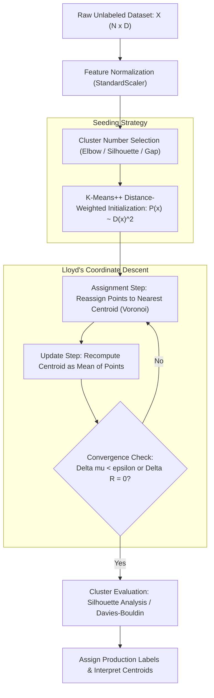

# Migration in progress
# Lesson 2: Summary and Assessment

## K-Means Clustering: Module Summary and Assessment

Unsupervised clustering algorithms discover latent groupings within datasets without relying on target labels. K-Means clustering serves as the benchmark partitional method, minimizing the Within-Cluster Sum of Squares (WCSS) through iterative coordinate descent. Analyzing the mathematical mechanics of Lloyd's algorithm, the probabilistic guarantees of K-Means++ seeding, unsupervised metric validation, and geometric boundary constraints equips machine learning practitioners to partition unlabeled data, handle large streaming datasets, and diagnose clustering failures.

## Synthesis of Core Week 10 Foundations

### The Distortion Objective and Partitional Geometry

- **Unsupervised objective:** K-Means partitions $N$ observations into $K$ disjoint subsets $\mathcal{C} = \{C_1, \dots, C_K\}$, minimizing the cumulative squared Euclidean distance between points and cluster prototypes:
  $$J(R, \mu) = \sum_{n=1}^N \sum_{k=1}^K r_{nk} \|x_n - \mu_k\|_2^2$$
  where $r_{nk} \in \{0, 1\}$ enforces an exclusive partitional constraint ($\sum_k r_{nk} = 1$).
- **Combinatorial intractability:** Global minimization of $J(R, \mu)$ across all $S(N, K)$ possible partitions is **NP-hard**, necessitating heuristic optimization procedures that discover local minima.
- **Euclidean geometry:** The squared $L_2$ norm metric restricts K-Means to discovering convex, spherical clusters, drawing orthogonal bisecting hyperplanes between adjacent centroid prototypes.

### Alternating Coordinate Descent and Local Convergence

- **The Expectation-Maximization loop (Lloyd's Algorithm):**
  - **Assignment Step (E-step):** Fixes centroids $\mu$ and optimizes assignments $R$. Each point assigns to its nearest centroid ($r_{nk} = \mathbf{1}[k = \arg\min_j \|x_n - \mu_j\|^2]$), carving the feature space into a **Voronoi tessellation**.
  - **Update Step (M-step):** Fixes assignments $R$ and optimizes centroids $\mu$. Setting the gradient $\nabla_{\mu_k} J = 0$ reveals that the optimal prototype equals the exact **arithmetic mean** of all assigned points ($\mu_k = \frac{1}{|C_k|} \sum x_n$).
- **Monotonic finite convergence:** The assignment step cannot increase distortion, and the update step strictly minimizes quadratic error. Because distortion decreases monotonically on a finite partition space ($K^N$), Lloyd's algorithm must terminate in a finite number of iterations without cycling.
- **Local minima vulnerability:** Monotonic convergence guarantees arrival at a local stationary minimum; uncalibrated starting points cause centroids to become trapped in suboptimal configurations, requiring multiple restarts.

### Probabilistic Seeding and Metric Validation

- **K-Means++ initialization:** Replaces uniform random centroid selection with a distance-weighted probability distribution proportional to squared shortest distances:
  $$P(x) = \frac{D(x)^2}{\sum D(x')^2}$$
  This spreads initial centroids across the feature space, establishing a theoretical $O(\log K)$ approximation bound relative to optimal clustering.
- **Determining optimal $K$:**
  - **The Elbow Method:** Tracks the marginal drop in WCSS ($J$), selecting the inflection elbow where adding centroids yields diminishing returns.
  - **Silhouette Analysis:** Compares intra-cluster compactness ($a(i)$) against nearest-cluster separation ($b(i)$) on a normalized scale from $-1.0$ to $+1.0$.
  - **The Gap Statistic:** Compares empirical log-distortion against a uniform null reference distribution, identifying genuine clustering structure and confirming unclustered distributions ($K=1$).

> [!Tip]
> **Lloyd's algorithm executes coordinate descent**: alternating between discrete Voronoi assignment and sample mean calculation minimizes distortion monotonically, terminating in finite steps at a local stationary point.

## The End-to-End Unsupervised Clustering Pipeline

> [!Important]
> **Feature standardization is mandatory**: because K-Means computes squared Euclidean distances, unscaled features with large numerical ranges dominate distance calculations, distorting cluster shapes along unnormalized dimensions.

## Comprehensive Clustering Algorithms and Validation Matrix

| Clustering Algorithm | Prototype Representation | Distance Metric Supported | Computational Complexity per Step | Outlier Sensitivity | Handling Non-Convex Geometry |
|---|---|---|---|---|---|
| **Standard K-Means (Lloyd)** | Arithmetic mean vector ($\mu \in \mathbb{R}^D$) | Squared Euclidean ($L_2$ only) | $O(N \cdot K \cdot D)$ | High (quadratic pull toward outliers) | Fails; bisects non-convex shapes linearly |
| **K-Means++** | Distance-weighted mean seeding | Squared Euclidean ($L_2$ only) | Initialization: $O(NKD)$ + Lloyd's cost | High during Lloyd iterations | Fails; restricted to spherical clusters |
| **K-Medoids (PAM)** | Actual data instance (medoid $m \in \mathcal{D}$) | Arbitrary (Manhattan $L_1$, Cosine, Gower) | $O(K(N - K)^2)$ | Low (median equivalent; highly robust) | Fails; restricted by distance metric |
| **Mini-Batch K-Means** | Moving average across mini-batches | Squared Euclidean ($L_2$ only) | $O(m \cdot K \cdot D)$ | Moderate to High | Fails; produces spherical partitions |
| **DBSCAN** | Core points and density connectivity | Arbitrary continuous distance | $O(N \log N)$ to $O(N^2)$ | Completely robust (labels outliers as noise) | Excels; separates concentric rings and moons |

### Unsupervised Cluster Evaluation Metrics Comparison

| Validation Metric | Governing Mathematical Formulation | Numerical Range | Optimal Direction | Primary Evaluation Strength |
|---|---|---|---|---|
| **Inertia / WCSS ($J$)** | $\sum_n \sum_k r_{nk} \|x_n - \mu_k\|_2^2$ | $[0, \; \infty)$ | Lower (inflection point) | Simple to compute; identifies natural compression boundaries |
| **Silhouette Score ($s$)** | $\frac{1}{N} \sum_i \frac{b(i) - a(i)}{\max(a(i), b(i))}$ | $[-1.0, \; +1.0]$ | **Maximize** (highest score) | Balances compactness against separation; bounded interpretation |
| **Davies-Bouldin Index** | $\frac{1}{K} \sum_i \max_{j \neq i} \left( \frac{\sigma_i + \sigma_j}{d(\mu_i, \mu_j)} \right)$ | $[0, \; \infty)$ | **Minimize** (lowest score) | Evaluates worst-case cluster similarity; computationally fast |
| **Calinski-Harabasz** | $\frac{\text{Tr}(B_K) / (K - 1)}{\text{Tr}(W_K) / (N - K)}$ | $[0, \; \infty)$ | **Maximize** (highest score) | Fast variance ratio; favors dense, well-separated clusters |
| **Gap Statistic** | $\mathbb{E}^*[\ln(J_K)] - \ln(J_K)$ | $(-\infty, \; \infty)$ | Exceeds null threshold | Compares against uniform noise; reliably identifies $K=1$ |

> [!Tip]
> **Combine complementary metrics**: plot the Elbow curve to observe distortion drops, then evaluate the Silhouette Score and Davies-Bouldin Index to confirm cluster cohesion and separation.

## Assessment Preparation

### Conceptual Review Questions

- **Question 1 (Mathematical Proof of Monotonic Decrease):** Prove that the Within-Cluster Sum of Squares objective function $J(R, \mu)$ cannot increase between consecutive iterations of Lloyd's algorithm.
  - *Answer:* Let $J^{(t)} = J(R^{(t)}, \mu^{(t)})$ represent distortion at step $t$. During the assignment phase, centroids $\mu^{(t)}$ remain fixed while each point $x_n$ reassigns to the centroid minimizing squared Euclidean distance: $r_{nk}^{(t+1)} = \mathbf{1}[k = \arg\min_j \|x_n - \mu_j^{(t)}\|^2]$. Because reassigning a point to a closer or identical centroid cannot increase distance, $J(R^{(t+1)}, \mu^{(t)}) \le J(R^{(t)}, \mu^{(t)})$. During the update phase, assignments $R^{(t+1)}$ remain fixed while centroids update. Differentiating $J$ with respect to $\mu_k$ yields $\nabla_{\mu_k} J = 0$ when $\mu_k$ equals the arithmetic mean of assigned points. Because the squared Euclidean function is convex, the arithmetic mean provides the unique global minimum for that assignment, ensuring $J(R^{(t+1)}, \mu^{(t+1)}) \le J(R^{(t+1)}, \mu^{(t)})$. Chaining both inequalities yields $J(R^{(t+1)}, \mu^{(t+1)}) \le J(R^{(t)}, \mu^{(t)})$, proving monotonic decrease.
- **Question 2 (Mechanics of K-Means++ Seeding):** How does K-Means++ probabilistic distance weighting prevent the sub-optimal cluster splitting caused by standard uniform random initialization?
  - *Answer:* Standard uniform initialization samples centroids with equal probability ($\frac{1}{N}$), often selecting multiple points from the same dense cluster, which splits natural clusters and merges distant groups. K-Means++ selects the first centroid randomly, then calculates $D(x)$, the Euclidean distance from each point to the closest already-selected centroid. The next centroid is sampled with probability proportional to squared distance: $P(x) = \frac{D(x)^2}{\sum D(x')^2}$. Points near existing centroids have $D(x) \approx 0$, making their selection probability near zero, while distant points have high selection probabilities. This forces centroids to initialize far apart across distinct data modes, establishing an expected bound of $8(\ln K + 2) J_{\text{opt}}$.
- **Question 3 (Silhouette Coefficient Boundary Conditions):** Interpret the geometric meaning of an observation exhibiting a Silhouette coefficient of $s(i) = -0.4$, and contrast it with $s(i) = +0.8$.
  - *Answer:* The Silhouette coefficient is defined as $s(i) = \frac{b(i) - a(i)}{\max(a(i), b(i))}$, where $a(i)$ is mean intra-cluster distance and $b(i)$ is mean distance to the nearest neighboring cluster. If $s(i) = +0.8$, $b(i) \gg a(i)$, meaning the point is tightly clustered near its assigned centroid and located far from neighboring clusters (high confidence assignment). If $s(i) = -0.4$, $a(i) > b(i)$, which produces a negative value. This indicates that the point is physically closer to observations in a neighboring cluster than to points in its assigned cluster, signaling a geometric misclassification or cluster overlap.
- **Question 4 (Failure of K-Means on Concentric Structures):** Why is K-Means mathematically incapable of separating two concentric, non-intersecting circular rings?
  - *Answer:* K-Means assigns observations based on Euclidean distance to centroid prototypes ($\arg\min_k \|x - \mu_k\|_2^2$). The decision boundary separating any two clusters $\mu_j$ and $\mu_k$ is the set of points where distances are equal: $\|x - \mu_j\|_2^2 = \|x - \mu_k\|_2^2$. Expanding and simplifying this equation yields a linear algebraic equation ($2(\mu_k - \mu_j)^T x + \|\mu_j\|^2 - \|\mu_k\|^2 = 0$), forming a flat linear hyperplane. Because K-Means partitions space into convex polyhedral Voronoi cells, it cannot generate non-linear or closed circular boundaries. When presented with concentric circles, K-Means places both centroids near the central origin and slices both rings with a linear boundary, bisecting the classes incorrectly.

### Applied Analytical Scenarios

- **Scenario A (Clustering Failure on Anisotropic Customer Segments):** A marketing analytics team clusters customer purchasing data using standard K-Means ($K=3$). Plotting the results shows that an elongated, hig