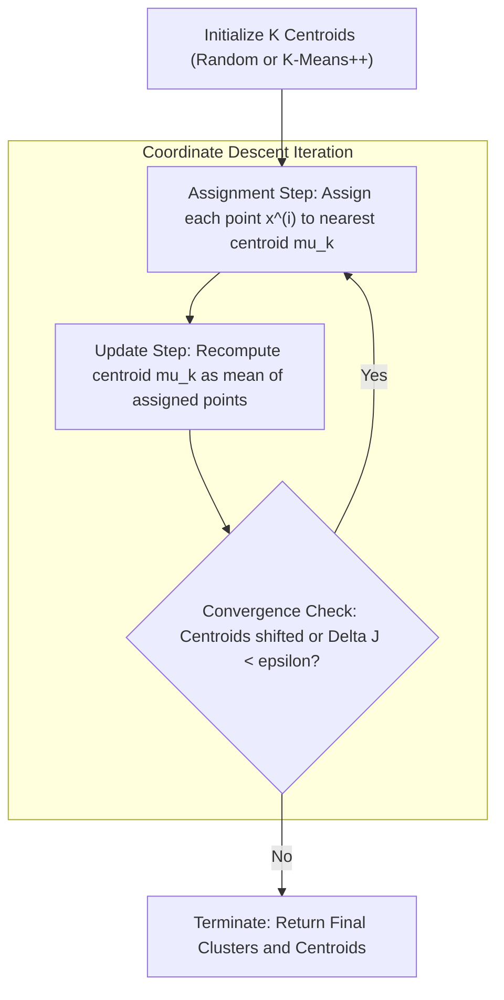
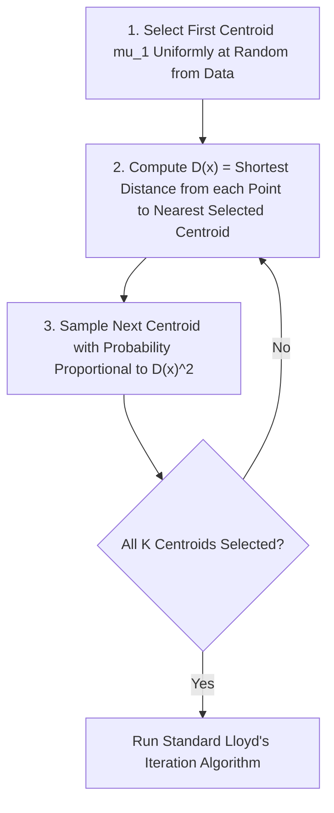

# Week 10: Unsupervised Learning: K-means Clustering

## Unsupervised Learning: K-Means Clustering Foundations and Algorithms

Unsupervised learning addresses the challenge of discovering latent structure, natural groupings, and geometric patterns within unlabeled datasets. Unlike supervised learning, which relies on ground-truth targets to guide optimization, clustering algorithms partition feature spaces based strictly on intrinsic geometric proximities. K-Means clustering serves as the foundational partitional clustering algorithm, formulating cluster identification as an optimization problem solved via coordinate descent. Examining its objective function, convergence proofs, probabilistic initialization safeguards, cluster validation metrics, and geometric limitations establishes the theoretical basis for partitional unsupervised learning.

## The Unsupervised Clustering Paradigm

### Partitional Clustering and Latent Structure Discovery

- Unsupervised learning operates on datasets containing feature vectors without corresponding ground-truth supervisory labels:
  $$\mathcal{D} = \{x^{(1)}, x^{(2)}, \dots, x^{(N)}\}, \quad x^{(i)} \in \mathbb{R}^D$$
- **Partitional clustering** decomposes a dataset of $N$ observations into a user-defined set of $K$ mutually exclusive subsets (clusters) $\mathcal{C} = \{C_1, C_2, \dots, C_K\}$ such that:
  $$\bigcup_{k=1}^K C_k = \mathcal{D} \quad \text{and} \quad C_j \cap C_k = \emptyset \quad \forall j \neq k$$
- The primary learning objective enforces two complementary geometric properties:
  - **High Intra-Cluster Similarity:** Points assigned to the same cluster reside in close spatial proximity within $\mathbb{R}^D$.
  - **Low Inter-Cluster Similarity:** Points belonging to distinct clusters remain widely separated by low-density boundary margins.

### The Mathematical Formulation of Within-Cluster Sum of Squares (WCSS)

- Let $\mu_k \in \mathbb{R}^D$ represent the geometric **centroid** (mean prototype vector) of cluster $C_k$.
- Define a set of binary indicator variables $r_{ik} \in \{0, 1\}$ representing cluster assignment:
  $$r_{ik} = \begin{cases} 1 & \text{if } x^{(i)} \in C_k \\ 0 & \text{otherwise} \end{cases} \quad \text{subject to } \sum_{k=1}^K r_{ik} = 1 \quad \forall i$$
- The objective function, termed the **Within-Cluster Sum of Squares (WCSS)**, **distortion measure**, or **inertia**, evaluates the cumulative squared Euclidean distance between every observation and its assigned cluster centroid:
  $$J(r, \mu) = \sum_{i=1}^N \sum_{k=1}^K r_{ik} \|x^{(i)} - \mu_k\|_2^2$$
- Minimizing $J(r, \mu)$ seeks the joint configuration of assignments $r$ and centroid coordinates $\mu$ that produces the most compact, spatially cohesive spherical partitions.

### The NP-Hard Nature of Global Cluster Optimization

- Finding the exact global minimum of the WCSS objective function requires an exhaustive combinatorial search across all possible assignments of $N$ points into $K$ non-empty clusters.
- The total number of valid partitions is given by the **Stirling numbers of the second kind**:
  $$S(N, K) = \frac{1}{K!} \sum_{j=0}^K (-1)^{K-j} \binom{K}{j} j^N \approx \frac{K^N}{K!}$$
- For a small dataset of $N = 100$ instances partitioned into $K = 4$ clusters, the solution space contains approximately $10^{58}$ distinct combinations, rendering brute-force evaluation impossible.
- Global WCSS minimization is **NP-hard** even for $K=2$ in arbitrary dimensions; practical applications rely on iterative greedy heuristics that guarantee convergence to local minima.

> [!Important]
> **K-Means approximates an NP-hard combinatorial problem**: because finding the globally optimal partition requires evaluating $S(N, K)$ combinations, algorithms use greedy coordinate descent to discover high-quality local minima.

## Lloyd's Algorithm and Coordinate Descent

### Step 1: Assignment Phase (E-Step) and Voronoi Tessellation

- Formulated by Stuart Lloyd (1957) and popularized by James MacQueen (1967), **Lloyd's Algorithm** minimizes the distortion objective $J(r, \mu)$ using two-step **alternating coordinate descent**.
- **Assignment Phase:** Holding centroid coordinates $\mu$ fixed, optimize the objective with respect to cluster assignment indicators $r$:
  $$\min_r J(r, \mu) = \sum_{i=1}^N \sum_{k=1}^K r_{ik} \|x^{(i)} - \mu_k\|_2^2$$
- Because the choices for each point $x^{(i)}$ are independent, the optimal assignment sets $r_{ik} = 1$ for the centroid that minimizes Euclidean distance:
  $$r_{ik} = \begin{cases} 1 & \text{if } k = \arg\min_j \|x^{(i)} - \mu_j\|_2^2 \\ 0 & \text{otherwise} \end{cases}$$
- Geometrically, this phase partitions the continuous feature space into a set of convex polyhedral regions known as a **Voronoi tessellation**, where the boundary between any two clusters is an orthogonal bisecting hyperplane:
  $$\|x - \mu_j\|_2^2 = \|x - \mu_k\|_2^2$$

### Step 2: Centroid Update Phase (M-Step) via Mean Aggregation

- **Update Phase:** Holding the discrete assignments $r$ fixed, optimize the objective with respect to the continuous centroid vectors $\mu$:
  $$\min_\mu J(r, \mu) = \sum_{i=1}^N \sum_{k=1}^K r_{ik} \|x^{(i)} - \mu_k\|_2^2$$
- Differentiating $J$ with respect to a specific centroid vector $\mu_k$ and setting the gradient to zero isolates the minimum:
  $$\nabla_{\mu_k} J = -2 \sum_{i=1}^N r_{ik} (x^{(i)} - \mu_k) = 0$$
  $$\sum_{i=1}^N r_{ik} x^{(i)} = \mu_k \sum_{i=1}^N r_{ik}$$
  $$\mu_k = \frac{\sum_{i=1}^N r_{ik} x^{(i)}}{\sum_{i=1}^N r_{ik}} = \frac{1}{|C_k|} \sum_{x^{(i)} \in C_k} x^{(i)}$$
- The optimal centroid coordinate equals the exact **arithmetic mean** (center of mass) of all observations assigned to that cluster during the preceding assignment step.

### Monotonic Convergence Proof and Local Optima Traps

- Lloyd's algorithm is guaranteed to converge in a finite number of iterations:
  - **Monotonic Distortion Reduction:** The assignment step strictly decreases or maintains $J$ because points reassign only to closer centroids. The update step strictly minimizes $J$ by setting centroids to the exact sample means.
  - **Finite State Space:** The total number of unique discrete assignments $r$ across $N$ instances into $K$ sets is finite ($K^N$).
- Because the objective function decreases monotonically on a finite set of configurations, the algorithm cannot oscillate and must terminate.
- Monotonic convergence guarantees arrival at a **local stationary minimum**, not the global optimum; poor initial centroid positions cause the algorithm to trap in suboptimal, split, or degenerate cluster configurations.

> [!Tip]
> **Lloyd's algorithm is an Expectation-Maximization procedure**: the assignment step computes expectations over latent cluster assignments (E-step), while the update step maximizes likelihood by recalculating centroids (M-step).

## Centroid Initialization and K-Means++

### Pathologies of Uniform Random Initialization

- Standard K-Means initializes centroids by selecting $K$ data points uniformly at random from dataset $\mathcal{D}$ (the Forgy method).
- Uniform random sampling often selects initial centroids that reside in close spatial proximity within the same high-density cluster.
- When multiple centroids initialize in one cluster, Lloyd's algorithm splits that natural cluster into artificial sub-partitions while grouping distant, distinct clusters together into a single merged cluster.
- This creates arbitrary, non-reproducible partitions with high WCSS distortion, requiring multiple random restarts to locate an acceptable local minimum.

### The K-Means++ Probabilistic Seeding Algorithm

- Formulated by David Arthur and Sergei Vassilvitskii (2007), **K-Means++** replaces uniform random sampling with a distance-weighted probabilistic initialization protocol.
- The algorithm spreads initial centroids across the feature space through four sequential steps:
  1. Select the first centroid $\mu_1$ uniformly at random from dataset $\mathcal{D}$.
  2. For every remaining data point $x^{(i)}$, compute $D(x^{(i)})$, defined as the shortest Euclidean distance from $x^{(i)}$ to the closest centroid already chosen:
     $$D(x^{(i)}) = \min_{j \in \{1, \dots, m\}} \|x^{(i)} - \mu_j\|_2$$
  3. Select the next centroid $\mu_{m+1}$ from $\mathcal{D}$ using a weighted probability distribution proportional to the squared distance:
     $$P(x^{(i)}) = \frac{D(x^{(i)})^2}{\sum_{j=1}^N D(x^{(j)})^2}$$
  4. Repeat steps 2 and 3 sequentially until all $K$ centroids have been established.

### The $O(\log K)$ Approximation Guarantee

- Points situated far from existing centroids possess large $D(x)$ values, giving them a high probability of selection, while points close to existing centroids have selection probabilities near zero.
- Arthur and Vassilvitskii proved that K-Means++ guarantees an expected objective value bounded by a logarithmic factor of the true optimal clustering:
  $$\mathbb{E}[J_{\text{K-Means++}}] \le 8(\ln K + 2) J_{\text{optimal}}$$
- By preventing initial centroid clumping, K-Means++ accelerates convergence speed (requiring fewer Lloyd iterations) and consistently identifies superior local minima compared to uniform random seeding.

> [!Important]
> **K-Means++ spreads initial centroids probabilistically**: sampling new centroids with probability proportional to $D(x)^2$ ensures centers initialize far from each other, providing an $O(\log K)$ theoretical bound relative to the optimal clustering.

## Hyperparameter Selection: Determining the Optimal $K$

### The Elbow Method and Marginal Distortion Drop

- The WCSS distortion objective $J$ decreases monotonically as $K$ increases:
  $$\lim_{K \to N} J(K) = 0$$
  When $K = N$, every point acts as its own centroid, reducing distortion to zero while providing zero clustering utility.
- The **Elbow Method** plots the distortion metric $J$ against a range of cluster values ($K \in [1, K_{\max}]$).
- As $K$ increases, distortion drops rapidly until the true number of latent clusters is reached; beyond this point, adding more centroids splits natural groups, yielding diminishing marginal returns.
- The optimal $K^*$ appears as an inflection point (an **elbow**) where the curve transitions from steep decline to a gentle plateau.
- The elbow can be ambiguous or flat on datasets containing smooth density gradients, requiring analytical validation metrics.

### Silhouette Analysis: Intra-Cluster Versus Inter-Cluster Separation

- Proposed by Peter Rousseeuw (1987), **Silhouette Analysis** evaluates the cohesion and separation of individual data assignments without requiring ground-truth labels.
- For an individual data point $x^{(i)} \in C_A$:
  - **Mean Intra-Cluster Distance ($a(i)$):** Evaluates the average distance from $x^{(i)}$ to all other points within its own cluster $C_A$, measuring **compactness**:
    $$a(i) = \frac{1}{|C_A| - 1} \sum_{x^{(j)} \in C_A, j \neq i} \|x^{(i)} - x^{(j)}\|_2$$
  - **Mean Nearest-Cluster Distance ($b(i)$):** Evaluates the average distance from $x^{(i)}$ to all points in the nearest neighboring cluster $C_B$, measuring **separation**:
    $$b(i) = \min_{C_k \neq C_A} \left( \frac{1}{|C_k|} \sum_{x^{(j)} \in C_k} \|x^{(i)} - x^{(j)}\|_2 \right)$$
- The **Silhouette Coefficient** $s(i)$ for observation $x^{(i)}$ evaluates as:
  $$s(i) = \frac{b(i) - a(i)}{\max(a(i), \; b(i))} \in [-1, \; +1]$$
- **Interpretation of Silhouette Values:**
  - $s(i) \approx +1$: Point is well-clustered; internal distance $a(i)$ is much smaller than separation distance $b(i)$.
  - $s(i) \approx 0$: Point resides directly on the decision boundary between two adjacent clusters.
  - $s(i) < 0$: Point is closer to a neighboring cluster than its assigned cluster, indicating a misclassification.
- The **Global Silhouette Score** averages $s(i)$ across all $N$ dataset points; the optimal cluster count $K^*$ corresponds to the global maximum of the average silhouette curve.

### The Gap Statistic and Uniform Reference Benchmarks

- Formulated by Robert Tibshirani, Guenther Walther, and Trevor Hastie (2001), the **Gap Statistic** formalizes the elbow method by comparing empirical distortion against a null reference distribution.
- The metric computes the difference between the logarithm of the empirical distortion $\ln(J_K)$ and the expected logarithm of distortion $\mathbb{E}^*[\ln(J_K)]$ generated from a uniform reference distribution without clusters:
  $$\text{Gap}(K) = \mathbb{E}_B^*[\ln(J_{K, b})] - \ln(J_K)$$
  where $\mathbb{E}_B^*$ is computed by generating $B$ Monte Carlo synthetic datasets drawn uniformly over the bounding box of the original data.
- The optimal cluster count $K^*$ is chosen as the smallest $K$ such that the gap score satisfies:
  $$\text{Gap}(K) \ge \text{Gap}(K+1) - s_{K+1}$$
  where $s_{K+1}$ denotes the simulation standard error.
- The Gap Statistic can identify unclustered distributions ($K=1$), an outcome the standard elbow method cannot confirm.

> [!Tip]
> **Use Silhouette Analysis when the elbow is ambiguous**: silhouette coefficients measure whether intra-cluster distance is smaller than nearest-neighbor separation, providing a scale from $-1$ to $+1$ where the peak indicates optimal cluster count.

## Structural Assumptions, Limitations, and Mitigations

### Isotropic and Equal-Variance Geometric Assumptions

- K-Means implicitly assumes that clusters are **spherical (isotropic)** and possess **comparable spatial variance**.
- Because the assignment step relies strictly on Euclidean distance $\|x - \mu_k\|_2^2$, the decision boundary between any two clusters is an affine flat hyperplane.
- K-Means fails on:
  - **Non-Convex Geometries:** Concentric circles, interlocking rings, and moon-shaped manifolds cannot be separated by linear hyperplanes, causing K-Means to bisect the geometric shapes incorrectly.
  - **Anisotropic (Elongated) Clusters:** Clusters with high directional covariance are split into artificial spherical pieces because Euclidean metrics ignore correlation.
  - **Varying Densities and Sizes:** High-density small clusters are often merged or absorbed by adjacent low-density expansive clusters.
- **Mitigation:** Deploy **Density-Based Spatial Clustering (DBSCAN)** for non-convex arbitrary shapes, or **Gaussian Mixture Models (GMM)** with unconstrained covariance matrices to model anisotropic ellipsoids.

### Outlier Sensitivity and Robust K-Medoids (PAM)

- The update step computes the arithmetic mean $\mu_k = \frac{1}{|C_k|} \sum x^{(i)}$, which minimizes squared Euclidean distance.
- Squaring Euclidean terms ($L_2$ norm) penalizes distant points quadratically; an extreme outlier pulls the centroid coordinate heavily away from the true cluster core, distorting cluster boundaries.
- **K-Medoids (Partitioning Around Medoids - PAM):** Replaces the synthetic mean vector $\mu_k$ with an actual observed data point from the dataset, termed a **medoid**.
- K-Medoids minimizes absolute Manhattan ($L_1$) or arbitrary non-Euclidean distance metrics, providing high robustness against anomalous outliers at the cost of higher computational complexity ($O(N^2)$ per step).

### Mini-Batch K-Means for Large-Scale Data Streams

- Standard Lloyd's algorithm requires evaluating distances between all $N$ data points and all $K$ centroids on every iteration ($O(N \cdot K \cdot D)$), causing latency spikes on massive datasets.
- Introduced by D. Sculley (2010), **Mini-Batch K-Means** processes small, randomly sampled subsets of data ($m \ll N$) at each step:
  1. Sample a random mini-batch $\mathcal{B} \subset \mathcal{D}$ of size $m$ (typically $m \in [100, 1000]$).
  2. Assign each point in $\mathcal{B}$ to its nearest centroid.
  3. Update centroid coordinates using an exponential per-centroid learning rate proportional to historical sample counts.
- Mini-Batch K-Means reduces computational time by orders of magnitude and supports out-of-core streaming pipelines while producing clustering partitions comparable to full-batch K-Means.

> [!Important]
> **K-Means assumes spherical, equal-variance clusters**: the algorithm fails on elongated ellipsoids and non-convex geometries (like concentric rings); use GMMs for ellipsoids, DBSCAN for complex shapes, and K-Medoids when outliers distort sample means.

## Comparative Matrix of Clustering Algorithms and Metrics

| Algorithm Variant | Centroid Prototype Definition | Computational Complexity per Step | Distance Metric Supported | Outlier Sensitivity | Memory Scalability |
|---|---|---|---|---|---|
| **Standard K-Means (Lloyd's)** | Arithmetic Mean ($\mu \in \mathbb{R}^D$) | $O(N \cdot K \cdot D \cdot I)$ | Squared Euclidean ($L_2$ only) | High (quadratic pull) | High (requires full dataset in RAM) |
| **K-Means++** | Arithmetic Mean with distance-weighted seeding | Initialization: $O(N \cdot K \cdot D)$ + Lloyd's cost | Squared Euclidean ($L_2$ only) | High during iteration | Identical to Lloyd's algorithm |
| **K-Medoids (PAM)** | Actual Data Point ($m \in \mathcal{D}$) | $O(K(N - K)^2)$ | Arbitrary (Manhattan, Cosine, Gower) | Low (robust median equivalent) | Poor (requires pairwise distance matrix) |
| **Mini-Batch K-Means** | Moving Average across mini-batches | $O(m \cdot K \cdot D \cdot I)$ | Squared Euclidean ($L_2$ only) | Moderate to High | Excellent (processes out-of-core streams) |

### Comparison of Unsupervised Cluster Evaluation Metrics

| Metric | Mathematical Objective | Value Range | Ground Truth Required? | Optimal Selection Rule |
|---|---|---|---|---|
| **Inertia / WCSS** | $\sum_{i} \sum_{k} r_{ik} \|x^{(i)} - \mu_k\|_2^2$ | $[0, \; \infty)$ | No | Identify the inflection elbow point |
| **Silhouette Score** | $\frac{1}{N} \sum_i \frac{b(i) - a(i)}{\max(a(i), b(i))}$ | $[-1.0, \; +1.0]$ | No | Maximize the global average score |
| **Davies-Bouldin Index** | $\frac{1}{K} \sum_i \max_{j \neq i} \left( \frac{\sigma_i + \sigma_j}{d(\mu_i, \mu_j)} \right)$ | $[0, \; \infty)$ | No | **Minimize** the index score |
| **Calinski-Harabasz Index** | $\frac{\text{Tr}(B_K) / (K - 1)}{\text{Tr}(W_K) / (N - K)}$ | $[0, \; \infty)$ | No | Maximize the variance ratio score |
| **Gap Statistic** | $\mathbb{E}^*[\ln(J_K)] - \ln(J_K)$ | $(-\infty, \; \infty)$ | No | Select smallest $K$ where $\text{Gap}(K) \ge \text{Gap}(K+1) - s_{K+1}$ |

> [!Tip]
> **Davies-Bouldin prefers lower values while Silhouette prefers higher**: evaluate both metrics concurrently to verify that candidate cluster partitions maximize cluster separation while minimizing internal dispersion.

## Key Takeaways

- **Unsupervised clustering discovers intrinsic data groupings** by optimizing for high intra-cluster cohesion and low inter-cluster overlap without target labels.
- **Within-Cluster Sum of Squares (WCSS)** measures the cumulative squared Euclidean distance from observations to their assigned centroids, acting as the objective function.
- **Global WCSS minimization is NP-hard**, requiring greedy coordinate descent algorithms that locate local stationary minima.
- **Lloyd's Algorithm alternates between two steps**: assigning points to the nearest centroid (Voronoi partitioning) and recalculating centroids as the arithmetic mean of assigned points.
- **Uniform random initialization traps in poor local minima**, which motivated **K-Means++** to spread initial centroids probabilistically using $D(x)^2$ weighting.
- **K-Means++ guarantees an expected bound** of $8(\ln K + 2)$ relative to the optimal clustering, speeding convergence and improving partition quality.
- **The Elbow Method tracks the marginal drop in WCSS**, while **Silhouette Analysis** evaluates internal cohesion versus nearest-neighbor separation on a scale from $-1$ to $+1$.
- **K-Means assumes spherical, equal-variance clusters**, failing on non-convex manifolds and anisotropic distributions where DBSCAN or GMMs are required.
- **Mini-Batch K-Means scales to massive datasets** by executing updates across small, randomly sampled batches, enabling streaming unsupervised clustering.

> [!Tip]
> The foundational principle of K-Means clustering: **iterative centroid repositioning balances spatial distortion**; alternating between Voronoi assignment and sample mean recalculation partitions Euclidean feature space into compact, spherical clusters with linear computational complexity per iteration.
