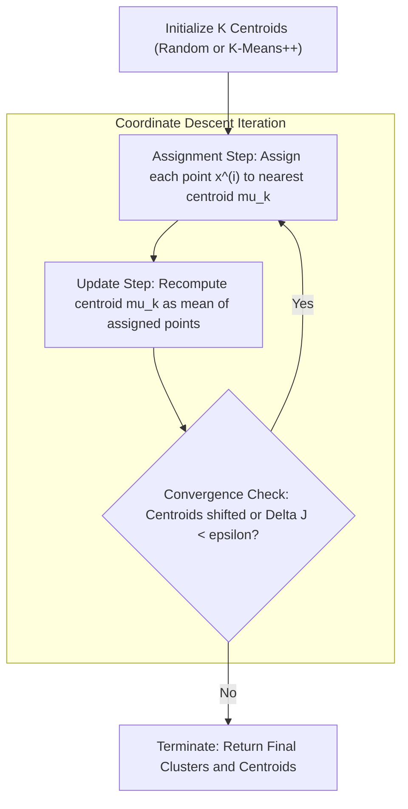
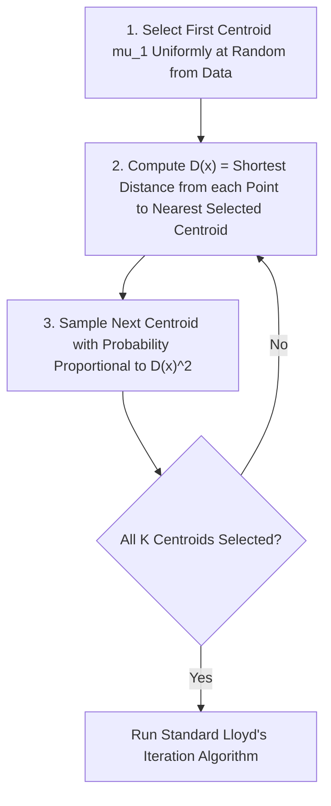

# Migration in progress
# Week 10: Unsupervised Learning: K-means Clustering

## Unsupervised Learning: K-Means Clustering Foundations and Algorithms

Unsupervised learning addresses the challenge of discovering latent structure, natural groupings, and geometric patterns within unlabeled datasets. Unlike supervised learning, which relies on ground-truth targets to guide optimization, clustering algorithms partition feature spaces based strictly on intrinsic geometric proximities. K-Means clustering serves as the foundational partitional clustering algorithm, formulating cluster identification as an optimization problem solved via coordinate descent. Examining its objective function, convergence proofs, probabilistic initialization safeguards, cluster validation metrics, and geometric limitations establishes the theoretical basis for partitional unsupervised learning.

## The Unsupervised Clustering Paradigm

### Partitional Clustering and Latent Structure Discovery

- Unsupervised learning operates on datasets containing feature vectors without corresponding ground-truth supervisory labels:
  $$\mathcal{D} = \{x^{(1)}, x^{(2)}, \dots, x^{(N)}\}, \quad x^{(i)} \in \mathbb{R}^D$$
- **Partitional clustering** decomposes a dataset of $N$ observations into a user-defined set of $K$ mutually exclusive subsets (clusters) $\mathcal{C} = \{C_1, C_2, \dots, C_K\}$ such that:
  $$\bigcup_{k=1}^K C_k = \mathcal{D} \quad \text{and} \quad C_j \cap C_k = \emptyset \quad \forall j \neq k$$
- The primary learning objective enforces two complementary geometric properties:
  - **High Intra-Cluster Similarity:** Points assigned to the same cluster reside in close spatial proximity within $\mathbb{R}^D$.
  - **Low Inter-Cluster Similarity:** Points belonging to distinct clusters remain widely separated by low-density boundary margins.

### The Mathematical Formulation of Within-Cluster Sum of Squares (WCSS)

- Let $\mu_k \in \mathbb{R}^D$ represent the geometric **centroid** (mean prototype vector) of cluster $C_k$.
- Define a set of binary indicator variables $r_{ik} \in \{0, 1\}$ representing cluster assignment:
  $$r_{ik} = \begin{cases} 1 & \text{if } x^{(i)} \in C_k \\ 0 & \text{otherwise} \end{cases} \quad \text{subject to } \sum_{k=1}^K r_{ik} = 1 \quad \forall i$$
- The objective function, termed the **Within-Cluster Sum of Squares (WCSS)**, **distortion measure**, or **inertia**, evaluates the cumulative squared Euclidean distance between every observation and its assigned cluster centroid:
  $$J(r, \mu) = \sum_{i=1}^N \sum_{k=1}^K r_{ik} \|x^{(i)} - \mu_k\|_2^2$$
- Minimizing $J(r, \mu)$ seeks the joint configuration of assignments $r$ and centroid coordinates $\mu$ that produces the most compact, spatially cohesive spherical partitions.

### The NP-Hard Nature of Global Cluster Optimization

- Finding the exact global minimum of the WCSS objective function requires an exhaustive combinatorial search across all possible assignments of $N$ points into $K$ non-empty clusters.
- The total number of valid partitions is given by the **Stirling numbers of the second kind**:
  $$S(N, K) = \frac{1}{K!} \sum_{j=0}^K (-1)^{K-j} \binom{K}{j} j^N \approx \frac{K^N}{K!}$$
- For a small dataset of $N = 100$ instances partitioned into $K = 4$ clusters, the solution space contains approximately $10^{58}$ distinct combinations, rendering brute-force evaluation impossible.
- Global WCSS minimization is **NP-hard** even for $K=2$ in arbitrary dimensions; practical applications rely on iterative greedy heuristics that guarantee convergence to local minima.

> [!Important]
> **K-Means approximates an NP-hard combinatorial problem**: because finding the globally optimal partition requires evaluating $S(N, K)$ combinations, algorithms use greedy coordinate descent to discover high-quality local minima.

## Lloyd's Algorithm and Coordinate Descent

### Step 1: Assignment Phase (E-Step) and Voronoi Tessellation

- Formulated by Stuart Lloyd (1957) and popularized by James MacQueen (1967), **Lloyd's Algorithm** minimizes the distortion objective $J(r, \mu)$ using two-step **alternating coordinate descent**.
- **Assignment Phase:** Holding centroid coordinates $\mu$ fixed, optimize the objective with respect to cluster assignment indicators $r$:
  $$\min_r J(r, \mu) = \sum_{i=1}^N \sum_{k=1}^K r_{ik} \|x^{(i)} - \mu_k\|_2^2$$
- Because the choices for each point $x^{(i)}$ are independent, the optimal assignment sets $r_{ik} = 1$ for the centroid that minimizes Euclidean distance:
  $$r_{ik} = \begin{cases} 1 & \text{if } k = \arg\min_j \|x^{(i)} - \mu_j\|_2^2 \\ 0 & \text{otherwise} \end{cases}$$
- Geometrically, this phase partitions the continuous feature space into a set of convex polyhedral regions known as a **Voronoi tessellation**, where the boundary between any two clusters is an orthogonal bisecting hyperplane:
  $$\|x - \mu_j\|_2^2 = \|x - \mu_k\|_2^2$$

### Step 2: Centroid Update Phase (M-Step) via Mean Aggregation

- **Update Phase:** Holding the discrete assignments $r$ fixed, optimize the objective with respect to the continuous centroid vectors $\mu$:
  $$\min_\mu J(r, \mu) = \sum_{i=1}^N \sum_{k=1}^K r_{ik} \|x^{(i)} - \mu_k\|_2^2$$
- Differentiating $J$ with respect to a specific centroid vector $\mu_k$ and setting the gradient to zero isolates the minimum:
  $$\nabla_{\mu_k} J = -2 \sum_{i=1}^N r_{ik} (x^{(i)} - \mu_k) = 0$$
  $$\sum_{i=1}^N r_{ik} x^{(i)} = \mu_k \sum_{i=1}^N r_{ik}$$
  $$\mu_k = \frac{\sum_{i=1}^N r_{ik} x^{(i)}}{\sum_{i=1}^N r_{ik}} = \frac{1}{|C_k|} \sum_{x^{(i)} \in C_k} x^{(i)}$$
- The optimal centroid coordinate equals the exact **arithmetic mean** (center of mass) of all observations assigned to that cluster during the preceding assignment step.

### Monotonic Convergence Proof and Local Optima Traps

- Lloyd's algorithm is guaranteed to converge in a finite number of iterations:
  - **Monotonic Distortion Reduction:** The assignment step strictly decreases or maintains $J$ because points reassign only to closer centroids. The update step strictly minimizes $J$ by setting centroids to the exact sample means.
  - **Finite State Space:** The total number of unique discrete assignments $r$ across $N$ instances into $K$ sets is finite ($K^N$).
- Because the objective function decreases monotonically on a finite set of configurations, the algorithm cannot oscillate and must terminate.
- Monotonic convergence guarantees arrival at a **local stationary minimum**, not the global optimum; poor initial centroid positions cause the algorithm to trap in suboptimal, split, or degenerate cluster configurations.

> [!Tip]
> **Lloyd's algorithm is an Expectation-Maximization procedure**: the assignment step computes expectations over latent cluster assignments (E-step), while the update step maximizes likelihood by recalculating centroids (M-step).

## Centroid Initialization and K-Means++

### Pathologies of Uniform Random Initialization

- Standard K-Means initializes centroids by selecting $K$ data points uniformly at random from dataset $\mathcal{D}$ (the Forgy method).
- Uniform random sampling often selects initial centroids that reside in close spatial proximity within the same high-density cluster.
- When multiple centroids initialize in one cluster, Lloyd's algorithm splits that natural cluster into artificial sub-partitions while grouping distant, distinct clusters together into a single merged cluster.
- This creates arbitrary, non-reproducible partitions with high WCSS distortion, requiring multiple random restarts to locate an acceptable local minimum.

### The K-Means++ Probabilistic Seeding Algorithm

- Formulated by David Arthur and Sergei Vassilvitskii (2007), **K-Means++** replaces uniform random sampling with a distance-weighted probabilistic initialization protocol.
- The algorithm spreads initial centroids across the feature space through four sequential steps:
  1. Select the first centroid $\mu_1$ uniformly at random from dataset $\mathcal{D}$.
  2. For every remaining data point $x^{(i)}$, compute $D(x^{(i)})$, defined as the shortest Euclidean distance from $x^{(i)}$ to the closest centroid already chosen:
     $$D(x^{(i)}) = \min_{j \in \{1, \dots, m\}} \|x^{(i)} - \mu_j\|_2$$
  3. Select the next centroid $\mu_{m+1}$ from $\mathcal{D}$ using a weighted probability distribution proportional to the squared distance:
     $$P(x^{(i)}) = \frac{D(x^{(i)})^2}{\sum_{j=1}^N D(x^{(j)})^2}$$
  4. Repeat steps 2 and 3 sequentially until all $K$ centroids have been established.

### The $O(\log K)$ Approximation Guarantee

- Points situated far from existing centroids possess large $D(x)$ values, giving them a high probability of selection, while points close to existing centroids have selection probabilities near zero.
- Arthur and Vassilvitskii proved that K-Means++ guarantees an expected objective value bounded by a logarithmic factor of the true optimal clustering:
  $$\mathbb{E}[J_{\text{K-Means++}}] \le 8(\ln K + 2) J_{\text{optimal}}$$
- By preventing initial centroid clumping, K-Means++ accelerates convergence speed (requiring fewer Lloyd iterations) and consistently identifies superior local minima compared to uniform random seeding.

> [!Important]
> **K-Means++ spreads initial centroids probabilistically**: sampling new centroids with probability proportional to $D(x)^2$ ensures centers initialize far from each other, providing an $O(\log K)$ theoretical bound relative to the optimal clustering.

## Hyperparameter Selection: Determining the Optimal $K$

### The Elbow Method and Marginal Distortion Drop

- The WCSS distortion objective $J$ decreases monotonically as $K$ increases:
  $$\lim_{K \to N} J(K) = 0$$
