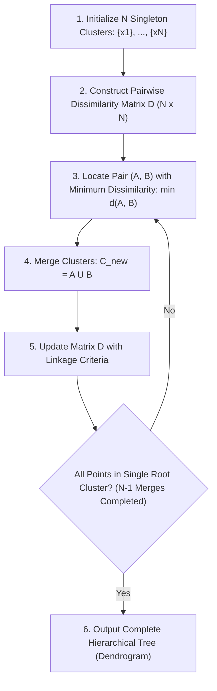
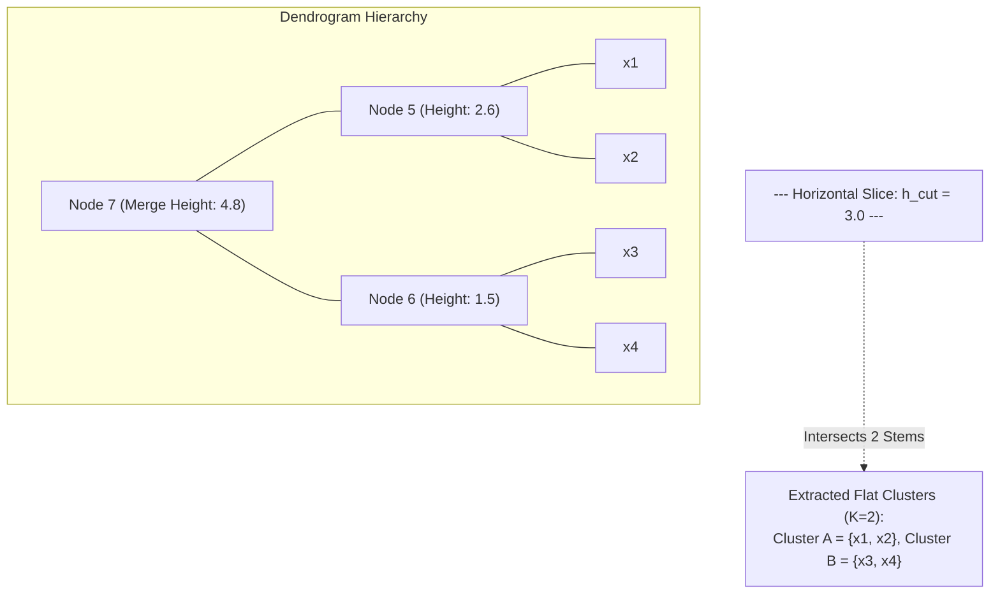

# Lesson 1: Hierarchical Clustering: Algorithms and...
## Hierarchical Clustering: Algorithms, Dendrograms, and Dissimilarity

Hierarchical clustering partitions unlabeled data by constructing multi-level nested tree structures rather than flat, unnested groupings. By operating directly on pairwise dissimilarity matrices, hierarchical methods expose relational taxonomy across varying scales without requiring a predetermined cluster count $K$. Analyzing the algorithmic steps of agglomerative and divisive paradigms, the geometry of dendrogram construction, cophenetic distance metrics, and multi-modal distance formulations establishes the core mechanics of hierarchical unsupervised learning.

## The Agglomerative Clustering Algorithm

### Stepwise Execution and Matrix Updating

- **Agglomerative Nesting (AGNES)** executes as a bottom-up, greedy aggregation algorithm across $N - 1$ sequential steps:
  1. **Initialization:** Assign each observation $x_i \in \mathcal{D}$ to an independent singleton cluster: $\mathcal{C}_0 = \{C_1, C_2, \dots, C_N\}$, where $C_i = \{x_i\}$.
  2. **Proximity Evaluation:** Compute a symmetric pairwise **dissimilarity matrix** $D_0 \in \mathbb{R}^{N \times N}$ using a chosen distance metric:
     $$D(i, j) = d(x_i, x_j), \quad D(i, i) = 0$$
  3. **Greedy Pair Identification:** Scan the active distance matrix to locate the two clusters $(A^*, B^*)$ separated by the minimum dissimilarity:
     $$(A^*, B^*) = \arg\min_{A, B \in \mathcal{C}, A \neq B} d(A, B)$$
  4. **Cluster Fusion:** Merge $A^*$ and $B^*$ into a single composite cluster: $C_{\text{new}} = A^* \cup B^*$. Remove $A^*$ and $B^*$ from active set $\mathcal{C}$ and insert $C_{\text{new}}$, decrementing total cluster count by one.
  5. **Matrix Recalculation:** Update the dissimilarity matrix by evaluating distances between $C_{\text{new}}$ and all remaining unmerged clusters using a designated **linkage criterion**.
  6. **Termination Check:** Repeat steps 3 through 5 until all observations merge into a single global root cluster containing all $N$ instances.

### The Greedy Merge Criterion

- At each iteration step $t$, the algorithm evaluates only local pairwise proximities, making an immediate, locally optimal merge decision.
- The decision function optimizes strictly over the active candidate pairs:
  $$\min_{A, B} d(A, B)$$
- The algorithm does not optimize a global objective function (unlike the Within-Cluster Sum of Squares in K-Means), meaning final groupings reflect the cumulative history of localized greedy choices.

### Irreversibility and Error Propagation

- Agglomerative clustering operates as an **irreversible greedy heuristic**.
- Once two observations or sub-clusters unite into a composite cluster at step $t$, they cannot be separated, swapped, or reassigned at any subsequent step $t+k$.
- An erroneous merge caused by localized noise, bridge points, or outliers persists throughout all subsequent levels of the tree hierarchy, permanently distorting downstream cluster boundaries.

> [!Tip]
> **Agglomerative clustering is greedy and irreversible**: once two clusters merge, they cannot be unmerged or reassigned at subsequent iterations, meaning early merge errors propagate throughout the entire remaining tree.

## The Divisive Clustering Framework

### Top-Down Recursive Bisection

- **Divisive Analysis (DIANA)** reverses agglomeration, executing a top-down hierarchical partitioning strategy:
  1. Initialize the entire dataset as a single global root cluster: $\mathcal{C}_0 = \{\mathcal{D}\}$.
  2. Identify the cluster exhibiting the largest diameter or internal dissimilarity.
  3. Bisect the selected cluster into two distinct sub-clusters.
  4. Repeat steps 2 and 3 recursively across child clusters until every observation isolates into an individual singleton leaf node.

### The Splinter Group Allocation Protocol

- Exact exhaustive bisection requires evaluating $2^{m-1} - 1$ possible binary splits for a cluster of size $m$, which is computationally intractable for large clusters.
- DIANA resolves this bottleneck using a heuristic **splinter group protocol**:
  1. **Identify the Seed:** Compute the average dissimilarity of each point to all other points within the cluster. The observation with the highest average dissimilarity initiates an independent **splinter group**.
  2. **Iterative Point Reallocation:** For every point remaining in the original cluster, evaluate two distances:
     - Average dissimilarity to remaining members of the original cluster: $d_{\text{orig}}(x)$.
     - Average dissimilarity to members of the splinter group: $d_{\text{splinter}}(x)$.
  3. **Transfer Criterion:** If $d_{\text{orig}}(x) - d_{\text{splinter}}(x) > 0$, the observation is physically closer to the splinter group; reassign the point with the largest positive difference into the splinter group.
  4. Repeat step 3 until no remaining point in the original cluster is closer to the splinter group.

### Computational Bottlenecks of Top-Down Partitioning

- While divisive methods capture global macro-structure early by focusing initial splits on major data modes, their computational cost remains prohibitive.
- Even with greedy splinter heuristics, evaluating pairwise distances across large undivided clusters in early iterations scales poorly compared to bottom-up pairwise tracking, making agglomerative methods the primary standard in practical machine learning workflows.

> [!Important]
> **Divisive clustering avoids combinatorial split explosion via splinter groups**: instead of evaluating $2^{m-1}-1$ possible binary partitions, DIANA seeds a splinter group with the most distant point and reallocates neighbors iteratively.

## Dendrogram Structure, Slicing, and Ultrametrics

### Anatomy and Rotational Symmetry of Nodes

- A **dendrogram** is an inverted binary tree visualizing the sequence of merges or splits executed during hierarchical clustering.
- **Leaf Nodes:** Represent individual observations plotted along the horizontal axis.
- **Internal Nodes (U-Links):** Represent merge events, where two vertical lines join horizontally.
- **Vertical Height ($h$):** Represents the exact scalar dissimilarity (distance) at which the two constituent sub-clusters merged.
- **Rotational Invariance:** The horizontal ordering of leaves is arbitrary. Internal nodes act as swivel joints; flipping the left and right branches of any node does not alter the underlying tree topology. For a binary tree containing $N$ leaves, there exist $2^{N-1}$ equivalent linear horizontal orderings that represent the identical hierarchical clustering solution.

### Cophenetic Distances and the Ultrametric Inequality

- The **cophenetic distance** $c_{ij}$ between two observations $x_i$ and $x_j$ is defined as the vertical merge height of the lowest common ancestor node connecting them in the dendrogram:
  $$c_{ij} = \text{Height}(\text{Lowest Common Ancestor}(x_i, x_j))$$
- Cophenetic distances satisfy the **ultrametric inequality**, which is strictly stronger than the standard metric triangle inequality:
  $$c_{ij} \le \max(c_{ik}, \; c_{jk}) \quad \forall i, j, k$$
- In an ultrametric space, every triangle is either equilateral or an isosceles triangle with two long equal sides and a shorter base, meaning the two most distant points among any triplet are equidistant from each other.

### Horizontal Slicing for Flat Cluster Extraction

- While a dendrogram preserves the complete hierarchical continuum, practical applications require extracting a discrete set of $K$ non-overlapping flat clusters.
- A flat partition is obtained by drawing a **horizontal cut line** across the dendrogram at a user-defined threshold height $h_{\text{cut}}$.
- Slicing removes all internal merge branches occurring above height $h_{\text{cut}}$, isolating disconnected vertical stems.
- The number of vertical lines intersected by the horizontal cut line corresponds exactly to the resulting number of discrete flat clusters $K$.
- Slicing across a long, uninterrupted vertical branch indicates stable cluster boundaries that remain invariant across a wide range of dissimilarity thresholds.

> [!Tip]
> **Dendrograms possess rotational symmetry**: leaf ordering along the horizontal axis is arbitrary and can swivel at every node ($2^{N-1}$ equivalent layouts); true similarity is measured strictly by the vertical height of the lowest common ancestor node.

## Cophenetic Correlation and Hierarchy Validation

### The Cophenetic Distance Matrix

- Summarizing clusters of multiple points with scalar linkage distances inevitably distorts the original pairwise Euclidean distances between raw samples.
- To quantify this distortion, construct the **cophenetic matrix** $C \in \mathbb{R}^{N \times N}$, where entry $C_{ij} = c_{ij}$ stores the vertical merge height between observations $x_i$ and $x_j$ extracted from the dendrogram.
- An ideal hierarchical model produces cophenetic distances that correlate linearly with original pairwise input distances $D_{ij} = \|x_i - x_j\|$.

### Mathematical Formulation of the Cophenetic Correlation Coefficient

- Introduced by Robert Sokal and F. James Rohlf (1962), the **Cophenetic Correlation Coefficient ($r_{\text{coph}}$)** calculates the Pearson correlation coefficient between original pairwise distances and cophenetic tree distances:
  $$r_{\text{coph}} = \frac{\sum_{i < j} (D_{ij} - \bar{D})(C_{ij} - \bar{C})}{\sqrt{\left( \sum_{i < j} (D_{ij} - \bar{D})^2 \right) \left( \sum_{i < j} (C_{ij} - \bar{C})^2 \right)}}$$
  where $\bar{D} = \frac{2}{N(N-1)} \sum_{i < j} D_{ij}$ and $\bar{C} = \frac{2}{N(N-1)} \sum_{i < j} C_{ij}$ represent the average original and cophenetic distances across all $\frac{N(N-1)}{2}$ unique sample pairs.

### Interpreting Hierarchy Preservation Scores

- The cophenetic correlation coefficient serves as an analytical metric for validating linkage choice:
  - **$r_{\text{coph}} \ge 0.80$:** High-fidelity hierarchy; the dendrogram preserves pairwise input relationships accurately.
  - **$0.70 \le r_{\text{coph}} < 0.80$:** Moderate distortion; hierarchy captures primary modes but distorts local boundary relationships.
  - **$r_{\text{coph}} < 0.70$:** Severe geometric distortion; the chosen linkage criterion imposes an unnatural structural bias onto the data.
- Average linkage (UPGMA) typically yields the highest cophenetic correlation coefficient, as its averaging mechanism preserves pairwise distance expectations.

> [!Important]
> **Cophenetic correlation quantifies dendrogram distortion**: measuring the Pearson correlation ($r_{\text{coph}}$) between original distances and tree merge heights validates whether the chosen linkage preserves true data geometry without distortion.

## Distance Metrics Across Varied Data Modalities

### Minkowski Metrics: Euclidean and Manhattan

- The choice of distance metric defines the base dissimilarity matrix $D$ prior to applying linkage criteria:
  - **Euclidean Distance ($L_2$ Norm):** Measures straight-line geometric distance:
    $$d_{\text{Euclidean}}(x, y) = \|x - y\|_2 = \sqrt{\sum_{d=1}^D (x_d - y_d)^2}$$
    Appropriate for continuous physical coordinates with isotropic variance; sensitive to unnormalized feature scales and extreme outliers.
  - **Manhattan Distance ($L_1$ Norm / City Block):** Measures rectilinear coordinate displacement:
    $$d_{\text{Manhattan}}(x, y) = \|x - y\|_1 = \sum_{d=1}^D |x_d - y_d|$$
    Robust against isolated outliers along individual dimensions; widely used in high-dimensional grid representations.

### Angular Dissimilarity via Cosine Distance

- For text documents, tf-idf representations, and high-dimensional embeddings, vector magnitude often reflects document length rather than semantic content.
- **Cosine Distance** measures directional angular disparity, normalizing out vector length:
  $$d_{\text{Cosine}}(x, y) = 1 - \frac{x \cdot y}{\|x\|_2 \|y\|_2} = 1 - \frac{\sum_{d=1}^D x_d y_d}{\sqrt{\sum_{d=1}^D x_d^2} \sqrt{\sum_{d=1}^D y_d^2}}$$
- Cosine distance maps to the bounded interval $[0, 2]$, where $0$ indicates identical orientation, $1$ indicates orthogonal directions, and $2$ indicates opposite vectors.

### Gower's Distance for Mixed-Type Attributes

- Real-world tabular datasets combine continuous variables, nominal categorical factors, and ordinal scales, rendering standard Euclidean calculations invalid.
- Proposed by John Gower (1971), **Gower's Distance** computes a normalized dissimilarity metric across mixed data types:
  $$d_{\text{Gower}}(x_i, x_j) = \frac{\sum_{k=1}^P w_k s_{ijk}}{\sum_{k=1}^P w_k}$$
  where $w_k \in \{0, 1\}$ is a validity indicator (zero if attribute $k$ is missing for either observation), and $s_{ijk} \in [0, 1]$ represents the attribute-level dissimilarity:
  - **Continuous Features:** Scaled by the empirical range of attribute $k$:
    $$s_{ijk} = \frac{|x_{ik} - x_{jk}|}{\max(X_k) - \min(X_k)}$$
  - **Nominal Categorical Features:** Binary matching indicator:
    $$s_{ijk} = \begin{cases} 0 & \text{if } x_{ik} = x_{jk} \\ 1 & \text{if } x_{ik} \neq x_{jk} \end{cases}$$
  - **Ordinal Features:** Replaced by normalized ranks and evaluated using continuous fractional equations.
- Gower's distance outputs a valid dissimilarity matrix within $[0, 1]$, enabling agglomerative clustering across complex clinical, financial, and demographic databases without dummy-variable distortion.

> [!Tip]
> **Use Gower's distance for mixed tabular data**: Gower's metric normalizes continuous features by their empirical range while evaluating categorical variables via matching indicators, avoiding the pitfalls of Euclidean distance on mixed attributes.

## Comparative Matrix of Hierarchical Paradigms

| Method | Initial State | Merge / Split Decision Strategy | Algorithmic Paradigm | Time Complexity | Outlier Vulnerability | Primary Real-World Application |
|---|---|---|---|---|---|---|
| **Agglomerative (AGNES)** | $N$ individual singleton clusters | Greedy merge of minimum linkage distance: $\min d(A, B)$ | Bottom-up progressive aggregation | $O(N^2 \log N)$ to $O(N^3)$ | Low to High (depends on linkage criterion) | Bioinformatics, gene expression trees, document taxonomy |
| **Divisive (DIANA)** | Single global root cluster containing all $N$ points | Iterative splinter group extraction based on average dissimilarity | Top-down recursive bisection | $O(2^N)$ exact; $O(N^2)$ heuristic | Low (macro-structure established early) | Ecology, community network detection, hierarchical topic division |

> [!Important]
> **AGNES builds fine-grained clusters while DIANA preserves macro-structure**: agglomerative clustering identifies local neighborhoods first, whereas divisive clustering partitions major macroscopic modes before resolving local boundaries.

## Key Takeaways

- **Hierarchical clustering constructs nested taxonomies** without requiring a predefined cluster count $K$, visualizing data organization via dendrograms.
- **Agglomerative clustering (AGNES) merges clusters bottom-up** across $N - 1$ steps by iteratively joining the closest candidate pairs identified in a distance matrix.
- **Divisive clustering (DIANA) splits clusters top-down**, using splinter group heuristics to avoid the $2^{m-1}-1$ combinatorial bisection bottleneck.
- **Greedy merges are irreversible**: early mistakes caused by localized noise cannot be undone, propagating errors throughout the remaining hierarchy.
- **Vertical dendrogram height measures merge dissimilarity**, defining the cophenetic distance between observations through their lowest common ancestor node.
- **Cophenetic distances satisfy the ultrametric inequality** ($c_{ij} \le \max(c_{ik}, c_{jk})$), enforcing structured geometric constraints on tree distances.
- **Horizontal slicing at height $h_{\text{cut}}$ extracts flat partitions**, where the number of intersected branches equals the resulting cluster count $K$.
- **The Cophenetic Correlation Coefficient ($r_{\text{coph}}$)** measures dendrogram fidelity against original input distances, with scores exceeding $0.75$ confirming accurate structural preservation.
- **Gower's distance handles mixed data types**, combining range-normalized continuous metrics with categorical match indicators to enable clustering on tabular records.

> [!Tip]
> The fundamental mechanics of hierarchical algorithms: **pair choices greedily to construct an ultrametric tree**; agglomerative algorithms evaluate pairwise dissimilarity matrices to build nested dendrograms, allowing practitioners to extract flat clusters at any desired operational threshold.
