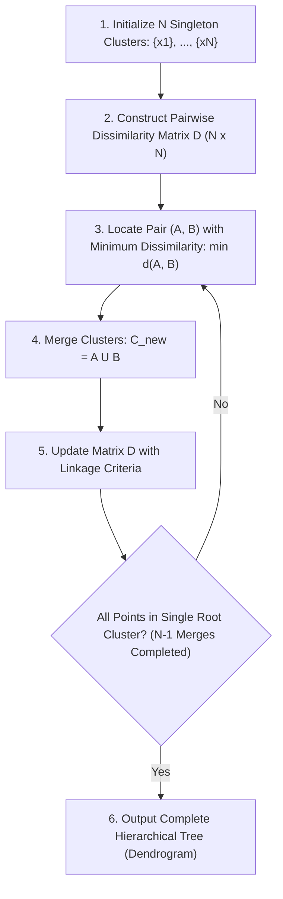

# Migration in progress
# Lesson 1: Hierarchical Clustering: Algorithms and...
## Hierarchical Clustering: Algorithms, Dendrograms, and Dissimilarity

Hierarchical clustering partitions unlabeled data by constructing multi-level nested tree structures rather than flat, unnested groupings. By operating directly on pairwise dissimilarity matrices, hierarchical methods expose relational taxonomy across varying scales without requiring a predetermined cluster count $K$. Analyzing the algorithmic steps of agglomerative and divisive paradigms, the geometry of dendrogram construction, cophenetic distance metrics, and multi-modal distance formulations establishes the core mechanics of hierarchical unsupervised learning.

## The Agglomerative Clustering Algorithm

### Stepwise Execution and Matrix Updating

- **Agglomerative Nesting (AGNES)** executes as a bottom-up, greedy aggregation algorithm across $N - 1$ sequential steps:
  1. **Initialization:** Assign each observation $x_i \in \mathcal{D}$ to an independent singleton cluster: $\mathcal{C}_0 = \{C_1, C_2, \dots, C_N\}$, where $C_i = \{x_i\}$.
  2. **Proximity Evaluation:** Compute a symmetric pairwise **dissimilarity matrix** $D_0 \in \mathbb{R}^{N \times N}$ using a chosen distance metric:
     $$D(i, j) = d(x_i, x_j), \quad D(i, i) = 0$$
  3. **Greedy Pair Identification:** Scan the active distance matrix to locate the two clusters $(A^*, B^*)$ separated by the minimum dissimilarity:
     $$(A^*, B^*) = \arg\min_{A, B \in \mathcal{C}, A \neq B} d(A, B)$$
  4. **Cluster Fusion:** Merge $A^*$ and $B^*$ into a single composite cluster: $C_{\text{new}} = A^* \cup B^*$. Remove $A^*$ and $B^*$ from active set $\mathcal{C}$ and insert $C_{\text{new}}$, decrementing total cluster count by one.
  5. **Matrix Recalculation:** Update the dissimilarity matrix by evaluating distances between $C_{\text{new}}$ and all remaining unmerged clusters using a designated **linkage criterion**.
  6. **Termination Check:** Repeat steps 3 through 5 until all observations merge into a single global root cluster containing all $N$ instances.

### The Greedy Merge Criterion

- At each iteration step $t$, the algorithm evaluates only local pairwise proximities, making an immediate, locally optimal merge decision.
- The decision function optimizes strictly over the active candidate pairs:
  $$\min_{A, B} d(A, B)$$
- The algorithm does not optimize a global objective function (unlike the Within-Cluster Sum of Squares in K-Means), meaning final groupings reflect the cumulative history of localized greedy choices.

### Irreversibility and Error Propagation

- Agglomerative clustering operates as an **irreversible greedy heuristic**.
- Once two observations or sub-clusters unite into a composite cluster at step $t$, they cannot be separated, swapped, or reassigned at any subsequent step $t+k$.
- An erroneous merge caused by localized noise, bridge points, or outliers persists throughout all subsequent levels of the tree hierarchy, permanently distorting downstream cluster boundaries.



> [!Tip]
> **Agglomerative clustering is greedy and irreversible**: once two clusters merge, they cannot be unmerged or reassigned at subsequent iterations, meaning early merge errors propagate throughout the entire remaining tree.

## The Divisive Clustering Framework

### Top-Down Recursive Bisection

- **Divisive Analysis (DIANA)** reverses agglomeration, executing a top-down hierarchical partitioning strategy:
  1. Initialize the entire dataset as a single global root cluster: $\mathcal{C}_0 = \{\mathcal{D}\}$.
  2. Identify the cluster exhibiting the largest diameter or internal dissimilarity.
  3. Bisect the selected cluster into two distinct sub-clusters.
  4. Repeat steps 2 and 3 recursively across child clusters until every observation isolates into an individual singleton leaf node.

### The Splinter Group Allocation Protocol

- Exact exhaustive bisection requires evaluating $2^{m-1} - 1$ possible binary splits for a cluster of size $m$, which is computationally intractable for large clusters.
- DIANA resolves this bottleneck using a heuristic **splinter group protocol**:
  1. **Identify the Seed:** Compute the average dissimilarity of each point to all other points within the cluster. The observation with the highest average dissimilarity initiates an independent **splinter group**.
  2. **Iterative Point Reallocation:** For every point remaining in the original cluster, evaluate two distances:
     - Average dissimilarity to remaining members of the original cluster: $d_{\text{orig}}(x)$.
     - Average dissimilarity to members of the splinter group: $d_{\text{splinter}}(x)$.
  3. **Transfer Criterion:** If $d_{\text{orig}}(x) - d_{\text{splinter}}(x) > 0$, the observation is physically closer to the splinter group; reassign the point with the largest positive difference into the splinter group.
  4. Repeat step 3 until no remaining point in the original cluster is closer to the splinter group.

### Computational Bottlenecks of Top-Down Partitioning

- While divisive methods capture global macro-structure early by focusing initial splits on major data modes, their computational cost remains prohibitive.
- Even with greedy splinter heuristics, evaluating pairwise distances across large undivided clusters in early iterations scales poorly compared to bottom-up pairwise tracking, making agglomerative methods the primary standard in practical machine learning workflows.

> [!Important]
> **Divisive clustering avoids combinatorial split explosion via splinter groups**: instead of evaluating $2^{m-1}-1$ possible binary partitions, DIANA seeds a splinter group with the most distant point and reallocates neighbors iteratively.

## Dendrogram Structure, Slicing, and Ultrametrics

### Anatomy and Rotational Symmetry of Nodes

- A **dendrogram** is an inverted binary tree visualizing the sequence of merges or splits executed during hierarchical clustering.
- **Leaf Nodes:** Represent individual observations plotted along the horizontal axis.
- **Internal Nodes (U-Links):** Represent merge events, where two vertical lines join horizontally.
- **Vertical Height ($h$):** Represents the exact scalar dissimilarity (distance) at which the two constituent sub-clusters merged.
- **Rotational Invariance:** The horizontal ordering of leaves is arbitrary. Internal nodes act as swivel joints; flipping the left and right branches of any node does not alter the underlying tree topology. For a binary tree containing $N$ leaves, there exist $2^{N-1}$ equivalent linear horizontal orderings that represent the identical hierarchical clustering solution.

### Cophenetic Distances and the Ultrametric Inequality

- The **cophenetic distance** $c_{ij}$ between two observations $x_i$ and $x_j$ is defined as the vertical merge height of the lowest common ancestor node connecting them in the dendrogram:
  $$c_{ij} = \text{Height}(\text{Lowest Common Ancestor}(x_i, x_j))$$
- Cophenetic distances satisfy the **ultrametric inequality**, which is strictly stronger than the standard metric triangle inequality:
  $$c_{ij} \le \max(c_{ik}, \; c_{jk}) \quad \forall i, j, k$$
- In an ultrametric space, every triangle is either equilateral or an isosceles triangle with two long equal sides and a shorter base, meaning the two most distant points among any triplet are equidistant from each other.

### Horizontal Slicing for Flat Cluster Extraction

- While a dendrogram preserves the complete hierarchical continuum, practical applications require extracting a discrete set of $K$ non-overlapping flat clusters.
- A flat partition is obtained by drawing a **horizontal cut line** across the dendrogram at a user-defined threshold height $h_{\text{cut}}$.
- Slicing removes all internal merge branches occurring above height $h_{\text{cut}}$, isolating disconnected vertical stems.
- The number of vertical lines intersected by the horizontal cut line corresponds exactly to the resulting number of discrete flat clusters $K$.
- Slicing across a long, uninterrupted vertical branch indicates stable cluster boundaries that remain invariant across a wide range of dissimilarity thresholds.

```mermaid
flowchart TD
    subgraph Tree["Dendrogram Hierarchy"]
        Root["Node 7 (Merge Height: 4.8)"]
        N5["Node 5 (Height