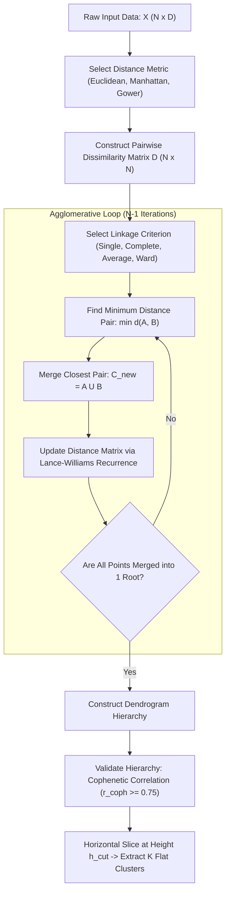

# Migration in progress
# Lesson 2: Summary and Assessment

## Hierarchical Clustering: Module Summary and Assessment

Hierarchical clustering partitions unlabeled data by constructing nested sequences of clusters that reveal relationships across varying granularities without requiring a predefined cluster count $K$. While agglomerative bottom-up approaches merge pairs greedily based on inter-cluster linkage metrics, divisive top-down approaches recursively bisect data modes. Synthesizing distance metric formulations, dendrogram geometry, Lance-Williams recurrence updates, and cophenetic validation equips machine learning practitioners to construct taxonomies, interpret multi-scale clusters, and diagnose chaining or inversion anomalies.

## Synthesis of Core Week 11 Foundations

### Agglomerative Versus Divisive Taxonomies

- **Agglomerative Nesting (AGNES):** Initiates with $N$ singleton clusters and executes $N - 1$ greedy merges, joining the two closest clusters identified in a pairwise dissimilarity matrix.
- **Divisive Analysis (DIANA):** Initiates with a single global root cluster containing all $N$ observations and recursively bisects the most heterogeneous cluster using splinter group heuristics to avoid the $2^{m-1} - 1$ combinatorial split bottleneck.
- **Irreversibility of greedy choices:** Agglomerative clustering makes permanent merge decisions; early misallocations caused by local noise or outliers cannot be undone and propagate throughout all subsequent levels of the tree hierarchy.

### Linkage Criteria and Cluster Geometries

- **Single Linkage (Nearest Neighbor):** $d(A, B) = \min_{x \in A, y \in B} d(x, y)$. Discovers non-elliptical, concentric manifolds, but suffers from the **chaining problem**, where bridge points cause distinct clusters to merge into elongated, straggly shapes.
- **Complete Linkage (Furthest Neighbor):** $d(A, B) = \max_{x \in A, y \in B} d(x, y)$. Avoids chaining by requiring all points in a union to lie within a bounded diameter, producing compact, equal-diameter spheres that are sensitive to isolated outliers.
- **Average Linkage (UPGMA):** $d(A, B) = \frac{1}{|A||B|} \sum \sum d(x, y)$. Balances single and complete linkage, providing high robustness to noise and yielding high cophenetic correlation scores.
- **Centroid Linkage (UPGMC):** $d(A, B) = \|\mu_A - \mu_B\|_2^2$. Evaluates distances between cluster centers of mass, but violates monotonicity by triggering the **inversion pathology**, where parent nodes appear lower than child nodes.
- **Ward's Minimum Variance Method:** Merges cluster pairs that minimize the increase in total Within-Cluster Sum of Squares ($\Delta \text{ESS}_{AB} = \frac{|A||B|}{|A|+|B|} \|\mu_A - \mu_B\|_2^2$), producing compact, balanced spherical clusters.
- **The Lance-Williams recurrence relation** updates distances between a merged cluster $(A \cup B)$ and any remaining cluster $C$ in $O(1)$ operations without re-scanning raw data points.

### Dendrogram Slicing and Cophenetic Preservation

- **Dendrogram visualization:** Leaf nodes represent individual observations along an arbitrary horizontal axis ($2^{N-1}$ equivalent rotational layouts); vertical branch height represents the exact dissimilarity value at which clusters merge.
- **Horizontal slicing ($h_{\text{cut}}$):** Slicing across the dendrogram at a designated threshold isolates disconnected vertical branches, yielding $K$ discrete flat clusters.
- **Cophenetic distance ($c_{ij}$):** Measures the vertical merge height of the lowest common ancestor node connecting observations $x_i$ and $x_j$, satisfying the **ultrametric inequality**: $c_{ij} \le \max(c_{ik}, c_{jk})$.
- **Cophenetic Correlation Coefficient ($r_{\text{coph}}$):** Evaluates the Pearson correlation between original pairwise distances and cophenetic tree distances; scores exceeding $0.75$ confirm faithful structural preservation.

> [!Tip]
> **Linkage choice dictates cluster shape**: single linkage detects non-linear manifolds but risks chaining, complete linkage produces compact equal-diameter spheres, and Ward's method minimizes internal variance to discover balanced clusters.

## The Hierarchical Clustering Execution Pipeline

> [!Important]
> **Lance-Williams avoids cubic recalculations**: using scalar recurrence coefficients to update the dissimilarity matrix after each merge reduces naive $O(N^3)$ distance calculations to $O(N^2 \log N)$ execution.

## Comprehensive Linkage Criteria and Lance-Williams Matrix

| Linkage Method | Mathematical Distance Formulation | $\alpha_A$ | $\alpha_B$ | $\beta$ | $\gamma$ | Chaining Risk | Inversion Risk | Favored Cluster Geometry |
|---|---|---|---|---|---|---|---|---|
| **Single Linkage** | $\min_{x \in A, y \in B} d(x, y)$ | $0.5$ | $0.5$ | $0$ | $-0.5$ | **High** | None | Arbitrary, non-linear manifolds |
| **Complete Linkage** | $\max_{x \in A, y \in B} d(x, y)$ | $0.5$ | $0.5$ | $0$ | $+0.5$ | None | None | Compact, equal-diameter spheres |
| **Average Linkage (UPGMA)** | $\frac{1}{\|A\|\|B\|} \sum \sum d(x, y)$ | $\frac{\|A\|}{\|A\|+\|B\|}$ | $\frac{\|B\|}{\|A\|+\|B\|}$ | $0$ | $0$ | Low | None | Natural ellipsoidal variance modes |
| **Centroid Linkage (UPGMC)**| $\|\mu_A - \mu_B\|_2^2$ | $\frac{\|A\|}{\|A\|+\|B\|}$ | $\frac{\|B\|}{\|A\|+\|B\|}$ | $\frac{-\|A\|\|B\|}{(\|A\|+\|B\|)^2}$ | $0$ | Low | **High** | Spherical, center-seeking clusters |
| **Ward's Method** | $\frac{\|A\|\|B\|}{\|A\|+\|B\|} \|\mu_A - \mu_B\|_2^2$ | $\frac{\|A\|+\|C\|}{\|A\|+\|B\|+\|C\|}$ | $\frac{\|B\|+\|C\|}{\|A\|+\|B\|+\|C\|}$ | $\frac{-\|C\|}{\|A\|+\|B\|+\|C\|}$ | $0$ | None | None | Balanced, compact spherical clusters |

> [!Tip]
> **Centroid linkage risks dendrogram inversions**: because newly formed cluster centroids can be closer together than their constituent components, centroid linkage can cause branches to cross downward, making trees difficult to interpret.

## Assessment Preparation

### Conceptual Review Questions

- **Question 1 (The Lance-Williams Recurrence Mechanics):** How does the Lance-Williams recurrence formula eliminate the requirement to re-examine raw data points when updating cluster distances?
  - *Answer:* When clusters $A$ and $B$ merge into a composite cluster $(A \cup B)$, evaluating its distance to any remaining cluster $C$ naively requires computing $|A \cup B| \cdot |C|$ pairwise point distances ($O(N^3)$ overall). The Lance-Williams recurrence formula expresses the new distance $d(A \cup B, C)$ strictly as a linear combination of three existing scalar distances: $d(A, C)$, $d(B, C)$, and $d(A, B)$, modified by an absolute difference term $|d(A, C) - d(B, C)|$. Because the required distances were already computed in prior steps, the update evaluates in $O(1)$ scalar arithmetic operations, allowing algorithms using priority queues to execute in $O(N^2 \log N)$ time.
- **Question 2 (The Chaining Problem in Single Linkage):** Describe the geometric mechanism that causes single linkage to exhibit chaining, and explain why complete linkage prevents this behavior.
  - *Answer:* Single linkage defines the distance between clusters $A$ and $B$ as the minimum pairwise distance between any single point in $A$ and any single point in $B$: $d(A, B) = \min_{x \in A, y \in B} d(x, y)$. If an unwanted sequence of noisy observations forms a thin physical bridge between two distinct, well-separated cluster modes, single linkage greedily merges points along this bridge. The algorithm views the two separate modes as close neighbors because a single pair of bridge points is near, forming an elongated, straggly cluster. Complete linkage defines distance using the maximum pairwise distance: $d(A, B) = \max_{x \in A, y \in B} d(x, y)$. To merge two clusters under complete linkage, *all* points across both clusters must lie within a small distance threshold. A thin chain of noise points cannot force a merge because points on opposite ends of the modes remain far apart.
- **Question 3 (The Inversion Pathology in Centroid Linkage):** Explain why centroid linkage can cause dendrogram branches to cross downward, and identify which mathematical condition it violates.
  - *Answer:* Centroid linkage measures distance as the squared Euclidean distance between cluster centers of mass: $d(A, B) = \|\mu_A - \mu_B\|_2^2$. This formulation violates the **monotonicity condition**, which requires that the dissimilarity height of a parent cluster must always be greater than or equal to the dissimilarity heights of its child sub-clusters: $h(\text{Parent}) \ge \max(h(\text{Child}_1), h(\text{Child}_2))$. When two large, dispersed clusters merge, their resulting center of mass can shift closer to an adjacent third cluster's centroid than the original components were to each other. When this third cluster merges with the union, its merge height evaluates lower than the preceding merge, causing dendrogram branches to drop downward (an inversion).
- **Question 4 (Ultrametric Distances in Dendrograms):** What does the ultrametric inequality imply about the geometric properties of cophenetic distances extracted from a hierarchical tree?
  - *Answer:* Cophenetic distances satisfy the ultrametric inequality: $c_{ij} \le \max(c_{ik}, c_{jk})$ for any triplet of observations $(i, j, k)$. This constraint is stronger than the standard metric triangle inequality ($d_{ij} \le d_{ik} + d_{jk}$). Geometrically, the ultrametric inequality implies that among any three points, the two largest cophenetic distances must be equal. In terms of tree topology, this means that if point $i$ is more closely related to point $j$ than to point $k$ ($c_{ij} < c_{ik}$), then the lowest common ancestor connecting $i$ to $k$ is the exact same ancestor node that connects $j$ to $k$, forcing $c_{ik} = c_{jk}$.

### Applied Analytical Scenarios

- **Scenario A (Resolving Chaining Artifacts in Customer Segmentation):** A data science team applies agglomerative hierarchical clustering to customer behavioral data using single linkage. The resulting dendrogram reveals an asymmetric structure: one massive cluster absorbs 96% of the customer base one point at a time, while the remaining 4% form tiny, isolated singleton branches.
  - *Diagnosis:* The clustering pipeline is suffering from the chaining pathology of single linkage. Outlier customer records and overlapping behavioral boundaries act as bridge points, causing single linkage to merge points along continuous noise chains into a single sprawling cluster.
  - *Remedy:* Replace single linkage with **Ward's minimum variance linkage** or **Complete linkage**. Ward's method minimizes internal variance growth ($\Delta \text{ESS}$), producing balanced, compact clusters of comparable size. Alternatively, use Average linkage (UPGMA) to balance noise tolerance and cluster cohesion.
- **Scenario B (Memory Exhaustion on Large Healthcare Records):** A bioinformatics lab attempts to cluster 120,000 patient electronic health records across 80 clinical features using standard agglomerative hierarchical clustering in Python. The program crashes immediately with an out-of-memory error.
  - *Diagnosis:* Standard agglomerative clustering requires constructing and storing the full pairwise dissimilarity matrix $D \in \mathbb{R}^{N \times N}$, which scales as $O(N^2)$ space complexity. For $N = 120,000$, an uncompressed single-precision distance matrix requires $(120,000)^2 \times 4 \text{ bytes} \approx 57.6 \text{ GB}$ of RAM, exceeding standard workstation memory.
  - *Remedy:* Deploy **BIRCH (Balanced Iterative Reducing and Clustering using Hierarchies)**. BIRCH makes a single linear pass ($O(N)$) over the data to construct an in-memory Clustering Feature