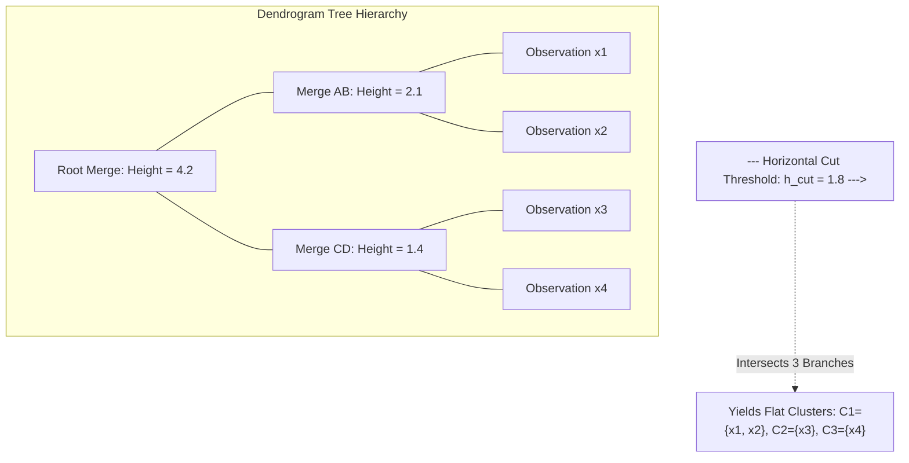

# Migration in progress
# Week 11: Unsupervised Learning: Hierarchical Clustering

## Unsupervised Learning: Hierarchical Clustering Foundations and Algorithms

Hierarchical clustering constructs nested sequences of partitions that organize unlabeled data into multi-level tree structures without requiring a predefined cluster count $K$. Unlike flat partitional algorithms that optimize a single global objective, hierarchical methods evaluate inter-cluster proximities to generate progressive groupings across varying granularities. Analyzing agglomerative and divisive paradigms, linkage formulations, dendrogram interpretations, and cophenetic validation metrics establishes the theoretical basis for hierarchical unsupervised learning.

## The Hierarchical Clustering Paradigm

### Partitional Versus Hierarchical Taxonomy

- **Partitional clustering** (such as K-Means) divides a dataset of $N$ observations into an unnested set of $K$ disjoint clusters, optimizing an empirical error criterion for a single fixed value of $K$.
- **Hierarchical clustering** constructs a continuous hierarchy of nested clusters where partitions at fine granularities embed inside broader groupings at coarse granularities.
- Hierarchical methods eliminate the requirement to specify the target cluster count $K$ prior to execution, allowing practitioners to inspect structure across multiple operational scales.
- Output models represent data through a root-to-leaf **dendrogram**, exposing taxonomy, sub-clusters, and outlier branches in a unified structure.

### Agglomerative (Bottom-Up) Mechanics

- **Agglomerative clustering** operates as a bottom-up greedy aggregation process:
  1. Initialize each observation $x_i \in \mathcal{D}$ as its own unique singleton cluster: $\mathcal{C} = \{\{x_1\}, \{x_2\}, \dots, \{x_N\}\}$.
  2. Evaluate a symmetric pairwise **distance matrix** $D \in \mathbb{R}^{N \times N}$ storing dissimilarities between all clusters.
  3. Identify the pair of clusters $(A, B)$ exhibiting the minimum inter-cluster distance:
     $$(A^*, B^*) = \arg\min_{A, B \in \mathcal{C}, A \neq B} d(A, B)$$
  4. Merge clusters $A^*$ and $B^*$ into a composite cluster $A^* \cup B^*$, reducing total cluster cardinality by one.
  5. Update the distance matrix to reflect proximities between the new union cluster and all remaining active clusters.
  6. Repeat steps 3 through 5 sequentially for $N - 1$ iterations until a single root cluster containing all $N$ points remains.

### Divisive (Top-Down) Mechanics

- **Divisive clustering** operates as a top-down recursive partitioning process:
  1. Initialize the entire dataset as a single global root cluster containing all observations: $\mathcal{C} = \{\mathcal{D}\}$.
  2. Identify the cluster exhibiting the largest internal dissimilarity or variance.
  3. Bisect this cluster into two optimal sub-clusters using a flat clustering algorithm (such as 2-Means) or exhaustive search (DIANA: Divisive Analysis).
  4. Repeat steps 2 and 3 recursively until each observation occupies an isolated singleton cluster.
- Divisive clustering is computationally demanding because finding the optimal 2-way split of a cluster of size $m$ requires evaluating $2^{m-1} - 1$ possible binary combinations, making agglomerative bottom-up clustering the practical industry standard.

```mermaid
flowchart TD
    subgraph Agglomerative["Agglomerative (Bottom-Up): O(N^2) to O(N^3)"]
        A_Leaves["N Singleton Clusters: {x1}, {x2}, ..., {xN}"] --> A_Merge1["Iteratively Merge Closest Pair"]
        A_Merge1 --> A_Merge2["Intermediate Clusters"]
        A_Merge2 --> A_Root["Single Global Root Cluster containing all N points"]
    end

    subgraph Divisive["Divisive (Top-Down): Exponential Split Space"]
        D_Root["Single Global Root Cluster containing all N points"] --> D_Split1["Iteratively Bisect Most Heterogeneous Cluster"]
        D_Split1 --> D_Split2["Intermediate Sub-Clusters"]
        D_Split2 --> D_Leaves["N Singleton Clusters: {x1}, {x2}, ..., {xN}"]
    end
```

> [!Important]
> **Agglomerative clustering builds hierarchies bottom-up**: starting from $N$ singleton clusters, the algorithm greedily merges the two closest clusters across $N - 1$ steps, avoiding the combinatorial split explosion of divisive methods.

## Dendrogram Geometry and Cophenetic Analysis

### Structural Anatomy of a Dendrogram

- A **dendrogram** is an inverted tree diagram visualizing the hierarchical merges or splits executed during clustering.
- **Leaves (Base Nodes):** Represent individual data observations positioned along the horizontal axis.
- **Internal Nodes (U-Shaped Branches):** Represent merge events joining two sub-clusters.
- **Vertical Height ($h$):** Represents the exact inter-cluster distance (dissimilarity) at which the two constituent clusters merged.
- The spatial proximity of leaf nodes along the horizontal axis does not indicate sample similarity; cluster similarity is quantified exclusively by the vertical height of the lowest common ancestor node connecting two points.

### Cophenetic Distance and Dissimilarity Heights

- The **cophenetic distance** $c_{ij}$ between two observations $x_i$ and $x_j$ is defined as the vertical merge height of the node where their respective branches first unite in the dendrogram:
  $$c_{ij} = \text{Height}(\text{Lowest Common Ancestor}(x_i, x_j))$$
- A low cophenetic distance indicates that two samples joined early in the aggregation process, reflecting high geometric similarity.
- Cophenetic distances satisfy the **ultrametric inequality**, a metric property stronger than the standard triangle inequality:
  $$c_{ij} \le \max(c_{ik}, \; c_{jk}) \quad \forall i, j, k$$

### Horizontal Threshold Slicing for Flat Partitions

- A continuous dendrogram converts into a discrete flat clustering partition by executing a **horizontal slice** across the tree at a designated threshold height $h_{\text{cut}}$.
- Slicing the dendrogram removes all merge connections occurring above height $h_{\text{cut}}$, isolating disconnected vertical branches.
- The number of vertical lines intersected by the horizontal cut equals the resulting number of discrete flat clusters $K$.
- Selecting a cut height in a tall vertical branch that spans a wide height range extracts stable, well-separated cluster boundaries.

### The Cophenetic Correlation Coefficient

- Agglomerative clustering introduces distortion because summarizing multi-point clusters with scalar linkages modifies original Euclidean distances.
- The **Cophenetic Correlation Coefficient ($r_{\text{coph}}$)** measures how faithfully a dendrogram preserves the original pairwise dissimilarities:
  $$r_{\text{coph}} = \frac{\sum_{i < j} (d_{ij} - \bar{d})(c_{ij} - \bar{c})}{\sqrt{\sum_{i < j} (d_{ij} - \bar{d})^2 \sum_{i < j} (c_{ij} - \bar{c})^2}}$$
  where $d_{ij} = \|x_i - x_j\|_2$ is the original Euclidean distance, $c_{ij}$ is the cophenetic distance from the dendrogram, and $\bar{d}, \bar{c}$ denote their respective sample means.
- An $r_{\text{coph}} \ge 0.75$ indicates that the dendrogram provides a faithful representation of true multidimensional data relationships.

> [!Tip]
> **Use cophenetic correlation to validate linkage choice**: calculating the Pearson correlation between original pairwise distances and dendrogram merge heights confirms whether the hierarchical tree faithfully represents the input data geometry.

## Linkage Criteria and Inter-Cluster Proximities

### Single Linkage and the Chaining Pathology

- **Single Linkage (Minimum Distance / Nearest Neighbor):** Defines the distance between two clusters as the shortest pairwise distance between any single point in $A$ and any single point in $B$:
  $$d_{\text{single}}(A, B) = \min_{x \in A, y \in B} \|x - y\|_2$$
- Single linkage can identify non-elliptical, concentric, and manifold-shaped clusters, as it merges points along continuous paths.
- **The Chaining Problem:** Single linkage suffers from a failure mode where isolated noise points act as bridges between distinct clusters. A chain of neighboring points causes single linkage to merge two separate data modes into an elongated straggly cluster.

### Complete Linkage and Compact Hyper-Spheres

- **Complete Linkage (Maximum Distance / Furthest Neighbor):** Defines the distance between two clusters as the maximum pairwise distance between points across clusters:
  $$d_{\text{complete}}(A, B) = \max_{x \in A, y \in B} \|x - y\|_2$$
- Complete linkage prevents chaining by requiring *all* points in a candidate union to reside within a bounded maximum diameter.
- It produces compact, spherical clusters of roughly equal spatial diameter.
- Complete linkage is sensitive to **anomalous outliers**: a single distant outlier point inflates the maximum cluster diameter, preventing natural clusters from merging.

### Average Linkage (UPGMA)

- **Average Linkage (UPGMA - Unweighted Pair Group Method with Arithmetic Mean):** Evaluates the average pairwise distance across all possible combinations of points:
  $$d_{\text{average}}(A, B) = \frac{1}{|A| \cdot |B|} \sum_{x \in A} \sum_{y \in B} \|x - y\|_2$$
- Average linkage balances the sensitivity of single linkage against the outlier vulnerability of complete linkage.
- It is robust to noise an