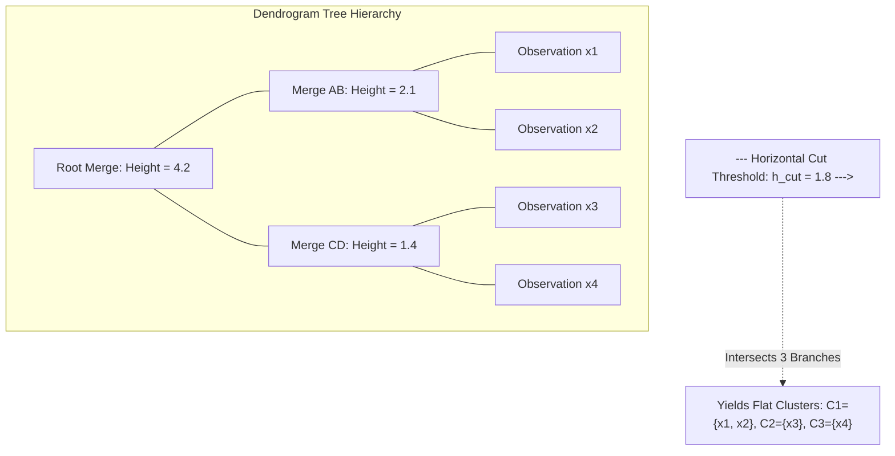

# Week 11: Unsupervised Learning: Hierarchical Clustering

## Unsupervised Learning: Hierarchical Clustering Foundations and Algorithms

Hierarchical clustering constructs nested sequences of partitions that organize unlabeled data into multi-level tree structures without requiring a predefined cluster count $K$. Unlike flat partitional algorithms that optimize a single global objective, hierarchical methods evaluate inter-cluster proximities to generate progressive groupings across varying granularities. Analyzing agglomerative and divisive paradigms, linkage formulations, dendrogram interpretations, and cophenetic validation metrics establishes the theoretical basis for hierarchical unsupervised learning.

## The Hierarchical Clustering Paradigm

### Partitional Versus Hierarchical Taxonomy

- **Partitional clustering** (such as K-Means) divides a dataset of $N$ observations into an unnested set of $K$ disjoint clusters, optimizing an empirical error criterion for a single fixed value of $K$.
- **Hierarchical clustering** constructs a continuous hierarchy of nested clusters where partitions at fine granularities embed inside broader groupings at coarse granularities.
- Hierarchical methods eliminate the requirement to specify the target cluster count $K$ prior to execution, allowing practitioners to inspect structure across multiple operational scales.
- Output models represent data through a root-to-leaf **dendrogram**, exposing taxonomy, sub-clusters, and outlier branches in a unified structure.

### Agglomerative (Bottom-Up) Mechanics

- **Agglomerative clustering** operates as a bottom-up greedy aggregation process:
  1. Initialize each observation $x_i \in \mathcal{D}$ as its own unique singleton cluster: $\mathcal{C} = \{\{x_1\}, \{x_2\}, \dots, \{x_N\}\}$.
  2. Evaluate a symmetric pairwise **distance matrix** $D \in \mathbb{R}^{N \times N}$ storing dissimilarities between all clusters.
  3. Identify the pair of clusters $(A, B)$ exhibiting the minimum inter-cluster distance:
     $$(A^*, B^*) = \arg\min_{A, B \in \mathcal{C}, A \neq B} d(A, B)$$
  4. Merge clusters $A^*$ and $B^*$ into a composite cluster $A^* \cup B^*$, reducing total cluster cardinality by one.
  5. Update the distance matrix to reflect proximities between the new union cluster and all remaining active clusters.
  6. Repeat steps 3 through 5 sequentially for $N - 1$ iterations until a single root cluster containing all $N$ points remains.

### Divisive (Top-Down) Mechanics

- **Divisive clustering** operates as a top-down recursive partitioning process:
  1. Initialize the entire dataset as a single global root cluster containing all observations: $\mathcal{C} = \{\mathcal{D}\}$.
  2. Identify the cluster exhibiting the largest internal dissimilarity or variance.
  3. Bisect this cluster into two optimal sub-clusters using a flat clustering algorithm (such as 2-Means) or exhaustive search (DIANA: Divisive Analysis).
  4. Repeat steps 2 and 3 recursively until each observation occupies an isolated singleton cluster.
- Divisive clustering is computationally demanding because finding the optimal 2-way split of a cluster of size $m$ requires evaluating $2^{m-1} - 1$ possible binary combinations, making agglomerative bottom-up clustering the practical industry standard.

```mermaid
flowchart TD
    subgraph Agglomerative["Agglomerative (Bottom-Up): O(N^2) to O(N^3)"]
        A_Leaves["N Singleton Clusters: {x1}, {x2}, ..., {xN}"] --> A_Merge1["Iteratively Merge Closest Pair"]
        A_Merge1 --> A_Merge2["Intermediate Clusters"]
        A_Merge2 --> A_Root["Single Global Root Cluster containing all N points"]
    end

    subgraph Divisive["Divisive (Top-Down): Exponential Split Space"]
        D_Root["Single Global Root Cluster containing all N points"] --> D_Split1["Iteratively Bisect Most Heterogeneous Cluster"]
        D_Split1 --> D_Split2["Intermediate Sub-Clusters"]
        D_Split2 --> D_Leaves["N Singleton Clusters: {x1}, {x2}, ..., {xN}"]
    end
```

> [!Important]
> **Agglomerative clustering builds hierarchies bottom-up**: starting from $N$ singleton clusters, the algorithm greedily merges the two closest clusters across $N - 1$ steps, avoiding the combinatorial split explosion of divisive methods.

## Dendrogram Geometry and Cophenetic Analysis

### Structural Anatomy of a Dendrogram

- A **dendrogram** is an inverted tree diagram visualizing the hierarchical merges or splits executed during clustering.
- **Leaves (Base Nodes):** Represent individual data observations positioned along the horizontal axis.
- **Internal Nodes (U-Shaped Branches):** Represent merge events joining two sub-clusters.
- **Vertical Height ($h$):** Represents the exact inter-cluster distance (dissimilarity) at which the two constituent clusters merged.
- The spatial proximity of leaf nodes along the horizontal axis does not indicate sample similarity; cluster similarity is quantified exclusively by the vertical height of the lowest common ancestor node connecting two points.

### Cophenetic Distance and Dissimilarity Heights

- The **cophenetic distance** $c_{ij}$ between two observations $x_i$ and $x_j$ is defined as the vertical merge height of the node where their respective branches first unite in the dendrogram:
  $$c_{ij} = \text{Height}(\text{Lowest Common Ancestor}(x_i, x_j))$$
- A low cophenetic distance indicates that two samples joined early in the aggregation process, reflecting high geometric similarity.
- Cophenetic distances satisfy the **ultrametric inequality**, a metric property stronger than the standard triangle inequality:
  $$c_{ij} \le \max(c_{ik}, \; c_{jk}) \quad \forall i, j, k$$

### Horizontal Threshold Slicing for Flat Partitions

- A continuous dendrogram converts into a discrete flat clustering partition by executing a **horizontal slice** across the tree at a designated threshold height $h_{\text{cut}}$.
- Slicing the dendrogram removes all merge connections occurring above height $h_{\text{cut}}$, isolating disconnected vertical branches.
- The number of vertical lines intersected by the horizontal cut equals the resulting number of discrete flat clusters $K$.
- Selecting a cut height in a tall vertical branch that spans a wide height range extracts stable, well-separated cluster boundaries.

### The Cophenetic Correlation Coefficient

- Agglomerative clustering introduces distortion because summarizing multi-point clusters with scalar linkages modifies original Euclidean distances.
- The **Cophenetic Correlation Coefficient ($r_{\text{coph}}$)** measures how faithfully a dendrogram preserves the original pairwise dissimilarities:
  $$r_{\text{coph}} = \frac{\sum_{i < j} (d_{ij} - \bar{d})(c_{ij} - \bar{c})}{\sqrt{\sum_{i < j} (d_{ij} - \bar{d})^2 \sum_{i < j} (c_{ij} - \bar{c})^2}}$$
  where $d_{ij} = \|x_i - x_j\|_2$ is the original Euclidean distance, $c_{ij}$ is the cophenetic distance from the dendrogram, and $\bar{d}, \bar{c}$ denote their respective sample means.
- An $r_{\text{coph}} \ge 0.75$ indicates that the dendrogram provides a faithful representation of true multidimensional data relationships.

> [!Tip]
> **Use cophenetic correlation to validate linkage choice**: calculating the Pearson correlation between original pairwise distances and dendrogram merge heights confirms whether the hierarchical tree faithfully represents the input data geometry.

## Linkage Criteria and Inter-Cluster Proximities

### Single Linkage and the Chaining Pathology

- **Single Linkage (Minimum Distance / Nearest Neighbor):** Defines the distance between two clusters as the shortest pairwise distance between any single point in $A$ and any single point in $B$:
  $$d_{\text{single}}(A, B) = \min_{x \in A, y \in B} \|x - y\|_2$$
- Single linkage can identify non-elliptical, concentric, and manifold-shaped clusters, as it merges points along continuous paths.
- **The Chaining Problem:** Single linkage suffers from a failure mode where isolated noise points act as bridges between distinct clusters. A chain of neighboring points causes single linkage to merge two separate data modes into an elongated straggly cluster.

### Complete Linkage and Compact Hyper-Spheres

- **Complete Linkage (Maximum Distance / Furthest Neighbor):** Defines the distance between two clusters as the maximum pairwise distance between points across clusters:
  $$d_{\text{complete}}(A, B) = \max_{x \in A, y \in B} \|x - y\|_2$$
- Complete linkage prevents chaining by requiring *all* points in a candidate union to reside within a bounded maximum diameter.
- It produces compact, spherical clusters of roughly equal spatial diameter.
- Complete linkage is sensitive to **anomalous outliers**: a single distant outlier point inflates the maximum cluster diameter, preventing natural clusters from merging.

### Average Linkage (UPGMA)

- **Average Linkage (UPGMA - Unweighted Pair Group Method with Arithmetic Mean):** Evaluates the average pairwise distance across all possible combinations of points:
  $$d_{\text{average}}(A, B) = \frac{1}{|A| \cdot |B|} \sum_{x \in A} \sum_{y \in B} \|x - y\|_2$$
- Average linkage balances the sensitivity of single linkage against the outlier vulnerability of complete linkage.
- It is robust to noise and provides high cophenetic correlation coefficients across biological, ecological, and genetic datasets.

### Centroid Linkage and the Inversion Anomaly

- **Centroid Linkage (UPGMC):** Evaluates the squared Euclidean distance between the arithmetic mean centroids of the two clusters:
  $$d_{\text{centroid}}(A, B) = \|\mu_A - \mu_B\|_2^2, \quad \text{where } \mu_A = \frac{1}{|A|} \sum_{x \in A} x$$
- **The Inversion Pathology:** Centroid linkage violates the ultrametric monotonicity condition: as clusters merge, the distance between newly created centroids can be smaller than the distance between earlier components:
  $$d(\text{Merged Centroids}) < d(\text{Preceding Centroids})$$
- Inversions cause dendrogram branches to cross downward or double back, producing non-interpretable trees where parent nodes appear lower than child nodes.

### Ward's Minimum Variance Criterion

- **Ward's Method:** Formulates merging as an optimization problem that minimizes the increase in total **Within-Cluster Sum of Squares (WCSS)**.
- For clusters $A$ and $B$, the objective evaluates the increase in error sum of squares ($\Delta \text{ESS}$) resulting from their potential union:
  $$\Delta \text{ESS}_{AB} = \text{ESS}_{A \cup B} - (\text{ESS}_A + \text{ESS}_B) = \frac{|A| \cdot |B|}{|A| + |B|} \|\mu_A - \mu_B\|_2^2$$
- Ward's linkage merges the specific pair of clusters that minimizes variance growth at each step.
- It produces balanced, compact clusters comparable to K-Means, but does not require manual cluster count initialization.
- Ward's method is mathematically restricted to continuous **Euclidean distances**, as variance calculations are undefined for non-Euclidean metrics.

### The Generalized Lance-Williams Recurrence Formula

- Recomputing distances from scratch after every merge requires expensive sweeps across all dataset points ($O(N^3)$).
- Lance and Williams (1967) introduced a unified recurrence relation that updates the distance between a newly merged cluster $(A \cup B)$ and any remaining cluster $C$ using only prior scalar distances:
  $$d(A \cup B, C) = \alpha_A d(A, C) + \alpha_B d(B, C) + \beta d(A, B) + \gamma |d(A, C) - d(B, C)|$$
- The parameters $\alpha_A, \alpha_B, \beta, \gamma$ instantiate standard linkage criteria:
  - **Single Linkage:** $\alpha_A = 0.5, \; \alpha_B = 0.5, \; \beta = 0, \; \gamma = -0.5$.
  - **Complete Linkage:** $\alpha_A = 0.5, \; \alpha_B = 0.5, \; \beta = 0, \; \gamma = +0.5$.
  - **Average Linkage:** $\alpha_A = \frac{|A|}{|A| + |B|}, \; \alpha_B = \frac{|B|}{|A| + |B|}, \; \beta = 0, \; \gamma = 0$.
  - **Ward's Method:** $\alpha_A = \frac{|A| + |C|}{|A| + |B| + |C|}, \; \alpha_B = \frac{|B| + |C|}{|A| + |B| + |C|}, \; \beta = \frac{-|C|}{|A| + |B| + |C|}, \; \gamma = 0$.

> [!Important]
> **Ward's method minimizes variance while single linkage risks chaining**: Ward's linkage merges clusters that cause the smallest increase in internal variance ($\Delta \text{ESS}$), whereas single linkage merges via nearest neighbors, causing straggly chaining artifacts.

## Computational Complexity and Scaling Limits

### Quadratic Memory and Cubic Time Constraints

- Hierarchical clustering requires substantial computational resources:
  - **Space Complexity ($O(N^2)$):** Agglomerative methods construct and store the full pairwise distance matrix $D \in \mathbb{R}^{N \times N}$. For $N = 100,000$ observations, storing this matrix in single-precision floating-point format requires approximately $40 \text{ GB}$ of RAM, creating a memory bottleneck for large datasets.
  - **Time Complexity ($O(N^3)$ naive, $O(N^2 \log N)$ optimized):** Naive search scans the $N \times N$ matrix across $N - 1$ steps ($O(N^3)$). Utilizing priority queues, binary heaps, and Lance-Williams updates reduces execution time to $O(N^2 \log N)$ or $O(N^2)$ for specific linkage criteria (such as SLINK for single linkage).
- Because computational complexity scales quadratically with dataset size, standard agglomerative clustering is restricted to datasets with $N \le 50,000$ instances.

### The Irreversibility Trap of Greedy Merging

- Agglomerative clustering operates as a strict, **irreversible greedy heuristic**.
- Once two clusters merge at an early iteration, they cannot be unmerged, split, or reassigned at subsequent steps.
- An erroneous merge caused by localized noise or bridge points persists throughout all subsequent levels of the tree, permanently distorting the resulting hierarchy.

### Scalable Extensions: BIRCH and CURE

- To apply hierarchical principles to large datasets, specialized algorithms modify the aggregation pipeline:
  - **BIRCH (Balanced Iterative Reducing and Clustering using Hierarchies):** Constructs an in-memory **Clustering Feature (CF) Tree** in a single linear pass ($O(N)$), summarizing dense sub-regions before applying agglomerative clustering to the compact leaf nodes.
  - **CURE (Clustering Using REpresentatives):** Represents each cluster using a fixed set of well-scattered points shrunk toward the centroid by a factor $\alpha$, handling non-spherical shapes and varying cluster sizes without suffering from single-linkage chaining.

> [!Tip]
> **Hierarchical clustering is memory-constrained**: storing the $O(N^2)$ distance matrix limits standard agglomerative methods to datasets smaller than 50,000 instances; larger datasets require pre-clustering summaries like BIRCH.

## Comparative Matrices of Linkages and Clustering Paradigms

| Linkage Criterion | Mathematical Distance Formula | Favored Cluster Geometry | Chaining Susceptibility | Outlier Sensitivity | Monotonicity (Inversion Risk) |
|---|---|---|---|---|---|
| **Single Linkage** | $\min_{x \in A, y \in B} d(x, y)$ | Non-elliptical, concentric manifolds | **High** (severe chaining) | Low (absorbs isolated points) | Guaranteed monotonic (no inversions) |
| **Complete Linkage** | $\max_{x \in A, y \in B} d(x, y)$ | Compact, uniform-diameter spheres | None | **High** (outliers inflate diameter) | Guaranteed monotonic (no inversions) |
| **Average Linkage (UPGMA)** | $\frac{1}{\|A\|\|B\|} \sum \sum d(x, y)$ | Intermediate variance ellipsoids | Low | Moderate (robust average) | Guaranteed monotonic (no inversions) |
| **Centroid Linkage (UPGMC)** | $\|\mu_A - \mu_B\|_2^2$ | Centroid-clustered spheres | Low | Moderate | **Non-monotonic (inversions occur)** |
| **Ward's Minimum Variance** | $\frac{\|A\|\|B\|}{\|A\|+\|B\|} \|\mu_A - \mu_B\|_2^2$ | Compact, equal-sized spherical clusters | None | Moderate | Guaranteed monotonic (no inversions) |

### Partitional K-Means Versus Agglomerative Hierarchical Clustering

| Operational Dimension | Partitional K-Means (Lloyd) | Agglomerative Hierarchical Clustering |
|---|---|---|
| **Cluster Count $K$ Requirement** | Must be predefined before execution | Not required; selected post-hoc via dendrogram slice |
| **Deterministic Consistency** | Stochastic; dependent on initial random seeds | **Deterministic**; yields identical trees for fixed linkage |
| **Underlying Output Representation** | Flat, non-nested partition of $K$ clusters | Nested hierarchical dendrogram exposing sub-structure |
| **Computational Time Complexity** | Linear: $O(I \cdot N \cdot K \cdot D)$ | Quadratic to Cubic: $O(N^2 \log N)$ to $O(N^3)$ |
| **Memory Complexity** | Linear: $O(ND + KD)$ | Quadratic: $O(N^2)$ to store distance matrix |
| **Scalability to Large Datasets ($N > 10^5$)** | High (processes millions of points via Mini-Batch) | Poor (exhausts memory on large sample sizes) |
| **Distance Metrics Supported** | Strictly squared Euclidean ($L_2$) | Arbitrary (Euclidean, Manhattan, Cosine, Gower) |
| **Flexibility of Partitioning** | Hard spherical Voronoi hyperplanes | Flexible; non-spherical shapes supported via Single Linkage |

> [!Important]
> **K-Means scales to volume, while Hierarchical reveals taxonomy**: K-Means processes millions of instances quickly using linear updates, whereas Hierarchical clustering produces deterministic multi-level taxonomies on smaller datasets without pre-specifying $K$.

## Key Takeaways

- **Hierarchical clustering builds nested partitions** without requiring a predefined cluster count $K$, visualizing data organization through dendrograms.
- **Agglomerative clustering merges clusters bottom-up** across $N - 1$ steps, whereas divisive clustering bisects clusters top-down from a single global root.
- **Dendrogram branch heights represent dissimilarity**, allowing flat cluster partitions to be extracted by slicing the tree horizontally at threshold height $h_{\text{cut}}$.
- **The Cophenetic Correlation Coefficient** measures how accurately dendrogram merge heights preserve original pairwise Euclidean distances ($r_{\text{coph}} \ge 0.75$ indicates faithful preservation).
- **Single linkage measures nearest-neighbor distances**, discovering arbitrary shapes but suffering from straggly chaining artifacts.
- **Complete linkage measures furthest-neighbor distances**, producing compact, equal-diameter spheres while remaining sensitive to outliers.
- **Ward's method minimizes internal variance growth ($\Delta \text{ESS}$)**, producing balanced spherical clusters comparable to K-Means using continuous Euclidean distances.
- **The Lance-Williams recurrence relation** updates inter-cluster distances in $O(1)$ scalar steps using prior distances, avoiding expensive point-wise recalculations.
- **Hierarchical methods scale quadratically in memory ($O(N^2)$)** and time ($O(N^2 \log N)$), restricting standard applications to datasets smaller than 50,000 observations.

> [!Tip]
> The foundational rule of hierarchical clustering: **linkage choice defines cluster geometry**; single linkage captures non-linear manifolds but risks chaining, complete linkage enforces compact diameters, and Ward's method minimizes variance growth to identify balanced, spherical clusters.
