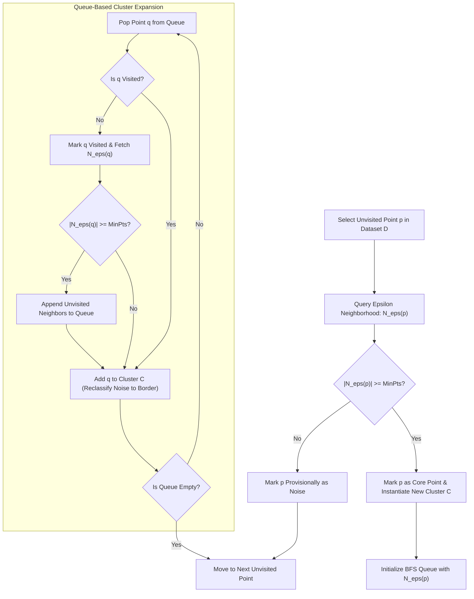

# Migration in progress
# Lesson 1: Density-Based and Scalable Clustering

## Density-Based and Scalable Clustering: Algorithms, Geometry, and Mechanics

Distance-based clustering algorithms such as K-Means and agglomerative hierarchical clustering encounter operational breakdowns when applied to complex physical distributions. K-Means forces data into convex, spherical clusters and remains vulnerable to outlier distortion, while hierarchical methods require quadratic memory scaling ($O(N^2)$) that exhausts computational resources on large datasets. Density-Based Spatial Clustering of Applications with Noise (DBSCAN) and Balanced Iterative Reducing and Clustering using Hierarchies (BIRCH) provide specialized solutions. DBSCAN discovers non-convex spatial manifolds while isolating noise via localized density criteria, and BIRCH compresses streaming datasets into in-memory statistical summaries to achieve linear-time hierarchical clustering.

## The Density-Based Clustering Paradigm

### The Geometry of Density Versus Centroid Proximity

- Centroid-based models partition feature space using linear Voronoi boundaries, assuming clusters form compact, isotropic hyper-spheres around point prototypes.
- Real-world spatial distributions (such as geological fault lines, GPS vehicular trajectories, and biological sequences) form intricate, non-linear geometries: interlocking crescents, concentric rings, and continuous serpentine paths.
- **Density-based clustering** redefines a cluster as an unbroken, contiguous region where the local concentration of observations exceeds a specified threshold, separated from other clusters by sparse regions of low density.
- This formulation eliminates the requirement to predetermine the cluster count $K$, allowing the natural topology of the data distribution to dictate the number and shapes of the extracted partitions.

### The Mathematical Core: Epsilon Neighborhoods and Density Thresholds

- Density within continuous feature space $\mathbb{R}^D$ is parameterized using two structural parameters:
  - **Epsilon ($\epsilon \in \mathbb{R}^+$):** The radius defining the localized Euclidean hypersphere centered at query point $p$:
    $$N_\epsilon(p) = \{q \in \mathcal{D} \mid \|p - q\|_2 \le \epsilon\}$$
  - **Minimum Points ($\text{MinPts} \in \mathbb{Z}^+$):** The scalar density threshold specifying the minimum number of observations required within $N_\epsilon(p)$ to designate a region as dense.
- Every observation in dataset $\mathcal{D}$ maps to one of three mutually exclusive topological categories:
  - **Core Points:** Point $p$ is a core point if its $\epsilon$-neighborhood meets or exceeds the density threshold:
    $$|N_\epsilon(p)| \ge \text{MinPts}$$
  - **Border Points:** Point $p$ is a border point if its local neighborhood is sparse ($|N_\epsilon(p)| < \text{MinPts}$), but it resides within the $\epsilon$-neighborhood of an established core point $q$:
    $$p \in N_\epsilon(q) \quad \text{such that } |N_\epsilon(q)| \ge \text{MinPts}$$
  - **Noise Points (Outliers):** Point $p$ is a noise point if it satisfies neither condition:
    $$|N_\epsilon(p)| < \text{MinPts} \quad \text{and} \quad p \notin N_\epsilon(c) \; \forall c \in \text{Core}(\mathcal{D})$$

### Formal Definitions of Reachability and Connectivity

- **Direct Density-Reachability:** Point $p$ is directly density-reachable from point $q$ with respect to $\epsilon$ and $\text{MinPts}$ if:
  $$p \in N_\epsilon(q) \quad \text{and} \quad |N_\epsilon(q)| \ge \text{MinPts}$$
  Direct density-reachability is **asymmetric**: border points are reachable from core points, but core points cannot be directly reachable from border points.
- **Density-Reachability:** Point $p$ is density-reachable from point $q$ if there exists a finite chain of points $(p_1, p_2, \dots, p_n)$ where $p_1 = q$, $p_n = p$, and each $p_{i+1}$ is directly density-reachable from $p_i$. Density-reachability is transitive, but remains asymmetric when border points terminate the chain.
- **Density-Connectivity:** Two points $p$ and $q$ are density-connected if there exists an intermediate observation $o \in \mathcal{D}$ such that both $p$ and $q$ are density-reachable from $o$. Density-connectivity is **symmetric** ($p \sim q \iff q \sim p$) and **reflexive**, serving as the mathematical equivalence relation defining cluster membership.

### Cluster Maximality and Connectivity Conditions

- A formal DBSCAN cluster $\mathcal{C} \subseteq \mathcal{D}$ satisfies two conditions:
  - **Maximality:** $\forall p, q \in \mathcal{D}$: if $p \in \mathcal{C}$ and $q$ is density-reachable from $p$, then $q \in \mathcal{C}$.
  - **Connectivity:** $\forall p, q \in \mathcal{C}$: $p$ is density-connected to $q$.
- A dataset partitions into a set of disjoint clusters $\{\mathcal{C}_1, \dots, \mathcal{C}_k\}$ and a set of unclustered noise points $\mathcal{C}_{\text{noise}}$.

> [!Important]
> **Density-connectivity enforces symmetric cluster membership**: while density-reachability is asymmetric due to non-core border points, density-connectivity establishes mutual equivalence through shared core ancestry, ensuring stable cluster definitions.

## Computational Execution and Spatial Indexing in DBSCAN

### Traversal Mechanics and Queue-Based Expansion

- DBSCAN traverses the dataset by visiting unclassified points sequentially.
- When an unvisited core point is identified, a breadth-first search (BFS) queue initializes with all points in its neighborhood $N_\epsilon(p)$.
- As the queue processes:
  - Unvisited points are marked as visited.
  - If a popped point is also a core point, its own $\epsilon$-neighborhood appends to the active queue, expanding the cluster boundaries across continuous dense paths.
  - Points previously flagged as noise that reside within the neighborhood are reclassified as border points of the active cluster.
- The expansion terminates when the queue empties, indicating that the dense component has reached low-density boundary margins.

### Accelerated Range Queries via Spatial Indexing Trees

- The computational bottleneck of DBSCAN resides in the neighborhood evaluation step: retrieving $N_\epsilon(p)$ for all $N$ data points.
- **Naive Exhaustive Search ($O(N^2)$):** Computes pairwise Euclidean distances between point $p$ and all other $N - 1$ points in the dataset, scaling quadratically and failing on large sample sizes.
- **Tree-Based Spatial Partitioning ($O(N \log N)$):**
  - **$k$-d Trees:** Recursively bisects data along axis-aligned hyperplanes; accelerates range queries to $O(\log N)$ on low-dimensional data ($D \le 10$).
  - **Ball Trees:** Partitions space into nested hyperspheres; handles higher-dimensional metric spaces ($D \approx 20$) by pruning distant sub-trees using the triangle inequality.
- Integrating spatial indexing trees reduces overall DBSCAN execution complexity to $O(N \log N)$ operations.

### The Sorted K-Distance Graph Calibration Heuristic

- Calibrating $\epsilon$ and $\text{MinPts}$ requires empirical analysis of the dataset's local geometry:
  1. Set $\text{MinPts} = 2D$ (or $\text{MinPts} = D + 1$ for clean low-noise data).
  2. Set $k = \text{MinPts} - 1$.
  3. For every observation $x \in \mathcal{D}$, compute the Euclidean distance to its $k$-th nearest neighbor ($k$-distance).
  4. Sort all $N$ calculated $k$-distances in descending order.
  5. Plot the sorted distances along the vertical axis against the point index along the horizontal axis.
- **Identifying the Inflection Threshold:** The curve displays a sharp knee or elbow:
  - Distances below the elbow represent dense intra-cluster points whose $k$-nearest neighbors reside in close spatial proximity.
  - Distances above the elbow represent sparse background noise points separated from their neighbors by wide margins.
  - The distance value at the elbow inflection identifies the optimal global radius $\epsilon$.

> [!Tip]
> **Accelerate DBSCAN using spatial trees**: replacing naive $O(N^2)$ distance sweeps with $k$-d trees or Ball trees reduces range query latency to $O(N \log N)$, enabling density-based clustering on hundreds of thousands of samples.

## Scalable Clustering via Statistical Summarization: BIRCH

### Overcoming the Memory Bottleneck in Massive Datasets

- Agglomerative hierarchical clustering constructs and stores a full pairwise dissimilarity matrix $D \in \mathbb{R}^{N \times N}$, requiring $O(N^2)$ memory that exhausts physical RAM when $N > 50,000$.
- K-Means requires loading the entire dataset into memory for repeated iterations over the raw data ($O(I \cdot N \cdot K \cdot D)$).
- **BIRCH (Balanced Iterative Reducing and Clustering using Hierarchies)** resolves this bottleneck by processing massive datasets in a **single linear scan ($O(N)$)**, compressing points into an in-memory summary tree that captures data distribution statistics without retaining individual sample coordinates.

### The Clustering Feature (CF) Triple Formulation

- A **Clustering Feature (CF)** is an ordered triple that summarizes the geometric distribution of an arbitrary sub-cluster of points $\{x_1, x_2, \dots, x_N\} \subset \mathbb{R}^D$:
  $$CF = (N, \; \vec{LS}, \; SS)$$
- The triple components capture fundamental statistical properties:
  - **$N \in \mathbb{Z}^+$:** The scalar count of data points contained within the sub-cluster:
    $$N = \sum_{i=1}^N 1$$
  - **$\vec{LS} \in \mathbb{R}^D$:** The vector **