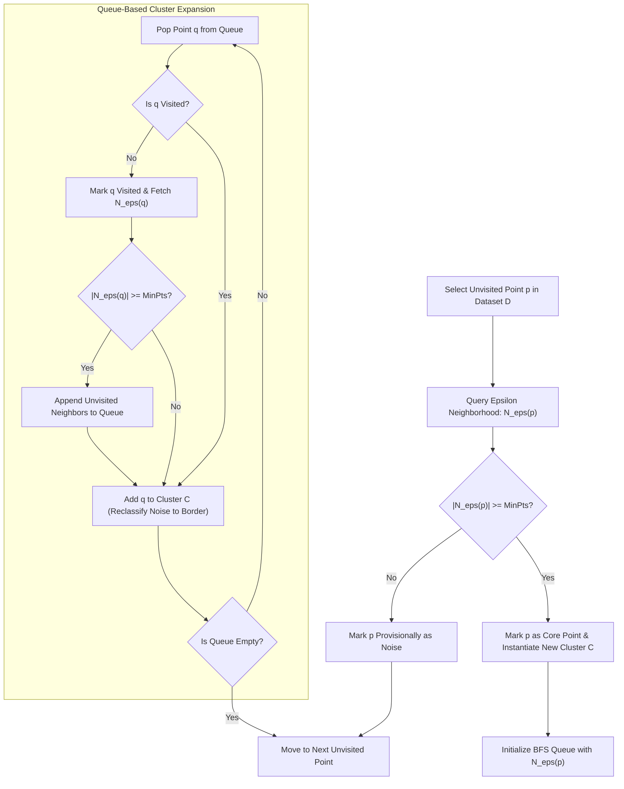
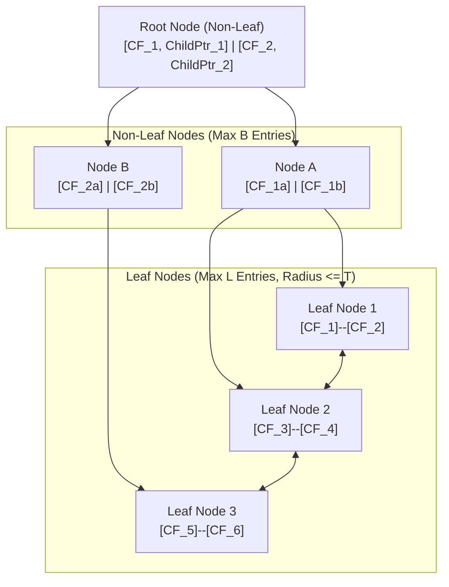
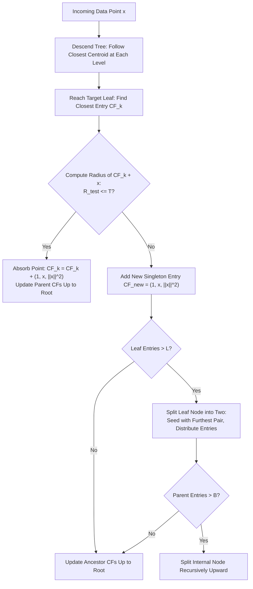

# Lesson 1: Density-Based and Scalable Clustering

## Density-Based and Scalable Clustering: Algorithms, Geometry, and Mechanics

Distance-based clustering algorithms such as K-Means and agglomerative hierarchical clustering encounter operational breakdowns when applied to complex physical distributions. K-Means forces data into convex, spherical clusters and remains vulnerable to outlier distortion, while hierarchical methods require quadratic memory scaling ($O(N^2)$) that exhausts computational resources on large datasets. Density-Based Spatial Clustering of Applications with Noise (DBSCAN) and Balanced Iterative Reducing and Clustering using Hierarchies (BIRCH) provide specialized solutions. DBSCAN discovers non-convex spatial manifolds while isolating noise via localized density criteria, and BIRCH compresses streaming datasets into in-memory statistical summaries to achieve linear-time hierarchical clustering.

## The Density-Based Clustering Paradigm

### The Geometry of Density Versus Centroid Proximity

- Centroid-based models partition feature space using linear Voronoi boundaries, assuming clusters form compact, isotropic hyper-spheres around point prototypes.
- Real-world spatial distributions (such as geological fault lines, GPS vehicular trajectories, and biological sequences) form intricate, non-linear geometries: interlocking crescents, concentric rings, and continuous serpentine paths.
- **Density-based clustering** redefines a cluster as an unbroken, contiguous region where the local concentration of observations exceeds a specified threshold, separated from other clusters by sparse regions of low density.
- This formulation eliminates the requirement to predetermine the cluster count $K$, allowing the natural topology of the data distribution to dictate the number and shapes of the extracted partitions.

### The Mathematical Core: Epsilon Neighborhoods and Density Thresholds

- Density within continuous feature space $\mathbb{R}^D$ is parameterized using two structural parameters:
  - **Epsilon ($\epsilon \in \mathbb{R}^+$):** The radius defining the localized Euclidean hypersphere centered at query point $p$:
    $$N_\epsilon(p) = \{q \in \mathcal{D} \mid \|p - q\|_2 \le \epsilon\}$$
  - **Minimum Points ($\text{MinPts} \in \mathbb{Z}^+$):** The scalar density threshold specifying the minimum number of observations required within $N_\epsilon(p)$ to designate a region as dense.
- Every observation in dataset $\mathcal{D}$ maps to one of three mutually exclusive topological categories:
  - **Core Points:** Point $p$ is a core point if its $\epsilon$-neighborhood meets or exceeds the density threshold:
    $$|N_\epsilon(p)| \ge \text{MinPts}$$
  - **Border Points:** Point $p$ is a border point if its local neighborhood is sparse ($|N_\epsilon(p)| < \text{MinPts}$), but it resides within the $\epsilon$-neighborhood of an established core point $q$:
    $$p \in N_\epsilon(q) \quad \text{such that } |N_\epsilon(q)| \ge \text{MinPts}$$
  - **Noise Points (Outliers):** Point $p$ is a noise point if it satisfies neither condition:
    $$|N_\epsilon(p)| < \text{MinPts} \quad \text{and} \quad p \notin N_\epsilon(c) \; \forall c \in \text{Core}(\mathcal{D})$$

### Formal Definitions of Reachability and Connectivity

- **Direct Density-Reachability:** Point $p$ is directly density-reachable from point $q$ with respect to $\epsilon$ and $\text{MinPts}$ if:
  $$p \in N_\epsilon(q) \quad \text{and} \quad |N_\epsilon(q)| \ge \text{MinPts}$$
  Direct density-reachability is **asymmetric**: border points are reachable from core points, but core points cannot be directly reachable from border points.
- **Density-Reachability:** Point $p$ is density-reachable from point $q$ if there exists a finite chain of points $(p_1, p_2, \dots, p_n)$ where $p_1 = q$, $p_n = p$, and each $p_{i+1}$ is directly density-reachable from $p_i$. Density-reachability is transitive, but remains asymmetric when border points terminate the chain.
- **Density-Connectivity:** Two points $p$ and $q$ are density-connected if there exists an intermediate observation $o \in \mathcal{D}$ such that both $p$ and $q$ are density-reachable from $o$. Density-connectivity is **symmetric** ($p \sim q \iff q \sim p$) and **reflexive**, serving as the mathematical equivalence relation defining cluster membership.

### Cluster Maximality and Connectivity Conditions

- A formal DBSCAN cluster $\mathcal{C} \subseteq \mathcal{D}$ satisfies two conditions:
  - **Maximality:** $\forall p, q \in \mathcal{D}$: if $p \in \mathcal{C}$ and $q$ is density-reachable from $p$, then $q \in \mathcal{C}$.
  - **Connectivity:** $\forall p, q \in \mathcal{C}$: $p$ is density-connected to $q$.
- A dataset partitions into a set of disjoint clusters $\{\mathcal{C}_1, \dots, \mathcal{C}_k\}$ and a set of unclustered noise points $\mathcal{C}_{\text{noise}}$.

> [!Important]
> **Density-connectivity enforces symmetric cluster membership**: while density-reachability is asymmetric due to non-core border points, density-connectivity establishes mutual equivalence through shared core ancestry, ensuring stable cluster definitions.

## Computational Execution and Spatial Indexing in DBSCAN

### Traversal Mechanics and Queue-Based Expansion

- DBSCAN traverses the dataset by visiting unclassified points sequentially.
- When an unvisited core point is identified, a breadth-first search (BFS) queue initializes with all points in its neighborhood $N_\epsilon(p)$.
- As the queue processes:
  - Unvisited points are marked as visited.
  - If a popped point is also a core point, its own $\epsilon$-neighborhood appends to the active queue, expanding the cluster boundaries across continuous dense paths.
  - Points previously flagged as noise that reside within the neighborhood are reclassified as border points of the active cluster.
- The expansion terminates when the queue empties, indicating that the dense component has reached low-density boundary margins.

### Accelerated Range Queries via Spatial Indexing Trees

- The computational bottleneck of DBSCAN resides in the neighborhood evaluation step: retrieving $N_\epsilon(p)$ for all $N$ data points.
- **Naive Exhaustive Search ($O(N^2)$):** Computes pairwise Euclidean distances between point $p$ and all other $N - 1$ points in the dataset, scaling quadratically and failing on large sample sizes.
- **Tree-Based Spatial Partitioning ($O(N \log N)$):**
  - **$k$-d Trees:** Recursively bisects data along axis-aligned hyperplanes; accelerates range queries to $O(\log N)$ on low-dimensional data ($D \le 10$).
  - **Ball Trees:** Partitions space into nested hyperspheres; handles higher-dimensional metric spaces ($D \approx 20$) by pruning distant sub-trees using the triangle inequality.
- Integrating spatial indexing trees reduces overall DBSCAN execution complexity to $O(N \log N)$ operations.

### The Sorted K-Distance Graph Calibration Heuristic

- Calibrating $\epsilon$ and $\text{MinPts}$ requires empirical analysis of the dataset's local geometry:
  1. Set $\text{MinPts} = 2D$ (or $\text{MinPts} = D + 1$ for clean low-noise data).
  2. Set $k = \text{MinPts} - 1$.
  3. For every observation $x \in \mathcal{D}$, compute the Euclidean distance to its $k$-th nearest neighbor ($k$-distance).
  4. Sort all $N$ calculated $k$-distances in descending order.
  5. Plot the sorted distances along the vertical axis against the point index along the horizontal axis.
- **Identifying the Inflection Threshold:** The curve displays a sharp knee or elbow:
  - Distances below the elbow represent dense intra-cluster points whose $k$-nearest neighbors reside in close spatial proximity.
  - Distances above the elbow represent sparse background noise points separated from their neighbors by wide margins.
  - The distance value at the elbow inflection identifies the optimal global radius $\epsilon$.

> [!Tip]
> **Accelerate DBSCAN using spatial trees**: replacing naive $O(N^2)$ distance sweeps with $k$-d trees or Ball trees reduces range query latency to $O(N \log N)$, enabling density-based clustering on hundreds of thousands of samples.

## Scalable Clustering via Statistical Summarization: BIRCH

### Overcoming the Memory Bottleneck in Massive Datasets

- Agglomerative hierarchical clustering constructs and stores a full pairwise dissimilarity matrix $D \in \mathbb{R}^{N \times N}$, requiring $O(N^2)$ memory that exhausts physical RAM when $N > 50,000$.
- K-Means requires loading the entire dataset into memory for repeated iterations over the raw data ($O(I \cdot N \cdot K \cdot D)$).
- **BIRCH (Balanced Iterative Reducing and Clustering using Hierarchies)** resolves this bottleneck by processing massive datasets in a **single linear scan ($O(N)$)**, compressing points into an in-memory summary tree that captures data distribution statistics without retaining individual sample coordinates.

### The Clustering Feature (CF) Triple Formulation

- A **Clustering Feature (CF)** is an ordered triple that summarizes the geometric distribution of an arbitrary sub-cluster of points $\{x_1, x_2, \dots, x_N\} \subset \mathbb{R}^D$:
  $$CF = (N, \; \vec{LS}, \; SS)$$
- The triple components capture fundamental statistical properties:
  - **$N \in \mathbb{Z}^+$:** The scalar count of data points contained within the sub-cluster:
    $$N = \sum_{i=1}^N 1$$
  - **$\vec{LS} \in \mathbb{R}^D$:** The vector **Linear Sum** of all points:
    $$\vec{LS} = \sum_{i=1}^N x_i$$
  - **$SS \in \mathbb{R}$:** The scalar **Square Sum** of all point magnitudes:
    $$SS = \sum_{i=1}^N \|x_i\|_2^2 = \sum_{i=1}^N \sum_{d=1}^D x_{id}^2$$

### The Additivity Theorem and Closed-Form Geometry

- **The CF Additivity Theorem:** If two disjoint sub-clusters summarized by $CF_1 = (N_1, \vec{LS}_1, SS_1)$ and $CF_2 = (N_2, \vec{LS}_2, SS_2)$ merge, the resulting composite cluster's feature vector evaluates as the direct component-wise sum:
  $$CF_{\text{merged}} = CF_1 + CF_2 = (N_1 + N_2, \; \vec{LS}_1 + \vec{LS}_2, \; SS_1 + SS_2)$$
- The additivity theorem guarantees that sub-clusters can be merged, split, and aggregated dynamically without re-reading raw data instances from disk.
- Core geometric properties derive in closed form directly from the CF triple:
  - **Centroid Prototype ($\mu \in \mathbb{R}^D$):**
    $$\mu = \frac{\vec{LS}}{N}$$
  - **Sub-Cluster Radius ($R \in \mathbb{R}^+$):** The average distance from member points to the centroid:
    $$R = \sqrt{\frac{1}{N} \sum_{i=1}^N \|x_i - \mu\|_2^2} = \sqrt{\frac{SS}{N} - \|\mu\|_2^2} = \sqrt{\frac{SS}{N} - \frac{\|\vec{LS}\|_2^2}{N^2}}$$
  - **Sub-Cluster Diameter ($D \in \mathbb{R}^+$):** The average pairwise distance between all points:
    $$D = \sqrt{\frac{1}{N(N-1)} \sum_{i=1}^N \sum_{j=1}^N \|x_i - x_j\|_2^2} = \sqrt{\frac{2 N \cdot SS - 2 \|\vec{LS}\|_2^2}{N(N-1)}}$$

### Inter-Cluster Distance Formulations Directly from CF Vectors

- Evaluating proximities between two sub-clusters represented by $CF_1$ and $CF_2$ executes without consulting raw observations:
  - **Euclidean Centroid Distance ($D_0$):**
    $$D_0(CF_1, CF_2) = \|\mu_1 - \mu_2\|_2 = \left\| \frac{\vec{LS}_1}{N_1} - \frac{\vec{LS}_2}{N_2} \right\|_2$$
  - **Average Inter-Cluster Distance ($D_2$):**
    $$D_2(CF_1, CF_2) = \sqrt{\frac{SS_1}{N_1} + \frac{SS_2}{N_2} - \frac{2 \vec{LS}_1^T \vec{LS}_2}{N_1 N_2}}$$
  - **Ward's Minimum Variance Distance ($D_4$):**
    $$D_4(CF_1, CF_2) = \sqrt{\frac{N_1 N_2}{N_1 + N_2} \|\mu_1 - \mu_2\|_2^2}$$

> [!Important]
> **CF triples summarize sub-clusters without loss of centroid accuracy**: storing $N$, $\vec{LS}$, and $SS$ allows the exact centroid, radius, diameter, and inter-cluster distances to be calculated in $O(1)$ operations via closed-form vector algebra.

## The CF-Tree Architecture and Traversal Dynamics

### Structural Constraints: Branching Factor, Leaf Capacity, and Threshold

- A **CF-Tree** is a balanced, height-constrained search tree designed to store compact summaries in physical RAM.
- The tree structure is governed by three architectural parameters:
  - **Branching Factor ($B \in \mathbb{Z}^+$):** The maximum number of child pointers an internal non-leaf node can hold.
  - **Leaf Capacity ($L \in \mathbb{Z}^+$):** The maximum number of Clustering Feature entries a leaf node can hold.
  - **Threshold ($T \in \mathbb{R}^+$):** The maximum allowable spatial radius ($R \le T$) or diameter ($D \le T$) permitted for any micro-cluster stored within a leaf node.

### Insertion Dynamics and Leaf Node Splitting Logic

- Inserting a new observation vector $x$ traverses the tree dynamically:
  1. **Hierarchical Routing:** Starting at the root node, descend the tree by choosing the child entry whose centroid is closest to $x$ under Euclidean distance:
     $$\arg\min_i \|\mu_i - x\|_2$$
  2. **Leaf Node Matching:** At the designated leaf, identify the closest leaf entry $CF_k$.
  3. **Threshold Verification:** Test whether absorbing $x$ into $CF_k$ violates the maximum radius threshold:
     $$CF_{\text{test}} = CF_k + (1, x, \|x\|_2^2) \implies R(CF_{\text{test}}) \le T$$
     - If $R \le T$: The point absorbs into $CF_k$. Update $CF_k \leftarrow CF_{\text{test}}$ and propagate the additive changes upward along the descent path to the root.
     - If $R > T$: The point cannot merge into $CF_k$. A new entry $CF_{\text{new}} = (1, x, \|x\|_2^2)$ initializes within the leaf.
  4. **Dynamic Node Splitting:**
     - If the leaf node contains $\le L$ entries, insertion terminates.
     - If the leaf node exceeds capacity ($L + 1$ entries), the leaf splits into two distinct nodes.
     - The two entries separated by the largest pairwise distance act as seeds. Remaining entries assign to their closest seed.
     - If the parent node exceeds branching factor $B$, internal nodes split recursively upward toward the root.

### The Four-Phase Computational Pipeline

- BIRCH organizes clustering into four distinct phases:
  - **Phase 1 (In-Memory Tree Construction):** Scans the dataset in a single linear pass ($O(N)$), streaming points into a CF-Tree that fits within allocated RAM. If memory fills before processing completes, the threshold $T$ increases automatically, and the tree rebuilds into a more compact form.
  - **Phase 2 (Tree Condensation - Optional):** Scans the leaf entries to remove sparse, isolated entries (filtering outliers) and rebuilds a smaller, denser CF-Tree.
  - **Phase 3 (Global Clustering):** Applies a standard clustering algorithm (such as Agglomerative Hierarchical clustering with Ward's linkage or K-Means) to the compact set of leaf centroids, avoiding the $O(N^2)$ memory bottleneck of clustering raw points.
  - **Phase 4 (Cluster Refining - Optional):** Scans the raw data instances from disk in a final pass, assigning each point to its nearest Phase 3 cluster centroid to sharpen boundary assignments.

> [!Tip]
> **BIRCH decouples dataset size from clustering complexity**: Phase 1 summarizes millions of raw observations into hundreds of leaf summaries, allowing standard hierarchical clustering in Phase 3 to execute on compact prototypes in seconds.

## Comparative Matrix of Density-Based and Scalable Clustering

| Operational Dimension | DBSCAN | BIRCH |
|---|---|---|
| **Core Clustering Paradigm** | Density-connectivity traversal | Statistical summary pre-clustering + global clustering |
| **Cluster Morphology Discovered** | **Arbitrary non-convex shapes** (crescents, rings, spirals) | Spherical sub-clusters (governed by threshold radius $T$) |
| **Noise and Outlier Handling** | **Explicit isolation**: flags non-reachable points as noise | Filters sparse leaf entries during Phase 2 tree condensation |
| **Predefined Cluster Count ($K$)** | Not required; emerges from density parameters | Not required in Phase 1; specified during Phase 3 clustering |
| **Computational Time Complexity** | $O(N \log N)$ with spatial trees; $O(N^2)$ worst-case | **Strictly $O(N)$ linear scan** during Phase 1 tree build |
| **Memory Space Complexity** | $O(N)$ with spatial indexing | **$O(\text{Tree Size})$**: bounded by user-allocated RAM |
| **Input Sensitivity** | Highly sensitive to global density variations | Sensitive to insertion order and threshold radius $T$ |
| **Primary Real-World Niche** | Spatial anomaly detection; non-linear geometric clustering | Out-of-core streaming pipelines; massive tabular datasets |

> [!Important]
> **Choose DBSCAN for shape complexity and BIRCH for dataset scale**: deploy DBSCAN when clusters follow non-linear, arbitrary geometric shapes and contain noise; deploy BIRCH when datasets contain millions of instances that exceed physical memory.

## Key Takeaways

- **DBSCAN clusters data by density-connectivity**, grouping dense regions of points while isolating sparse anomalies as noise.
- **Topological point classification in DBSCAN** categorizes points as **core** ($|N_\epsilon| \ge \text{MinPts}$), **border** (within $\epsilon$ of a core point), or **noise**.
- **Density-reachability is transitive but asymmetric**, while **density-connectivity is symmetric**, defining cluster membership.
- **Spatial indexing trees (k-d trees and Ball trees) accelerate DBSCAN**, reducing range query complexity from $O(N^2)$ to $O(N \log N)$.
- **The $k$-distance graph identifies the optimal $\epsilon$ radius**, locating the inflection elbow separating dense clusters from sparse background noise.
- **BIRCH solves the memory bottleneck of hierarchical clustering**, using a single linear pass ($O(N)$) to compress massive datasets into an in-memory summary tree.
- **The Clustering Feature (CF) vector stores $(N, \vec{LS}, SS)$**, capturing point count, linear sum, and square sum.
- **The Additivity Theorem** allows sub-clusters to merge by adding their summary vectors ($CF_1 + CF_2$), enabling exact centroid, radius, and diameter updates without reading raw data.
- **The CF-Tree uses threshold $R \le T$ to bound sub-cluster spread**, summarizing millions of points into leaf nodes that can be clustered using standard algorithms in Phase 3.

> [!Tip]
> The fundamental design distinction: **DBSCAN captures arbitrary geometric shape through density, while BIRCH achieves linear scalability through statistical summarization**; combining density-based connectivity with summary-based tree structures allows modern machine learning systems to handle complex geometries and massive streaming datasets.
