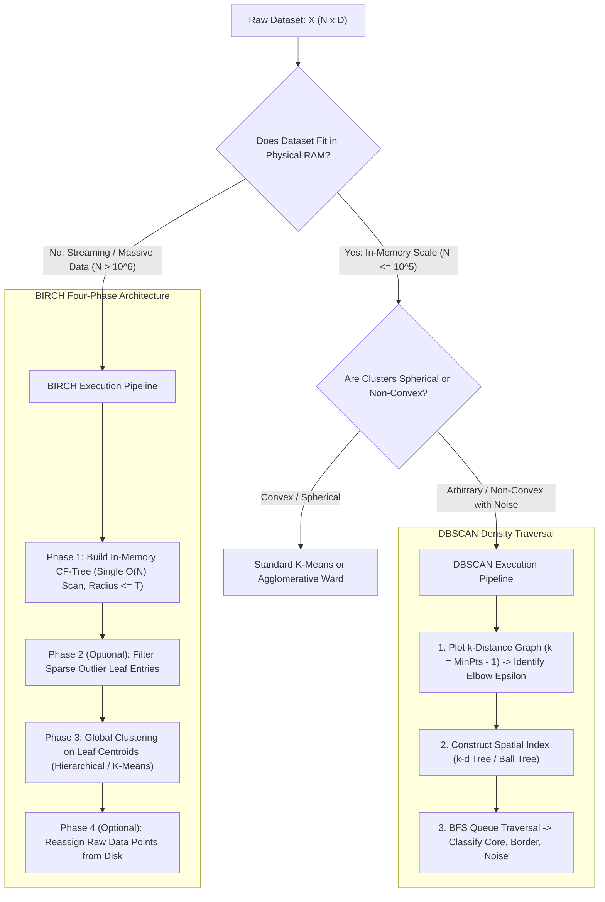

# Migration in progress
# Lesson 2: Summary and Assessment
## DBSCAN and BIRCH: Module Summary and Assessment

Modern unsupervised learning requires clustering algorithms capable of discovering non-linear geometric structures and scaling to massive datasets without prohibitive memory overhead. While Density-Based Spatial Clustering of Applications with Noise (DBSCAN) defines clusters through continuous spatial density connectivity to identify arbitrary shapes and isolate noise, Balanced Iterative Reducing and Clustering using Hierarchies (BIRCH) utilizes additive statistical summaries to cluster out-of-core data streams in linear time. Synthesizing density-reachability mechanics, Clustering Feature (CF) algebra, tree insertion dynamics, and diagnostic calibration equips machine learning engineers to partition complex physical manifolds and scale unsupervised pipelines.

## Synthesis of Core Week 12 Foundations

### Topological Density Connectivity and Noise Isolation

- **DBSCAN parameterization:** Density is defined by a local Euclidean hypersphere of radius **Epsilon ($\epsilon$)** and a density threshold **Minimum Points ($\text{MinPts}$)**.
- **Topological classification:**
  - **Core Points:** Satisfy $|N_\epsilon(p)| \ge \text{MinPts}$, establishing local density anchors.
  - **Border Points:** Possess sparse neighborhoods ($|N_\epsilon(p)| < \text{MinPts}$), but reside within distance $\epsilon$ of an established core point.
  - **Noise Points (Outliers):** Possess sparse neighborhoods and are not reachable from any core point, remaining unassigned to isolate anomalies from cluster boundaries.
- **Reachability and connectivity:** Direct density-reachability is asymmetric due to border points; **density-connectivity** enforces symmetry via shared core ancestry ($\exists o$ such that $o \to p$ and $o \to q$), providing the formal mathematical condition defining a cluster.
- **Arbitrary shape discovery:** DBSCAN connects continuous dense paths regardless of linear separability, identifying concentric rings, interlocking crescents, and non-convex geometries where centroid-based algorithms fail.

### Statistical Summarization and Additive CF Triples

- **The Clustering Feature (CF) triple:** BIRCH compresses an arbitrary-sized subset of $N$ points into an in-memory summary:
  $$CF = (N, \; \vec{LS}, \; SS)$$
  where $N$ is point count, $\vec{LS} = \sum x_i$ is the vector linear sum, and $SS = \sum \|x_i\|_2^2$ is the scalar square sum.
- **The Additivity Theorem:** Merging two disjoint sub-clusters requires only vector addition ($CF_1 + CF_2 = (N_1 + N_2, \vec{LS}_1 + \vec{LS}_2, SS_1 + SS_2)$), eliminating the requirement to read raw data points from disk.
- **Closed-form geometry:** Centroid prototype coordinates ($\mu = \frac{\vec{LS}}{N}$), sub-cluster radius ($R = \sqrt{\frac{SS}{N} - \|\mu\|_2^2}$), and sub-cluster diameter ($D$) derive in closed form directly from the CF triple in $O(1)$ operations.

### Algorithmic Lifecycles: Queue Expansion Versus Balanced Trees

- **DBSCAN execution:** Uses breadth-first search (BFS) queue expansion from core points, accelerated from $O(N^2)$ to $O(N \log N)$ time complexity using spatial indexing structures ($k$-d trees and Ball trees).
- **The $k$-distance graph:** Calibrates $\epsilon$ by plotting sorted distances to the $k$-th nearest neighbor ($k = \text{MinPts} - 1$) and locating the inflection elbow separating dense clusters from sparse background noise.
- **The BIRCH CF-Tree:** A height-balanced search tree parameterized by Branching Factor $B$, Leaf Capacity $L$, and Radius Threshold $T$.
- **The four-phase lifecycle of BIRCH:** Scans data in a single linear pass ($O(N)$) to construct an in-memory CF-Tree (Phase 1), filters outlier leaves (Phase 2), clusters compact leaf centroids using existing algorithms like Ward's hierarchical method (Phase 3), and optionally refines assignments on raw data (Phase 4).

> [!Tip]
> **Density captures non-convexity while summarization enables scale**: deploy DBSCAN when clusters follow arbitrary spatial manifolds containing noise, and deploy BIRCH when datasets contain millions of instances that exceed physical RAM.

## The Structural Selection and Execution Pipeline

> [!Important]
> **Dataset scale and geometry dictate algorithm selection**: data exceeding memory requires statistical compression via BIRCH, whereas non-convex spatial data containing noise requires density-connectivity via DBSCAN.

## Comprehensive Unsupervised Clustering Matrix

| Clustering Paradigm | Representative Algorithm | Mathematical Optimization Objective | Cluster Geometry Discovered | Computational Time Complexity | Memory Space Complexity | Outlier and Noise Handling |
|---|---|---|---|---|---|---|
| **Centroid-Based** | **K-Means (Lloyd)** | Minimize WCSS: $\sum \|x_n - \mu_k\|_2^2$ | Convex, spherical hyper-spheres | $O(I \cdot N \cdot K \cdot D)$ | $O(ND + KD)$ (requires full data in RAM) | High sensitivity (quadratic outlier pull) |
| **Hierarchical (Bottom-Up)** | **Agglomerative (Ward)** | Minimize variance growth: $\Delta \text{ESS}_{AB}$ | Compact, balanced spherical clusters | $O(N^2 \log N)$ to $O(N^3)$ | $O(N^2)$ (stores pairwise distance matrix) | Absorbs outliers into late-stage branches |
| **Density-Based** | **DBSCAN** | Maximal density-connectivity within radius $\epsilon$ | **Arbitrary non-convex shapes** (rings, crescents) | $O(N \log N)$ with trees; $O(N^2)$ worst | $O(N)$ with spatial indexing trees | **Explicit isolation**: labels anomalies as noise |
| **Statistical Summary** | **BIRCH** | Bounded radius sub-clusters ($R \le T$) via CFs | Spherical sub-clusters aggregated globally | **Strictly $O(N)$ linear pass** (Phase 1) | **$O(\text{Tree Size})$**: bounded by user RAM | Filters sparse leaf entries during Phase 2 |

> [!Tip]
> **DBSCAN isolates noise while K-Means absorbs it**: DBSCAN leaves low-density anomalies unassigned, whereas K-Means shifts centroid prototypes quadratically to accommodate outliers.

## Assessment Preparation

### Conceptual Review Questions

- **Question 1 (Asymmetry of Density-Reachability Versus Symmetry of Density-Connectivity):** Why is direct density-reachability an asymmetric relationship, and how does density-connectivity restore symmetry to define a valid mathematical equivalence relation for clusters?
  - *Answer:* Direct density-reachability requires the source observation to be a core point ($|N_\epsilon(q)| \ge \text{MinPts}$). If point $p$ is a border point residing within the $\epsilon$-neighborhood of core point $q$, then $p$ is directly density-reachable from $q$. The reverse is false: because $p$ is a border point, $|N_\epsilon(p)| < \text{MinPts}$, meaning core point $q$ cannot be directly density-reachable from border point $p$. This asymmetry prevents reachability from acting as an equivalence relation. **Density-connectivity** restores mathematical symmetry by establishing connection through a common ancestor: two points $p$ and $q$ are density-connected if there exists an intermediate point $o$ such that both $p$ and $q$ are density-reachable from $o$. Because this condition depends on mutual reachability from $o$, $p \sim q \iff q \sim p$, providing the symmetric relation required to define a cluster.
- **Question 2 (Derivation of Cluster Radius from a Clustering Feature Triple):** Derive the closed-form equation for the spatial radius $R$ of a sub-cluster using only its Clustering Feature triple components $(N, \vec{LS}, SS)$.
  - *Answer:* The radius $R$ is defined as the root mean square distance from all member points to the centroid $\mu$:
    $$R = \sqrt{\frac{1}{N} \sum_{i=1}^N \|x_i - \mu\|_2^2} = \sqrt{\frac{1}{N} \sum_{i=1}^N (x_i^T x_i - 2 \mu^T x_i + \mu^T \mu)}$$
    Distributing the summation across the terms yields:
    $$R = \sqrt{\frac{1}{N} \left( \sum_{i=1}^N x_i^T x_i - 2 \mu^T \sum_{i=1}^N x_i + \mu^T \mu \sum_{i=1}^N 1 \right)}$$
    Substitute the CF triple definitions ($SS = \sum x_i^T x_i$, $\vec{LS} = \sum x_i$, and $\mu = \frac{\vec{LS}}{N}$):
    $$R = \sqrt{\frac{1}{N} \left( SS - 2 \left( \frac{\vec{LS}}{N} \right)^T \vec{LS} + \left\| \frac{\vec{LS}}{N} \right\|_2^2 N \right)} = \sqrt{\frac{SS}{N} - \frac{2 \|\vec{LS}\|_2^2}{N^2} + \frac{\|\vec{LS}\|_2^2}{N^2}} = \sqrt{\frac{SS}{N} - \frac{\|\vec{LS}\|_2^2}{N^2}} = \sqrt{\frac{SS}{N} - \|\mu\|_2^2}$$
    This confirms that the radius evaluates in $O(1)$ operations directly from $N, \vec{LS}$, and $SS$ without accessing individual data points.
- **Question 3 (The Uniform Density Dilemma in DBSCAN):** Explain why standard DBSCAN fails on datasets with multi-density clusters, and identify how hierarchical density algorithms resolve this breakdown.
  - *Answer:* DBSCAN applies a single global $\epsilon$ radius across the entire feature space. If a dataset contains a high-density cluster (where points are separated by distance $0.2$) alongside a loose, low-density cluster (where points are separated by distance $1.5$), selecting a single $\epsilon$ causes optimization failure: setting $\epsilon = 0.3$ fragments the low-density cluster entirely into noise, while setting $\epsilon = 1.6$ merges the dense cluster with adjacent background points. Hierarchical density extensions (such as **OPTICS** and **HDBSCAN**) resolve this by computing density reachability across a continuous spectrum of $\epsilon$ thresholds, generating a cluster hierarchy that identifies dense cores and sparse shells concurrently.
- **Question 4 (The In-Memory Scaling Mechanism of the CF-Tree):** How does the BIRCH CF-Tree maintain a bounded memory footprint when streaming datasets containing tens of millions of records?
  - *Answer:* The CF-Tree enforces a maximum memory allocation parameterized by Branching Factor $B$, Leaf Capacity $L$, and Threshold $T$. During Phase 1, raw observations stream into the tree, absorbing into existing leaf entries if the updated sub-cluster radius satisfies $R \le T$. If incoming points cause leaf nodes to split repeatedly until the tree exhausts allocated RAM, BIRCH triggers an automatic **rebuilding step**: the threshold $T$ increases, and existing leaf entries re-insert into a more compact tree. Storing only statistical triples $(N, \vec{LS}, SS)$ rather than raw points keeps memory consumption proportional to the number of micro-clusters rather than dataset size $N$.

### Applied Analytical Scenarios

- **Scenario A (GPS Trajectory Noise Filtering in Fleet Management):** A telematics platform clusters vehicle GPS breadcrumbs to identify common transport corridors. The raw data contains thousands of satellite transmission dropouts, drift artifacts, and highway speed variations. Running K-Means creates distorted, overlapping circular clusters that cross physical road boundaries.
  - *Diagnosis:* GPS road corridors form non-convex, continuous linear manifolds, while transmission dropouts act as isolated spatial anomalies. K-Means fails because it enforces spherical boundaries and pulls centroids toward distant anomalies.
  - *Remedy:* Deploy **DBSCAN**. Set $\text{MinPts} = 10$ and determine $\epsilon$ using the $k$-distance elbow. DBSCAN groups continuous GPS tracks into arbitrary serpentine shapes through density-reachability while labeling isolated transmission errors as noise.
- **Scenario B (Out-of-Core Me