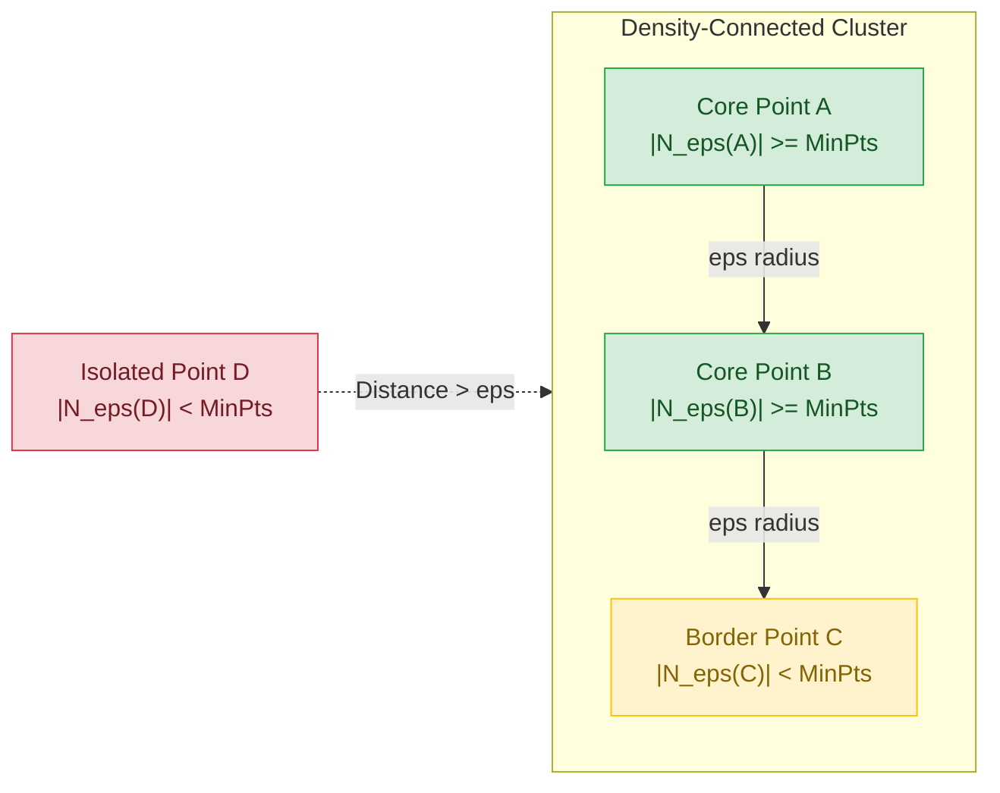
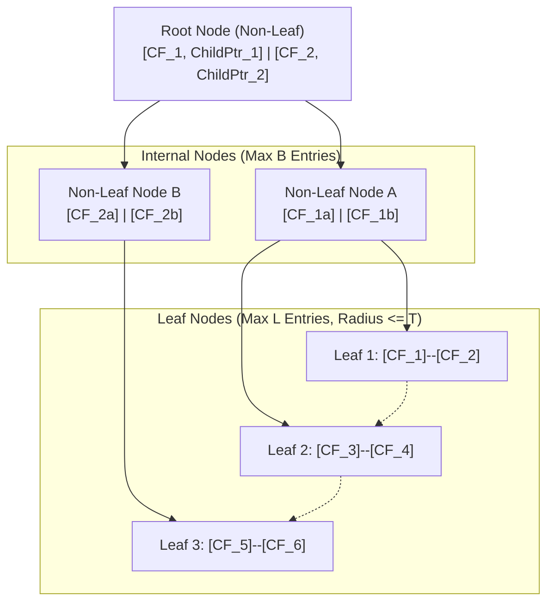

# Week 12: Unsupervised Learning: DBSCAN and BIRCH

## Density-Based and Large-Scale Clustering: DBSCAN and BIRCH

Centroid-based and hierarchical clustering algorithms exhibit structural limitations when processing real-world data: K-Means assumes spherical clusters and remains vulnerable to outliers, while agglomerative hierarchical clustering requires quadratic memory and cubic time complexity. Density-Based Spatial Clustering of Applications with Noise (DBSCAN) and Balanced Iterative Reducing and Clustering using Hierarchies (BIRCH) provide specialized alternatives. While DBSCAN identifies clusters of arbitrary geometric shape and isolates anomalous noise via spatial density thresholds, BIRCH constructs compact in-memory tree summaries to cluster massive streaming datasets in linear time.

## The Density-Based Clustering Paradigm: DBSCAN

### Epsilon Neighborhoods and Minimum Points Criteria

- Formulated by Martin Ester, Hans-Peter Kriegel, Jörg Sander, and Xiaowei Xu (1996), **DBSCAN** defines clusters as continuous regions of high point density separated by regions of low point density.
- The algorithm parameterizes spatial density using two core hyperparameters:
  - **Epsilon ($\epsilon \in \mathbb{R}^+$):** The maximum Euclidean radius defining the spatial neighborhood around any query point $p$:
    $$N_\epsilon(p) = \{q \in \mathcal{D} \mid \|p - q\|_2 \le \epsilon\}$$
  - **Minimum Points ($\text{MinPts} \in \mathbb{Z}^+$):** The minimum cardinality threshold of observations required within the $\epsilon$-neighborhood to establish a dense local region.

### Topological Point Classification: Core, Border, and Noise

- DBSCAN classifies every observation in dataset $\mathcal{D}$ into one of three mutually exclusive topological categories:
  - **Core Points:** Point $p$ is a core point if its $\epsilon$-neighborhood contains at least $\text{MinPts}$ observations (including $p$ itself):
    $$|N_\epsilon(p)| \ge \text{MinPts}$$
    Core points form the internal structural backbone of dense clusters.
  - **Border Points:** Point $p$ is a border point if it is not a core point ($|N_\epsilon(p)| < \text{MinPts}$), but falls within the $\epsilon$-neighborhood of an established core point $q$:
    $$p \in N_\epsilon(q) \quad \text{where } |N_\epsilon(q)| \ge \text{MinPts}$$
    Border points reside on cluster perimeters and do not project density outward.
  - **Noise Points (Outliers):** Point $p$ is a noise point if it is neither a core point nor a border point:
    $$|N_\epsilon(p)| < \text{MinPts} \quad \text{and} \quad p \notin N_\epsilon(q) \; \forall \text{ core points } q$$
    DBSCAN leaves noise points unassigned, isolating anomalies from cluster partitions.

### Density-Reachability Versus Density-Connectivity

- **Directly Density-Reachable:** A point $p$ is directly density-reachable from point $q$ if $p \in N_\epsilon(q)$ and $q$ is a core point. This relation is asymmetric; border points can be directly reachable from core points, but core points cannot be directly reachable from border points.
- **Density-Reachable:** A point $p$ is density-reachable from point $q$ if there exists a sequential chain of points $(p_1, p_2, \dots, p_n)$ where $p_1 = q$, $p_n = p$, and each $p_{i+1}$ is directly density-reachable from $p_i$. Density-reachability is transitive, but asymmetric when involving border points.
- **Density-Connected:** Two points $p$ and $q$ are density-connected if there exists an intermediate point $o$ such that both $p$ and $q$ are density-reachable from $o$. Density-connectivity is **symmetric** and **reflexive**, serving as the formal mathematical condition defining a DBSCAN cluster.

### The DBSCAN Algorithmic Traversal

- A DBSCAN cluster $\mathcal{C}$ is a non-empty subset of $\mathcal{D}$ satisfying two formal criteria:
  - **Maximal Density-Reachability:** $\forall p, q$: if $p \in \mathcal{C}$ and $q$ is density-reachable from $p$, then $q \in \mathcal{C}$.
  - **Mutual Density-Connectivity:** $\forall p, q \in \mathcal{C}$: $p$ is density-connected to $q$.
- **Traversal Loop:** DBSCAN iterates through unvisited points:
  1. Retrieve neighborhood $N_\epsilon(p)$.
  2. If $|N_\epsilon(p)| < \text{MinPts}$, mark $p$ provisionally as noise.
  3. If $|N_\epsilon(p)| \ge \text{MinPts}$, instantiate a new cluster and expand it using a queue-based breadth-first search (BFS), absorbing all directly density-reachable points and reclassifying any assigned noise points as border points.

> [!Important]
> **DBSCAN clusters via density-connectivity**: arbitrary non-convex geometries (such as concentric circles and spirals) merge into unified clusters as long as an unbroken path of core points connects them within radius $\epsilon$.

## DBSCAN Parameter Tuning and Structural Boundaries

### The K-Distance Graph Heuristic for Epsilon Selection

- Selecting $\epsilon$ and $\text{MinPts}$ arbitrarily degrades clustering quality: setting $\epsilon$ too small fragments natural clusters into noise, while setting $\epsilon$ too large merges distinct clusters into a single group.
- **MinPts Rule of Thumb:** Set $\text{MinPts} \ge D + 1$, where $D$ represents feature dimensionality. For noisy or large datasets, set $\text{MinPts} = 2D$.
- **The $k$-Distance Graph:** Identifies optimal $\epsilon$ empirically:
  1. Set $k = \text{MinPts} - 1$.
  2. For every observation in the dataset, compute the Euclidean distance to its $k$-th nearest neighbor ($k$-distance).
  3. Sort all $N$ calculated distances in descending order.
  4. Plot the sorted $k$-distances against their rank index.
  5. Identify the sharp inflection point (the **elbow**): distances below the elbow represent intra-cluster core densities, while points above the elbow represent sparse background noise. The $y$-axis value at the elbow defines the optimal $\epsilon$.

### The Varying Density Dilemma and Dimensionality Breakdown

- **Uniform Density Bottleneck:** DBSCAN applies a single global $\epsilon$ radius across the entire feature space. If a dataset contains multiple valid clusters possessing significantly different local densities, DBSCAN fails:
  - An $\epsilon$ tuned for high-density clusters marks looser, low-density clusters entirely as noise.
  - An $\epsilon$ tuned for low-density clusters merges adjacent high-density clusters together.
  - Mitigating variable density requires hierarchical density extensions, such as **OPTICS** or **HDBSCAN**.
- **Curse of Dimensionality:** In high-dimensional spaces ($D > 20$), distance concentration causes Euclidean metrics to approach uniform values across all points, causing density estimation to collapse.

> [!Tip]
> **Use the k-distance elbow to calibrate epsilon**: plotting sorted distances to the $k$-th nearest neighbor isolates the threshold between dense intra-cluster points and sparse background noise.

## The BIRCH Framework: Linear-Time Streaming Hierarchies

### Memory Bottlenecks in Classical Clustering

- Agglomerative hierarchical clustering scales quadratically in memory ($O(N^2)$), requiring pairwise distance matrices that exceed physical RAM when $N > 50,000$.
- K-Means requires loading the entire dataset into memory for repeated scanning across iterations ($O(I \cdot N \cdot K \cdot D)$).
- Tian Zhang, Raghu Ramakrishnan, and Miron Livny (1996) formulated **BIRCH (Balanced Iterative Reducing and Clustering using Hierarchies)** to cluster massive datasets in a **single linear scan ($O(N)$)** while minimizing I/O operations.

### The Clustering Feature (CF) Vector: Triple Definition

- BIRCH compresses arbitrary-sized subsets of data points into compact, zero-loss statistical summaries called **Clustering Feature (CF) vectors**.
- For a sub-cluster containing $N$ data points $\{x_1, x_2, \dots, x_N\} \subset \mathbb{R}^D$, its Clustering Feature is defined as an ordered triple:
  $$CF = (N, \; \vec{LS}, \; SS)$$
  - **$N \in \mathbb{Z}^+$:** The scalar count of data points contained in the sub-cluster.
  - **$\vec{LS} \in \mathbb{R}^D$:** The **Linear Sum** vector across all points:
    $$\vec{LS} = \sum_{i=1}^N x_i$$
  - **$SS \in \mathbb{R}$:** The scalar **Square Sum** of all point magnitudes:
    $$SS = \sum_{i=1}^N \|x_i\|_2^2 = \sum_{i=1}^N \sum_{d=1}^D x_{id}^2$$

### The Additivity Theorem and Statistical Derivations

- **The Additivity Theorem:** If two disjoint sub-clusters represented by $CF_1 = (N_1, \vec{LS}_1, SS_1)$ and $CF_2 = (N_2, \vec{LS}_2, SS_2)$ merge, the resulting composite cluster's feature vector evaluates as the linear sum of its components:
  $$CF_{\text{merged}} = CF_1 + CF_2 = (N_1 + N_2, \; \vec{LS}_1 + \vec{LS}_2, \; SS_1 + SS_2)$$
- The additivity property allows BIRCH to merge clusters dynamically without re-reading the underlying raw data points from disk.
- Fundamental geometric statistics derive directly from the three entries of a CF vector:
  - **Cluster Centroid Prototype ($\mu \in \mathbb{R}^D$):**
    $$\mu = \frac{\vec{LS}}{N}$$
  - **Cluster Radius ($R \in \mathbb{R}^+$):** The average distance from member points to the centroid:
    $$R = \sqrt{\frac{1}{N} \sum_{i=1}^N \|x_i - \mu\|_2^2} = \sqrt{\frac{SS}{N} - \|\mu\|_2^2} = \sqrt{\frac{SS}{N} - \frac{\|\vec{LS}\|_2^2}{N^2}}$$
  - **Cluster Diameter ($D \in \mathbb{R}^+$):** The average pairwise distance between all points:
    $$D = \sqrt{\frac{1}{N(N-1)} \sum_{i=1}^N \sum_{j=1}^N \|x_i - x_j\|_2^2} = \sqrt{\frac{2 N \cdot SS - 2 \|\vec{LS}\|_2^2}{N(N-1)}}$$

> [!Important]
> **CF vectors compress data additively**: storing only point count $N$, linear sum $\vec{LS}$, and square sum $SS$ allows sub-clusters to merge via simple addition while enabling exact centroid, radius, and diameter calculations.

## The CF-Tree Architecture and Four-Phase Execution

### Structural Organization of the CF-Tree

- A **CF-Tree** is a balanced, height-constrained search tree parameterized by three architectural constants:
  - **Branching Factor ($B$):** The maximum number of child entries allowed in an internal non-leaf node.
  - **Leaf Capacity ($L$):** The maximum number of CF entries allowed in a leaf node.
  - **Threshold ($T$):** The maximum allowable radius ($R \le T$) or diameter ($D \le T$) permitted for any sub-cluster stored in a leaf node.
- **Internal Non-Leaf Nodes:** Store up to $B$ entries of the form $[CF_i, \text{ChildPointer}_i]$, where $CF_i$ represents the additive sum of all clustering features in its underlying sub-tree.
- **Leaf Nodes:** Store up to $L$ leaf entries $[CF_1, CF_2, \dots, CF_L]$, representing dense micro-clusters. Leaf nodes link sequentially via forward and backward pointers, facilitating linear scans.

### Threshold Radius Violations and Dynamic Splitting

- Inserting an incoming point $x$ executes as an in-memory search:
  1. **Hierarchical Traversal:** Descend the tree from the root, selecting the child node whose centroid is closest to $x$ at each non-leaf level.
  2. **Leaf Node Selection:** At the target leaf, identify the closest sub-cluster entry $CF_k$.
  3. **Threshold Check:** Calculate the updated radius $R_{\text{new}}$ of $CF_k + CF_x$.
     - If $R_{\text{new}} \le T$, point $x$ absorbs into $CF_k$, and updated statistics propagate upward to the root.
     - If $R_{\text{new}} > T$, point $x$ initiates a new singleton entry $CF_{\text{new}} = (1, x, \|x\|_2^2)$ within the leaf.
  4. **Node Splitting:** If inserting $CF_{\text{new}}$ exceeds leaf capacity $L$, the leaf splits into two: the two entries separated by the largest distance act as seeds, remaining entries assign to their closest seed, and parent nodes split recursively if branching factor $B$ is exceeded.

### The Four-Phase Computational Lifecycle

- **Phase 1 (Initial In-Memory Tree Construction):** Scans the dataset in a single linear pass ($O(N)$), constructing an initial CF-Tree that fits in physical RAM. If memory fills during processing, $T$ increases automatically, and the tree rebuilds into a more compact form.
- **Phase 2 (Tree Condensation - Optional):** Scans leaf entries to remove sparse, isolated entries (filtering outliers) and rebuilds a smaller tree.
- **Phase 3 (Global Clustering):** Applies an existing clustering algorithm (such as Agglomerative Hierarchical clustering or K-Means) to the compact set of leaf centroids, avoiding the $O(N^2)$ memory bottleneck of clustering raw points.
- **Phase 4 (Cluster Refining - Optional):** Executes an optional final pass using the cluster centers from Phase 3 to reassign raw data points to their nearest prototype, correcting boundary assignments.

> [!Tip]
> **BIRCH bridges streaming scale and hierarchical clustering**: Phase 1 summarizes millions of data points into a compact in-memory CF-Tree in linear time, allowing Phase 3 to run agglomerative hierarchical clustering on leaf centroids without memory exhaustion.

## Comparative Matrix of Advanced Clustering Paradigms

| Dimension | K-Means Clustering | Agglomerative Hierarchical | DBSCAN | BIRCH |
|---|---|---|---|---|
| **Cluster Shape Assumption** | Spherical, convex, equal-variance | Varies by linkage (Ward: spherical; Single: manifold) | **Arbitrary non-convex shapes** (crescents, rings) | Spherical sub-clusters (governed by radius $T$) |
| **Cluster Count $K$ Requirement** | Must be predefined ($K$) | Not required (dendrogram cut) | **Not required** (density-driven) | Not required in Phase 1; chosen in Phase 3 |
| **Computational Time Complexity** | $O(I \cdot N \cdot K \cdot D)$ | $O(N^2 \log N)$ to $O(N^3)$ | $O(N \log N)$ with trees; $O(N^2)$ worst | **$O(N)$ linear pass** (Phase 1) |
| **Memory Space Complexity** | $O(ND + KD)$ | $O(N^2)$ distance matrix | $O(N)$ with spatial indexing | **$O(\text{Tree Size})$** (fits in allocated RAM) |
| **Outlier and Noise Handling** | Distorts centroids (quadratic $L_2$ pull) | Absorbs outliers into branches | **Isolates noise points explicitly** | Filters sparse entries in Phase 2 |
| **Streaming / Out-of-Core Data** | Supported via Mini-Batch | Completely unscalable | Unscalable on streaming data | **Designed for streaming and disk storage** |
| **Sensitive Hyperparameters** | Number of clusters $K$ | Linkage criterion | Radius $\epsilon$ and $\text{MinPts}$ | Threshold $T$ and Branching Factor $B$ |

> [!Important]
> **Select algorithms based on geometric shape and dataset scale**: deploy DBSCAN when clusters exhibit complex non-convex shapes and contain noise, and deploy BIRCH when datasets contain millions of instances that exceed physical memory.

## Key Takeaways

- **DBSCAN clusters data by density connectivity**, identifying dense clusters of arbitrary geometric shape while isolating anomalous noise points.
- **Topological point classification in DBSCAN** labels points as **core** ($|N_\epsilon| \ge \text{MinPts}$), **border** (within $\epsilon$ of a core point), or **noise**.
- **Density-reachability is transitive but asymmetric**, while **density-connectivity is symmetric**, defining cluster membership.
- **The $k$-distance graph identifies optimal $\epsilon$ values** by locating the inflection elbow across sorted nearest-neighbor distances.
- **DBSCAN struggles with variable-density clusters**, as a single global $\epsilon$ cannot separate dense and loose modes concurrently.
- **BIRCH solves hierarchical scaling bottlenecks** by compressing massive datasets into in-memory summary structures using a single linear pass ($O(N)$).
- **The Clustering Feature (CF) vector** stores $(N, \vec{LS}, SS)$, capturing point count, linear sum, and square sum.
- **The Additivity Theorem** allows sub-clusters to merge by adding their summary vectors ($CF_1 + CF_2$), enabling exact centroid and radius updates without reading raw data.
- **The CF-Tree uses threshold $R \le T$ to bound sub-cluster spread**, summarizing millions of points into leaf nodes that can be clustered using standard algorithms in Phase 3.

> [!Tip]
> The defining principle of advanced unsupervised clustering: **geometric density captures arbitrary shape, while statistical summarization enables massive scale**; DBSCAN relies on local density connectivity to separate complex spatial manifolds from noise, while BIRCH uses additive statistical summaries to scale hierarchical clustering to out-of-core streaming datasets.
