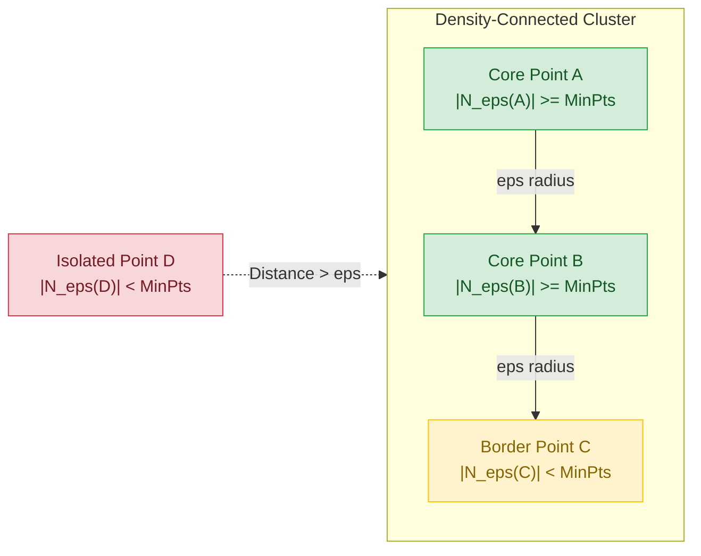

# Migration in progress
# Week 12: Unsupervised Learning: DBSCAN and BIRCH

## Density-Based and Large-Scale Clustering: DBSCAN and BIRCH

Centroid-based and hierarchical clustering algorithms exhibit structural limitations when processing real-world data: K-Means assumes spherical clusters and remains vulnerable to outliers, while agglomerative hierarchical clustering requires quadratic memory and cubic time complexity. Density-Based Spatial Clustering of Applications with Noise (DBSCAN) and Balanced Iterative Reducing and Clustering using Hierarchies (BIRCH) provide specialized alternatives. While DBSCAN identifies clusters of arbitrary geometric shape and isolates anomalous noise via spatial density thresholds, BIRCH constructs compact in-memory tree summaries to cluster massive streaming datasets in linear time.

## The Density-Based Clustering Paradigm: DBSCAN

### Epsilon Neighborhoods and Minimum Points Criteria

- Formulated by Martin Ester, Hans-Peter Kriegel, Jörg Sander, and Xiaowei Xu (1996), **DBSCAN** defines clusters as continuous regions of high point density separated by regions of low point density.
- The algorithm parameterizes spatial density using two core hyperparameters:
  - **Epsilon ($\epsilon \in \mathbb{R}^+$):** The maximum Euclidean radius defining the spatial neighborhood around any query point $p$:
    $$N_\epsilon(p) = \{q \in \mathcal{D} \mid \|p - q\|_2 \le \epsilon\}$$
  - **Minimum Points ($\text{MinPts} \in \mathbb{Z}^+$):** The minimum cardinality threshold of observations required within the $\epsilon$-neighborhood to establish a dense local region.

### Topological Point Classification: Core, Border, and Noise

- DBSCAN classifies every observation in dataset $\mathcal{D}$ into one of three mutually exclusive topological categories:
  - **Core Points:** Point $p$ is a core point if its $\epsilon$-neighborhood contains at least $\text{MinPts}$ observations (including $p$ itself):
    $$|N_\epsilon(p)| \ge \text{MinPts}$$
    Core points form the internal structural backbone of dense clusters.
  - **Border Points:** Point $p$ is a border point if it is not a core point ($|N_\epsilon(p)| < \text{MinPts}$), but falls within the $\epsilon$-neighborhood of an established core point $q$:
    $$p \in N_\epsilon(q) \quad \text{where } |N_\epsilon(q)| \ge \text{MinPts}$$
    Border points reside on cluster perimeters and do not project density outward.
  - **Noise Points (Outliers):** Point $p$ is a noise point if it is neither a core point nor a border point:
    $$|N_\epsilon(p)| < \text{MinPts} \quad \text{and} \quad p \notin N_\epsilon(q) \; \forall \text{ core points } q$$
    DBSCAN leaves noise points unassigned, isolating anomalies from cluster partitions.

### Density-Reachability Versus Density-Connectivity

- **Directly Density-Reachable:** A point $p$ is directly density-reachable from point $q$ if $p \in N_\epsilon(q)$ and $q$ is a core point. This relation is asymmetric; border points can be directly reachable from core points, but core points cannot be directly reachable from border points.
- **Density-Reachable:** A point $p$ is density-reachable from point $q$ if there exists a sequential chain of points $(p_1, p_2, \dots, p_n)$ where $p_1 = q$, $p_n = p$, and each $p_{i+1}$ is directly density-reachable from $p_i$. Density-reachability is transitive, but asymmetric when involving border points.
- **Density-Connected:** Two points $p$ and $q$ are density-connected if there exists an intermediate point $o$ such that both $p$ and $q$ are density-reachable from $o$. Density-connectivity is **symmetric** and **reflexive**, serving as the formal mathematical condition defining a DBSCAN cluster.

### The DBSCAN Algorithmic Traversal

- A DBSCAN cluster $\mathcal{C}$ is a non-empty subset of $\mathcal{D}$ satisfying two formal criteria:
  - **Maximal Density-Reachability:** $\forall p, q$: if $p \in \mathcal{C}$ and $q$ is density-reachable from $p$, then $q \in \mathcal{C}$.
  - **Mutual Density-Connectivity:** $\forall p, q \in \mathcal{C}$: $p$ is density-connected to $q$.
- **Traversal Loop:** DBSCAN iterates through unvisited points:
  1. Retrieve neighborhood $N_\epsilon(p)$.
  2. If $|N_\epsilon(p)| < \text{MinPts}$, mark $p$ provisionally as noise.
  3. If $|N_\epsilon(p)| \ge \text{MinPts}$, instantiate a new cluster and expand it using a queue-based breadth-first search (BFS), absorbing all directly density-reachable points and reclassifying any assigned noise points as border points.

> [!Important]
> **DBSCAN clusters via density-connectivity**: arbitrary non-convex geometries (such as concentric circles and spirals) merge into unified clusters as long as an unbroken path of core points connects them within radius $\epsilon$.

## DBSCAN Parameter Tuning and Structural Boundaries

### The K-Distance Graph Heuristic for Epsilon Selection

- Selecting $\epsilon$ and $\text{MinPts}$ arbitrarily degrades clustering quality: setting $\epsilon$ too small fragments natural clusters into noise, while setting $\epsilon$ too large merges distinct clusters into a single group.
- **MinPts Rule of Thumb:** Set $\text{MinPts} \ge D + 1$, where $D$ represents feature dimensionality. For noisy or large datasets, set $\text{MinPts} = 2D$.
- **The $k$-Distance Graph:** Identifies optimal $\epsilon$ empirically:
  1. Set $k = \text{MinPts} - 1$.
  2. For every observation in the dataset, compute the Euclidean distance to its $k$-th nearest neighbor ($k$-distance).
  3. Sort all $N$ calculated distances in descending order.
  4. Plot the sorted $k$-distances against their rank index.
  5. Identify the sharp inflection point (the **elbow**): distances below the elbow represent intra-cluster core densities, while points above the elbow represent sparse background noise. The $y$-axis value at the elbow defines the optimal $\epsilon$.

### The Varying Density Dilemma and Dimensionality Breakdown

- **Uniform Density Bottleneck:** DBSCAN applies a single global $\epsilon$ radius across the entire feature space. If a dataset contains multiple valid clusters possessing significantly different local densities, DBSCAN fails:
  - An $\epsilon$ tuned for high-density clusters marks looser, low-density clusters entirely as noise.
  - An $\epsilon$ tuned for low-density clusters merges adjacent high-density clusters together.
  - Mitigating variable density requires hierarchical density extensions, such as **OPTICS** or **HDBSCAN**.
- **Curse of Dimensionality:** In high-dimensional spaces ($D > 20$), distance concentration causes Euclidean metrics to approach uniform values across all points, causing density estimation to collapse.

> [!Tip]
> **Use the k-distance elbow to calibrate epsilon**: plotting sorted distances to the $k$-th nearest neighbor isolates the threshold between dense intra-cluster points and sparse background noise.

## The BIRCH Framework: Linear-Time Streaming Hierarchies

### Memory Bottlenecks in Classical Clustering

- Agglomerative hierarchical clustering scales quadratically in memory ($O(N^2)$), requiring pairwise distance matrices that exceed physical RAM when $N > 50,000$.
- K-Means requires loading the entire dataset into memory for repeated scanning across iterations ($O(I \cdot N \cdot K \cdot D)$).
- Tian Zhang, Raghu Ramakrishnan, and Miron Livny (1996) formulated **BIRCH (Balanced Iterative Reducing and Clustering using Hierarchies)** to cluster massive datasets in a **single linear scan ($O(N)$)** while minimizing I/O operations.

### The Clustering Feature (CF) Vector: Triple Definition

- BIRCH compresses arbitrary-sized subsets of data points into compact, zero-loss statistical summaries called **Clustering Feature (CF) vectors**.
- For a sub-cluster containing $N$ data points $\{x_1, x_2, \dots, x_N\} \subset \mathbb{R}^D$, its Clustering Feature is defined as an ordered triple:
  $$CF = (N, \; \vec{LS}, \; SS)$$
  - **$N \in \mathbb{Z}^+$:** The scalar count of data points contained in the sub-cluster.
  - **$\vec{LS} \in \mathbb{R}^D$:** The **Linear Sum** vector across all points:
    $$\vec{LS} =