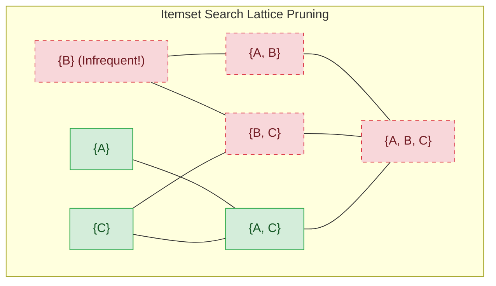
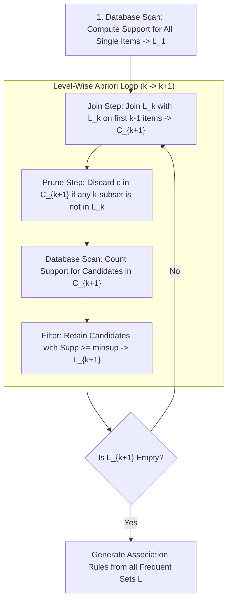

# Lesson 1: Association Rule Mining and the Apriori...

## Association Rule Mining and the Apriori Algorithm

Association Rule Mining discovers non-trivial co-occurrence patterns, correlations, and predictive relationships within large transaction databases without supervision. Originating in retail market basket analysis, the task models relationships of the form $X \implies Y$, identifying items that frequently appear together in customer transactions. Because evaluating all possible combinations across an item universe creates a combinatorial explosion, efficient mining relies on the anti-monotonicity of support. The Apriori algorithm exploits this property to prune search spaces systematically, generating frequent itemsets and reliable association rules through level-wise exploration.

## Problem Formulation and the Combinatorial Challenge

### Transactional Databases and Itemset Lattice Geometry

- Let $\mathcal{I} = \{i_1, i_2, \dots, i_M\}$ denote the **item universe**, representing the set of $M$ distinct discrete items available in a domain.
- A **transaction database** $\mathcal{T} = \{t_1, t_2, \dots, t_N\}$ consists of $N$ unique transaction records, where each transaction $t_n \subseteq \mathcal{I}$ represents an observed subset of items.
- An **itemset** $X \subseteq \mathcal{I}$ is any collection of items; an itemset containing exactly $k$ items is termed a **$k$-itemset**.
- An observation $t_n$ contains an itemset $X$ if and only if $X$ is a subset of the transaction: $X \subseteq t_n$.
- Itemsets organize into a partially ordered set known as an **itemset lattice**, structured hierarchically from the empty set $\emptyset$ at the base to the complete set $\mathcal{I}$ at the apex.

### The Power Set Explosion

- The total number of possible itemset combinations generated from an item universe of cardinality $M$ equals the size of the power set:
  $$|\mathcal{P}(\mathcal{I})| = 2^M$$
- A supermarket inventory containing a modest catalog of $M = 100$ items yields $2^{100} \approx 1.26 \times 10^{30}$ candidate itemsets, rendering brute-force frequency counting computationally impossible.
- An itemset containing $k$ items can generate $2^k - 2$ candidate association rules, creating a secondary combinatorial challenge during rule extraction.

### Rule Syntax and Asymmetric Mapping

- An **association rule** is an implication between two mutually disjoint itemsets:
  $$X \implies Y, \quad \text{where } X, Y \subset \mathcal{I} \text{ and } X \cap Y = \emptyset$$
- **Antecedent ($X$):** The condition or body of the rule, representing the observed prerequisite items.
- **Consequent ($Y$):** The conclusion or head of the rule, representing the predicted co-occurring items.
- Association rules represent empirical correlations rather than causal mechanisms; observing antecedent $X$ increases the conditional likelihood of observing consequent $Y$ within the same transaction.

> [!Important]
> **Association rules express co-occurrence, not causality**: the rule $X \implies Y$ proves that items $X$ and $Y$ appear together with statistically significant frequency, but does not indicate that selecting $X$ causes the selection of $Y$.

## Quantitative Evaluation Metrics

### Support: Evaluating Empirical Frequency

- The **support** of an itemset $X$ quantifies its empirical probability of occurrence across the entire transaction database $\mathcal{T}$:
  $$\text{Supp}(X) = \frac{|\{t \in \mathcal{T} \mid X \subseteq t\}|}{|\mathcal{T}|} = P(X)$$
- The support of an association rule $X \implies Y$ equals the joint probability of both itemsets appearing simultaneously within a single transaction:
  $$\text{Supp}(X \implies Y) = \text{Supp}(X \cup Y) = P(X \cap Y)$$
- Enforcing a **minimum support threshold ($\text{minsup}$)** eliminates rare, idiosyncratic noise patterns, restricting analysis to statistically significant itemsets.

### Confidence: Directional Predictive Reliability

- The **confidence** of a rule $X \implies Y$ measures the conditional probability that a transaction contains consequent $Y$ given that it contains antecedent $X$:
  $$\text{Conf}(X \implies Y) = \frac{\text{Supp}(X \cup Y)}{\text{Supp}(X)} = \frac{P(X \cap Y)}{P(X)} = P(Y \mid X)$$
- Confidence is **asymmetric**: $\text{Conf}(X \implies Y) \neq \text{Conf}(Y \implies X)$ unless both itemsets possess identical support counts ($\text{Supp}(X) = \text{Supp}(Y)$).
- Setting a **minimum confidence threshold ($\text{minconf}$)** ensures that generated rules possess high conditional certainty.

### The Confidence Fallacy and Global Popularity Distortions

- Evaluating rules using only support and confidence often yields misleading inferences when consequent items are globally popular.
- Consider an item $Y$ that appears in 90% of all customer transactions ($P(Y) = 0.90$). For any arbitrary antecedent $X$:
  $$\text{Conf}(X \implies Y) = P(Y \mid X) \approx 0.90$$
- If the baseline probability of purchasing $Y$ without $X$ is 95% ($P(Y \mid \neg X) = 0.95$), purchasing $X$ actually *decreases* the likelihood of purchasing $Y$.
- Confidence fails as a standalone quality metric because it measures only the conditional probability $P(Y \mid X)$ while ignoring the baseline margin $P(Y)$.

### Lift: Quantifying Statistical Dependence

- **Lift** evaluates the ratio of observed joint support to the expected support under statistical independence:
  $$\text{Lift}(X \implies Y) = \frac{P(X \cap Y)}{P(X) P(Y)} = \frac{\text{Conf}(X \implies Y)}{\text{Supp}(Y)} = \frac{\text{Supp}(X \cup Y)}{\text{Supp}(X) \cdot \text{Supp}(Y)}$$
- Lift is **symmetric**: $\text{Lift}(X \implies Y) = \text{Lift}(Y \implies X)$.
- **Interpreting Lift Thresholds:**
  - **$\text{Lift} = 1.0$:** Itemsets $X$ and $Y$ are statistically independent ($P(X \cap Y) = P(X)P(Y)$); the rule provides zero predictive value over chance.
  - **$\text{Lift} > 1.0$:** Itemsets $X$ and $Y$ are **positively correlated**; observing $X$ increases the likelihood of observing $Y$.
  - **$\text{Lift} < 1.0$:** Itemsets $X$ and $Y$ are **negatively correlated** (substitutes); observing $X$ decreases the likelihood of observing $Y$.

### Conviction and Leverage Formulations

- **Conviction:** Measures the ratio of expected frequency of $X$ occurring without $Y$ under statistical independence to the observed frequency of $X$ occurring without $Y$:
  $$\text{Conv}(X \implies Y) = \frac{1 - \text{Supp}(Y)}{1 - \text{Conf}(X \implies Y)} = \frac{P(X) P(\neg Y)}{P(X \cap \neg Y)}$$
  Conviction is directional (asymmetric) and evaluates to infinity when the rule is a deterministic logical implication ($\text{Conf} = 1.0$).
- **Leverage:** Measures the absolute difference between observed joint support and expected support under independence:
  $$\text{Lev}(X \implies Y) = \text{Supp}(X \cup Y) - \text{Supp}(X) \cdot \text{Supp}(Y)$$
  Leverage quantifies the proportion of additional transactions explained by the rule over chance.

> [!Tip]
> **Use Lift to identify true correlation**: high confidence alone can produce misleading rules if the consequent is globally popular; a Lift score exceeding 1.0 confirms that the antecedent genuinely increases the likelihood of the consequent.

## The Apriori Principle and Anti-Monotonicity

### Mathematical Formulation of Support Monotonicity

- Let $X$ and $Y$ represent two itemsets such that $X \subseteq Y$.
- Any transaction $t_n$ containing superset $Y$ must contain subset $X$:
  $$Y \subseteq t_n \implies X \subseteq t_n$$
- The set of transactions containing $Y$ is a subset of the transactions containing $X$:
  $$\{t \in \mathcal{T} \mid Y \subseteq t\} \subseteq \{t \in \mathcal{T} \mid X \subseteq t\}$$
- Dividing by total database cardinality $|\mathcal{T}|$ yields the **monotonicity property of support**:
  $$X \subseteq Y \implies \text{Supp}(X) \ge \text{Supp}(Y)$$
- Adding items to an itemset cannot increase its support; support either decreases or remains constant as itemsets expand.

### The Contrapositive Pruning Mechanism

- Rakesh Agrawal and Ramakrishnan Srikant (1994) formulated the **Apriori Principle** by taking the contrapositive of support monotonicity:
  $$\text{If an itemset } X \text{ is frequent, all of its subsets } s \subseteq X \text{ must also be frequent.}$$
  $$\text{If an itemset } s \text{ is infrequent, all of its supersets } Y \supseteq s \text{ must be infrequent.}$$
- If candidate itemset $\{A, B\}$ fails the minimum support threshold ($\text{Supp}(\{A, B\}) < \text{minsup}$), all higher-order supersets ($\{A, B, C\}, \{A, B, D\}, \dots$) are guaranteed to fail and are pruned immediately without querying the database.

### Lattice Pruning Efficiency

- Pruning infrequent itemsets early eliminates entire exponential sub-lattices.
- If itemset $\{B\}$ is infrequent at level 1, all $2^{M-1}$ supersets containing item $B$ are pruned from consideration, reducing the required candidate search space.

> [!Important]
> **Anti-monotonicity enables candidate pruning**: if any $k$-subset of a candidate itemset is infrequent, the candidate cannot be frequent, allowing Apriori to eliminate entire sub-trees of the search lattice without scanning the database.

## The Apriori Algorithm Mechanics

### Level-Wise Search Strategy

- Apriori executes a level-wise **breadth-first search** across the itemset lattice, discovering all frequent $k$-itemsets ($L_k$) before generating candidate $(k+1)$-itemsets ($C_{k+1}$).
- The algorithm begins at $k=1$, scanning the database to find frequent single items ($L_1$), and iterates sequentially until no further frequent itemsets can be formed.

### Candidate Generation: The Join Step

- To generate candidate $(k+1)$-itemsets $C_{k+1}$, the algorithm performs a self-join on frequent itemsets $L_k$:
  $$C_{k+1} = L_k \bowtie L_k$$
- Items within each itemset are maintained in strict **lexicographical order**.
- Two itemsets $l_1, l_2 \in L_k$ join if and only if they share their first $k - 1$ items and differ only in their final element:
  $$l_1 = \{i_1, i_2, \dots, i_{k-1}, i_k\}$$
  $$l_2 = \{i_1, i_2, \dots, i_{k-1}, i_k'\} \quad \text{where } i_k < i_k'$$
  $$\text{Joined Candidate } c = \{i_1, i_2, \dots, i_{k-1}, i_k, i_k'\}$$
- This joining condition prevents duplicate candidate generation, ensuring every potential $(k+1)$-itemset is generated exactly once.

### Candidate Pruning: The Prune Step

- Before scanning the database to verify candidate support, Apriori filters $C_{k+1}$ using subset validation.
- For each candidate $c \in C_{k+1}$:
  1. Enumerate all possible $k$-subsets of $c$.
  2. Verify whether every $k$-subset exists in the frequent set $L_k$.
  3. If *any* $k$-subset is missing from $L_k$, prune candidate $c$ from $C_{k+1}$ immediately.
- Pruning eliminates candidates that cannot possibly be frequent under the Apriori principle, avoiding unnecessary database counting.

### Database Scanning and Support Counting

- For candidates surviving the prune step, Apriori scans the transaction database $\mathcal{T}$ to compute empirical occurrences.
- To accelerate counting, transactions are mapped into a **hash tree** of candidates.
- Candidates whose support meets or exceeds the threshold form the frequent set:
  $$L_{k+1} = \{c \in C_{k+1} \mid \text{Supp}(c) \ge \text{minsup}\}$$
- The algorithm increments $k \leftarrow k + 1$ and repeats the cycle until $L_{k+1} = \emptyset$.

> [!Tip]
> **The join step enforces lexicographical ordering**: joining itemsets that share their first $k-1$ items generates unique candidate combinations systematically, avoiding duplicate evaluations.

## Generating Association Rules from Frequent Itemsets

### Subset Extraction from Maximal Frequent Sets

- Once all frequent itemsets $L = \bigcup_k L_k$ are mined, association rules are extracted directly from each frequent set without re-scanning the database.
- For every frequent itemset $l \in L_k$ ($k \ge 2$), enumerate all non-empty proper subsets $s \subset l$.
- Form candidate rule $s \implies (l \setminus s)$ and evaluate its confidence:
  $$\text{Conf}(s \implies l \setminus s) = \frac{\text{Supp}(l)}{\text{Supp}(s)}$$
- Because $l$ is a known frequent itemset, both $\text{Supp}(l)$ and $\text{Supp}(s)$ were recorded during earlier Apriori passes, allowing confidence to evaluate via simple division without querying transactions.
- If $\text{Conf} \ge \text{minconf}$, the rule is retained.

### Anti-Monotonicity of Confidence for Fixed Itemsets

- While support is anti-monotonic across the global itemset lattice, **confidence is anti-monotonic with respect to the consequent** for a fixed frequent itemset $l$.
- Let $s' \subset s \subset l$, meaning consequent $s$ is a superset of consequent $s'$.
- Comparing the confidence of rules generating these consequents:
  $$\text{Conf}(l \setminus s \implies s) = \frac{\text{Supp}(l)}{\text{Supp}(l \setminus s)}$$
  $$\text{Conf}(l \setminus s' \implies s') = \frac{\text{Supp}(l)}{\text{Supp}(l \setminus s')}$$
- Because $(l \setminus s) \subset (l \setminus s')$, support monotonicity guarantees that $\text{Supp}(l \setminus s) \ge \text{Supp}(l \setminus s')$.
- Inverting the denominator demonstrates that confidence decreases as the consequent expands:
  $$\text{Conf}(l \setminus s \implies s) \le \text{Conf}(l \setminus s' \implies s')$$
- **Rule Pruning Property:** If a rule $l \setminus s \implies s$ fails the minimum confidence threshold, all rules derived from $l$ with consequents containing supersets of $s$ will also fail and are pruned immediately.

### Computational Bottlenecks and I/O Limitations

- Despite its pruning mechanisms, Apriori suffers from two computational bottlenecks on large datasets:
  - **Repeated Disk Scans:** Identifying frequent itemsets of maximum size $K_{\max}$ requires $K_{\max} + 1$ full scans of database $\mathcal{T}$, creating high I/O overhead on disk-resident databases.
  - **Candidate Explosion:** When the number of frequent 1-itemsets $|L_1|$ is large, candidate generation creates millions of pairs in $C_2$ ($|C_2| \approx \frac{|L_1|^2}{2}$), exhausting memory during intermediate joins.

> [!Important]
> **Confidence is anti-monotonic as consequents expand**: for a fixed itemset $l$, moving items from the antecedent to the consequent decreases confidence, allowing candidate rules with larger consequents to be pruned if a smaller consequent rule fails.

## Comparative Matrix of Rule Evaluation Metrics

| Metric | Governing Mathematical Formulation | Numerical Range | Directional Property | Baseline Threshold | Primary Diagnostic Role | Known Failure Mode |
|---|---|---|---|---|---|---|
| **Support** | $\frac{\text{Count}(X \cup Y)}{N} = P(X \cap Y)$ | $[0.0, \; 1.0]$ | Symmetric | Minimum support ($\text{minsup}$) | Filters out rare, uninformative noise patterns | Discards rare items possessing high predictive value |
| **Confidence** | $\frac{\text{Supp}(X \cup Y)}{\text{Supp}(X)} = P(Y \mid X)$ | $[0.0, \; 1.0]$ | **Asymmetric** | Minimum confidence ($\text{minconf}$) | Measures rule predictive reliability $P(Y \mid X)$ | Misleading when consequent $Y$ is globally popular |
| **Lift** | $\frac{P(X \cap Y)}{P(X) P(Y)} = \frac{\text{Conf}(X \implies Y)}{\text{Supp}(Y)}$ | $[0.0, \; \infty)$ | **Symmetric** | $> 1.0$ (Positive correlation) | Identifies true statistical dependence | Sensitive to rare items with tiny marginal support |
| **Conviction** | $\frac{1 - \text{Supp}(Y)}{1 - \text{Conf}(X \implies Y)} = \frac{P(X)P(\neg Y)}{P(X \cap \neg Y)}$ | $[0.0, \; \infty)$ | **Asymmetric** | $> 1.0$ ($=\infty$ for perfect implication) | Measures directional implication strength | Undefined division by zero when confidence is $1.0$ |
| **Leverage** | $\text{Supp}(X \cup Y) - \text{Supp}(X)\text{Supp}(Y)$ | $[-0.25, \; +0.25]$ | **Symmetric** | $> 0.0$ (Surplus co-occurrence) | Measures absolute transaction lift over chance | Strongly favors globally popular itemsets |

> [!Tip]
> **Combine metrics to isolate quality rules**: support ensures statistical significance, confidence measures directional predictive reliability, and lift verifies that the relationship exceeds random chance.

## Key Takeaways

- **Association Rule Mining extracts unguided patterns** from transactional databases, modeling co-occurrences of the form $X \implies Y$.
- **Combinatorial itemset scaling ($2^M$)** makes brute-force pattern enumeration impossible for large item universes.
- **Support measures joint frequency**, **confidence measures conditional probability**, and **lift measures statistical dependence**.
- **The confidence fallacy** produces misleading rules when consequent items are globally popular; calculating lift confirms genuine positive correlation.
- **The Apriori Principle (anti-monotonicity)** states that all subsets of a frequent itemset must be frequent, allowing algorithms to prune candidate supersets without querying databases.
- **Apriori executes level-wise breadth-first search**, alternating between join steps ($L_k \bowtie L_k$), subset pruning, and database support counting.
- **Lexicographical ordering during candidate joins** ensures that every potential itemset combination is generated exactly once without duplicates.
- **Confidence is anti-monotonic with respect to the rule consequent**, allowing rule pruning when small-consequent rules fail the minimum confidence threshold.
- **Apriori is bottlenecked by repeated disk scans** ($K_{\max} + 1$ passes) and candidate generation explosions on dense datasets.

> [!Tip]
> The foundational rule of association mining: **prune itemset lattices before generating directional rules**; whether pruning candidate itemsets using support anti-monotonicity or pruning candidate rules using confidence anti-monotonicity, scalable mining relies on discarding unpromising combinations early.
