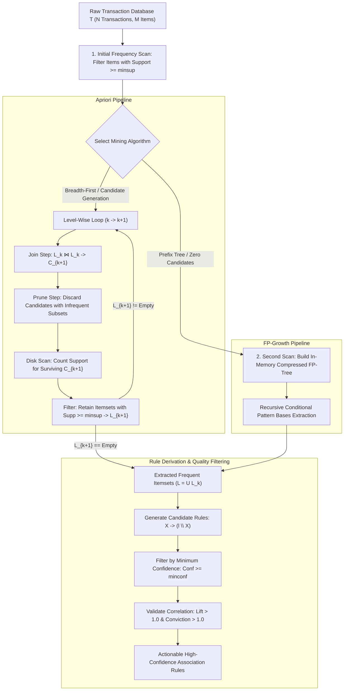

# Migration in progress
# Lesson 2: Summary and Assessment

## Association Rule Mining: Module Summary and Assessment

Association Rule Mining provides the analytical foundation for discovering latent co-occurrences, statistical correlations, and affinity patterns within unannotated transaction databases. Navigating exponential itemset spaces ($2^M$) requires pruning heuristics and compressed data structures that avoid brute-force combinatorial counting. Synthesizing the anti-monotonicity of support, candidate generation in Apriori, in-memory prefix trees in FP-Growth, vertical intersections in ECLAT, and multi-metric validation metrics equips machine learning practitioners to mine actionable rules and avoid spurious statistical artifacts.

## Synthesis of Core Week 13 Foundations

### The Combinatorial Itemset Space and Rule Semantics

- **The itemset lattice:** For an inventory of $M$ unique items, the search space consists of $2^M$ potential itemsets.
- **Rule syntax:** Association rules model directed co-occurrences:
  $$X \implies Y, \quad \text{where } X, Y \subset \mathcal{I} \text{ and } X \cap Y = \emptyset$$
  where $X$ represents the antecedent condition and $Y$ represents the consequent outcome.
- **Empirical correlation versus causality:** Association rules identify statistical co-occurrence within shared transaction windows, not mechanistic causation.

### Metric Triad: Support, Confidence, and Statistical Lift

- **Support ($s$):** Measures the joint probability of all items in a rule appearing together across the database:
  $$\text{Supp}(X \implies Y) = P(X \cap Y) = \frac{\text{Count}(X \cup Y)}{N}$$
  Enforcing a minimum support threshold ($\text{minsup}$) eliminates rare, statistically unrepresentative noise.
- **Confidence ($c$):** Measures the conditional probability that a transaction contains consequent $Y$ given that it contains antecedent $X$:
  $$\text{Conf}(X \implies Y) = P(Y \mid X) = \frac{\text{Supp}(X \cup Y)}{\text{Supp}(X)}$$
- **The Confidence Fallacy:** High confidence alone can yield misleading conclusions if the consequent is globally popular across all transactions ($P(Y) \approx 1.0$).
- **Lift ($L$):** Quantifies statistical dependence by comparing observed joint support to the support expected under statistical independence:
  $$\text{Lift}(X \implies Y) = \frac{P(X \cap Y)}{P(X) P(Y)} = \frac{\text{Conf}(X \implies Y)}{\text{Supp}(Y)}$$
  $\text{Lift} > 1.0$ indicates true positive correlation, $\text{Lift} = 1.0$ indicates statistical independence, and $\text{Lift} < 1.0$ indicates negative correlation (substitutes).

### The Anti-Monotonicity Pruning Imperative

- **The Apriori Principle:** Support is strictly anti-monotonic across the itemset lattice:
  $$\forall X \subseteq Y \implies \text{Supp}(X) \ge \text{Supp}(Y)$$
- **Contrapositive lattice pruning:** If an itemset is infrequent, all of its supersets are guaranteed to be infrequent:
  $$\text{Supp}(s) < \text{minsup} \implies \text{Supp}(X) < \text{minsup} \quad \forall X \supseteq s$$
  This allows search algorithms to discard entire exponential branches of candidate itemsets without querying the database.
- **Confidence anti-monotonicity for fixed itemsets:** For a fixed frequent itemset $l$, transferring items from the antecedent to the consequent decreases confidence, allowing candidate rules with larger consequents to be pruned if a smaller consequent rule fails.

### Beyond Apriori: Prefix Trees and Vertical Intersections

- **FP-Growth (Frequent Pattern Growth):** Resolves Apriori's I/O bottleneck by encoding the database into a compressed in-memory **Frequent Pattern Tree (FP-Tree)** using only **two database scans**. It mines patterns recursively via conditional pattern bases without generating candidate itemsets.
- **ECLAT (Equivalence Class Clustering and Data Transformation):** Inverts transactions into a **vertical data format**, mapping items to Transaction ID lists (TID-lists). Evaluating multi-item support reduces to fast set intersections ($|\text{TID}(A) \cap \text{TID}(B)|$) within a depth-first search.

> [!Tip]
> **Combine Support, Confidence, and Lift**: support filters out rare noise, confidence ensures conditional reliability, and lift confirms that the relationship exceeds random statistical chance.

## The End-to-End Pattern Mining Pipeline

> [!Important]
> **FP-Growth eliminates candidate generation**: encoding transactions into shared prefix trees requires only two database passes, avoiding the repeated disk scans and combinatorial join bottlenecks of Apriori.

## Comprehensive Association Mining Algorithms Matrix

| Dimension | Apriori Algorithm (Agrawal & Srikant) | FP-Growth Algorithm (Han et al.) | ECLAT Algorithm (Zaki) |
|---|---|---|---|
| **Underlying Data Layout** | Horizontal (TID $\to$ Items) | Horizontal $\to$ In-Memory Prefix Tree | **Vertical (Item $\to$ TID-Lists)** |
| **Search Traversal Strategy** | Level-wise Breadth-First Search (BFS) | Recursive Divide-and-Conquer | **Depth-First Search (DFS)** |
| **Database Scans Required** | $K_{\max} + 1$ full disk scans | **Exactly 2 sequential scans** | 1 initial pass to build TID-lists |
| **Candidate Generation Mechanism** | Explicit ($C_{k+1} = L_k \bowtie L_k$ + Subset Pruning) | **Zero candidate generation** | Implicit via TID-list intersections |
| **Memory Consumption** | Low (bounded by $C_k$ per level) | Moderate to High (holds FP-Tree in RAM) | High (long TID-lists consume memory) |
| **Primary Execution Bottleneck** | Repeated disk I/O and candidate explosion | Memory allocation for complex branching trees | Intersecting large, dense TID-lists |
| **Optimal Problem Domain** | Sparse transaction data; small itemsets | Dense data; long frequent patterns | Moderate-sized datasets with fast RAM |

> [!Tip]
> **Deploy FP-Growth for dense data and ECLAT for memory-rich systems**: FP-Growth outperforms Apriori by orders of magnitude on dense transactional data, while ECLAT excels when transaction ID lists fit in memory.

## Assessment Preparation

### Conceptual Review Questions

- **Question 1 (Mathematical Proof of Support Anti-Monotonicity):** Prove that for any two itemsets $X$ and $Y$ where $X \subseteq Y$, the support of $X$ must be greater than or equal to the support of $Y$.
  - *Answer:* Let $\mathcal{T} = \{t_1, t_2, \dots, t_N\}$ denote a database of $N$ transactions. By definition, a transaction $t_n$ supports itemset $Y$ if and only if $Y \subseteq t_n$. Define the set of transaction identifiers supporting $Y$ as $\mathcal{T}_Y = \{t \in \mathcal{T} \mid Y \subseteq t\}$. Because $X \subseteq Y$, any transaction that contains superset $Y$ must contain subset $X$:
    $$Y \subseteq t \implies X \subseteq t$$
    Therefore, the transaction set supporting $Y$ is a subset of the transaction set supporting $X$:
    $$\mathcal{T}_Y \subseteq \mathcal{T}_X$$
    Taking set cardinalities yields:
    $$|\mathcal{T}_Y| \le |\mathcal{T}_X|$$
    Dividing both sides by the total transaction count $N$ yields the formal proof:
    $$\frac{|\mathcal{T}_Y|}{N} \le \frac{|\mathcal{T}_X|}{N} \implies \text{Supp}(Y) \le \text{Supp}(X)$$
- **Question 2 (The Confidence Anti-Monotonicity Property for Fixed Itemsets):** Prove that for a given frequent itemset $l$, moving items from the antecedent to the consequent decreases or maintains rule confidence, and explain how this enables rule pruning.
  - *Answer:* Let $l$ be a frequent itemset, and consider two candidate rules derived from $l$ with consequents $s$ and $s'$, where $s' \subset s \subset l$ (meaning consequent $s$ contains more items than $s'$). The confidence of both rules evaluates as:
    $$\text{Conf}(l \setminus s \implies s) = \frac{\text{Supp}(l)}{\text{Supp}(l \setminus s)}$$
    $$\text{Conf}(l \setminus s' \implies s') = \frac{\text{Supp}(l)}{\text{Supp}(l \setminus s')}$$
    Comparing the antecedents, because $s' \subset s$, it follows that $(l \setminus s) \subset (l \setminus s')$. By the anti-monotonicity of support, the smaller antecedent must have support greater than or equal to the larger antecedent:
    $$\text{Supp}(l \setminus s) \ge \text{Supp}(l \setminus s')$$
    Because $\text{Supp}(l)$ is a constant in the numerator, inverting the denominator reverses the inequality:
    $$\frac{\text{Supp}(l)}{\text{Supp}(l \setminus s)} \le \frac{\text{Supp}(l)}{\text{Supp}(l \setminus s')} \implies \text{Conf}(l \setminus s \implies s) \le \text{Conf}(l \setminus s' \implies s')$$
    Confidence decreases monotonically as items shift to the consequent. If rule $l \setminus s \implies s$ fails the minimum confidence threshold, any rule with a larger consequent $s^* \supset s$ will also fail and is pruned immediately.
- **Question 3 (The Mechanics of the Confidence Fallacy):** Construct an example showing why an association rule with 80% confidence can be misleading and uninformative.
  - *Answer:* Consider a database of 1,000 transactions where tea ($T$) appears in 200 transactions ($\text{Supp}(T) = 0.20$), milk ($M$) appears in 850 transactions ($\text{Supp}(M) = 0.85$), and both appear together in 160 transactions ($\text{Supp}(T \cup M) = 0.16$).
    Evaluating the rule $T \implies M$:
    $$\text{Conf}(T \implies M) = \frac{\text{Supp}(T \cup M)}{\text{Supp}(T)} = \frac{0.16}{0.20} = 0.80 \quad (80\%)$$
    While 80% confidence appears strong, the baseline probability of buying milk across all customers is 85% ($P(M) = 0.85$). Evaluating Lift reveals:
    $$\text{Lift}(T \implies M) = \frac{\text{Conf}(T \implies M)}{\text{Supp}(M)} = \frac{0.80}{0.85} \approx 0.941 < 1.0$$
    Because $\text{Lift} < 1.0$, purchasing tea actually *decreases* the likelihood of purchasing milk by roughly 6%. The rule exhibits high confidence only because milk is globally popular, demonstrating that confidence alone cannot verify positive correlation.
- **Question 4 (Prefix Path Sharing in FP-Trees):** How does the FP-Tree achieve compact in-memory compression of large transaction databases without losing frequency information?
  - *Answer:* The FP-Tree orders items within each transaction in descending order of their global database frequency (the F-List). Transactions sharing identical frequent prefixes merge onto the same root-to-node path in the tree, incrementing node traversal counts rather than allocating duplicate nodes. Highly frequent items appear near the top of the tree, maximizing path sharing across thousands of distinct transactions. Infrequent items ($s < \text{minsup}$) are pruned before insertion, compressing database storage into an in-memory prefix tree while preserving exact count statistics.

### Applied Analytical Scenarios

- **Scenario A (Misleading Promotional Bundling in E-Commerce):** An e-commerce analyst mines checkout logs and discovers the rule $\text{Phone Case} \implies \text{Screen Protector}$ with $