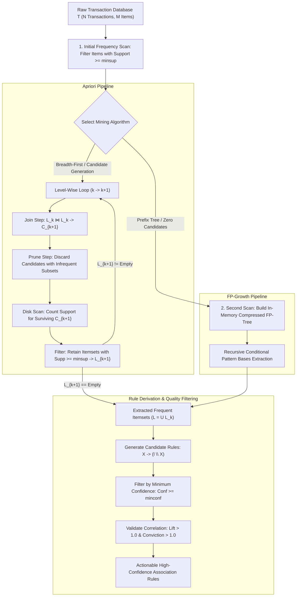

# Lesson 2: Summary and Assessment

## Association Rule Mining: Module Summary and Assessment

Association Rule Mining provides the analytical foundation for discovering latent co-occurrences, statistical correlations, and affinity patterns within unannotated transaction databases. Navigating exponential itemset spaces ($2^M$) requires pruning heuristics and compressed data structures that avoid brute-force combinatorial counting. Synthesizing the anti-monotonicity of support, candidate generation in Apriori, in-memory prefix trees in FP-Growth, vertical intersections in ECLAT, and multi-metric validation metrics equips machine learning practitioners to mine actionable rules and avoid spurious statistical artifacts.

## Synthesis of Core Week 13 Foundations

### The Combinatorial Itemset Space and Rule Semantics

- **The itemset lattice:** For an inventory of $M$ unique items, the search space consists of $2^M$ potential itemsets.
- **Rule syntax:** Association rules model directed co-occurrences:
  $$X \implies Y, \quad \text{where } X, Y \subset \mathcal{I} \text{ and } X \cap Y = \emptyset$$
  where $X$ represents the antecedent condition and $Y$ represents the consequent outcome.
- **Empirical correlation versus causality:** Association rules identify statistical co-occurrence within shared transaction windows, not mechanistic causation.

### Metric Triad: Support, Confidence, and Statistical Lift

- **Support ($s$):** Measures the joint probability of all items in a rule appearing together across the database:
  $$\text{Supp}(X \implies Y) = P(X \cap Y) = \frac{\text{Count}(X \cup Y)}{N}$$
  Enforcing a minimum support threshold ($\text{minsup}$) eliminates rare, statistically unrepresentative noise.
- **Confidence ($c$):** Measures the conditional probability that a transaction contains consequent $Y$ given that it contains antecedent $X$:
  $$\text{Conf}(X \implies Y) = P(Y \mid X) = \frac{\text{Supp}(X \cup Y)}{\text{Supp}(X)}$$
- **The Confidence Fallacy:** High confidence alone can yield misleading conclusions if the consequent is globally popular across all transactions ($P(Y) \approx 1.0$).
- **Lift ($L$):** Quantifies statistical dependence by comparing observed joint support to the support expected under statistical independence:
  $$\text{Lift}(X \implies Y) = \frac{P(X \cap Y)}{P(X) P(Y)} = \frac{\text{Conf}(X \implies Y)}{\text{Supp}(Y)}$$
  $\text{Lift} > 1.0$ indicates true positive correlation, $\text{Lift} = 1.0$ indicates statistical independence, and $\text{Lift} < 1.0$ indicates negative correlation (substitutes).

### The Anti-Monotonicity Pruning Imperative

- **The Apriori Principle:** Support is strictly anti-monotonic across the itemset lattice:
  $$\forall X \subseteq Y \implies \text{Supp}(X) \ge \text{Supp}(Y)$$
- **Contrapositive lattice pruning:** If an itemset is infrequent, all of its supersets are guaranteed to be infrequent:
  $$\text{Supp}(s) < \text{minsup} \implies \text{Supp}(X) < \text{minsup} \quad \forall X \supseteq s$$
  This allows search algorithms to discard entire exponential branches of candidate itemsets without querying the database.
- **Confidence anti-monotonicity for fixed itemsets:** For a fixed frequent itemset $l$, transferring items from the antecedent to the consequent decreases confidence, allowing candidate rules with larger consequents to be pruned if a smaller consequent rule fails.

### Beyond Apriori: Prefix Trees and Vertical Intersections

- **FP-Growth (Frequent Pattern Growth):** Resolves Apriori's I/O bottleneck by encoding the database into a compressed in-memory **Frequent Pattern Tree (FP-Tree)** using only **two database scans**. It mines patterns recursively via conditional pattern bases without generating candidate itemsets.
- **ECLAT (Equivalence Class Clustering and Data Transformation):** Inverts transactions into a **vertical data format**, mapping items to Transaction ID lists (TID-lists). Evaluating multi-item support reduces to fast set intersections ($|\text{TID}(A) \cap \text{TID}(B)|$) within a depth-first search.

> [!Tip]
> **Combine Support, Confidence, and Lift**: support filters out rare noise, confidence ensures conditional reliability, and lift confirms that the relationship exceeds random statistical chance.

## The End-to-End Pattern Mining Pipeline

> [!Important]
> **FP-Growth eliminates candidate generation**: encoding transactions into shared prefix trees requires only two database passes, avoiding the repeated disk scans and combinatorial join bottlenecks of Apriori.

## Comprehensive Association Mining Algorithms Matrix

| Dimension | Apriori Algorithm (Agrawal & Srikant) | FP-Growth Algorithm (Han et al.) | ECLAT Algorithm (Zaki) |
|---|---|---|---|
| **Underlying Data Layout** | Horizontal (TID $\to$ Items) | Horizontal $\to$ In-Memory Prefix Tree | **Vertical (Item $\to$ TID-Lists)** |
| **Search Traversal Strategy** | Level-wise Breadth-First Search (BFS) | Recursive Divide-and-Conquer | **Depth-First Search (DFS)** |
| **Database Scans Required** | $K_{\max} + 1$ full disk scans | **Exactly 2 sequential scans** | 1 initial pass to build TID-lists |
| **Candidate Generation Mechanism** | Explicit ($C_{k+1} = L_k \bowtie L_k$ + Subset Pruning) | **Zero candidate generation** | Implicit via TID-list intersections |
| **Memory Consumption** | Low (bounded by $C_k$ per level) | Moderate to High (holds FP-Tree in RAM) | High (long TID-lists consume memory) |
| **Primary Execution Bottleneck** | Repeated disk I/O and candidate explosion | Memory allocation for complex branching trees | Intersecting large, dense TID-lists |
| **Optimal Problem Domain** | Sparse transaction data; small itemsets | Dense data; long frequent patterns | Moderate-sized datasets with fast RAM |

> [!Tip]
> **Deploy FP-Growth for dense data and ECLAT for memory-rich systems**: FP-Growth outperforms Apriori by orders of magnitude on dense transactional data, while ECLAT excels when transaction ID lists fit in memory.

## Assessment Preparation

### Conceptual Review Questions

- **Question 1 (Mathematical Proof of Support Anti-Monotonicity):** Prove that for any two itemsets $X$ and $Y$ where $X \subseteq Y$, the support of $X$ must be greater than or equal to the support of $Y$.
  - *Answer:* Let $\mathcal{T} = \{t_1, t_2, \dots, t_N\}$ denote a database of $N$ transactions. By definition, a transaction $t_n$ supports itemset $Y$ if and only if $Y \subseteq t_n$. Define the set of transaction identifiers supporting $Y$ as $\mathcal{T}_Y = \{t \in \mathcal{T} \mid Y \subseteq t\}$. Because $X \subseteq Y$, any transaction that contains superset $Y$ must contain subset $X$:
    $$Y \subseteq t \implies X \subseteq t$$
    Therefore, the transaction set supporting $Y$ is a subset of the transaction set supporting $X$:
    $$\mathcal{T}_Y \subseteq \mathcal{T}_X$$
    Taking set cardinalities yields:
    $$|\mathcal{T}_Y| \le |\mathcal{T}_X|$$
    Dividing both sides by the total transaction count $N$ yields the formal proof:
    $$\frac{|\mathcal{T}_Y|}{N} \le \frac{|\mathcal{T}_X|}{N} \implies \text{Supp}(Y) \le \text{Supp}(X)$$
- **Question 2 (The Confidence Anti-Monotonicity Property for Fixed Itemsets):** Prove that for a given frequent itemset $l$, moving items from the antecedent to the consequent decreases or maintains rule confidence, and explain how this enables rule pruning.
  - *Answer:* Let $l$ be a frequent itemset, and consider two candidate rules derived from $l$ with consequents $s$ and $s'$, where $s' \subset s \subset l$ (meaning consequent $s$ contains more items than $s'$). The confidence of both rules evaluates as:
    $$\text{Conf}(l \setminus s \implies s) = \frac{\text{Supp}(l)}{\text{Supp}(l \setminus s)}$$
    $$\text{Conf}(l \setminus s' \implies s') = \frac{\text{Supp}(l)}{\text{Supp}(l \setminus s')}$$
    Comparing the antecedents, because $s' \subset s$, it follows that $(l \setminus s) \subset (l \setminus s')$. By the anti-monotonicity of support, the smaller antecedent must have support greater than or equal to the larger antecedent:
    $$\text{Supp}(l \setminus s) \ge \text{Supp}(l \setminus s')$$
    Because $\text{Supp}(l)$ is a constant in the numerator, inverting the denominator reverses the inequality:
    $$\frac{\text{Supp}(l)}{\text{Supp}(l \setminus s)} \le \frac{\text{Supp}(l)}{\text{Supp}(l \setminus s')} \implies \text{Conf}(l \setminus s \implies s) \le \text{Conf}(l \setminus s' \implies s')$$
    Confidence decreases monotonically as items shift to the consequent. If rule $l \setminus s \implies s$ fails the minimum confidence threshold, any rule with a larger consequent $s^* \supset s$ will also fail and is pruned immediately.
- **Question 3 (The Mechanics of the Confidence Fallacy):** Construct an example showing why an association rule with 80% confidence can be misleading and uninformative.
  - *Answer:* Consider a database of 1,000 transactions where tea ($T$) appears in 200 transactions ($\text{Supp}(T) = 0.20$), milk ($M$) appears in 850 transactions ($\text{Supp}(M) = 0.85$), and both appear together in 160 transactions ($\text{Supp}(T \cup M) = 0.16$).
    Evaluating the rule $T \implies M$:
    $$\text{Conf}(T \implies M) = \frac{\text{Supp}(T \cup M)}{\text{Supp}(T)} = \frac{0.16}{0.20} = 0.80 \quad (80\%)$$
    While 80% confidence appears strong, the baseline probability of buying milk across all customers is 85% ($P(M) = 0.85$). Evaluating Lift reveals:
    $$\text{Lift}(T \implies M) = \frac{\text{Conf}(T \implies M)}{\text{Supp}(M)} = \frac{0.80}{0.85} \approx 0.941 < 1.0$$
    Because $\text{Lift} < 1.0$, purchasing tea actually *decreases* the likelihood of purchasing milk by roughly 6%. The rule exhibits high confidence only because milk is globally popular, demonstrating that confidence alone cannot verify positive correlation.
- **Question 4 (Prefix Path Sharing in FP-Trees):** How does the FP-Tree achieve compact in-memory compression of large transaction databases without losing frequency information?
  - *Answer:* The FP-Tree orders items within each transaction in descending order of their global database frequency (the F-List). Transactions sharing identical frequent prefixes merge onto the same root-to-node path in the tree, incrementing node traversal counts rather than allocating duplicate nodes. Highly frequent items appear near the top of the tree, maximizing path sharing across thousands of distinct transactions. Infrequent items ($s < \text{minsup}$) are pruned before insertion, compressing database storage into an in-memory prefix tree while preserving exact count statistics.

### Applied Analytical Scenarios

- **Scenario A (Misleading Promotional Bundling in E-Commerce):** An e-commerce analyst mines checkout logs and discovers the rule $\text{Phone Case} \implies \text{Screen Protector}$ with $\text{Supp} = 0.05$ and $\text{Conf} = 0.70$. The marketing department launches an expensive cross-promotional campaign based on this 70% confidence. However, campaign sales show no increase over baseline.
  - *Diagnosis:* The analyst fell victim to the confidence fallacy. Screen protectors are purchased frequently across all device orders ($\text{Supp}(\text{Screen Protector}) = 0.75$). Evaluating Lift yields $\text{Lift} = \frac{0.70}{0.75} \approx 0.933 < 1.0$. The items are negatively correlated; customers buying this specific case purchase screen protectors less often than average.
  - *Remedy:* Re-filter all mined rules by enforcing a strict constraint: $\text{Lift}(X \implies Y) > 1.20$ and positive $\text{Leverage} > 0$. This guarantees that promotional bundles target products exhibiting genuine statistical affinity.
- **Scenario B (I/O Bottlenecks on Large Transaction Archives):** A grocery chain attempts to run the Apriori algorithm on 5 million transactions containing 8,000 distinct SKUs with $\text{minsup} = 0.005$. The job runs for 14 hours before failing due to disk thrashing during candidate generation for $C_3$.
  - *Diagnosis:* Apriori requires $K_{\max} + 1$ full scans of the 5-million-row database from disk. Setting a low support threshold on a large catalog caused candidate generation for $C_2$ and $C_3$ to explode into millions of combinations, overwhelming RAM and saturating disk I/O.
  - *Remedy:* Replace Apriori with **FP-Growth**. FP-Growth scans the database only twice, building an in-memory FP-Tree that mines frequent itemsets recursively without generating candidate combinations, reducing processing time from hours to minutes.
- **Scenario C (Mining Rare, High-Value Healthcare Co-Occurrences):** A hospital epidemiology team searches for rare adverse drug interactions. Because adverse reactions occur in fewer than 0.01% of patients, setting a global $\text{minsup} = 0.01$ yields zero rules, while dropping $\text{minsup} = 0.0001$ produces millions of uninformative combinations of common medications.
  - *Diagnosis:* The dataset exhibits a severe **item frequency imbalance**. High-frequency routine medications dominate global support, while rare, high-severity clinical interactions fall below standard support thresholds.
  - *Remedy:* Implement **Multiple Minimum Support (MSApriori)**, assigning lower minimum support thresholds to rare, critical items ($\text{minsup}(\text{adverse reaction}) = 0.0001$) while keeping thresholds high for common drugs. Alternatively, filter candidate rules using **Conviction** or **Fisher's Exact Test** to identify statistically significant rare associations.

> [!Important]
> **Filter rules using statistical independence**: high confidence on globally popular items generates misleading rules; always verify that $\text{Lift} > 1.0$ to ensure positive statistical correlation.

### Self-Assessment Technical Calculations

#### Problem 1: Stepwise Apriori Execution (Join, Prune, and Support Filtering for $C_3$)

A database contains $N = 5$ customer transactions over items $\{A, B, C, D, E\}$:
- $T_1 = \{A, B, C, D\}$
- $T_2 = \{A, B, C, E\}$
- $T_3 = \{A, B, D\}$
- $T_4 = \{B, C, E\}$
- $T_5 = \{A, C, D\}$

The minimum support threshold is $\text{minsup} = 0.40$ (minimum absolute count of 2 transactions).
Prior level-wise execution mined the following set of frequent 2-itemsets:
$$L_2 = \{\{A, B\}, \; \{A, C\}, \; \{A, D\}, \; \{B, C\}, \; \{B, E\}\}$$

1. Execute the **Join Step** ($L_2 \bowtie L_2$) to generate all candidate 3-itemsets $C_3$ using lexicographical ordering.
2. Execute the **Prune Step** using the Apriori Principle, discarding any candidate possessing an infrequent 2-subset.
3. Count the empirical support for surviving candidates across the database and determine the final frequent set $L_3$.

*Stepwise Solution:*
1. Candidate Generation: Join Step ($L_2 \bowtie L_2$):
   - Two itemsets join if they share their first $k-1 = 1$ item:
     - Join $\{A, B\}$ with $\{A, C\} \implies \mathbf{\{A, B, C\}}$
     - Join $\{A, B\}$ with $\{A, D\} \implies \mathbf{\{A, B, D\}}$
     - Join $\{A, C\}$ with $\{A, D\} \implies \mathbf{\{A, C, D\}}$
     - Join $\{B, C\}$ with $\{B, E\} \implies \mathbf{\{B, C, E\}}$
   - Candidate set:
     $$C_3 = \{\{A, B, C\}, \; \{A, B, D\}, \; \{A, C, D\}, \; \{B, C, E\}\}$$

2. Candidate Validation: Prune Step:
   - For each candidate $c \in C_3$, verify that all of its 2-subsets exist in $L_2$:
     - Candidate $\{A, B, C\}$: Subsets are $\{A, B\}, \{A, C\}, \{B, C\}$. All three exist in $L_2$. $\implies \mathbf{Retain}$.
     - Candidate $\{A, B, D\}$: Subsets are $\{A, B\}, \{A, D\}, \{B, D\}$. Subset $\{B, D\} \notin L_2$. $\implies \mathbf{Prune}$.
     - Candidate $\{A, C, D\}$: Subsets are $\{A, C\}, \{A, D\}, \{C, D\}$. Subset $\{C, D\} \notin L_2$. $\implies \mathbf{Prune}$.
     - Candidate $\{B, C, E\}$: Subsets are $\{B, C\}, \{B, E\}, \{C, E\}$. Subset $\{C, E\} \notin L_2$. $\implies \mathbf{Prune}$.
   - Surviving candidates after pruning:
     $$C_3^{\text{pruned}} = \{\{A, B, C\}\}$$

3. Database Scan and Support Counting:
   - Count occurrences of $\{A, B, C\}$ in transactions:
     - $T_1 = \{A, B, C, D\} \implies$ Contains $\{A, B, C\}$ (Count = 1)
     - $T_2 = \{A, B, C, E\} \implies$ Contains $\{A, B, C\}$ (Count = 2)
     - $T_3 = \{A, B, D\} \implies$ Missing $C$
     - $T_4 = \{B, C, E\} \implies$ Missing $A$
     - $T_5 = \{A, C, D\} \implies$ Missing $B$
   - Total count: $2$ out of $5$ transactions.
     $$\text{Supp}(\{A, B, C\}) = \frac{2}{5} = 0.40$$
   - Evaluate against threshold: $0.40 \ge \text{minsup} = 0.40$.
   - Final frequent 3-itemset:
     $$L_3 = \{\{A, B, C\}\}$$

#### Problem 2: Comprehensive Rule Metric Evaluation

A market basket database contains $N = 100$ transactions. A sales log reveals the following empirical frequencies:
- Item $A$ appears in 40 transactions: $\text{Supp}(A) = 0.40$
- Item $B$ appears in 50 transactions: $\text{Supp}(B) = 0.50$
- Both items $A$ and $B$ appear together in 30 transactions: $\text{Supp}(A \cup B) = 0.30$

Evaluate the following metrics for the association rule $A \implies B$:
1. Support ($\text{Supp}$)
2. Confidence ($\text{Conf}$)
3. Lift ($\text{Lift}$)
4. Conviction ($\text{Conv}$)
5. Leverage ($\text{Lev}$)

*Stepwise Solution:*
1. Support Calculation:
   $$\text{Supp}(A \implies B) = \text{Supp}(A \cup B) = \frac{30}{100} = \mathbf{0.30} \quad (30\%)$$
2. Confidence Calculation:
   $$\text{Conf}(A \implies B) = \frac{\text{Supp}(A \cup B)}{\text{Supp}(A)} = \frac{0.30}{0.40} = \mathbf{0.75} \quad (75\%)$$
3. Lift Calculation:
   $$\text{Lift}(A \implies B) = \frac{\text{Supp}(A \cup B)}{\text{Supp}(A) \cdot \text{Supp}(B)} = \frac{0.30}{0.40 \times 0.50} = \frac{0.30}{0.20} = \mathbf{1.50}$$
   Interpretation: Purchasing item $A$ increases the likelihood of purchasing item $B$ by $50\%$ over random chance.
4. Conviction Calculation:
   $$\text{Conv}(A \implies B) = \frac{1 - \text{Supp}(B)}{1 - \text{Conf}(A \implies B)} = \frac{1 - 0.50}{1 - 0.75} = \frac{0.50}{0.25} = \mathbf{2.00}$$
   Interpretation: The rule would be incorrect twice as often if $A$ and $B$ were completely independent.
5. Leverage Calculation:
   $$\text{Lev}(A \implies B) = \text{Supp}(A \cup B) - \text{Supp}(A) \cdot \text{Supp}(B) = 0.30 - (0.40 \times 0.50) = 0.30 - 0.20 = \mathbf{0.10}$$
   Interpretation: The rule accounts for $10\%$ more transactions than would be expected under independence.

#### Problem 3: Rule Generation and Pruning via Confidence Anti-Monotonicity

A frequent 3-itemset $l = \{A, B, C\}$ has empirical support $\text{Supp}(\{A, B, C\}) = 0.30$.
Prior mining extracted the support of all subsets:
- $\text{Supp}(\{A, B\}) = 0.40$
- $\text{Supp}(\{A, C\}) = 0.50$
- $\text{Supp}(\{B, C\}) = 0.60$
- $\text{Supp}(\{A\}) = 0.60$
- $\text{Supp}(\{B\}) = 0.70$
- $\text{Supp}(\{C\}) = 0.80$

The minimum confidence threshold is $\text{minconf} = 0.60$ (60%).

1. Evaluate confidence for all three candidate rules with 1-item consequents ($l \setminus \{i\} \implies \{i\}$).
2. Apply the confidence anti-monotonicity property to identify which candidate rules with 2-item consequents can be pruned without calculation.
3. Evaluate surviving 2-item consequent rules and list the final retained association rules.

*Stepwise Solution:*
1. 1-Item Consequent Rule Evaluations:
   - **Rule 1:** $\{B, C\} \implies A$
     $$\text{Conf}(\{B, C\} \implies A) = \frac{\text{Supp}(\{A, B, C\})}{\text{Supp}(\{B, C\})} = \frac{0.30}{0.60} = \mathbf{0.50} \quad (50\% < 60\% \implies \mathbf{Fails})$$
   - **Rule 2:** $\{A, C\} \implies B$
     $$\text{Conf}(\{A, C\} \implies B) = \frac{\text{Supp}(\{A, B, C\})}{\text{Supp}(\{A, C\})} = \frac{0.30}{0.50} = \mathbf{0.60} \quad (60\% \ge 60\% \implies \mathbf{Valid})$$
   - **Rule 3:** $\{A, B\} \implies C$
     $$\text{Conf}(\{A, B\} \implies C) = \frac{\text{Supp}(\{A, B, C\})}{\text{Supp}(\{A, B\})} = \frac{0.30}{0.40} = \mathbf{0.75} \quad (75\% \ge 60\% \implies \mathbf{Valid})$$

2. Pruning 2-Item Consequent Rules via Anti-Monotonicity:
   - The candidate 2-item consequent rules derived from $l$ are:
     - $\{B\} \implies \{A, C\}$ (consequent contains $A$)
     - $\{C\} \implies \{A, B\}$ (consequent contains $A$)
     - $\{A\} \implies \{B, C\}$ (consequent contains $\{B, C\}$)
   - Because rule $\{B, C\} \implies A$ failed minimum confidence ($\text{Conf} = 0.50 < 0.60$), confidence anti-monotonicity guarantees that any rule whose consequent contains $A$ must also fail ($\text{Conf} \le 0.50$).
   - Prune immediately without calculation:
     - $\{B\} \implies \{A, C\}$ is **Pruned** ($\text{Conf} \le 0.50$).
     - $\{C\} \implies \{A, B\}$ is **Pruned** ($\text{Conf} \le 0.50$).

3. Evaluate Surviving Candidate Rules:
   - The only candidate rule not containing $A$ in its consequent is $\{A\} \implies \{B, C\}$:
     $$\text{Conf}(\{A\} \implies \{B, C\}) = \frac{\text{Supp}(\{A, B, C\})}{\text{Supp}(\{A\})} = \frac{0.30}{0.60} = \mathbf{0.50} \quad (50\% < 60\% \implies \mathbf{Fails})$$
4. Final Retained Association Rules:
   - Exactly two rules satisfy $\text{minconf} \ge 0.60$:
     1. $\mathbf{\{A, C\} \implies B} \quad (\text{Supp} = 0.30, \; \text{Conf} = 0.60)$
     2. $\mathbf{\{A, B\} \implies C} \quad (\text{Supp} = 0.30, \; \text{Conf} = 0.75)$

> [!Tip]
> **Manual calculation confirms algorithmic pruning**: walking through candidate joins, metric equations, and rule confidence verification demonstrates how anti-monotonicity prevents unnecessary database lookups.

## Key Takeaways

- **Association Rule Mining extracts unguided patterns** from transactional databases, modeling co-occurrences of the form $X \implies Y$.
- **Combinatorial itemset scaling ($2^M$)** makes brute-force pattern enumeration impossible for large item universes.
- **Support measures joint frequency**, **confidence measures conditional probability**, and **lift measures statistical dependence**.
- **The confidence fallacy** produces misleading rules when consequent items are globally popular; calculating lift confirms genuine positive correlation.
- **The Apriori Principle (anti-monotonicity)** states that all subsets of a frequent itemset must be frequent, allowing algorithms to prune candidate supersets without querying databases.
- **Apriori executes level-wise breadth-first search**, alternating between join steps ($L_k \bowtie L_k$), subset pruning, and database support counting.
- **Confidence is anti-monotonic with respect to the rule consequent**, allowing rule pruning when small-consequent rules fail the minimum confidence threshold.
- **FP-Growth eliminates candidate generation**, compressing transactions into an in-memory prefix tree using only two database scans and mining patterns via recursive conditional trees.
- **ECLAT uses a vertical data format**, mapping items to transaction ID lists and evaluating joint support through fast set intersections ($|\text{TID}(A) \cap \text{TID}(B)|$).

> [!Tip]
> The foundational rule of association mining: **prune itemset lattices before generating directional rules**; whether pruning candidate itemsets using support anti-monotonicity, compacting into FP-trees, or intersecting vertical TID-lists, scalable mining relies on discarding unpromising combinations early to discover statistically dependable association rules.
