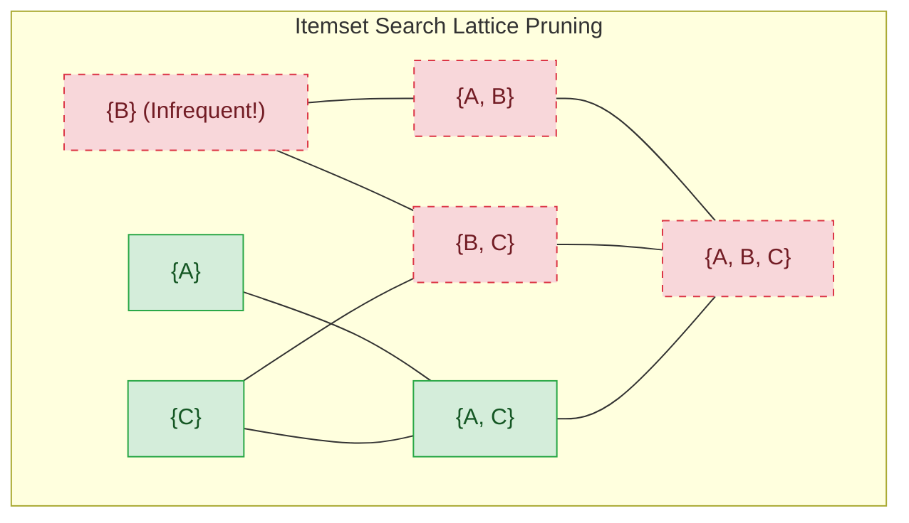

# Migration in progress
# Week 13: Unsupervised Learning: Association Rule Mining

## Unsupervised Learning: Association Rule Mining and Pattern Discovery

Association Rule Mining (ARM) identifies non-trivial co-occurrence patterns, correlations, and predictive relationships within large transaction databases without supervision. Originating in retail market basket analysis to analyze customer purchasing tendencies, association algorithms uncover rules governing items that frequently appear together. Analyzing combinatorial itemset spaces, rule evaluation metrics, the anti-monotonicity of support, candidate generation in Apriori, compressed prefix trees in FP-Growth, and vertical intersections in ECLAT establishes the technical foundation for unsupervised pattern discovery.

## Foundations of Association Rule Mining

### Transactional Databases and Itemset Formalism

- Let $\mathcal{I} = \{i_1, i_2, \dots, i_M\}$ denote a finite set of $M$ distinct categorical symbols, termed the **item universe**.
- A **transaction database** $\mathcal{T} = \{t_1, t_2, \dots, t_N\}$ consists of $N$ unique transaction records, where each transaction $t_n \subseteq \mathcal{I}$ represents an arbitrary subset of items.
- An **itemset** $X \subseteq \mathcal{I}$ is a collection of items; an itemset containing exactly $k$ items is termed a **$k$-itemset**.
- A transaction $t_n$ satisfies or contains an itemset $X$ if and only if $X$ is a subset of the transaction: $X \subseteq t_n$.

### The Combinatorial Explosion of Itemsets and Rules

- For an item universe containing $M$ unique items, the total number of candidate itemsets equals the size of the power set:
  $$|\mathcal{P}(\mathcal{I})| = 2^M$$
- An item universe of modest size ($M = 100$) yields $2^{100} \approx 1.26 \times 10^{30}$ possible itemsets, creating an intractable search space for brute-force frequency counting.
- Once a frequent itemset $Z$ of size $k$ is identified, generating non-trivial binary rules ($X \implies Y$ where $X \subset Z, Y = Z \setminus X$) yields $2^k - 2$ possible rule combinations.

### Rule Syntax: Antecedent and Consequent

- An **association rule** is an implication expression between two disjoint itemsets:
  $$X \implies Y, \quad \text{where } X, Y \subset \mathcal{I} \text{ and } X \cap Y = \emptyset$$
- **Antecedent ($X$):** The condition or body of the rule, representing the observed prerequisite items.
- **Consequent ($Y$):** The result or head of the rule, representing the inferred co-occurring items.
- Association rules represent empirical correlations, not causal relationships: observing itemset $X$ increases the statistical likelihood of observing itemset $Y$ within the same transaction.

> [!Important]
> **Association rules express co-occurrence, not causality**: finding that $X \implies Y$ establishes that items $X$ and $Y$ appear together with statistically significant frequency, but does not indicate that purchasing $X$ causes the purchase of $Y$.

## Quantitative Rule Evaluation Metrics

### Support: Quantifying Statistical Frequency

- The **support** of an itemset $X$ measures its empirical frequency of occurrence across the transaction database $\mathcal{T}$:
  $$\text{Supp}(X) = \frac{|\{t \in \mathcal{T} \mid X \subseteq t\}|}{|\mathcal{T}|} = P(X)$$
- The support of an association rule $X \implies Y$ evaluates the joint probability of both itemsets appearing simultaneously within a single transaction:
  $$\text{Supp}(X \implies Y) = \text{Supp}(X \cup Y) = P(X \cap Y)$$
- Setting a **minimum support threshold ($\text{minsup}$)** filters out rare, idiosyncratic noise patterns, restricting analysis to statistically significant itemsets.

### Confidence: Directional Conditional Probability

- The **confidence** of a rule $X \implies Y$ measures the conditional probability that a transaction contains consequent $Y$ given that it contains antecedent $X$:
  $$\text{Conf}(X \implies Y) = \frac{\text{Supp}(X \cup Y)}{\text{Supp}(X)} = \frac{P(X \cap Y)}{P(X)} = P(Y \mid X)$$
- Confidence is asymmetric: $\text{Conf}(X \implies Y) \neq \text{Conf}(Y \implies X)$ unless $\text{Supp}(X) = \text{Supp}(Y)$.
- Enforcing a **minimum confidence threshold ($\text{minconf}$)** ensures that generated rules possess high predictive certainty.

### The Confidence Fallacy and Misleading Rules

- Relying exclusively on high support and high confidence often extracts misleading or uninformative rules.
- Consider an item $Y$ that appears in 90% of all transactions ($P(Y) = 0.9$). Any arbitrary item $X$ will yield high confidence:
  $$\text{Conf}(X \implies Y) = P(Y \mid X) \approx 0.9$$
- If the baseline probability of purchasing $Y$ without $X$ is 95% ($P(Y \mid \neg X) = 0.95$), purchasing $X$ actually *decreases* the likelihood of purchasing $Y$.
- Confidence fails because it evaluates only the conditional probability $P(Y \mid X)$ while ignoring the baseline margin $P(Y)$.

### Lift: Measuring Statistical Dependence

- **Lift** evaluates the ratio of observed joint support to the expected support under statistical independence:
  $$\text{Lift}(X \implies Y) = \frac{P(X \cap Y)}{P(X) P(Y)} = \frac{\text{Conf}(X \implies Y)}{\text{Supp}(Y)} = \frac{\text{Supp}(X \cup Y)}{\text{Supp}(X) \cdot \text{Supp}(Y)}$$
- Lift is **symmetric**: $\text{Lift}(X \implies Y) = \text{Lift}(Y \implies X)$.
- **Interpreting Lift Values:**
  - **$\text{Lift} = 1.0$:** Itemsets $X$ and $Y$ are statistically independent ($P(X \cap Y) = P(X)P(Y)$); the rule provides zero predictive value.
  - **$\text{Lift} > 1.0$:** Itemsets $X$ and $Y$ are **positively correlated**; the presence of $X$ increases the likelihood of observing $Y$.
  - **$\text{Lift} < 1.0$:** Itemsets $X$ and $Y$ are **negatively correlated** (substitutes); the presence of $X$ decreases the likelihood of observing $Y$.

### Conviction and Leverage Metrics

- **Conviction:** Measures the ratio of expected frequency of $X$ occurring without $Y$ under statistical independence to the observed frequency of $X$ occurring without $Y$:
  $$\text{Conv}(X \implies Y) = \frac{1 - \text{Supp}(Y)}{1 - \text{Conf}(X \implies Y)} = \frac{P(X) P(\neg Y)}{P(X \cap \neg Y)}$$
  Conviction is directional (asymmetric) and evaluates to infinity when the rule is a deterministic logical implication ($\text{Conf} = 1.0$).
- **Leverage:** Measures the absolute difference between observed joint frequency and expected frequency under independence:
  $$\text{Lev}(X \implies Y) = \text{Supp}(X \cup Y) - \text{Supp}(X) \cdot \text{Supp}(Y)$$
  Leverage quantifies the net number of additional transactions explained by the rule over chance.

> [!Tip]
> **Use Lift to identify true correlation**: high confidence alone can produce misleading rules if the consequent is globally popular; a Lift score exceeding 1.0 confirms that the antecedent genuinely increases the likelihood of the consequent.

## The Apriori Algorithm and Anti-Monotonicity

### The Apriori Principle (Anti-Monotonicity of Support)

- Rakesh Agrawal and Ramakrishnan Srikant (1994) introduced the **Apriori Principle**, formalizing the **anti-monotonicity of support**:
  $$\text{If an itemset } X \text{ is frequent, every subset } s \subseteq X \text{ must also be frequent.}$$
- Stating the contrapositive provides the pruning foundation:
  $$\text{If an itemset } s \text{ is infrequent, every superset } X \supseteq s \text{ must be infrequent.}$$
- If candidate itemset $\{A, B\}$ fails the minimum support threshold, all supersets ($\{A, B, C\}, \{A, B, D\}, \dots$) are guaranteed to fail and are pruned immediately without querying the database.

### Level-Wise Search: Join and Prune Steps

- Apriori executes a level-wise breadth-first search across the itemset lattice, discovering frequent $k$-itemsets ($L_k$) before advancing to $(k+1)$-itemsets:
  1. **Candidate Generation ($C_{k+1}$ - Join Step):** Join frequent itemsets in $L_k$ with themselves. Two itemsets $l_1, l_2 \in L_k$ join if they share their first $k - 1$ items in lexicographical order:
     $$l_1 = \{i_1, \dots, i_{k-1}, i_k\}, \quad l_2 = \{i_1, \dots, i_{k-1}, i_k'\} \implies c = \{i_1, \dots, i_{k-1}, i_k, i_k'\}$$
  2. **Candidate Pruning (Prune Step):** For each candidate $c \in C_{k+1}$, check all of its $k$-subsets. If any $k$-subset is not present in $L_k$, prune $c$ from $C_{k+1}$ immediately.
  3. **Database Scan and Support Counting:** Scan the full transaction database $\mathcal{T}$ to compute empirical support for surviving candidates in $C_{k+1}$. Candidates meeting $\text{minsup}$ form $L_{k+1}$.
  4. Repeat until $L_{k+1} = \emptyset$.

### Generating Rules from Frequent Itemsets

- For each frequent itemset $l \in L_k$, generate non-empty subsets $s \subset l$.
- Evaluate rule confidence:
  $$\text{Conf}(s \implies l \setminus s) = \frac{\text{Supp}(l)}{\text{Supp}(s)}$$
- If $\text{Conf} \ge \text{minconf}$, retain the rule.
- Confidence is anti-m