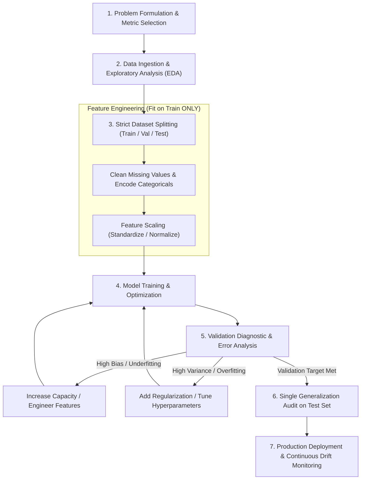
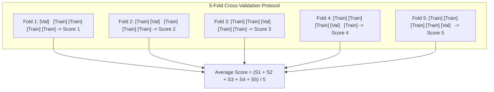
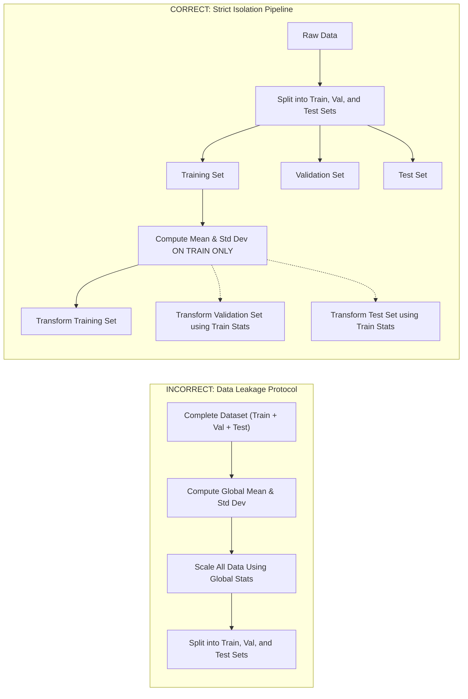

# Lesson 1: Machine Learning Paradigms and Workflow

## Machine Learning Paradigms and Engineering Workflow

Machine learning formalizes the automated extraction of predictive models and latent representations directly from empirical data. Selecting an appropriate learning paradigm establishes the supervisory signal, mathematical objective, and evaluation criteria required to address a specific problem. Structuring projects within a disciplined engineering workflow ensures that feature preprocessing, model selection, hyperparameter tuning, and validation isolation occur without data contamination.

## Formalization of Core Learning Paradigms

### Supervised Learning: Mapping Inputs to Labels

- **Supervised Learning** operates on datasets containing input features paired with verified target outputs:
  $$\mathcal{D}_{\text{train}} = \{(x^{(1)}, y^{(1)}), (x^{(2)}, y^{(2)}), \dots, (x^{(N)}, y^{(N)})\}, \quad x^{(i)} \in \mathcal{X}, \; y^{(i)} \in \mathcal{Y}$$
- The objective is discovering a parameterized function $f: \mathcal{X} \to \mathcal{Y}$ that minimizes the expected empirical risk:
  $$\min_\theta \frac{1}{N} \sum_{i=1}^N \mathcal{L}(f(x^{(i)}; \theta), y^{(i)})$$
- **Regression:** Targets belong to a continuous real-valued space ($\mathcal{Y} \subseteq \mathbb{R}^K$). The model predicts quantities such as temperature, financial asset values, or physical velocities using objective losses like Mean Squared Error (MSE).
- **Classification:** Targets belong to a discrete categorical set ($\mathcal{Y} = \{1, 2, \dots, C\}$). The model predicts discrete class memberships or posterior probabilities using loss functions like Cross-Entropy.

### Unsupervised Learning: Uncovering Latent Structure

- **Unsupervised Learning** operates on unlabeled observations containing only input feature vectors:
  $$\mathcal{D} = \{x^{(1)}, x^{(2)}, \dots, x^{(N)}\}, \quad x^{(i)} \in \mathcal{X}$$
- The objective is estimating the underlying data-generating distribution $P(x)$, identifying dense geometric clusters, or projecting data onto compressed latent manifolds.
- Core tasks include partitional clustering (K-Means), density-based clustering (DBSCAN), hierarchical clustering, dimensionality reduction (PCA, t-SNE), and association rule discovery (Apriori).

### Semi-Supervised and Self-Supervised Formulations

- **Semi-Supervised Learning:** Combines a small set of labeled instances $\mathcal{D}_L = \{(x_l, y_l)\}_{l=1}^{N_L}$ with a large pool of unlabeled instances $\mathcal{D}_U = \{x_u\}_{u=1}^{N_U}$ where $N_U \gg N_L$.
- The unlabeled observations provide structural regularization, guiding decision boundaries through low-density regions in the input space to improve generalization when ground-truth annotation is expensive.
- **Self-Supervised Learning:** Generates supervisory training targets autonomously from the structure of unlabeled data by defining a surrogate **pretext task**.
- The model withholds a portion of the input signal (e.g., masking tokens in a text sequence or occluding patches in an image) and trains to reconstruct the missing component conditioned on the unmasked context.

### Reinforcement Learning and Markov Decision Processes

- **Reinforcement Learning (RL)** frames learning as an active trial-and-error process where an **agent** interacts with an external, uncertain **environment** modeled as a **Markov Decision Process (MDP)**:
  $$\mathcal{M} = (\mathcal{S}, \mathcal{A}, \mathcal{P}, \mathcal{R}, \gamma)$$
- At discrete time step $t$, the agent observes environment state $s_t \in \mathcal{S}$ and selects action $a_t \in \mathcal{A}$ according to its internal **policy** $\pi(a_t \mid s_t)$.
- The environment transitions to a new state $s_{t+1} \sim \mathcal{P}(s_{t+1} \mid s_t, a_t)$ and emits a scalar **reward** $r_{t+1} \in \mathbb{R}$.
- The objective is discovering the optimal policy $\pi^*$ that maximizes the expected cumulative discounted return:
  $$J(\pi) = \mathbb{E}_\pi \left[ \sum_{t=0}^\infty \gamma^t r_{t+1} \right], \quad \gamma \in [0, 1)$$

> [!Important]
> **Supervision format dictates the learning objective**: supervised models minimize empirical label errors, unsupervised models uncover intrinsic geometric structures, self-supervised models solve pretext reconstruction tasks, and reinforcement learning agents optimize cumulative scalar rewards.

## The End-to-End Machine Learning Workflow

### Problem Framing and Objective Alignment

- Project execution begins by translating an abstract business or domain objective into a formal machine learning task ($T$), identifying quantifiable performance metrics ($P$), and auditing data sources ($E$).
- Defining the evaluation metric in advance prevents metric gaming and ensures alignment with business costs (e.g., choosing Area Under the Precision-Recall Curve over Accuracy for imbalanced fraud detection).

### Data Ingestion and Exploratory Data Analysis

- **Exploratory Data Analysis (EDA):** Assesses data distributions, missingness patterns, class balance, outliers, and feature correlations before selecting architectures.
- Visualizing feature distributions reveals skewness that requires logarithmic transformations and identifies high-cardinality categorical features that demand specialized encodings.

### Model Selection, Training, and Iterative Diagnostics

- Establishing a simple, deterministic **baseline model** (such as Logistic Regression or a shallow Decision Tree) provides a lower performance benchmark before deploying complex deep architectures.
- Parameter optimization minimizes empirical training loss while validation tracking diagnoses whether the model occupies an underfitting regime (high bias) or an overfitting regime (high variance).

### Production Deployment and Drift Monitoring

- Deploying a model into production initiates the operational monitoring phase:
  - **Data Drift:** The input distribution changes over time ($P_{\text{train}}(x) \neq P_{\text{production}}(x)$) due to seasonal shifts, sensor degradation, or changing consumer habits.
  - **Concept Drift:** The mathematical mapping connecting inputs to outputs shifts ($P(y \mid x)$ changes), rendering historic parameter weights obsolete.
- Production pipelines require automated alerting systems that monitor inference distributions and trigger scheduled model retraining when drift metrics exceed tolerance limits.

> [!Tip]
> **Establish simple baselines before training complex models**: deploying a linear or tree-based baseline provides an empirical performance floor, verifying that added architectural complexity delivers measurable accuracy gains.

## Dataset Partitioning and Cross-Validation Mechanics

### The Three-Way Partition: Train, Validation, and Test Sets

- Evaluating models on the data used to train parameters yields overfitted, uninformative metrics.
- Empirical datasets divide into three non-overlapping subsets:
  - **Training Set (60% to 80%):** Consumed by optimization algorithms to update model parameters (weights and biases).
  - **Validation Set (10% to 20%):** Evaluated repeatedly during development to compare architectures, guide hyperparameter tuning, and trigger early stopping.
  - **Test Set (10% to 20%):** Held strictly in an uninspected, locked state until model development concludes; it evaluates once to provide an unbiased estimate of generalization error.

### K-Fold and Stratified Cross-Validation

- When dataset size is limited ($N < 50,000$), standard three-way splits reduce training data volume too severely.
- **$K$-Fold Cross-Validation** partitions the non-test data into $K$ equal-sized subsets (folds):
  - The model trains $K$ times; each iteration trains on $K-1$ folds and evaluates on the remaining held-out fold.
  - The final validation score averages the performance across all $K$ validation runs:
    $$\text{Score}_{\text{CV}} = \frac{1}{K} \sum_{k=1}^K \text{Score}_k$$
- **Stratified $K$-Fold Cross-Validation:** Enforces that every individual fold preserves the exact class percentage distribution of the global dataset, preventing class imbalances from creating unrepresentative validation splits.

### Temporal and Group-Based Partitioning Constraints

- **Time-Series Partitioning:** Shuffling sequential or temporal data across random folds causes future information to leak into past predictions. Time-series cross-validation uses **rolling-origin forward chaining**, where validation splits reside strictly in the temporal future relative to training folds.
- **Group-Based Partitioning:** When multiple samples originate from the same subject or entity (such as multiple medical images from one patient), standard random splits allow patient-specific features to appear in both train and validation splits. Grouped splitting guarantees that all observations from a specific subject reside entirely within a single fold.

> [!Important]
> **Use stratified splits for imbalanced classes and temporal splits for time-series**: random data shuffling breaks class balance on skewed categories and causes future-information leakage when evaluating temporal data.

## Data Preprocessing and Leakage Prevention

### Feature Scaling: Standardization Versus Normalization

- Optimization algorithms (gradient descent) and distance-based estimators (KNN, K-Means, SVMs) fail when input attributes possess vastly different numerical ranges.
- **Standardization (Z-Score Scaling):** Rescales features to zero mean ($\mu = 0$) and unit variance ($\sigma = 1$):
  $$x_{\text{std}} = \frac{x - \mu}{\sigma}$$
  Standardization does not bound features to a fixed interval, making it robust against extreme outliers.
- **Min-Max Normalization:** Linearly compresses feature values into a rigid bounded interval, typically $[0, 1]$:
  $$x_{\text{norm}} = \frac{x - x_{\min}}{x_{\max} - x_{\min}}$$
  Normalization is sensitive to outliers, as extreme minimum or maximum values compress the remaining data into tiny sub-intervals.

### Categorical Variable Encodings

- Machine learning algorithms require numerical tensor inputs, necessitating the conversion of discrete symbolic strings:
  - **One-Hot Encoding:** Maps categorical values into binary vectors of length $C$, where only the active category entry evaluates to one. Appropriate for low-cardinality nominal variables lacking intrinsic order (e.g., colors, country names).
  - **Ordinal Encoding:** Maps ordered categories to integer ranks ($0, 1, 2, \dots$). Appropriate when categories possess natural hierarchical order (e.g., education levels, shirt sizes).
  - **Target (Mean) Encoding:** Replaces categorical levels with the average target value observed for that level, effective for high-cardinality variables but susceptible to overfitting without regularization.

### Imputation Strategies for Incomplete Records

- Dropping rows containing missing values discards training data and introduces selection bias if data is not Missing Completely at Random (MCAR).
- **Statistical Imputation:** Fills unobserved entries with simple summary statistics computed from observed training values (median for skewed continuous variables, mode for discrete categories).
- **Model-Based Imputation:** Uses algorithmic estimators (such as K-Nearest Neighbors or iterative multivariate regression) to predict missing attributes based on observed feature relationships.

### The Strict Isolation Boundary Against Data Leakage

- **Data Leakage** occurs when information from the validation or test splits influences preprocessing transformations prior to model training.
- Leakage produces overly optimistic validation scores that collapse when the model deploys to real-world data.
- **The Golden Rule of Machine Learning Pipelines:** All preprocessing parameters (means $\mu$, standard deviations $\sigma$, min/max ranges, imputation values, target encodings) must be calculated strictly from the **training partition**.
- The saved training parameters then apply deterministically to transform validation and test splits without recalculation.

> [!Tip]
> **Fit transformers strictly on the training partition**: never compute scaling parameters or imputation statistics across the entire dataset; calculate metrics on training data and apply those fixed parameters to transform validation and test sets.

## Comparative Matrix of Machine Learning Paradigms

| Learning Paradigm | Supervisory Training Input | Mathematical Objective Formulation | Primary Practical Constraints | Canonical Industrial Tasks | Representative Baseline Algorithms |
|---|---|---|---|---|---|
| **Supervised Learning** | Inputs paired with true target labels: $(x, y)$ | Empirical risk minimization: $\min_\theta \sum \mathcal{L}(f(x), y)$ | Requires extensive ground-truth data annotation | Credit scoring, medical diagnosis, demand forecasting | Linear/Logistic Regression, Random Forests, XGBoost, MLPs |
| **Unsupervised Learning** | Unlabeled feature vectors: $(x)$ | Discover geometric clusters, density, or manifolds | Lacks direct objective evaluation metrics | Customer segmentation, anomaly detection, data compression | K-Means, DBSCAN, PCA, Autoencoders, Isolation Forests |
| **Semi-Supervised Learning** | Sparse labels $(x_l, y_l)$ + vast unlabeled data $(x_u)$ | Joint supervised loss and manifold consistency | Requires smooth class distributions across unlabeled space | Medical image analysis, protein structure prediction | Pseudo-Labeling, Label Propagation, Consistency Regularization |
| **Self-Supervised Learning** | Unlabeled data formatted into pretext tasks | Reconstruct masked inputs or maximize contrastive bounds | Demands high-capacity models and massive compute | Foundational language modeling, visual representation learning | Masked Autoencoders (MAE), BERT, SimCLR, CLIP |
| **Reinforcement Learning** | Environmental state transitions and scalar rewards | Maximize expected cumulative discounted return | Sample inefficient; requires stable simulated environments | Autonomous driving, robotics manipulation, algorithmic trading | Deep Q-Networks (DQN), PPO, Soft Actor-Critic (SAC) |

> [!Important]
> **Select paradigms based on annotation availability**: use supervised learning when clean ground-truth labels exist, deploy self-supervised pretraining when unannotated data is abundant, and choose reinforcement learning when optimizing sequential decision policies in dynamic environments.

## Key Takeaways

- **Machine learning extracts rules from data**, transforming historical observations into predictive parameters through optimization.
- **Supervised learning optimizes against known targets**, dividing into continuous regression and discrete categorical classification.
- **Unsupervised learning uncovers latent geometry**, discovering clusters, manifolds, and co-occurrences without external supervision.
- **Self-supervised learning generates its own supervisory signals**, training foundational models via pretext reconstruction tasks over unlabeled corpora.
- **Reinforcement learning optimizes decision policies** by maximizing cumulative discounted rewards through environmental interaction.
- **A disciplined ML workflow** spans problem framing, exploratory analysis, isolated preprocessing, model training, error diagnostics, and production drift monitoring.
- **Three-way partitioning isolates evaluation**: parameters update on training data, hyperparameters tune on validation data, and generalization audits execute once on held-out test data.
- **Stratified and temporal splits prevent evaluation artifacts** by preserving class proportions and enforcing causal time directionality.
- **Strict preprocessing isolation prevents data leakage**: all transformation statistics (means, ranges, imputation medians) must derive strictly from training partitions.

> [!Tip]
> The foundational principle of machine learning engineering: **rigorous workflow isolation protects generalization integrity**; aligning the learning paradigm with available supervisory signals while isolating validation partitions ensures that empirical optimization produces models that perform reliably in production environments.
