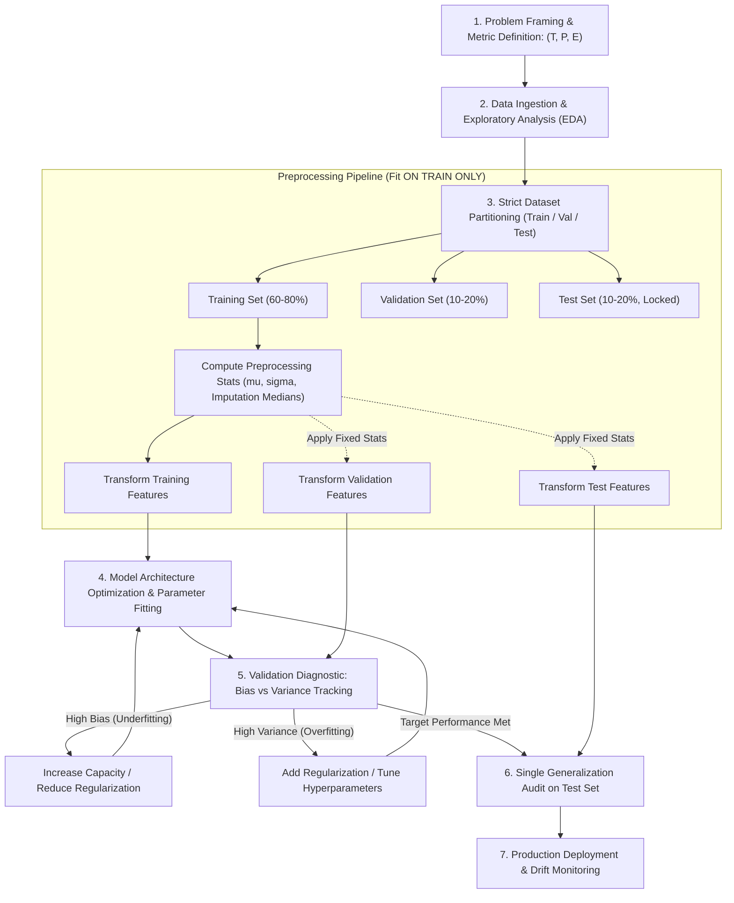

# Migration in progress
# Lesson 2: Summary and Assessment

## Introduction to Machine Learning: Module Summary and Assessment

Machine learning formalizes the automated extraction of predictive models, decision boundaries, and latent data structures directly from empirical observations. By shifting the computational paradigm from handcrafted procedural rules to statistical parameter optimization, machine learning solves high-dimensional tasks that defy manual algorithmic design. Synthesizing the core learning paradigms, Tom Mitchell's operational framework, strict validation protocols, data leakage prevention, and foundational generalization theorems establishes the technical foundation for developing robust predictive pipelines.

## Synthesis of Core Week 1 Foundations

### The Computational Paradigm Shift and Operational Definitions

- **The paradigm shift:** Traditional programming executes deterministic rules on input data to generate outputs ($\text{Data} + \text{Rules} \to \text{Outputs}$). Machine learning receives empirical inputs and observed outputs to discover parameter rules ($\text{Data} + \text{Outputs} \to \text{Rules}$).
- **Tom Mitchell's operational definition:** A computer program learns from **Experience ($E$)** with respect to a class of **Tasks ($T$)** and **Performance Measure ($P$)** if its performance at tasks in $T$, as measured by $P$, improves with experience $E$.
- **Components of the $(T, P, E)$ framework:**
  - *Task ($T$):* The operational objective (e.g., continuous regression, categorical classification, density estimation).
  - *Performance ($P$):* The quantitative evaluation metric (e.g., Mean Squared Error, F1-Score, Area Under the ROC Curve).
  - *Experience ($E$):* The empirical data stream (e.g., labeled feature-target pairs, unannotated continuous vectors, environmental interaction trajectories).

### The Spectrum of Machine Learning Supervision

- **Supervised Learning:** Learns a mapping function $f: \mathcal{X} \to \mathcal{Y}$ from labeled pairs $\mathcal{D} = \{(x^{(i)}, y^{(i)})\}_{i=1}^N$. It divides into **Regression** (predicting continuous real-valued targets $y \in \mathbb{R}$) and **Classification** (predicting discrete categorical targets $y \in \{1, \dots, C\}$).
- **Unsupervised Learning:** Operates on unannotated input feature vectors $\mathcal{D} = \{x^{(i)}\}_{i=1}^N$ to discover latent geometric structure, probability densities, or low-dimensional manifolds (e.g., K-Means, DBSCAN, PCA).
- **Semi-Supervised Learning:** Exploits a small labeled partition $\mathcal{D}_L$ alongside a large unlabeled pool $\mathcal{D}_U$ ($N_U \gg N_L$), using unlabeled data to regularize decision boundaries across low-density regions.
- **Self-Supervised Learning:** Generates supervisory labels autonomously from raw data by defining surrogate pretext tasks (e.g., masked language modeling, image patch inpainting, contrastive representation learning).
- **Reinforcement Learning:** An autonomous agent learns a policy $\pi(a_t \mid s_t)$ in a Markov Decision Process (MDP) by executing actions in an environment to maximize cumulative discounted rewards: $\max_\pi \mathbb{E}[\sum \gamma^t r_t]$.

### Inductive Bias and Generalization Theorems

- **Inductive Bias:** The complete set of prior assumptions, structural preferences, and constraints an algorithm uses to predict outputs for unobserved inputs (e.g., linear relationships in regression, spatial locality in CNNs, temporal persistence in RNNs).
- **The No Free Lunch (NFL) Theorem:** Proves that averaged across all mathematically possible data-generating distributions, no learning algorithm outperforms any other, including uniform random guessing.
- Model success depends on aligning an algorithm's inductive biases with the physical reality of the target domain.

> [!Tip]
> **Inductive bias enables generalization**: without structural preferences that constrain candidate functions, an algorithm cannot predict unseen data points; machine learning engineering is the discipline of matching inductive bias to domain reality.

## The Machine Learning Pipeline and Validation Hygiene

> [!Important]
> **Fit transformers strictly on the training partition**: calculating scaling parameters, imputation statistics, or feature encodings across combined splits causes data leakage, artificially inflating validation scores while degrading production performance.

## Comprehensive Learning Paradigms and Validation Matrix

| Learning Paradigm | Supervisory Signal | Core Mathematical Objective | Data Preprocessing Requirements | Canonical Evaluation Metrics | Primary Failure Mode / Risk |
|---|---|---|---|---|---|
| **Supervised Learning** | Ground-truth labels paired with features: $(x, y)$ | Empirical risk minimization: $\min_\theta \frac{1}{N} \sum \mathcal{L}(f(x), y)$ | Outlier filtering, imputation, feature scaling, label encoding | MSE, MAE, Accuracy, F1-Score, Cross-Entropy Loss | Overfitting on noise; label corruption |
| **Unsupervised Learning** | None; unannotated feature vectors: $(x)$ | Density modeling or geometric compactness: $\min J(R, \mu)$ | Strict feature standardization (Z-score scaling) | WCSS / Inertia, Silhouette Score, Explained Variance | Discovering spurious, non-actionable clusters |
| **Semi-Supervised Learning** | Small labeled subset $(x_l, y_l)$ + large unlabeled pool $(x_u)$ | Supervised loss plus manifold consistency regularization | Joint distribution alignment, pseudo-label thresholding | Standard supervised metrics on held-out test splits | Confirmation bias from propagating false pseudo-labels |
| **Self-Supervised Learning** | Autonomous labels derived from pretext masks | Predict masked components or maximize contrastive similarity | Large-scale tokenization, masking generators, augmentations | Downstream fine-tuning transfer accuracy, linear probe score | Learning trivial shortcut features that fail to transfer |
| **Reinforcement Learning** | Environmental state transitions and scalar rewards: $r_t$ | Maximize expected discounted return: $\mathbb{E}[\sum \gamma^t r_{t+1}]$ | State-space normalization, reward scaling, replay buffers | Cumulative episodic reward, policy stability, win rate | Reward hacking; exploration-exploitation divergence |

> [!Tip]
> **Select learning paradigms based on annotation constraints**: use supervised methods when verified ground truth is abundant, self-supervised pretraining when unlabeled data dominates, and reinforcement learning when optimizing sequential decision policies.

## Assessment Preparation

### Conceptual Review Questions

- **Question 1 (Mathematical Mechanism of Data Leakage):** Prove algebraically how standardizing an entire dataset before partitioning into train and test splits contaminates the training phase and invalidates generalization estimates.
  - *Answer:* Let the complete dataset be $\mathcal{D} = \mathcal{D}_{\text{train}} \cup \mathcal{D}_{\text{test}}$, containing $N = N_{\text{train}} + N_{\text{test}}$ observations. Global standardization computes the dataset-wide mean:
    $$\mu_{\text{global}} = \frac{1}{N} \left( \sum_{i \in \mathcal{D}_{\text{train}}} x_i + \sum_{j \in \mathcal{D}_{\text{test}}} x_j \right) = \frac{N_{\text{train}} \mu_{\text{train}} + N_{\text{test}} \mu_{\text{test}}}{N}$$
    When each training instance is scaled using $\mu_{\text{global}}$ ($x_{\text{scaled}} = \frac{x_i - \mu_{\text{global}}}{\sigma_{\text{global}}}$), every single training feature incorporates information about $\mu_{\text{test}}$ and $\sigma_{\text{test}}$. The model parameters $\theta$ optimized on these inputs implicitly encode distribution properties of the unseen test set. This violates the statistical independence assumption between training data and evaluation data, producing optimistic validation scores that collapse when the model encounters real-world data drawn from a shifted distribution.
- **Question 2 (The Operational Implications of the No Free Lunch Theorem):** Does the No Free Lunch (NFL) theorem imply that comparing algorithms on a benchmark dataset like ImageNet is scientifically meaningless?
  - *Answer:* No. The No Free Lunch theorem assumes a uniform distribution over *all mathematically possible data-generating functions*, including random permutations, white noise, and unlearnable lookup tables. In the physical universe, real-world data distributions occupy a tiny, highly structured fraction of this universe characterized by physics, temporal continuity, and spatial coherence. Benchmarking on ImageNet is valid because it evaluates algorithms on the specific class of natural image distributions. The NFL theorem proves that an algorithm outperforms others on ImageNet only because its **inductive biases** (such as translation equivariance in CNNs) match the visual domain, which trades off performance on unaligned domains like encrypted text strings.
- **Question 3 (Stratified Splitting Necessity in Imbalanced Datasets):** Why is standard uniform random splitting hazardous when evaluating classification performance on rare disease datasets with a 99:1 class imbalance?
  - *Answer:* Consider a dataset of 1,000 observations containing 10 positive cases (1%) and 990 negative cases (99%). Under a standard random 80/20 train/test split, the test partition contains 200 samples. The probability distribution of positive cases in the test set follows a hypergeometric distribution. By chance, the test set could capture only 0 or 1 positive case, making the empirical test positive rate 0% or 0.5%. Conversely, the training set would contain 9 or 10 positive cases. Evaluating a model on a test set containing almost no minority instances prevents reliable calculation of Precision, Recall, and F1-Score. **Stratified splitting** enforces exact class proportions across all partitions, guaranteeing that the training set retains exactly 8 positive cases (1%) and the test set retains exactly 2 positive cases (1%).
- **Question 4 (Tom Mitchell's Framework Applied to Language Modeling):** Formalize an autoregressive Large Language Model (such as GPT) using Tom Mitchell's $(T, P, E)$ framework.
  - *Answer:*
    - **Task ($T$):** Predict the next discrete token $w_t \in \mathcal{V}$ conditioned on an antecedent token context sequence $(w_1, \dots, w_{t-1})$.
    - **Performance Measure ($P$):** Perplexity ($\text{PPL} = \exp(\mathcal{L}_{\text{CE}})$) or cross-entropy loss evaluated on an uninspected, held-out validation corpus.
    - **Experience ($E$):** Exposure to massive text corpora comprising billions of self-supervised token sequences during pretraining.

### Applied Analytical Scenarios

- **Scenario A (Production Collapse Due to Feature Leakage in Fraud Detection):** A fintech data science team trains a Gradient Boosted Decision Tree to predict credit card transaction fraud. During cross-validation, the model achieves an extraordinary Area Under the ROC Curve of 0.994. Upon deploying the model to live production transactions, the true AUC collapses to 0.582, barely outperforming random chance.
  - *Diagnosis:* The pipeline suffered from **target leakage**. Inspecting the raw data schema reveals a feature named `chargeback_status_updated`. When a transaction i