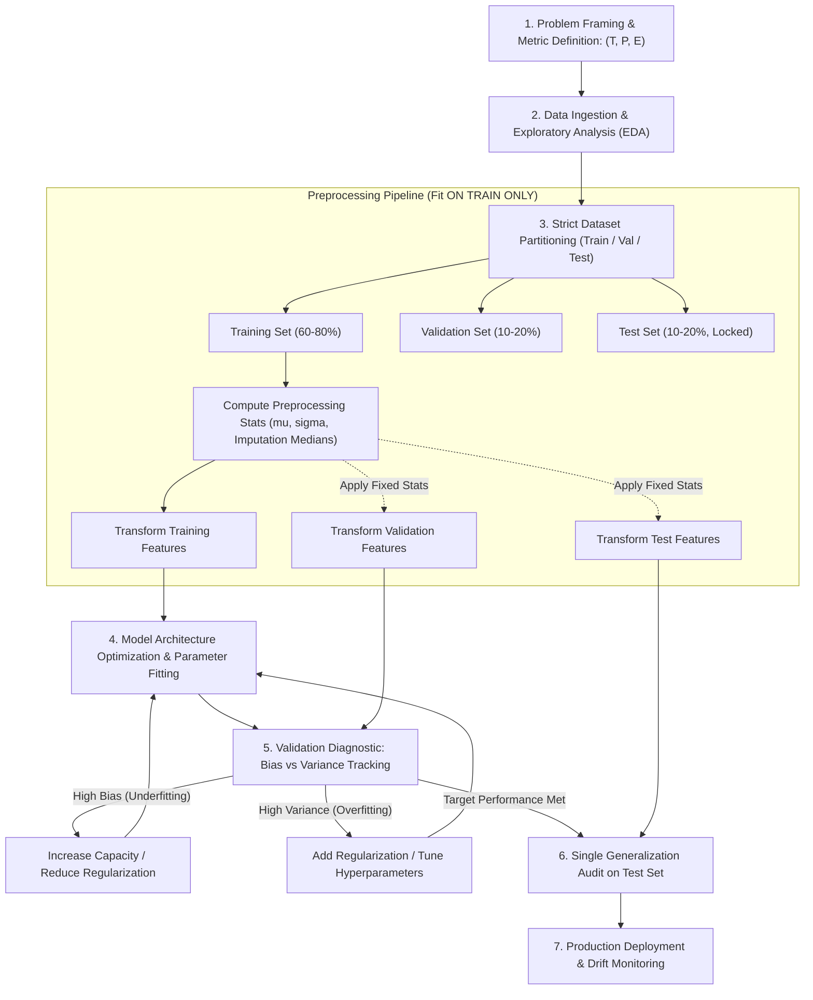

# Lesson 2: Summary and Assessment

## Introduction to Machine Learning: Module Summary and Assessment

Machine learning formalizes the automated extraction of predictive models, decision boundaries, and latent data structures directly from empirical observations. By shifting the computational paradigm from handcrafted procedural rules to statistical parameter optimization, machine learning solves high-dimensional tasks that defy manual algorithmic design. Synthesizing the core learning paradigms, Tom Mitchell's operational framework, strict validation protocols, data leakage prevention, and foundational generalization theorems establishes the technical foundation for developing robust predictive pipelines.

## Synthesis of Core Week 1 Foundations

### The Computational Paradigm Shift and Operational Definitions

- **The paradigm shift:** Traditional programming executes deterministic rules on input data to generate outputs ($\text{Data} + \text{Rules} \to \text{Outputs}$). Machine learning receives empirical inputs and observed outputs to discover parameter rules ($\text{Data} + \text{Outputs} \to \text{Rules}$).
- **Tom Mitchell's operational definition:** A computer program learns from **Experience ($E$)** with respect to a class of **Tasks ($T$)** and **Performance Measure ($P$)** if its performance at tasks in $T$, as measured by $P$, improves with experience $E$.
- **Components of the $(T, P, E)$ framework:**
  - *Task ($T$):* The operational objective (e.g., continuous regression, categorical classification, density estimation).
  - *Performance ($P$):* The quantitative evaluation metric (e.g., Mean Squared Error, F1-Score, Area Under the ROC Curve).
  - *Experience ($E$):* The empirical data stream (e.g., labeled feature-target pairs, unannotated continuous vectors, environmental interaction trajectories).

### The Spectrum of Machine Learning Supervision

- **Supervised Learning:** Learns a mapping function $f: \mathcal{X} \to \mathcal{Y}$ from labeled pairs $\mathcal{D} = \{(x^{(i)}, y^{(i)})\}_{i=1}^N$. It divides into **Regression** (predicting continuous real-valued targets $y \in \mathbb{R}$) and **Classification** (predicting discrete categorical targets $y \in \{1, \dots, C\}$).
- **Unsupervised Learning:** Operates on unannotated input feature vectors $\mathcal{D} = \{x^{(i)}\}_{i=1}^N$ to discover latent geometric structure, probability densities, or low-dimensional manifolds (e.g., K-Means, DBSCAN, PCA).
- **Semi-Supervised Learning:** Exploits a small labeled partition $\mathcal{D}_L$ alongside a large unlabeled pool $\mathcal{D}_U$ ($N_U \gg N_L$), using unlabeled data to regularize decision boundaries across low-density regions.
- **Self-Supervised Learning:** Generates supervisory labels autonomously from raw data by defining surrogate pretext tasks (e.g., masked language modeling, image patch inpainting, contrastive representation learning).
- **Reinforcement Learning:** An autonomous agent learns a policy $\pi(a_t \mid s_t)$ in a Markov Decision Process (MDP) by executing actions in an environment to maximize cumulative discounted rewards: $\max_\pi \mathbb{E}[\sum \gamma^t r_t]$.

### Inductive Bias and Generalization Theorems

- **Inductive Bias:** The complete set of prior assumptions, structural preferences, and constraints an algorithm uses to predict outputs for unobserved inputs (e.g., linear relationships in regression, spatial locality in CNNs, temporal persistence in RNNs).
- **The No Free Lunch (NFL) Theorem:** Proves that averaged across all mathematically possible data-generating distributions, no learning algorithm outperforms any other, including uniform random guessing.
- Model success depends on aligning an algorithm's inductive biases with the physical reality of the target domain.

> [!Tip]
> **Inductive bias enables generalization**: without structural preferences that constrain candidate functions, an algorithm cannot predict unseen data points; machine learning engineering is the discipline of matching inductive bias to domain reality.

## The Machine Learning Pipeline and Validation Hygiene

> [!Important]
> **Fit transformers strictly on the training partition**: calculating scaling parameters, imputation statistics, or feature encodings across combined splits causes data leakage, artificially inflating validation scores while degrading production performance.

## Comprehensive Learning Paradigms and Validation Matrix

| Learning Paradigm | Supervisory Signal | Core Mathematical Objective | Data Preprocessing Requirements | Canonical Evaluation Metrics | Primary Failure Mode / Risk |
|---|---|---|---|---|---|
| **Supervised Learning** | Ground-truth labels paired with features: $(x, y)$ | Empirical risk minimization: $\min_\theta \frac{1}{N} \sum \mathcal{L}(f(x), y)$ | Outlier filtering, imputation, feature scaling, label encoding | MSE, MAE, Accuracy, F1-Score, Cross-Entropy Loss | Overfitting on noise; label corruption |
| **Unsupervised Learning** | None; unannotated feature vectors: $(x)$ | Density modeling or geometric compactness: $\min J(R, \mu)$ | Strict feature standardization (Z-score scaling) | WCSS / Inertia, Silhouette Score, Explained Variance | Discovering spurious, non-actionable clusters |
| **Semi-Supervised Learning** | Small labeled subset $(x_l, y_l)$ + large unlabeled pool $(x_u)$ | Supervised loss plus manifold consistency regularization | Joint distribution alignment, pseudo-label thresholding | Standard supervised metrics on held-out test splits | Confirmation bias from propagating false pseudo-labels |
| **Self-Supervised Learning** | Autonomous labels derived from pretext masks | Predict masked components or maximize contrastive similarity | Large-scale tokenization, masking generators, augmentations | Downstream fine-tuning transfer accuracy, linear probe score | Learning trivial shortcut features that fail to transfer |
| **Reinforcement Learning** | Environmental state transitions and scalar rewards: $r_t$ | Maximize expected discounted return: $\mathbb{E}[\sum \gamma^t r_{t+1}]$ | State-space normalization, reward scaling, replay buffers | Cumulative episodic reward, policy stability, win rate | Reward hacking; exploration-exploitation divergence |

> [!Tip]
> **Select learning paradigms based on annotation constraints**: use supervised methods when verified ground truth is abundant, self-supervised pretraining when unlabeled data dominates, and reinforcement learning when optimizing sequential decision policies.

## Assessment Preparation

### Conceptual Review Questions

- **Question 1 (Mathematical Mechanism of Data Leakage):** Prove algebraically how standardizing an entire dataset before partitioning into train and test splits contaminates the training phase and invalidates generalization estimates.
  - *Answer:* Let the complete dataset be $\mathcal{D} = \mathcal{D}_{\text{train}} \cup \mathcal{D}_{\text{test}}$, containing $N = N_{\text{train}} + N_{\text{test}}$ observations. Global standardization computes the dataset-wide mean:
    $$\mu_{\text{global}} = \frac{1}{N} \left( \sum_{i \in \mathcal{D}_{\text{train}}} x_i + \sum_{j \in \mathcal{D}_{\text{test}}} x_j \right) = \frac{N_{\text{train}} \mu_{\text{train}} + N_{\text{test}} \mu_{\text{test}}}{N}$$
    When each training instance is scaled using $\mu_{\text{global}}$ ($x_{\text{scaled}} = \frac{x_i - \mu_{\text{global}}}{\sigma_{\text{global}}}$), every single training feature incorporates information about $\mu_{\text{test}}$ and $\sigma_{\text{test}}$. The model parameters $\theta$ optimized on these inputs implicitly encode distribution properties of the unseen test set. This violates the statistical independence assumption between training data and evaluation data, producing optimistic validation scores that collapse when the model encounters real-world data drawn from a shifted distribution.
- **Question 2 (The Operational Implications of the No Free Lunch Theorem):** Does the No Free Lunch (NFL) theorem imply that comparing algorithms on a benchmark dataset like ImageNet is scientifically meaningless?
  - *Answer:* No. The No Free Lunch theorem assumes a uniform distribution over *all mathematically possible data-generating functions*, including random permutations, white noise, and unlearnable lookup tables. In the physical universe, real-world data distributions occupy a tiny, highly structured fraction of this universe characterized by physics, temporal continuity, and spatial coherence. Benchmarking on ImageNet is valid because it evaluates algorithms on the specific class of natural image distributions. The NFL theorem proves that an algorithm outperforms others on ImageNet only because its **inductive biases** (such as translation equivariance in CNNs) match the visual domain, which trades off performance on unaligned domains like encrypted text strings.
- **Question 3 (Stratified Splitting Necessity in Imbalanced Datasets):** Why is standard uniform random splitting hazardous when evaluating classification performance on rare disease datasets with a 99:1 class imbalance?
  - *Answer:* Consider a dataset of 1,000 observations containing 10 positive cases (1%) and 990 negative cases (99%). Under a standard random 80/20 train/test split, the test partition contains 200 samples. The probability distribution of positive cases in the test set follows a hypergeometric distribution. By chance, the test set could capture only 0 or 1 positive case, making the empirical test positive rate 0% or 0.5%. Conversely, the training set would contain 9 or 10 positive cases. Evaluating a model on a test set containing almost no minority instances prevents reliable calculation of Precision, Recall, and F1-Score. **Stratified splitting** enforces exact class proportions across all partitions, guaranteeing that the training set retains exactly 8 positive cases (1%) and the test set retains exactly 2 positive cases (1%).
- **Question 4 (Tom Mitchell's Framework Applied to Language Modeling):** Formalize an autoregressive Large Language Model (such as GPT) using Tom Mitchell's $(T, P, E)$ framework.
  - *Answer:*
    - **Task ($T$):** Predict the next discrete token $w_t \in \mathcal{V}$ conditioned on an antecedent token context sequence $(w_1, \dots, w_{t-1})$.
    - **Performance Measure ($P$):** Perplexity ($\text{PPL} = \exp(\mathcal{L}_{\text{CE}})$) or cross-entropy loss evaluated on an uninspected, held-out validation corpus.
    - **Experience ($E$):** Exposure to massive text corpora comprising billions of self-supervised token sequences during pretraining.

### Applied Analytical Scenarios

- **Scenario A (Production Collapse Due to Feature Leakage in Fraud Detection):** A fintech data science team trains a Gradient Boosted Decision Tree to predict credit card transaction fraud. During cross-validation, the model achieves an extraordinary Area Under the ROC Curve of 0.994. Upon deploying the model to live production transactions, the true AUC collapses to 0.582, barely outperforming random chance.
  - *Diagnosis:* The pipeline suffered from **target leakage**. Inspecting the raw data schema reveals a feature named `chargeback_status_updated`. When a transaction is confirmed fraudulent, customer service logs update this field. While historical training records contained this post-fraud feature, live production transactions at the moment of authorization do not yet have this field populated, rendering the model useless.
  - *Remedy:* Reconstruct the training pipeline to enforce strict **point-in-time correctness**. Discard all features generated after the exact timestamp of transaction authorization. Audit feature importance metrics; any feature exhibiting disproportionate predictive power (e.g., explaining >90% of model variance) must be evaluated for temporal contamination.
- **Scenario B (Temporal Contamination in High-Frequency Algorithmic Trading):** A quantitative analyst develops an equity price direction forecasting model using a 10-fold cross-validation scheme where transactions are randomly shuffled across folds. The model shows consistent profitability in backtesting, but loses capital immediately upon live execution.
  - *Diagnosis:* The analyst used **randomized cross-validation on time-series data**, creating severe future-information leakage. Random shuffling allowed the model to train on market features from Wednesday, validate on Tuesday, and train on Thursday. In financial time series, prices exhibit auto-correlation and volatility clustering; training on future prices allowed the model to interpolate past states rather than learning predictive signals.
  - *Remedy:* Prohibit random shuffling on temporal datasets. Transition to **rolling-origin forward chaining (TimeSeriesSplit)**. In this protocol, training sets consist exclusively of historical records preceding the validation fold in time ($t_{\text{train}} < t_{\text{val}}$), preserving causal temporal directionality.
- **Scenario C (Unscaled Distance Collapse in Healthcare Patient Segmentation):** A hospital research team clusters patient health profiles using K-Means clustering. The feature set contains `Annual_Income` (ranging from \$15,000 to \$350,000) and `Blood_Pressure_Ratio` (ranging from 0.70 to 1.45). The resulting clusters reflect annual income brackets, showing zero correlation with cardiovascular health metrics.
  - *Diagnosis:* K-Means calculates squared Euclidean distance: $\|x - \mu\|_2^2 = \sum (x_d - \mu_d)^2$. Because `Annual_Income` exhibits a numerical scale six orders of magnitude larger than `Blood_Pressure_Ratio`, income differences dominate distance calculations, reducing the blood pressure ratio to negligible noise.
  - *Remedy:* Implement feature standardization via **Z-score scaling** ($x_{\text{scaled}} = \frac{x - \mu}{\sigma}$) prior to clustering. This centers both features to zero mean and unit variance, ensuring that clinical cardiovascular indicators contribute equally with demographic variables during Euclidean distance calculations.

> [!Important]
> **Enforce point-in-time correctness and temporal splitting**: target leakage and time-series shuffling produce artificially inflated validation scores; verify that input features reflect strictly pre-event data states and that validation sets reside in the temporal future.

### Self-Assessment Technical Calculations

#### Problem 1: Feature Standardization and Leakage-Free Test Transformation

A continuous numerical attribute has the following observed values in a partitioned dataset:
- Training Partition: $X_{\text{train}} = [10.0, \; 20.0, \; 30.0, \; 40.0, \; 50.0]^T$
- Held-Out Test Partition: $X_{\text{test}} = [15.0, \; 60.0]^T$

1. Compute the sample mean $\mu_{\text{train}}$ and population standard deviation $\sigma_{\text{train}}$ strictly from the training partition.
2. Standardize the training partition: $Z_{\text{train}}$.
3. Using strictly the training partition parameters, transform the held-out test partition: $Z_{\text{test}}$.
4. Calculate the contaminated global mean $\mu_{\text{global}}$ that would have resulted from data leakage, and explain the numerical discrepancy.

*Stepwise Solution:*
1. Training Statistics Calculation:
   - Compute training sample mean:
     $$\mu_{\text{train}} = \frac{1}{N_{\text{train}}} \sum_{i=1}^5 x_i = \frac{10.0 + 20.0 + 30.0 + 40.0 + 50.0}{5} = \frac{150.0}{5} = \mathbf{30.0}$$
   - Compute training population variance and standard deviation:
     $$\sigma_{\text{train}}^2 = \frac{1}{5} \sum_{i=1}^5 (x_i - \mu_{\text{train}})^2 = \frac{(10-30)^2 + (20-30)^2 + (30-30)^2 + (40-30)^2 + (50-30)^2}{5}$$
     $$\sigma_{\text{train}}^2 = \frac{(-20)^2 + (-10)^2 + (0)^2 + (10)^2 + (20)^2}{5} = \frac{400 + 100 + 0 + 100 + 400}{5} = \frac{1000}{5} = 200.0$$
     $$\sigma_{\text{train}} = \sqrt{200.0} \approx \mathbf{14.1421}$$
2. Training Set Standardization ($Z_{\text{train}} = \frac{X_{\text{train}} - \mu_{\text{train}}}{\sigma_{\text{train}}}$):
   $$z_1 = \frac{10.0 - 30.0}{14.1421} = \frac{-20.0}{14.1421} \approx \mathbf{-1.4142}$$
   $$z_2 = \frac{20.0 - 30.0}{14.1421} = \frac{-10.0}{14.1421} \approx \mathbf{-0.7071}$$
   $$z_3 = \frac{30.0 - 30.0}{14.1421} = \frac{0.0}{14.1421} = \mathbf{0.0000}$$
   $$z_4 = \frac{40.0 - 30.0}{14.1421} = \frac{10.0}{14.1421} \approx \mathbf{+0.7071}$$
   $$z_5 = \frac{50.0 - 30.0}{14.1421} = \frac{20.0}{14.1421} \approx \mathbf{+1.4142}$$
   $$Z_{\text{train}} = [-1.4142, \; -0.7071, \; 0.0000, \; +0.7071, \; +1.4142]^T$$
3. Leakage-Free Test Transformation (Using $\mu_{\text{train}} = 30.0$ and $\sigma_{\text{train}} = 14.1421$):
   $$z_{\text{test}, 1} = \frac{15.0 - 30.0}{14.1421} = \frac{-15.0}{14.1421} \approx \mathbf{-1.0607}$$
   $$z_{\text{test}, 2} = \frac{60.0 - 30.0}{14.1421} = \frac{30.0}{14.1421} \approx \mathbf{+2.1213}$$
   $$Z_{\text{test}} = [-1.0607, \; +2.1213]^T$$
4. Data Leakage Calculation:
   - If computed across the entire combined dataset ($N = 7$):
     $$\mu_{\text{global}} = \frac{150.0 + 15.0 + 60.0}{7} = \frac{225.0}{7} \approx \mathbf{32.1429}$$
   - Contamination impact: The outlier value in the test set ($60.0$) pulls the global mean upward from $30.0$ to $32.14$. Using $\mu_{\text{global}}$ to scale the training set would allow future test information to alter training values, causing data leakage.

#### Problem 2: Cross-Validation Metrics Aggregation Across Imbalanced Folds

A binary classification model is evaluated using 3-Fold Cross-Validation on an imbalanced validation set of $N = 600$ samples ($200$ samples per fold). The empirical confusion matrices for the three validation folds are:
- **Fold 1:** $\text{TP} = 45, \; \text{FP} = 5, \; \text{FN} = 10, \; \text{TN} = 140$
- **Fold 2:** $\text{TP} = 40, \; \text{FP} = 8, \; \text{FN} = 15, \; \text{TN} = 137$
- **Fold 3:** $\text{TP} = 48, \; \text{FP} = 4, \; \text{FN} = 7, \; \text{TN} = 141$

Compute:
1. Accuracy, Precision, Recall, and F1-Score for each individual fold.
2. The mean Cross-Validation score for Accuracy, Precision, Recall, and F1-Score.

*Stepwise Solution:*
1. Metric Calculations per Fold:
   - **Fold 1:**
     $$\text{Accuracy}_1 = \frac{\text{TP} + \text{TN}}{\text{Total}} = \frac{45 + 140}{200} = \frac{185}{200} = \mathbf{0.9250}$$
     $$\text{Precision}_1 = \frac{\text{TP}}{\text{TP} + \text{FP}} = \frac{45}{45 + 5} = \frac{45}{50} = \mathbf{0.9000}$$
     $$\text{Recall}_1 = \frac{\text{TP}}{\text{TP} + \text{FN}} = \frac{45}{45 + 10} = \frac{45}{55} \approx \mathbf{0.8182}$$
     $$\text{F1}_1 = 2 \times \frac{\text{Precision}_1 \times \text{Recall}_1}{\text{Precision}_1 + \text{Recall}_1} = 2 \times \frac{0.9000 \times 0.8182}{0.9000 + 0.8182} = \frac{1.47276}{1.7182} \approx \mathbf{0.8571}$$
   - **Fold 2:**
     $$\text{Accuracy}_2 = \frac{40 + 137}{200} = \frac{177}{200} = \mathbf{0.8850}$$
     $$\text{Precision}_2 = \frac{40}{40 + 8} = \frac{40}{48} \approx \mathbf{0.8333}$$
     $$\text{Recall}_2 = \frac{40}{40 + 15} = \frac{40}{55} \approx \mathbf{0.7273}$$
     $$\text{F1}_2 = 2 \times \frac{0.8333 \times 0.7273}{0.8333 + 0.7273} = \frac{1.2121}{1.5606} \approx \mathbf{0.7767}$$
   - **Fold 3:**
     $$\text{Accuracy}_3 = \frac{48 + 141}{200} = \frac{189}{200} = \mathbf{0.9450}$$
     $$\text{Precision}_3 = \frac{48}{48 + 4} = \frac{48}{52} \approx \mathbf{0.9231}$$
     $$\text{Recall}_3 = \frac{48}{48 + 7} = \frac{48}{55} \approx \mathbf{0.8727}$$
     $$\text{F1}_3 = 2 \times \frac{0.9231 \times 0.8727}{0.9231 + 0.8727} = \frac{1.6111}{1.7958} \approx \mathbf{0.8972}$$
2. Mean Cross-Validation Scores:
   $$\text{Mean Accuracy} = \frac{0.9250 + 0.8850 + 0.9450}{3} = \frac{2.7550}{3} \approx \mathbf{0.9183} \quad (91.83\%)$$
   $$\text{Mean Precision} = \frac{0.9000 + 0.8333 + 0.9231}{3} = \frac{2.6564}{3} \approx \mathbf{0.8855} \quad (88.55\%)$$
   $$\text{Mean Recall} = \frac{0.8182 + 0.7273 + 0.8727}{3} = \frac{2.4182}{3} \approx \mathbf{0.8061} \quad (80.61\%)$$
   $$\text{Mean F1-Score} = \frac{0.8571 + 0.7767 + 0.8972}{3} = \frac{2.5310}{3} \approx \mathbf{0.8437} \quad (84.37\%)$$

#### Problem 3: Operational Formalization into Tom Mitchell's Framework

An autonomous delivery drone requires an automated flight control model to predict required emergency braking distance based on sensor telemetry. The sensor inputs include current airspeed, altitude, air density, payload mass, and headwind velocity.

Formalize this problem into Tom Mitchell's $(T, P, E)$ framework and specify the mathematical loss function:

*Stepwise Solution:*
1. Task Specification ($T$):
   - Continuous multivariate regression task.
   - Formally: Learn a parameterized mapping function $f: \mathbb{R}^5 \to \mathbb{R}^+$ that maps input vector $x = [\text{airspeed}, \text{altitude}, \text{density}, \text{mass}, \text{wind}]^T \in \mathbb{R}^5$ to scalar predicted braking distance $\hat{y} \in \mathbb{R}^+$.
2. Performance Measure ($P$):
   - Evaluated on a held-out test split of real-world emergency braking maneuvers.
   - Metrics: **Root Mean Squared Error (RMSE)** to measure prediction error in physical meters, accompanied by **Mean Absolute Percentage Error (MAPE)** to evaluate proportional error tolerance:
     $$\text{RMSE} = \sqrt{\frac{1}{N_{\text{test}}} \sum_{i=1}^{N_{\text{test}}} (y^{(i)} - \hat{y}^{(i)})^2}$$
3. Training Experience ($E$):
   - A supervised dataset comprising $N$ logged historical test flights containing telemetry sensor inputs paired with ground-truth GPS-measured stopping distances:
     $$\mathcal{D} = \{(x^{(1)}, y^{(1)}), (x^{(2)}, y^{(2)}), \dots, (x^{(N)}, y^{(N)})\}$$
4. Mathematical Objective Function:
   - To penalize dangerous underestimates of braking distance more severely than safe overestimates, use an **Asymmetric Huber Loss**:
     $$\mathcal{L}(y, \hat{y}) = \begin{cases} \frac{1}{2}(y - \hat{y})^2 & \text{if } |y - \hat{y}| \le \delta \\ \delta |y - \hat{y}| - \frac{1}{2}\delta^2 & \text{if } |y - \hat{y}| > \delta \end{cases}$$
     modified with an asymmetry weight $w_{\text{under}} > w_{\text{over}}$ when $y > \hat{y}$.

> [!Tip]
> **Manual calculation clarifies pipeline hygiene**: working through normalization parameters, cross-validation metrics, and task formalisms confirms that proper data isolation prevents data leakage while producing reliable performance evaluations.

## Key Takeaways

- **Machine learning extracts rules from data**, transforming historical observations into predictive parameters through optimization.
- **Supervised learning models input-to-output mappings**, dividing into continuous regression and categorical classification.
- **Unsupervised learning uncovers latent geometry**, discovering clusters, manifolds, and co-occurrences without external supervision.
- **Self-supervised learning generates its own supervisory signals**, training foundational models via pretext reconstruction tasks over unlabeled corpora.
- **Reinforcement learning optimizes sequential decision policies**, using environmental interaction and discounted scalar rewards rather than explicit targets.
- **Strict dataset partitioning protects generalization audits**: models train on training splits, select hyperparameters on validation splits, and evaluate once on held-out test splits.
- **Data leakage introduces false confidence**: estimating preprocessing statistics across combined splits allows future evaluation data to contaminate training.
- **The No Free Lunch Theorem proves no algorithm is universally superior**: model success requires choosing architectures whose inductive biases match domain constraints.

> [!Tip]
> The foundational law of machine learning: **data provides empirical evidence, while inductive bias enables generalization**; by structuring problems into tasks, metrics, and experiences, machine learning transforms statistical observations into predictive software that generalizes to unseen environments.
