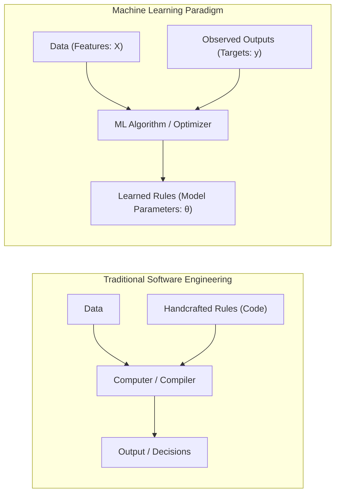
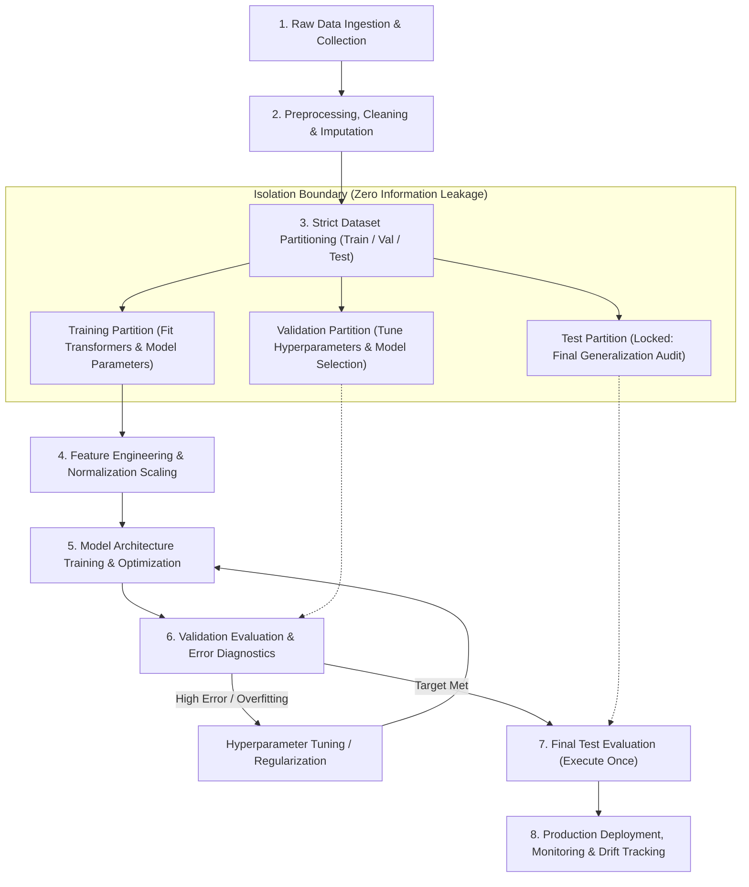

# Week 1: Introduction to Machine Learning
## Introduction to Machine Learning: Paradigms, Lifecycle, and Foundations

Machine learning shifts the computational paradigm from writing static, rule-based software to constructing statistical systems that adapt and extract decision rules directly from data. By formalizing learning through task specifications, performance metrics, and empirical experience, machine learning algorithms discover predictive and structural patterns across complex feature spaces. Analyzing the mathematical taxonomy of learning paradigms, operational pipeline hygiene, inductive biases, and theoretical constraints establishes the engineering foundation for all predictive modeling.

## The Machine Learning Paradigm Shift

### Traditional Programming Versus Machine Learning

- **Traditional Programming:** Software engineers manually construct explicit, deterministic algorithms. The computer receives structured **rules (code)** and **input data**, executing procedural logic to produce an **output answer**:
  $$\text{Data} + \text{Rules} \longrightarrow \text{Output}$$
- **Machine Learning:** The computer receives empirical **input data** and corresponding observed **outputs (answers)**, executing statistical optimization algorithms to discover the underlying **rules (model parameters)**:
  $$\text{Data} + \text{Output} \longrightarrow \text{Rules (Model Parameters)}$$
- Machine learning automates rule formulation for tasks where the underlying input-to-output mapping is too complex, non-linear, or high-dimensional for manual specification (e.g., computer vision, natural language understanding, biometric identification).

### Tom Mitchell's Formal Operational Definition

- Arthur Samuel (1959) provided an informal conceptual baseline: *"Machine learning is the field of study that gives computers the ability to learn without being explicitly programmed."*
- Tom Mitchell (1997) established the standard **operational engineering definition**:
  $$\text{A computer program is said to learn from experience } E \text{ with respect to some class of tasks } T$$
  $$\text{and performance measure } P, \text{ if its performance at tasks in } T, \text{ as measured by } P, \text{ improves with experience } E.$$

### Experience, Tasks, and Performance Metrics

- **Task ($T$):** The operational goal the machine must execute, defined independently of learning mechanics:
  - *Classification:* Assigning input vector $x \in \mathbb{R}^D$ to discrete category $y \in \{1, \dots, K\}$.
  - *Regression:* Predicting continuous real-valued scalar or vector $y \in \mathbb{R}$.
  - *Density Estimation:* Modeling probability distribution $P(x)$ across an input domain.
- **Experience ($E$):** The data stream or historical records made available to the algorithm:
  - Unsupervised data tuples containing only input vectors: $\{x^{(i)}\}_{i=1}^N$.
  - Supervised pairs containing inputs and verified ground-truth targets: $\{(x^{(i)}, y^{(i)})\}_{i=1}^N$.
  - Dynamic interaction trajectories in an environment: $\{(s_t, a_t, r_t, s_{t+1})\}_{t=1}^T$.
- **Performance Measure ($P$):** A quantitative metric evaluating how effectively the model executes task $T$:
  - Mean Squared Error (MSE) or Mean Absolute Error (MAE) for continuous regression.
  - Accuracy, F1-Score, Area Under the ROC Curve (AUC-ROC), or Cross-Entropy Loss for categorical classification.

> [!Important]
> **Learning is operationalized through $(T, P, E)$**: an algorithm qualifies as machine learning if and only if its measured performance score $P$ on a specific task $T$ improves systematically as it consumes additional data experience $E$.

## Taxonomy of Learning Paradigms

### Supervised Learning: Regression and Classification

- **Supervised Learning** operates on datasets containing input features paired with verified target labels:
  $$\mathcal{D}_{\text{train}} = \{(x^{(1)}, y^{(1)}), (x^{(2)}, y^{(2)}), \dots, (x^{(N)}, y^{(N)})\}$$
  The objective is finding a parameterized hypothesis function $f: \mathcal{X} \to \mathcal{Y}$ that minimizes the discrepancy between predictions $\hat{y} = f(x; \theta)$ and true targets $y$.
- **Regression:** The target space $\mathcal{Y}$ is continuous real-valued ($\mathcal{Y} \subseteq \mathbb{R}^K$). Examples include financial asset price forecasting, real estate valuation, and trajectory velocity prediction.
- **Classification:** The target space $\mathcal{Y}$ is a discrete, categorical set ($\mathcal{Y} = \{C_1, C_2, \dots, C_K\}$).
  - *Binary Classification:* Two mutually exclusive classes ($y \in \{0, 1\}$ or $\{-1, +1\}$).
  - *Multi-Class Classification:* More than two mutually exclusive classes ($y \in \{1, \dots, K\}$).
  - *Multi-Label Classification:* Multiple non-exclusive binary attributes active simultaneously ($y \in \{0, 1\}^K$).

### Unsupervised Learning: Structure and Density Discovery

- **Unsupervised Learning** operates on datasets without target labels:
  $$\mathcal{D} = \{x^{(1)}, x^{(2)}, \dots, x^{(N)}\}$$
  The objective is discovering intrinsic geometric structure, latent distributions, or groupings within data.
- **Clustering:** Partitions unlabeled instances into groups exhibiting high intra-cluster similarity and low inter-cluster similarity (e.g., K-Means, Agglomerative Hierarchical, DBSCAN).
- **Dimensionality Reduction:** Compresses high-dimensional feature spaces into low-dimensional latent manifolds while preserving variance or topological distances (e.g., Principal Component Analysis, t-SNE, UMAP).
- **Density Estimation:** Models the underlying probability density function $P(x)$ generating the observations (e.g., Gaussian Mixture Models, Kernel Density Estimation).
- **Association Rule Mining:** Identifies co-occurrence affinities and non-trivial correlations across discrete itemsets (e.g., Apriori, FP-Growth).

### Semi-Supervised and Self-Supervised Approaches

- **Semi-Supervised Learning:** Combines a small pool of labeled observations $\mathcal{D}_L = \{(x_l, y_l)\}$ with a large volume of unlabeled observations $\mathcal{D}_U = \{x_u\}$. Unlabeled data anchors decision boundaries across low-density regions, improving generalization when acquiring labels is expensive (e.g., medical pathology imagery).
- **Self-Supervised Learning:** Derives supervisory signals directly from raw unlabeled data by formulating pretext surrogate tasks. The model withholds a portion of the input and trains to predict the missing segment from the observed context (e.g., Masked Autoencoders, Contrastive Language-Image Pretraining, Next-Token Language Modeling).

### Reinforcement Learning: Policy and Reward Mechanics

- **Reinforcement Learning (RL)** models an autonomous **agent** interacting with a dynamic, uncertain **environment** modeled as a **Markov Decision Process (MDP)**:
  $$\mathcal{M} = (\mathcal{S}, \mathcal{A}, \mathcal{P}, \mathcal{R}, \gamma)$$
- At time step $t$, the agent observes environment state $s_t \in \mathcal{S}$ and executes an action $a_t \in \mathcal{A}$ according to its **policy** $\pi(a_t \mid s_t)$.
- The environment transitions to a new state $s_{t+1} \sim \mathcal{P}(s_{t+1} \mid s_t, a_t)$ and emits a scalar **reward** $r_{t+1} \in \mathbb{R}$.
- The objective is discovering an optimal policy $\pi^*$ that maximizes expected cumulative discounted return across the operational horizon:
  $$\max_\pi \mathbb{E} \left[ \sum_{t=0}^\infty \gamma^t r_{t+1} \right], \quad \gamma \in [0, 1)$$

> [!Tip]
> **Supervised models learn from teacher signals, while RL models learn from trials**: supervised systems optimize against explicit target vectors, while reinforcement learning agents discover policies through trial, error, and delayed scalar rewards.

## The End-to-End Machine Learning Lifecycle

### Data Ingestion and Feature Preprocessing

- Raw empirical data contains missing values, categorical strings, inconsistent scales, and sensor anomalies that prevent direct algebraic processing.
- **Missing Value Imputation:** Fills unobserved entries using statistical measures (mean, median, mode) or model-based estimates (KNN imputer), avoiding sample deletion that reduces sample diversity.
- **Categorical Encoding:** Converts discrete categories into numerical tensors via One-Hot Encoding, Ordinal Mapping, or Learned Embeddings.
- **Feature Standardization:** Centers continuous features to zero mean and unit variance:
  $$x_{\text{scaled}} = \frac{x - \mu}{\sigma}$$
  Standardization prevents features with large raw numerical scales from dominating gradient updates and distance metrics.

### Dataset Partitioning and Validation Hygiene

- To evaluate a model's true generalization capacity, empirical data partitions into three isolated subsets:
  - **Training Set (typically 60-80%):** Consumed directly by the optimization algorithm to update internal parameter weights ($\theta$).
  - **Validation Set (typically 10-20%):** Evaluated repeatedly during development to guide model selection, tune hyperparameters, and trigger early stopping.
  - **Test Set (typically 10-20%):** Held strictly in an uninspected, locked state throughout the entire modeling cycle. It evaluates once at project completion to provide an unbiased estimate of generalization error on unseen data.
- **$k$-Fold Cross-Validation:** Partitions the non-test data into $k$ equal folds, iteratively training on $k-1$ folds and evaluating on the held-out fold to establish robust error statistics on small datasets.

### Data Leakage Hazards and Mitigation

- **Data Leakage** occurs when information from outside the training partition influences the model before or during training, yielding artificially optimistic validation metrics that collapse in production.
- **Common Leakage Mechanisms:**
  - Standardizing features using the mean and variance of the *entire* dataset prior to splitting into train and test sets.
  - Using future temporal information to impute missing values in historical time-series sequences.
  - Applying feature selection metrics across both train and validation splits combined.
- **Mitigation Protocol:** Fit all preprocessing pipelines, imputation models, and feature transformers strictly on the training partition; use those saved parameters to transform validation and test sets without re-estimating statistics.

> [!Important]
> **Data leakage invalidates generalization guarantees**: calculating normalization statistics, imputation values, or feature selections across combined splits allows future test information to contaminate training, producing false validation accuracy.

## Inductive Bias and Generalization Theorems

### The Necessity of Inductive Bias

- A machine learning algorithm presented with a finite training set faces an infinite number of candidate functions that interpolate the observed data points with zero error.
- An algorithm without preference cannot choose among these candidate functions when predicting an unseen test instance.
- **Inductive Bias** represents the complete set of assumptions, structural preferences, and constraints a learning algorithm uses to predict outputs for unobserved inputs:
  - *Occam's Razor:* Favors the simplest hypothesis that explains the data (penalizing model parameter complexity).
  - *Linear Inductive Bias:* Assumes output targets correlate linearly with input features (e.g., Linear Regression, Logistic Regression).
  - *Spatial Locality Bias:* Assumes nearby inputs in grid space share strong semantic relationships (e.g., Convolutional Neural Networks).
  - *Temporal Invariance Bias:* Assumes recurring transition dynamics across time (e.g., Recurrent Neural Networks).

### The No Free Lunch Theorem

- Formulated by David Wolpert (1996), the **No Free Lunch (NFL) Theorem** establishes a foundational theoretical boundary for machine learning:
  $$\text{Averaged across all mathematically possible data-generating distributions,}$$
  $$\text{no supervised learning algorithm outperforms any other, including uniform random guessing.}$$
- An algorithm that achieves superior performance on a specific distribution class (e.g., image classification) does so only by trading off performance on other distribution classes (e.g., encrypted random noise).
- There is no universally optimal model architecture; predictive success depends entirely on aligning the algorithm's **inductive biases** with the physical reality of the target problem.

### Capacity and Generalization Preview

- An algorithm's **capacity** defines its flexibility to fit diverse functions without constraint.
- Matching capacity to data complexity governs training health:
  - Insufficient capacity leads to **underfitting** (high bias).
  - Excessive, unconstrained capacity leads to **overfitting** (high variance).
- Effective machine learning engineers balance capacity and generalization by combining expressive architectures with explicit regularization techniques.

> [!Tip]
> **Inductive bias makes generalization possible**: without structural assumptions favoring specific types of functions, an algorithm cannot generalize beyond raw training points; the No Free Lunch theorem proves that model design is the art of matching inductive bias to domain reality.

## Comparative Matrix of Core Learning Paradigms

| Learning Paradigm | Supervisory Training Signal | Primary Objective Function | Core Problem Formulations | Primary Evaluation Metrics | Canonical Baseline Algorithms |
|---|---|---|---|---|---|
| **Supervised Learning** | Ground-truth target labels paired with inputs: $(x, y)$ | Minimize empirical loss against labels: $\min_\theta \sum \mathcal{L}(f(x), y)$ | Regression, Binary and Multi-Class Classification | MSE, MAE, Accuracy, F1-Score, Cross-Entropy Loss | Linear/Logistic Regression, Random Forests, Gradient Boosted Trees, MLPs |
| **Unsupervised Learning** | None; unannotated raw input feature vectors: $(x)$ | Discover natural geometry, clustering, or density: $P(x)$ | Clustering, Dimensionality Reduction, Anomaly Detection | WCSS / Inertia, Silhouette Score, Explained Variance, Log-Likelihood | K-Means, DBSCAN, PCA, Autoencoders, Isolation Forests |
| **Semi-Supervised Learning** | Small labeled set $(x_l, y_l)$ + vast unlabeled pool $(x_u)$ | Joint supervised loss and manifold consistency regularization | Semi-supervised classification, label propagation | Standard supervised metrics on held-out test splits | Pseudo-Labeling, Label Propagation, Consistency Regularization |
| **Reinforcement Learning** | Scalar environmental feedback: rewards $(r)$ across states | Maximize expected cumulative discounted return: $\mathbb{E}[\sum \gamma^t r_t]$ | Policy optimization, value estimation, control | Cumulative episodic reward, win rate, convergence rate | Q-Learning, Deep Q-Networks (DQN), PPO, Actor-Critic |

### Regression Versus Classification in Supervised Learning

| Attribute | Continuous Regression | Categorical Classification |
|---|---|---|
| **Target Space ($\mathcal{Y}$)** | Continuous real-valued domain: $y \in \mathbb{R}$ | Discrete categorical set: $y \in \{C_1, \dots, C_K\}$ |
| **Model Output Mapping** | Unbounded continuous value: $\hat{y} \in (-\infty, \infty)$ | Normalized class posterior probabilities: $\hat{y} \in [0, 1]^K, \; \sum \hat{y}_k = 1$ |
| **Standard Output Activation** | Linear / Identity ($g(z) = z$) | Sigmoid (Binary) or Softmax (Multi-Class) |
| **Canonical Loss Functions** | Mean Squared Error (MSE), Mean Absolute Error (MAE), Huber Loss | Binary Cross-Entropy (BCE), Categorical Cross-Entropy (CCE) |
| **Geometric Output Nature** | Continuous fitting surface passing through data points | Decision hyperplanes separating discrete class regions |

> [!Important]
> **Supervision format dictates model design**: continuous targets require linear projections optimized via distance losses (MSE/MAE), while categorical targets require probability activations (Softmax) optimized via cross-entropy.

## Key Takeaways

- **Machine learning extracts rules from data**: traditional programming combines code and data to output answers, while machine learning combines data and answers to discover parameter rules.
- **Mitchell's formulation defines learning**: an algorithm learns if its measured performance $P$ at task $T$ improves with experience $E$.
- **Supervised learning models input-to-output mappings**, dividing into continuous regression and categorical classification.
- **Unsupervised learning discovers intrinsic data structure**, encompassing clustering, dimensionality reduction, density estimation, and association rules without labels.
- **Reinforcement learning optimizes sequential decision policies**, using environmental interaction and discounted scalar rewards rather than explicit targets.
- **Strict dataset partitioning protects generalization audits**: models train on training splits, select hyperparameters on validation splits, and evaluate once on held-out test splits.
- **Data leakage introduces false confidence**: estimating preprocessing statistics across combined splits allows future evaluation data to contaminate training.
- **The No Free Lunch Theorem proves no algorithm is universally superior**: model success requires choosing architectures whose inductive biases match domain constraints.

> [!Tip]
> The foundational law of machine learning: **data provides empirical evidence, while inductive bias enables generalization**; by structuring problems into tasks, metrics, and experiences, machine learning transforms statistical observations into predictive software that generalizes to unseen environments.
