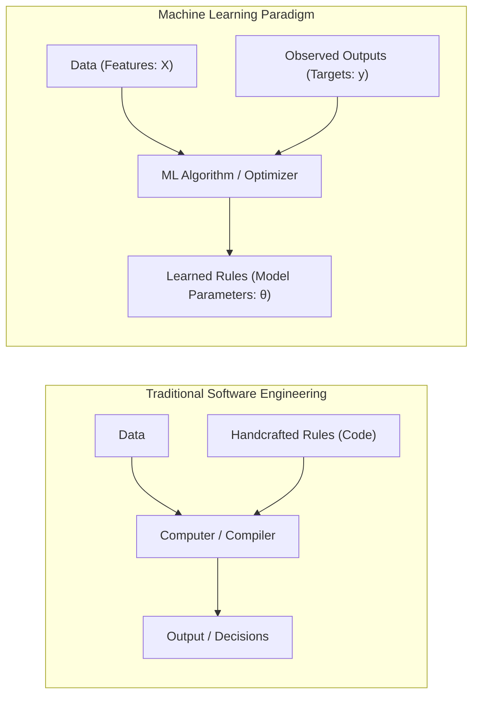
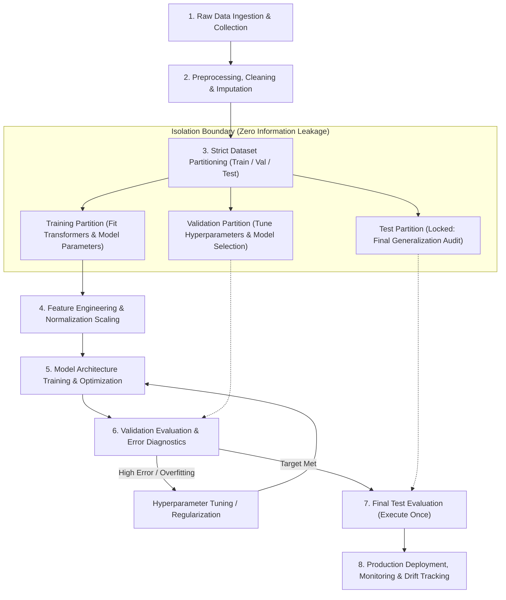

# Migration in progress
# Week 1: Introduction to Machine Learning
## Introduction to Machine Learning: Paradigms, Lifecycle, and Foundations

Machine learning shifts the computational paradigm from writing static, rule-based software to constructing statistical systems that adapt and extract decision rules directly from data. By formalizing learning through task specifications, performance metrics, and empirical experience, machine learning algorithms discover predictive and structural patterns across complex feature spaces. Analyzing the mathematical taxonomy of learning paradigms, operational pipeline hygiene, inductive biases, and theoretical constraints establishes the engineering foundation for all predictive modeling.

## The Machine Learning Paradigm Shift

### Traditional Programming Versus Machine Learning

- **Traditional Programming:** Software engineers manually construct explicit, deterministic algorithms. The computer receives structured **rules (code)** and **input data**, executing procedural logic to produce an **output answer**:
  $$\text{Data} + \text{Rules} \longrightarrow \text{Output}$$
- **Machine Learning:** The computer receives empirical **input data** and corresponding observed **outputs (answers)**, executing statistical optimization algorithms to discover the underlying **rules (model parameters)**:
  $$\text{Data} + \text{Output} \longrightarrow \text{Rules (Model Parameters)}$$
- Machine learning automates rule formulation for tasks where the underlying input-to-output mapping is too complex, non-linear, or high-dimensional for manual specification (e.g., computer vision, natural language understanding, biometric identification).

### Tom Mitchell's Formal Operational Definition

- Arthur Samuel (1959) provided an informal conceptual baseline: *"Machine learning is the field of study that gives computers the ability to learn without being explicitly programmed."*
- Tom Mitchell (1997) established the standard **operational engineering definition**:
  $$\text{A computer program is said to learn from experience } E \text{ with respect to some class of tasks } T$$
  $$\text{and performance measure } P, \text{ if its performance at tasks in } T, \text{ as measured by } P, \text{ improves with experience } E.$$

### Experience, Tasks, and Performance Metrics

- **Task ($T$):** The operational goal the machine must execute, defined independently of learning mechanics:
  - *Classification:* Assigning input vector $x \in \mathbb{R}^D$ to discrete category $y \in \{1, \dots, K\}$.
  - *Regression:* Predicting continuous real-valued scalar or vector $y \in \mathbb{R}$.
  - *Density Estimation:* Modeling probability distribution $P(x)$ across an input domain.
- **Experience ($E$):** The data stream or historical records made available to the algorithm:
  - Unsupervised data tuples containing only input vectors: $\{x^{(i)}\}_{i=1}^N$.
  - Supervised pairs containing inputs and verified ground-truth targets: $\{(x^{(i)}, y^{(i)})\}_{i=1}^N$.
  - Dynamic interaction trajectories in an environment: $\{(s_t, a_t, r_t, s_{t+1})\}_{t=1}^T$.
- **Performance Measure ($P$):** A quantitative metric evaluating how effectively the model executes task $T$:
  - Mean Squared Error (MSE) or Mean Absolute Error (MAE) for continuous regression.
  - Accuracy, F1-Score, Area Under the ROC Curve (AUC-ROC), or Cross-Entropy Loss for categorical classification.

> [!Important]
> **Learning is operationalized through $(T, P, E)$**: an algorithm qualifies as machine learning if and only if its measured performance score $P$ on a specific task $T$ improves systematically as it consumes additional data experience $E$.

## Taxonomy of Learning Paradigms

### Supervised Learning: Regression and Classification

- **Supervised Learning** operates on datasets containing input features paired with verified target labels:
  $$\mathcal{D}_{\text{train}} = \{(x^{(1)}, y^{(1)}), (x^{(2)}, y^{(2)}), \dots, (x^{(N)}, y^{(N)})\}$$
  The objective is finding a parameterized hypothesis function $f: \mathcal{X} \to \mathcal{Y}$ that minimizes the discrepancy between predictions $\hat{y} = f(x; \theta)$ and true targets $y$.
- **Regression:** The target space $\mathcal{Y}$ is continuous real-valued ($\mathcal{Y} \subseteq \mathbb{R}^K$). Examples include financial asset price forecasting, real estate valuation, and trajectory velocity prediction.
- **Classification:** The target space $\mathcal{Y}$ is a discrete, categorical set ($\mathcal{Y} = \{C_1, C_2, \dots, C_K\}$).
  - *Binary Classification:* Two mutually exclusive classes ($y \in \{0, 1\}$ or $\{-1, +1\}$).
  - *Multi-Class Classification:* More than two mutually exclusive classes ($y \in \{1, \dots, K\}$).
  - *Multi-Label Classification:* Multiple non-exclusive binary attributes active simultaneously ($y \in \{0, 1\}^K$).

### Unsupervised Learning: Structure and Density Discovery

- **Unsupervised Learning** operates on datasets without target labels:
  $$\mathcal{D} = \{x^{(1)}, x^{(2)}, \dots, x^{(N)}\}$$
  The objective is discovering intrinsic geometric structure, latent distributions, or groupings within data.
- **Clustering:** Partitions unlabeled instances into groups exhibiting high intra-cluster similarity and low inter-cluster similarity (e.g., K-Means, Agglomerative Hierarchical, DBSCAN).
- **Dimensionality Reduction:** Compresses high-dimensional feature spaces into low-dimensional latent manifolds while preserving variance or topological distances (e.g., Principal Component Analysis, t-SNE, UMAP).
- **Density Estimation:** Models the underlying probability density function $P(x)$ generating the observations (e.g., Gaussian Mixture Models, Kernel Density Estimation).
- **Association Rule Mining:** Identifies co-occurrence affinities and non-trivial correlations across discrete itemsets (e.g., Apriori, FP-Growth).

### Semi-Supervised and Self-Supervised Approaches

- **Semi-Supervised Learning:** Combines a small pool of labeled observations $\mathcal{D}_L = \{(x_l, y_l)\}$ with a large volume of unlabeled observations $\mathcal{D}_U = \{x_u\}$. Unlabeled data anchors decision boundaries across low-density regions, improving generalization when acquiring labels is expensive (e.g., medical pathology imagery).
- **Self-Supervised Learning:** Derives supervisory signals directly from raw unlabeled data by formulating pretext surrogate tasks. The model withholds a portion of the input and trains to predict the missing segment from the observed context (e.g., Masked Autoencoders, Contrastive Language-Image Pretraining, Next-Token Language Modeling).

### Reinforcement Learning: Policy and Reward Mechanics

- **Reinforcement Learning (RL)** models an autonomous **agent** interacting with a dynamic, uncertain **environment** modeled as a **Markov Decision Process (MDP)**:
  $$\mathcal{M} = (\mathcal{S}, \mathcal{A}, \mathcal{P}, \mathcal{R}, \gamma)$$
- At time step $t$, the agent observes environment state $s_t \in \mathcal{S}$ and executes an action $a_t \in \mathcal{A}$ according to its **policy** $\pi(a_t \mid s_t)$.
- The environment transitions to a new state $s_{t+1} \sim \mathcal{P}(s_{t+1} \mid s_t, a_t)$ and emits a scalar **reward** $r_{t+1} \in \mathbb{R}$.
- The objective is discovering an optimal policy $\pi^*$ that maximizes expected cumulative discounted return across the operational horizon:
  $$\max_\pi \mathbb{E} \left[ \sum_{t=0}^\infty \gamma^t r_{t+1} \right], \quad \gamma \in [0, 1)$$

> [!Tip]
> **Supervised models learn from teacher signals, while RL models learn from trials**: supervised systems optimize against explicit target vectors, while reinforcement learning agents discover policies through trial, error, and delayed scalar rewards.

## The End-to-End Machine Learning Lifecycle

### Data Ingestion and Feature Preprocessing

- Raw empirical data contains missing values, categorical strings, inconsistent scales, and sensor anomalies that prevent direct algebraic processing.
- **Missing Value Imputation:** Fills unobser