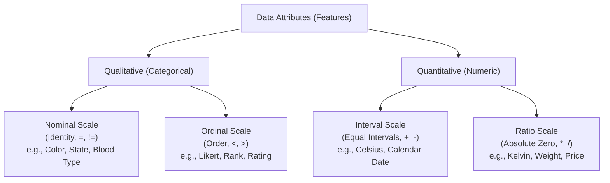

# Migration in progress
# Lesson 1: Data Quality, Attributes and...

## Data Quality, Attributes, and Measurement Scales

Machine learning pipelines operate on numerical tensors derived from empirical observations, making model performance fundamentally dependent on the quality and structure of incoming data. Raw data collections exhibit structural impurities, varying measurement scales, missing attributes, and measurement noise that violate statistical assumptions if left unaddressed. Analyzing attribute taxonomies, formal measurement scales, data quality dimensions, and profiling protocols establishes the operational foundation for data cleaning and feature transformation.

## Taxonomic Classification of Data Attributes

### Stevens' Four Scales of Measurement

- Formulated by psychologist Stanley Smith Stevens (1946), the **Theory of Scales of Measurement** classifies data attributes into four hierarchical tiers based on mathematical properties: **Nominal**, **Ordinal**, **Interval**, and **Ratio**.
- Each level inherits the mathematical properties of the levels below it while introducing additional algebraic constraints and permissible statistical operations.
- Selecting appropriate statistical measures, distance functions, and encoding strategies requires identifying the exact scale of measurement for each feature.

### Qualitative Attributes: Nominal and Ordinal

- **Nominal Scale (Categorical / Discrete):**
  - Values represent symbolic labels, names, or categories lacking any intrinsic mathematical order or quantitative scale.
  - Permitted mathematical relations evaluate only equality and inequality:
    $$x_i = x_j \quad \text{or} \quad x_i \neq x_j$$
  - Permissible statistical operations include **mode**, **frequency counts**, and contingency tables.
  - Examples: Eye color, country codes, customer ID numbers, marital status.
- **Ordinal Scale (Ranked / Qualitative):**
  - Values represent discrete categories possessing a clear, unambiguous rank order or hierarchy.
  - The intervals separating adjacent ranks are non-uniform, undefined, or unquantifiable.
  - Permitted mathematical relations evaluate comparative rank:
    $$x_i < x_j \quad \text{or} \quad x_i > x_j$$
  - Permissible statistical operations include **median**, **percentiles**, and rank correlation (Spearman's $\rho$).
  - Examples: Education levels (High School $\to$ Bachelor's $\to$ Master's $\to$ PhD), Likert customer satisfaction scales (1 to 5), credit risk ratings (AAA to C).

### Quantitative Attributes: Interval and Ratio

- **Interval Scale (Continuous / Quantitative with Arbitrary Zero):**
  - Values represent real numbers measured along an equal, uniform metric scale.
  - Differences between numbers are meaningful ($x_i - x_j$), but the scale lacks a **true physical absolute zero**. Zero represents an arbitrary baseline rather than the complete absence of the measured property.
  - Permitted mathematical operations include addition, subtraction, **arithmetic mean**, and **standard deviation**:
    $$x_i - x_j = \Delta x$$
  - Multiplication and division are meaningless: $20^\circ\text{C}$ is not twice as hot as $10^\circ\text{C}$, because $0^\circ\text{C}$ does not represent the absence of thermal energy.
  - Examples: Celsius temperature, Fahrenheit temperature, calendar years, IQ scores.
- **Ratio Scale (Continuous / Quantitative with Absolute Zero):**
  - Inherits equal intervals while possessing an **absolute, non-arbitrary physical zero point**, indicating total absence of the measured quantity.
  - Permitted mathematical operations include all real-valued arithmetic (addition, subtraction, multiplication, division, ratios):
    $$\frac{x_i}{x_j} = \text{ratio}$$
  - Permissible statistical operations include **geometric mean**, **harmonic mean**, and coefficient of variation.
  - Examples: Kelvin temperature ($0\text{ K} = \text{absolute zero}$), physical distance, mass, salary, network packet counts.

### Discrete Versus Continuous Attribute Domains

- **Discrete Attributes:** Feature values take values from a finite or countably infinite set: $x \in \mathbb{Z}$ (e.g., number of website clicks, hospital bed counts).
- **Continuous Attributes:** Feature values take real-valued measurements within any sub-interval of the continuum: $x \in \mathbb{R}$ (e.g., sensor voltage, velocity).
- Treating discrete attributes with low cardinality as continuous numbers can introduce false assumptions of infinite fractional granularity into linear models.

> [!Important]
> **Measurement scales dictate valid mathematical operations**: taking the arithmetic mean of ordinal survey ranks introduces invalid metric assumptions, while taking ratios of interval temperatures produces meaningless numbers.

## The Core Dimensions of Data Quality

### Accuracy and Correctness

- **Accuracy** measures the degree to which recorded empirical values correspond to ground-truth physical reality.
- **Inaccuracy Mechanisms:** Miscalibrated hardware sensors, manual human transcription typos, software parsing bugs, and transmission packet corruption.
- Inaccurate records act as structural noise, shifting optimization trajectories away from the true data-generating distribution.

### Completeness and Missingness Signatures

- **Completeness** quantifies the proportion of required attributes that possess observed, non-null values across the dataset:
  $$\text{Completeness} = 1 - \frac{\text{Count of Missing Fields}}{N \times P}$$
  where $N$ denotes sample count and $P$ denotes feature count.
- Evaluating missingness signatures isolates whether unobserved entries represent systematic omissions (MAR/MNAR) or random sensor dropouts (MCAR).

### Consistency and Structural Integrity

- **Consistency** requires that data values do not contradict other recorded fields within the same observation record or across related relational tables.
- **Consistency Violations:**
  - A patient's age recorded as 25 while their birth year indicates 1970.
  - Shipping delivery dates occurring prior to transaction order dates.
  - Disparate unit representations across rows (e.g., mixing metric meters with imperial feet within a single continuous column).

### Timeliness, Validity, and Uniqueness

- **Timeliness (Freshness):** Evaluates whether the temporal delay between physical event occurrence and model ingestion remains within the operational decision window. Stale training records induce **concept drift**, as historical relationships degrade over time.
- **Validity:** The degree to which data values conform strictly to defined schemas, business constraints, and format bounds (e.g., negative ages, malformed email addresses, or unparsable date formats).
- **Uniqueness:** The absence of redundant duplicate entries representing the identical real-world entity. Duplicate records bias empirical training weights toward over-represented samples.

> [!Tip]
> **Audit data quality across all six dimensions**: high completeness does not ensure model success if the recorded values lack accuracy, violate logical consistency, or suffer from duplication bias.

## Data Impurities and Measurement Defects

### Stochastic Noise and Sensor Jitter

- **Noise** represents random statistical variation or error around true signal values.
- **Additive Gaussian Noise:** Sensors often corrupt continuous signals with zero-mean noise:
  $$x_{\text{observed}} = x_{\text{true}} + \epsilon, \quad \epsilon \sim \mathcal{N}(0, \sigma^2)$$
- Unfiltered noise obscures subtle decision boundaries and forces high-capacit