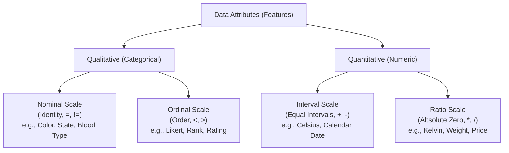
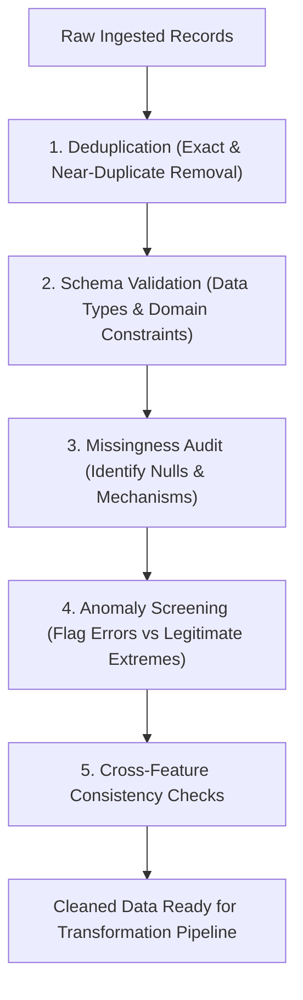

# Lesson 1: Data Quality, Attributes and...

## Data Quality, Attributes, and Measurement Scales

Machine learning pipelines operate on numerical tensors derived from empirical observations, making model performance fundamentally dependent on the quality and structure of incoming data. Raw data collections exhibit structural impurities, varying measurement scales, missing attributes, and measurement noise that violate statistical assumptions if left unaddressed. Analyzing attribute taxonomies, formal measurement scales, data quality dimensions, and profiling protocols establishes the operational foundation for data cleaning and feature transformation.

## Taxonomic Classification of Data Attributes

### Stevens' Four Scales of Measurement

- Formulated by psychologist Stanley Smith Stevens (1946), the **Theory of Scales of Measurement** classifies data attributes into four hierarchical tiers based on mathematical properties: **Nominal**, **Ordinal**, **Interval**, and **Ratio**.
- Each level inherits the mathematical properties of the levels below it while introducing additional algebraic constraints and permissible statistical operations.
- Selecting appropriate statistical measures, distance functions, and encoding strategies requires identifying the exact scale of measurement for each feature.

### Qualitative Attributes: Nominal and Ordinal

- **Nominal Scale (Categorical / Discrete):**
  - Values represent symbolic labels, names, or categories lacking any intrinsic mathematical order or quantitative scale.
  - Permitted mathematical relations evaluate only equality and inequality:
    $$x_i = x_j \quad \text{or} \quad x_i \neq x_j$$
  - Permissible statistical operations include **mode**, **frequency counts**, and contingency tables.
  - Examples: Eye color, country codes, customer ID numbers, marital status.
- **Ordinal Scale (Ranked / Qualitative):**
  - Values represent discrete categories possessing a clear, unambiguous rank order or hierarchy.
  - The intervals separating adjacent ranks are non-uniform, undefined, or unquantifiable.
  - Permitted mathematical relations evaluate comparative rank:
    $$x_i < x_j \quad \text{or} \quad x_i > x_j$$
  - Permissible statistical operations include **median**, **percentiles**, and rank correlation (Spearman's $\rho$).
  - Examples: Education levels (High School $\to$ Bachelor's $\to$ Master's $\to$ PhD), Likert customer satisfaction scales (1 to 5), credit risk ratings (AAA to C).

### Quantitative Attributes: Interval and Ratio

- **Interval Scale (Continuous / Quantitative with Arbitrary Zero):**
  - Values represent real numbers measured along an equal, uniform metric scale.
  - Differences between numbers are meaningful ($x_i - x_j$), but the scale lacks a **true physical absolute zero**. Zero represents an arbitrary baseline rather than the complete absence of the measured property.
  - Permitted mathematical operations include addition, subtraction, **arithmetic mean**, and **standard deviation**:
    $$x_i - x_j = \Delta x$$
  - Multiplication and division are meaningless: $20^\circ\text{C}$ is not twice as hot as $10^\circ\text{C}$, because $0^\circ\text{C}$ does not represent the absence of thermal energy.
  - Examples: Celsius temperature, Fahrenheit temperature, calendar years, IQ scores.
- **Ratio Scale (Continuous / Quantitative with Absolute Zero):**
  - Inherits equal intervals while possessing an **absolute, non-arbitrary physical zero point**, indicating total absence of the measured quantity.
  - Permitted mathematical operations include all real-valued arithmetic (addition, subtraction, multiplication, division, ratios):
    $$\frac{x_i}{x_j} = \text{ratio}$$
  - Permissible statistical operations include **geometric mean**, **harmonic mean**, and coefficient of variation.
  - Examples: Kelvin temperature ($0\text{ K} = \text{absolute zero}$), physical distance, mass, salary, network packet counts.

### Discrete Versus Continuous Attribute Domains

- **Discrete Attributes:** Feature values take values from a finite or countably infinite set: $x \in \mathbb{Z}$ (e.g., number of website clicks, hospital bed counts).
- **Continuous Attributes:** Feature values take real-valued measurements within any sub-interval of the continuum: $x \in \mathbb{R}$ (e.g., sensor voltage, velocity).
- Treating discrete attributes with low cardinality as continuous numbers can introduce false assumptions of infinite fractional granularity into linear models.

> [!Important]
> **Measurement scales dictate valid mathematical operations**: taking the arithmetic mean of ordinal survey ranks introduces invalid metric assumptions, while taking ratios of interval temperatures produces meaningless numbers.

## The Core Dimensions of Data Quality

### Accuracy and Correctness

- **Accuracy** measures the degree to which recorded empirical values correspond to ground-truth physical reality.
- **Inaccuracy Mechanisms:** Miscalibrated hardware sensors, manual human transcription typos, software parsing bugs, and transmission packet corruption.
- Inaccurate records act as structural noise, shifting optimization trajectories away from the true data-generating distribution.

### Completeness and Missingness Signatures

- **Completeness** quantifies the proportion of required attributes that possess observed, non-null values across the dataset:
  $$\text{Completeness} = 1 - \frac{\text{Count of Missing Fields}}{N \times P}$$
  where $N$ denotes sample count and $P$ denotes feature count.
- Evaluating missingness signatures isolates whether unobserved entries represent systematic omissions (MAR/MNAR) or random sensor dropouts (MCAR).

### Consistency and Structural Integrity

- **Consistency** requires that data values do not contradict other recorded fields within the same observation record or across related relational tables.
- **Consistency Violations:**
  - A patient's age recorded as 25 while their birth year indicates 1970.
  - Shipping delivery dates occurring prior to transaction order dates.
  - Disparate unit representations across rows (e.g., mixing metric meters with imperial feet within a single continuous column).

### Timeliness, Validity, and Uniqueness

- **Timeliness (Freshness):** Evaluates whether the temporal delay between physical event occurrence and model ingestion remains within the operational decision window. Stale training records induce **concept drift**, as historical relationships degrade over time.
- **Validity:** The degree to which data values conform strictly to defined schemas, business constraints, and format bounds (e.g., negative ages, malformed email addresses, or unparsable date formats).
- **Uniqueness:** The absence of redundant duplicate entries representing the identical real-world entity. Duplicate records bias empirical training weights toward over-represented samples.

> [!Tip]
> **Audit data quality across all six dimensions**: high completeness does not ensure model success if the recorded values lack accuracy, violate logical consistency, or suffer from duplication bias.

## Data Impurities and Measurement Defects

### Stochastic Noise and Sensor Jitter

- **Noise** represents random statistical variation or error around true signal values.
- **Additive Gaussian Noise:** Sensors often corrupt continuous signals with zero-mean noise:
  $$x_{\text{observed}} = x_{\text{true}} + \epsilon, \quad \epsilon \sim \mathcal{N}(0, \sigma^2)$$
- Unfiltered noise obscures subtle decision boundaries and forces high-capacity models to overfit on high-frequency measurement jitter.
- Mitigation relies on neighborhood smoothing, moving-average filters, or dimensionality reduction (PCA) that discards low-variance noise components.

### Outliers: Statistical Anomalies Versus Extreme Signals

- An **outlier** is an observation that deviates so significantly from the remaining data that it prompts suspicion it was generated by an entirely different mechanism.
- **Spurious Outliers (Data Errors):** Caused by decimal misplacement, transmission bugs, or sensor glitches (e.g., human body temperature recorded as $986^\circ\text{F}$ instead of $98.6^\circ\text{F}$). These must be corrected or removed.
- **Valid Extreme Outliers (Rare Signals):** Legitimate, rare occurrences that carry critical domain signals (e.g., high-value financial fraud, catastrophic network intrusions). Discarding valid outliers blinds predictive models to critical target behaviors.

### Data Duplication and Entity Resolution

- **Exact Duplicates:** Entire rows share identical values across all features, typically caused by multi-source logging ingestion retries. Easily purged using hash-based row deduplication.
- **Near-Duplicates (Fuzzy Entity Resolution):** Different records represent the same real-world entity, but feature typographical discrepancies (e.g., `"John Smith, New York"` versus `"J. Smith, NY"`).
- Resolving near-duplicates requires calculating string edit distances (Levenshtein distance, Jaro-Winkler metric) or probabilistic record linkage algorithms.

> [!Important]
> **Distinguish errors from valid rare events**: spurious outliers caused by data entry errors degrade model optimization, but legitimate extreme values contain essential predictive signal that must be retained.

## Data Profiling and Quality Auditing Protocols

### Summary Statistics and Distributional Diagnostics

- Initial data profiling requires computing the **five-number summary** alongside parametric dispersion metrics across all continuous attributes:
  $$\text{Summary} = \{X_{\min}, \; Q_1, \; \text{Median } (Q_2), \; Q_3, \; X_{\max}\}$$
- Comparing the sample **mean ($\mu$)** and **median ($Q_2$)** diagnoses distribution skewness:
  - $\mu \approx Q_2$: Symmetric, approximately Gaussian distribution.
  - $\mu > Q_2$: Positive (right-tailed) skewness; large values pull the arithmetic mean upward.
  - $\mu < Q_2$: Negative (left-tailed) skewness; small values pull the arithmetic mean downward.
- **Coefficient of Variation ($CV$):** Measures relative dispersion independent of absolute scale:
  $$CV = \frac{\sigma}{\mu}$$

### Bivariate Correlation and Redundancy Audits

- Profiling must evaluate relationships between feature pairs to identify redundant attributes and collinearity:
  - **Pearson Correlation ($r$):** Measures linear association between continuous features:
    $$r = \frac{\sum (x - \bar{x})(y - \bar{y})}{\sqrt{\sum (x - \bar{x})^2 \sum (y - \bar{y})^2}} \in [-1.0, \; +1.0]$$
  - **Spearman Rank Correlation ($\rho$):** Evaluates monotonic relationships between ranked variables, making it robust against non-linear scaling and continuous outliers.
- **Multicollinearity:** If two features share a correlation near unity ($|r| > 0.95$), they convey redundant information; retaining both increases parameter variance in linear models and wastes compute.

> [!Tip]
> **Use the median-mean gap to spot skewness**: when the mean significantly exceeds the median, the distribution is right-skewed, indicating the need for logarithmic or power transformations prior to linear modeling.

## Comparative Matrices of Measurement Scales and Quality Dimensions

| Scale of Measurement | Ordering Property | Mathematical Intervals | True Absolute Zero | Allowed Operations | Central Tendency Measure | Representative Features |
|---|---|---|---|---|---|---|
| **Nominal** | None | Non-existent | None | Equality ($=, \neq$) | **Mode** | ZIP codes, blood type, gender, language |
| **Ordinal** | **Strict Ranking** | Unequal / Undefined | None | Comparisons ($<, >$) | **Median** | Customer rating (1-5), clothing size (S/M/L) |
| **Interval** | Strict Ranking | **Equal Intervals** | Arbitrary | Addition / Subtraction ($+, -$) | **Arithmetic Mean** | Celsius/Fahrenheit, calendar years, IQ |
| **Ratio** | Strict Ranking | Equal Intervals | **Physical Zero** | Multiplicative ($\times, \div$) | **Geometric Mean** | Mass, length, price, time duration |

### Diagnostic Matrix of Data Quality Dimensions

| Quality Dimension | Formal Definition | Primary Root Cause | Manifested Machine Learning Failure | Automated Detection Strategy |
|---|---|---|---|---|
| **Accuracy** | Agreement between values and real-world facts | Hardware sensor drift; typos | Model learns false decision boundaries | Cross-referencing external trusted reference data |
| **Completeness** | Non-null values present across attributes | Optional web form fields; failures | Triggers runtime errors; shrinks data | Null counting matrices; missingness heatmaps |
| **Consistency** | Absence of contradictory field values | Merging siloed databases | Model encounters contradictory logic | Cross-field relational validation assertions |
| **Timeliness** | Freshness relative to decision windows | Slow batch ETL processing | Concept drift; degraded live performance | Tracking record timestamps vs ingestion logs |
| **Validity** | Compliance with formats and ranges | Missing input schema enforcement | Parsing exceptions; out-of-range bounds | Pydantic / Great Expectations schema tests |
| **Uniqueness** | Absence of redundant duplicate rows | Retry logging loops; joined tables | Biases loss weights toward repeated rows | Primary key hashing; fuzzy entity resolution |

> [!Important]
> **Automate schema validation during ingestion**: enforcing range bounds, type checks, and relational integrity assertions at the data boundary prevents corrupt records from entering downstream modeling pipelines.

## Key Takeaways

- **Data attributes follow four measurement scales**: Nominal (categories), Ordinal (ranks), Interval (equal steps without true zero), and Ratio (true absolute zero).
- **The measurement scale determines permissible operations**: categorical and ordinal attributes cannot undergo linear arithmetic, while interval features cannot be expressed as ratios.
- **The six dimensions of data quality** (Accuracy, Completeness, Consistency, Timeliness, Validity, and Uniqueness) govern the viability of empirical datasets.
- **Missingness mechanisms dictate imputation**: MCAR data permits unbiased deletion, while MAR data requires statistical imputation, and MNAR data requires modeling the missingness process directly.
- **Outliers divide into spurious errors and valid extremes**: measurement errors must be corrected or trimmed, while legitimate rare events contain critical predictive signal that must be preserved.
- **Data profiling diagnoses distribution health**: comparing the sample mean to the median reveals skewness, while correlation matrices identify redundant collinear features.
- **Automated validation assertions prevent silent failures**: enforcing schema constraints and entity resolution checks at data entry boundaries protects downstream preprocessing pipelines.

> [!Tip]
> The foundational rule of data quality: **attribute semantics govern mathematical validity**; verifying measurement scales, checking logical consistency, and profiling distributions before preprocessing ensures that downstream transformations preserve true domain reality.
