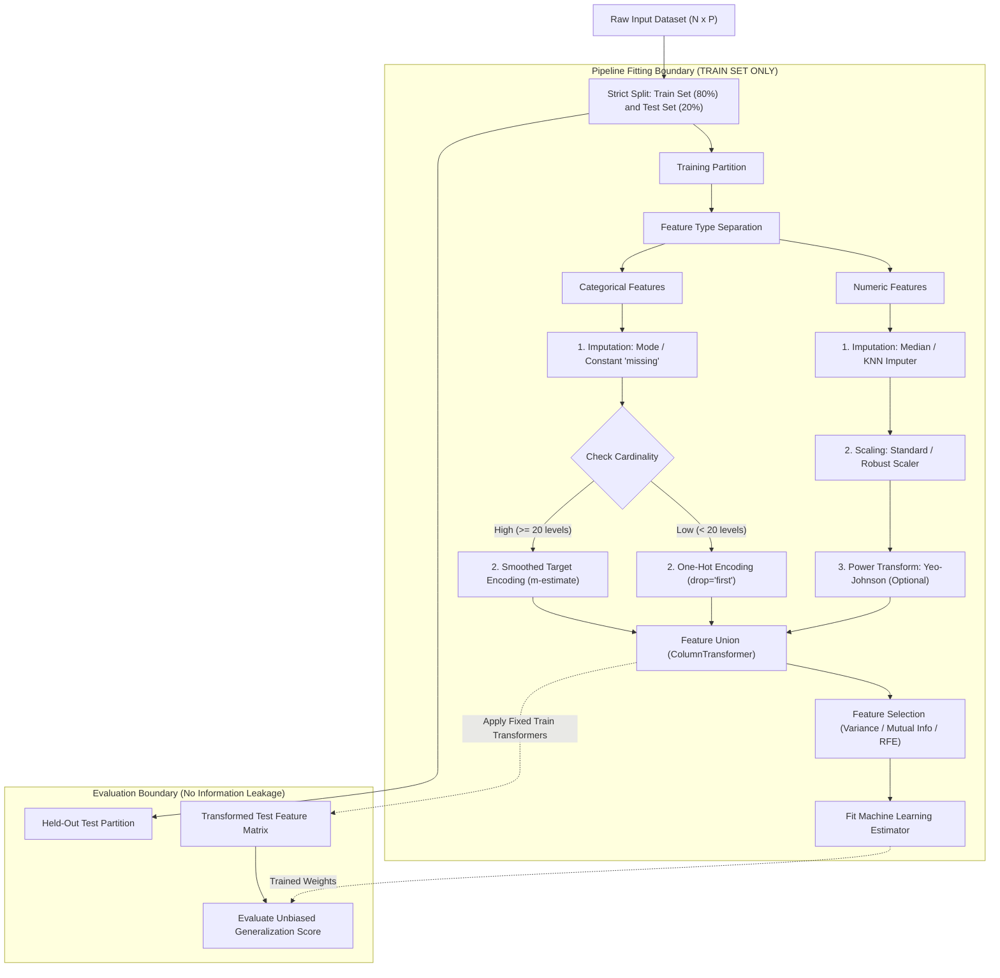

# Lesson 2: Summary and Assessment

## Data Preprocessing: Module Summary and Assessment

Data preprocessing establishes the mathematical foundation of machine learning systems, converting imperfect empirical records into structured numerical arrays. Raw collections exhibit missing attributes, non-standardized scales, extreme outliers, and unencoded categorical factors that break statistical assumptions and induce numerical instability. Synthesizing data quality dimensions, imputation mechanics, geometric feature scaling, cardinality-aware encodings, and strict pipeline isolation protocols equips engineers to prepare feature matrices while preventing data leakage.

## Synthesis of Core Week 2 Foundations

### Attribute Scales and Quality Verification

- **Stevens' measurement taxonomy:** Data features map to four hierarchical scales that determine permissible mathematical operations:
  - **Nominal:** Identity categories lacking intrinsic order (e.g., blood types); evaluates equality ($=, \neq$), summarized by the **mode**.
  - **Ordinal:** Ranked categories with undefined intervals (e.g., education tiers); evaluates inequality ($<, >$), summarized by the **median**.
  - **Interval:** Uniform continuous metric steps lacking true physical zero (e.g., Celsius temperature); evaluates differences ($+, -$), summarized by the **arithmetic mean**.
  - **Ratio:** Continuous metric steps possessing absolute physical zero (e.g., Kelvin, mass, revenue); evaluates multiplicative ratios ($\times, \div$), summarized by the **geometric mean**.
- **Data quality dimensions:** Verifying data viability requires auditing across six operational dimensions: **Accuracy** (agreement with real-world facts), **Completeness** (absence of unobserved nulls), **Consistency** (absence of contradictory cross-table entries), **Timeliness** (alignment with decision horizons), **Validity** (conformance to schema constraints), and **Uniqueness** (absence of duplicate records).

### Distributional Transformations and Outlier Management

- **Missing data mechanisms:**
  - **MCAR (Missing Completely at Random):** Missingness is independent of all attributes; listwise deletion yields unbiased parameter estimates but reduces sample size.
  - **MAR (Missing at Random):** Missingness depends on observed features; multivariate regression imputation (MICE) or KNN imputation restores unbiased estimates.
  - **MNAR (Missing Not at Random):** Missingness depends directly on the unobserved value itself; requires modeling missingness explicitly via binary indicator flags.
- **Outlier detection:**
  - **Tukey's Fences:** Establishes non-parametric boundaries using the Interquartile Range ($\text{IQR} = Q_3 - Q_1$): $[\text{Lower} = Q_1 - 1.5 \times \text{IQR}, \; \text{Upper} = Q_3 + 1.5 \times \text{IQR}]$.
  - **Winsorization:** Caps extreme outliers at fixed percentile thresholds ($P_1$ and $P_{99}$) rather than deleting observations, preserving sample size without distorting scale.
- **Feature scaling protocols:**
  - **Min-Max Normalization:** Linearly compresses features to a rigid interval ($[0, 1]$): $x_{\text{norm}} = \frac{x - x_{\min}}{x_{\max} - x_{\min}}$. Sensitive to extreme outliers.
  - **Z-Score Standardization:** Rescales features to zero mean and unit variance: $x_{\text{std}} = \frac{x - \mu}{\sigma}$. Unbounded and robust for Gaussian distributions.
  - **Robust Scaling:** Uses median centering and IQR scaling: $x_{\text{robust}} = \frac{x - Q_2}{Q_3 - Q_1}$, resisting outlier distortion.
  - **Power transformations:** Box-Cox ($x > 0$) and Yeo-Johnson (arbitrary real values) stabilize variance and correct skewed distributions toward Gaussian bell curves.

### Cardinality-Aware Categorical Encodings

- **One-Hot Encoding:** Maps categories into $K$ binary indicator columns. To prevent the **dummy variable trap** (perfect multicollinearity where $\sum x_k = 1.0$) in linear models with intercept terms, drop the reference category (`drop='first'`), allocating $K - 1$ columns.
- **Ordinal Encoding:** Encodes ranked categories into integers ($0, 1, 2, \dots$); applying ordinal mapping to unordered nominal variables introduces false mathematical distance assumptions.
- **Target (Mean) Encoding:** Replaces high-cardinality levels with category target means ($\bar{y}_c$). To prevent target leakage and severe overfitting on rare categories, apply **smoothed target encoding**:
  $$S_c = \frac{n_c \bar{y}_c + m \bar{y}_{\text{global}}}{n_c + m}$$
  where $m$ is a smoothing weight that pulls small categories toward the global prior.

### The Strict Training Isolation Boundary

- **Data Leakage:** Occurs when information from validation or test splits influences preprocessing transformations prior to model fitting.
- **The Pipeline Isolation Rule:** Compute all scaling statistics (means $\mu$, standard deviations $\sigma$, minimums, maximums, imputation medians, target encoding dictionaries) strictly from the **training partition**.
- Apply these saved, static parameters to transform validation and test partitions without re-estimating metrics.

> [!Tip]
> **Encapsulate transformations inside pipeline objects**: wrapping imputation, scaling, and encoding within scikit-learn Pipeline structures guarantees that transformation statistics fit strictly on training splits during cross-validation.

## The Modular Feature Preprocessing Architecture

> [!Important]
> **Isolate preprocessing branches by data type**: process numeric attributes through median imputation and robust scaling, while routing categorical attributes through mode imputation and cardinality-appropriate encodings before recombining.

## Comprehensive Preprocessing Transformations Matrix

| Transformation Method | Mathematical Formulation | Output Range / Type | Outlier Sensitivity | Primary Operational Advantage | Known Failure Mode / Hazard |
|---|---|---|---|---|---|
| **Min-Max Scaling** | $\frac{x - x_{\min}}{x_{\max} - x_{\min}}$ | Fixed: $[0, 1]$ or $[a, b]$ | High | Preserves exact zero values and distribution shape | Extreme outliers compress normal data into tiny sub-intervals |
| **Z-Score Standardization**| $\frac{x - \mu}{\sigma}$ | Continuous: $\approx [-3, +3]$ | Moderate | Centers data for gradient descent and linear models | Outliers distort sample mean and standard deviation |
| **Robust Scaling** | $\frac{x - Q_2}{Q_3 - Q_1}$ | Continuous: centered at $0$ | **Low** (Outlier-resistant) | Uses median and IQR; unaffected by extreme values | Does not restrict values to a bounded interval |
| **Yeo-Johnson Transform** | Piecewise power transformation | Continuous: Gaussian bell curve | Moderate | Stabilizes variance; handles zero and negative numbers | Computationally heavy maximum likelihood estimation |
| **One-Hot Encoding** | Binary indicator columns: $x \in \{0, 1\}^K$ | Sparse binary vectors | Low | Zero metric distortion for unordered nominal variables | Dummy variable trap; memory explosion on high cardinality |
| **Smoothed Target Encoding**| $\frac{n_c \bar{y}_c + m \bar{y}_{\text{global}}}{n_c + m}$ | Continuous: $[0, 1]$ scalar | Moderate | Compresses high cardinality into a single informative column | Target leakage risk without proper out-of-fold estimation |
| **KNN Imputation** | $\frac{\sum w_{ij} x_{jk}}{\sum w_{ij}}, \; w_{ij} = \frac{1}{d(x_i, x_j)}$ | Continuous or categorical | Moderate | Preserves multivariate feature covariance relationships | Computationally slow ($O(N^2)$); sensitive to unscaled inputs |

> [!Tip]
> **Use RobustScaler when outliers must be preserved**: RobustScaler centers on the median and scales by the Interquartile Range, providing clean normalization without letting extreme anomalies distort typical feature values.

## Assessment Preparation

### Conceptual Review Questions

- **Question 1 (Algebraic Proof of the Dummy Variable Trap):** Prove algebraically why encoding a categorical attribute possessing $K$ distinct levels into $K$ binary columns causes singular matrix inversion failure in linear regression models with an intercept.
  - *Answer:* In linear regression, parameter weights are solved via the normal equation: $\hat{\beta} = (X^T X)^{-1} X^T y$. The design matrix $X \in \mathbb{R}^{N \times (K+1)}$ contains an initial column of ones representing the intercept term $x_0 = \mathbf{1}$, alongside $K$ binary indicator columns $x_1, \dots, x_K$ generated by one-hot encoding. Because every observation belongs to exactly one category, the sum of all indicator columns across any row equals one:
    $$\sum_{k=1}^K x_{ik} = 1.0 = x_{i0} \quad \forall i \in \{1, \dots, N\}$$
    This creates an exact linear dependency between the intercept column and the $K$ dummy columns:
    $$x_0 - \sum_{k=1}^K x_k = \mathbf{0}$$
    Consequently, matrix $X$ does not have full column rank ($\text{rank}(X) \le K < K + 1$), making the square matrix $X^T X$ singular with a determinant of zero ($\det(X^T X) = 0$). The matrix inverse $(X^T X)^{-1}$ is undefined. Dropping one reference category (`drop='first'`) removes the linear dependency, restoring full rank and enabling matrix inversion.
- **Question 2 (Mathematical Constraints of Power Transformations):** Why is the Box-Cox transformation restricted strictly to positive values ($x > 0$), and how does the Yeo-Johnson formulation modify the objective to support negative values?
  - *Answer:* The Box-Cox transformation is defined as $x^{(\lambda)} = \frac{x^\lambda - 1}{\lambda}$ for $\lambda \neq 0$, and $\ln(x)$ for $\lambda = 0$. For non-integer values of $\lambda$, evaluating $x^\lambda$ on negative numbers generates imaginary complex numbers, while $\ln(x)$ is undefined for $x \le 0$. The **Yeo-Johnson transformation** resolves this by defining a piecewise function: for non-negative values ($x \ge 0$), it applies a shifted power transformation $\frac{(x + 1)^\lambda - 1}{\lambda}$; for negative values ($x < 0$), it applies an inverted power transformation $-\frac{(-x + 1)^{2 - \lambda} - 1}{2 - \lambda}$ (and $-\ln(-x + 1)$ when $\lambda = 2$). Adding $1$ to positive values and processing magnitudes of negative values ensures arguments remain strictly positive before exponentiation, providing smooth, invertible variance stabilization across the entire real number line.
- **Question 3 (The Derivation of Tukey's 1.5 Multiplier for Outlier Fences):** Why did John Tukey set the outlier fence threshold at $1.5 \times \text{IQR}$ rather than $1.0 \times \text{IQR}$ or $2.0 \times \text{IQR}$?
  - *Answer:* Tukey designed the $1.5 \times \text{IQR}$ multiplier under the assumption of a standard Gaussian distribution $\mathcal{N}(\mu, \sigma^2)$. In a normal distribution, the 25th and 75th percentiles evaluate to $Q_1 = \mu - 0.6745\sigma$ and $Q_3 = \mu + 0.6745\sigma$, yielding an interquartile range of $\text{IQR} = 1.349\sigma$. Evaluating the upper fence with multiplier $k = 1.5$:
    $$\text{Upper Fence} = Q_3 + 1.5 \times \text{IQR} = (\mu + 0.6745\sigma) + 1.5(1.349\sigma) = \mu + 0.6745\sigma + 2.0235\sigma \approx \mu + 2.698\sigma$$
    Under a Gaussian distribution, the probability of an observation exceeding $\mu \pm 2.7\sigma$ evaluates to approximately $0.7\%$ ($P(|Z| > 2.698) \approx 0.007$). Setting the multiplier to $1.0$ would place fences at $\approx \mu \pm 2.02\sigma$, flagging roughly $4.3\%$ of normal data as outliers (too aggressive). Setting the multiplier to $2.0$ would place fences at $\approx \mu \pm 3.37\sigma$, flagging only $0.07\%$ (missing subtle anomalies). The $1.5$ multiplier balances sensitivity and specificity, isolating genuine distributional tails while preserving normal observations.
- **Question 4 (The Mechanics of Out-of-Fold Target Encoding):** Why does naive target encoding cause severe overfitting even on large datasets, and how does K-Fold target encoding eliminate this bias?
  - *Answer:* Naive target encoding replaces category $c$ with the target mean $\bar{y}_c$ calculated over all training rows. For rare categories (e.g., a customer ID or zip code with only two instances), the target value of the observation directly dictates its own feature value: $x_i = \frac{y_i + y_j}{2}$. A decision tree can split on this feature to achieve perfect training accuracy by memorizing the target variable directly through the feature, causing **target leakage**. **K-Fold Target Encoding** eliminates this self-dependency: the training set partitions into $K$ folds. For any observation in fold $k$, its target encoding evaluates using target values from the remaining $K-1$ folds exclusively:
    $$\hat{x}_i = \frac{1}{|\mathcal{D}_{\setminus k, c}|} \sum_{j \in \mathcal{D}_{\setminus k, c}} y_j$$
    Because observation $i$'s own target $y_i$ is excluded from the calculation, the model cannot memorize target values directly, preventing target leakage.

### Applied Analytical Scenarios

- **Scenario A (Production Failure on Unseen Categorical Levels):** A travel recommendation model trained on categorical airline codes processes incoming booking transactions. During holiday deployment, an airline code (`"NEW_AIR"`) not present in the training set appears in the inference stream. The model crashes with a dimension mismatch error.
  - *Diagnosis:* The pipeline used standard One-Hot Encoding without configuring out-of-vocabulary handling. Encountering an unseen category caused the encoder to either fail or attempt to allocate an unexpected new column, breaking the downstream estimator's fixed feature matrix interface.
  - *Remedy:* Reconfigure the encoder to handle unknown categories gracefully: in scikit-learn, set `OneHotEncoder(handle_unknown='ignore')`. This ignores unobserved categories during inference, mapping them to a vector of all zeros. For high-cardinality attributes, transition to smoothed target encoding, where unseen categories default automatically to the global prior mean $\bar{y}_{\text{global}}$.
- **Scenario B (Loss Surface Ravines in Neural Network Training):** A deep neural network predicting residential energy consumption fails to converge using Adam. Tracking gradient norms reveals that weights connecting to `Square_Footage` (range $[400, 12,000]$) receive gradients four orders of magnitude larger than weights connecting to `Household_Occupants` (range $[1, 6]$).
  - *Diagnosis:* The raw input features were fed into dense linear layers without feature scaling. Disparate numerical scales create severe condition numbers in the loss surface's Hessian matrix ($\kappa(H) \gg 1$), forming steep, narrow ravines where gradient updates oscillate across the large-scale feature while stalling along the small-scale feature.
  - *Remedy:* Apply **Z-Score Standardization** ($x_{\text{std}} = \frac{x - \mu}{\sigma}$) or **Min-Max Scaling** to all continuous input features prior to network ingestion. Normalizing inputs to identical scales rounds the loss contours, equalizing gradient magnitudes and accelerating optimization convergence.
- **Scenario C (Severe Variance Collapse in Financial Credit Risk):** A credit risk model imputes missing `Applicant_Income` entries using mean imputation. Prior to imputation, the feature exhibited a standard deviation of $\$45,000$. Following imputation, standard deviation drops to $\$28,000$, and a downstream logistic regression model misclassifies high-risk applicants whose other financial attributes indicate distress.
  - *Diagnosis:* The feature `Applicant_Income` has 35% missingness. Replacing over one-third of the observations with the exact same scalar value ($\mu$) artificially collapsed feature variance and destroyed the covariance relationships connecting income to debt and credit history.
  - *Remedy:* Replace univariate mean substitution with **Iterative Multivariate Imputation (MICE)** or **KNN Imputation**. Modeling income conditionally on observed education, occupation, and debt ratios preserves natural distribution variance and maintains joint covariance structures.

> [!Important]
> **Handle unknown categorical levels at inference**: configure one-hot encoders with `handle_unknown='ignore'` or default target encodings to the global prior mean $\bar{y}_{\text{global}}$ to prevent runtime crashes on unseen production categories.

### Self-Assessment Technical Calculations

#### Problem 1: Tukey's IQR Fences and Winsorization Capping

A continuous sensor attribute contains a sorted array of nine observations:
$$X = [12.0, \; 15.0, \; 18.0, \; 20.0, \; 22.0, \; 25.0, \; 28.0, \; 32.0, \; 68.0]^T$$

1. Calculate the median ($Q_2$), first quartile ($Q_1$), third quartile ($Q_3$), and the Interquartile Range ($\text{IQR}$).
2. Compute Tukey's lower and upper outlier fences with multiplier $k = 1.5$.
3. Identify all statistical outliers in the dataset.
4. Execute Winsorization by capping extreme values at the upper fence threshold, and state the transformed array.

*Stepwise Solution:*
1. Quartile and IQR Calculations:
   - Sample size $N = 9$.
   - Median ($Q_2$) is the central 5th observation:
     $$Q_2 = \text{Median}(X) = \mathbf{22.0}$$
   - Lower half (observations below median): $[12.0, \; 15.0, \; 18.0, \; 20.0]$.
     $$Q_1 = \frac{15.0 + 18.0}{2} = \frac{33.0}{2} = \mathbf{16.5}$$
   - Upper half (observations above median): $[25.0, \; 28.0, \; 32.0, \; 68.0]$.
     $$Q_3 = \frac{28.0 + 32.0}{2} = \frac{60.0}{2} = \mathbf{30.0}$$
   - Interquartile Range:
     $$\text{IQR} = Q_3 - Q_1 = 30.0 - 16.5 = \mathbf{13.5}$$
2. Tukey's Outlier Fence Calculations:
   - Lower Fence:
     $$\text{Lower Bound} = Q_1 - 1.5 \times \text{IQR} = 16.5 - 1.5(13.5) = 16.5 - 20.25 = \mathbf{-3.75}$$
   - Upper Fence:
     $$\text{Upper Bound} = Q_3 + 1.5 \times \text{IQR} = 30.0 + 1.5(13.5) = 30.0 + 20.25 = \mathbf{50.25}$$
3. Outlier Identification:
   - Valid data interval: $[-3.75, \; 50.25]$.
   - Check all points: $68.0 > 50.25$.
   - **Identified Outlier:** Exactly one observation, $x_9 = \mathbf{68.0}$.
4. Winsorization Capping:
   - Clamp values exceeding the upper fence: $x_{\text{capped}} = \min(x, 50.25)$.
   - Transformed observation: $68.0 \to 50.25$.
   - Resulting Winsorized dataset:
     $$X_{\text{winsorized}} = [\mathbf{12.0, \; 15.0, \; 18.0, \; 20.0, \; 22.0, \; 25.0, \; 28.0, \; 32.0, \; 50.25}]^T$$

#### Problem 2: Smoothed Target Encoding with M-Estimate Regularization

A customer churn dataset ($N = 100$) contains a nominal categorical feature `Branch_Location` and a binary churn target $y \in \{0, 1\}$. The global population churn rate evaluates to $\bar{y}_{\text{global}} = 0.20$ (20% churn).
The empirical training frequencies for four branch locations are:
- Branch A: $n_A = 40$ instances, with 16 churn events ($\bar{y}_A = \frac{16}{40} = 0.40$).
- Branch B: $n_B = 4$ instances, with 3 churn events ($\bar{y}_B = \frac{3}{4} = 0.75$).
- Branch C: $n_C = 2$ instances, with 0 churn events ($\bar{y}_C = \frac{0}{2} = 0.00$).

The preprocessing protocol enforces smoothed target encoding with weight parameter $m = 10$:
$$S_c = \frac{n_c \bar{y}_c + m \bar{y}_{\text{global}}}{n_c + m}$$

1. Compute the smoothed target encoding values for Branch A, Branch B, and Branch C.
2. An unseen category (Branch D) appears during production inference. Compute its encoded value.
3. Compare the raw target mean of Branch B against its smoothed encoding, and explain the regularization benefit.

*Stepwise Solution:*
1. Smoothed Encoding Calculations:
   - **Branch A ($n_A = 40, \bar{y}_A = 0.40$):**
     $$S_A = \frac{40(0.40) + 10(0.20)}{40 + 10} = \frac{16.0 + 2.0}{50} = \frac{18.0}{50} = \mathbf{0.3600}$$
   - **Branch B ($n_B = 4, \bar{y}_B = 0.75$):**
     $$S_B = \frac{4(0.75) + 10(0.20)}{4 + 10} = \frac{3.0 + 2.0}{14} = \frac{5.0}{14} \approx \mathbf{0.3571}$$
   - **Branch C ($n_C = 2, \bar{y}_C = 0.00$):**
     $$S_C = \frac{2(0.00) + 10(0.20)}{2 + 10} = \frac{0.0 + 2.0}{12} = \frac{2.0}{12} \approx \mathbf{0.1667}$$
2. Unseen Production Category Encoding (Branch D):
   - For an unseen level, $n_D = 0$:
     $$S_D = \frac{0(\bar{y}_D) + 10(0.20)}{0 + 10} = \frac{2.0}{10} = \bar{y}_{\text{global}} = \mathbf{0.2000}$$
3. Regularization Comparison for Branch B:
   - Raw Target Mean: $\bar{y}_B = 0.7500$ (75% churn rate based on only 4 samples).
   - Smoothed Encoding: $S_B \approx 0.3571$.
   - Regularization impact: Because sample size is tiny ($n_B = 4 < m = 10$), the estimator places greater weight on the global population prior ($0.20$) than on the noisy sample mean ($0.75$), preventing the model from assigning an extreme, overfitted risk score to a category based on limited evidence.

#### Problem 3: Scaling Parameter Estimation and Out-of-Sample Transformation

A continuous training feature contains five observations:
$$X_{\text{train}} = [20.0, \; 30.0, \; 40.0, \; 50.0, \; 60.0]^T$$
A held-out test partition contains three observations:
$$X_{\text{test}} = [10.0, \; 45.0, \; 70.0]^T$$

1. Calculate the Min-Max parameters ($x_{\min}, x_{\max}$) and Z-score parameters ($\mu_{\text{train}}, \sigma_{\text{train}}$) strictly from the training partition (use population standard deviation).
2. Transform the test partition using Min-Max scaling ($X_{\text{test, norm}}$).
3. Transform the test partition using Z-score standardization ($X_{\text{test, std}}$).
4. Identify which test values violate the $[0, 1]$ normalization interval, and explain how out-of-sample data impacts bounded scalers.

*Stepwise Solution:*
1. Training Parameter Estimation:
   - Min-Max parameters:
     $$x_{\min} = \mathbf{20.0}, \quad x_{\max} = \mathbf{60.0}, \quad \text{Range} = 60.0 - 20.0 = \mathbf{40.0}$$
   - Z-score parameters:
     $$\mu_{\text{train}} = \frac{20.0 + 30.0 + 40.0 + 50.0 + 60.0}{5} = \frac{200.0}{5} = \mathbf{40.0}$$
     $$\sigma_{\text{train}}^2 = \frac{(20-40)^2 + (30-40)^2 + (40-40)^2 + (50-40)^2 + (60-40)^2}{5} = \frac{400 + 100 + 0 + 100 + 400}{5} = 200.0$$
     $$\sigma_{\text{train}} = \sqrt{200.0} \approx \mathbf{14.1421}$$
2. Min-Max Test Transformation ($x_{\text{norm}} = \frac{x - 20.0}{40.0}$):
   - For $x = 10.0$: $x_{\text{norm}} = \frac{10.0 - 20.0}{40.0} = \frac{-10.0}{40.0} = \mathbf{-0.2500}$
   - For $x = 45.0$: $x_{\text{norm}} = \frac{45.0 - 20.0}{40.0} = \frac{25.0}{40.0} = \mathbf{0.6250}$
   - For $x = 70.0$: $x_{\text{norm}} = \frac{70.0 - 20.0}{40.0} = \frac{50.0}{40.0} = \mathbf{1.2500}$
   $$X_{\text{test, norm}} = [\mathbf{-0.2500, \; 0.6250, \; 1.2500}]^T$$
3. Z-Score Test Transformation ($x_{\text{std}} = \frac{x - 40.0}{14.1421}$):
   - For $x = 10.0$: $x_{\text{std}} = \frac{10.0 - 40.0}{14.1421} = \frac{-30.0}{14.1421} \approx \mathbf{-2.1213}$
   - For $x = 45.0$: $x_{\text{std}} = \frac{45.0 - 40.0}{14.1421} = \frac{5.0}{14.1421} \approx \mathbf{+0.3536}$
   - For $x = 70.0$: $x_{\text{std}} = \frac{70.0 - 40.0}{14.1421} = \frac{30.0}{14.1421} \approx \mathbf{+2.1213}$
   $$X_{\text{test, std}} = [\mathbf{-2.1213, \; +0.3536, \; +2.1213}]^T$$
4. Out-of-Bounds Evaluation:
   - Observations $x = 10.0$ (yielding $-0.25$) and $x = 70.0$ (yielding $1.25$) violate the $[0, 1]$ interval.
   - When test points fall outside the historical training range $[x_{\min}, x_{\max}]$, Min-Max scaling outputs numbers outside $[0, 1]$. If a model strictly requires bounded inputs (such as image pixel layers), test outputs must be clipped to $[0, 1]$ or standardized using unbounded Z-scores.

> [!Tip]
> **Manual calculation confirms pipeline isolation**: evaluating scaling parameters strictly on training vectors and applying those fixed equations to out-of-sample instances verifies that validation scores remain free from data leakage.

## Key Takeaways

- **Data preprocessing establishes model generalization**: machine learning models extract patterns from preprocessed numerical tensors; unhandled missing values, unscaled ranges, and unencoded factors break convergence.
- **Identify missing data mechanisms early**: MCAR allows listwise deletion without bias, while MAR requires multivariate statistical imputation, and MNAR requires modeling the missingness mechanism directly.
- **Multivariate imputation (KNN, MICE) preserves covariance relationships**, avoiding the artificial variance collapse caused by simple mean substitution.
- **Outliers distort mean and variance estimates**: use Tukey's IQR fences or Winsorization capping to bound extreme values without reducing sample size.
- **Feature scaling balances gradient updates and distance metrics**, preventing attributes with large raw scales from dominating Euclidean distances.
- **Prevent multicollinearity in one-hot encodings** by dropping the first category column (`drop='first'`) when training linear models with intercept terms.
- **High-cardinality categorical variables demand smoothed target encoding or binary encoding** to prevent wide, sparse matrix explosions.
- **Strict pipeline isolation prevents data leakage**: all preprocessing statistics (means, medians, scaling parameters, target encodings) must be estimated strictly from the training partition and applied without recalculation to validation and test splits.

> [!Tip]
> The foundational rule of data preprocessing: **transformers must be fit on training data alone**; encapsulating imputation, scaling, and encoding within unified pipeline objects guarantees that future test statistics never leak into model training.
