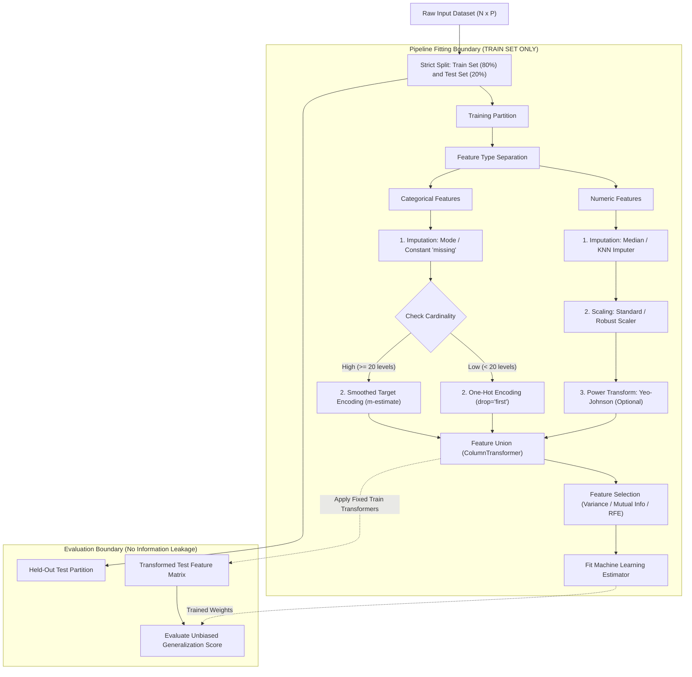

# Migration in progress
# Lesson 2: Summary and Assessment

## Data Preprocessing: Module Summary and Assessment

Data preprocessing establishes the mathematical foundation of machine learning systems, converting imperfect empirical records into structured numerical arrays. Raw collections exhibit missing attributes, non-standardized scales, extreme outliers, and unencoded categorical factors that break statistical assumptions and induce numerical instability. Synthesizing data quality dimensions, imputation mechanics, geometric feature scaling, cardinality-aware encodings, and strict pipeline isolation protocols equips engineers to prepare feature matrices while preventing data leakage.

## Synthesis of Core Week 2 Foundations

### Attribute Scales and Quality Verification

- **Stevens' measurement taxonomy:** Data features map to four hierarchical scales that determine permissible mathematical operations:
  - **Nominal:** Identity categories lacking intrinsic order (e.g., blood types); evaluates equality ($=, \neq$), summarized by the **mode**.
  - **Ordinal:** Ranked categories with undefined intervals (e.g., education tiers); evaluates inequality ($<, >$), summarized by the **median**.
  - **Interval:** Uniform continuous metric steps lacking true physical zero (e.g., Celsius temperature); evaluates differences ($+, -$), summarized by the **arithmetic mean**.
  - **Ratio:** Continuous metric steps possessing absolute physical zero (e.g., Kelvin, mass, revenue); evaluates multiplicative ratios ($\times, \div$), summarized by the **geometric mean**.
- **Data quality dimensions:** Verifying data viability requires auditing across six operational dimensions: **Accuracy** (agreement with real-world facts), **Completeness** (absence of unobserved nulls), **Consistency** (absence of contradictory cross-table entries), **Timeliness** (alignment with decision horizons), **Validity** (conformance to schema constraints), and **Uniqueness** (absence of duplicate records).

### Distributional Transformations and Outlier Management

- **Missing data mechanisms:**
  - **MCAR (Missing Completely at Random):** Missingness is independent of all attributes; listwise deletion yields unbiased parameter estimates but reduces sample size.
  - **MAR (Missing at Random):** Missingness depends on observed features; multivariate regression imputation (MICE) or KNN imputation restores unbiased estimates.
  - **MNAR (Missing Not at Random):** Missingness depends directly on the unobserved value itself; requires modeling missingness explicitly via binary indicator flags.
- **Outlier detection:**
  - **Tukey's Fences:** Establishes non-parametric boundaries using the Interquartile Range ($\text{IQR} = Q_3 - Q_1$): $[\text{Lower} = Q_1 - 1.5 \times \text{IQR}, \; \text{Upper} = Q_3 + 1.5 \times \text{IQR}]$.
  - **Winsorization:** Caps extreme outliers at fixed percentile thresholds ($P_1$ and $P_{99}$) rather than deleting observations, preserving sample size without distorting scale.
- **Feature scaling protocols:**
  - **Min-Max Normalization:** Linearly compresses features to a rigid interval ($[0, 1]$): $x_{\text{norm}} = \frac{x - x_{\min}}{x_{\max} - x_{\min}}$. Sensitive to extreme outliers.
  - **Z-Score Standardization:** Rescales features to zero mean and unit variance: $x_{\text{std}} = \frac{x - \mu}{\sigma}$. Unbounded and robust for Gaussian distributions.
  - **Robust Scaling:** Uses median centering and IQR scaling: $x_{\text{robust}} = \frac{x - Q_2}{Q_3 - Q_1}$, resisting outlier distortion.
  - **Power transformations:** Box-Cox ($x > 0$) and Yeo-Johnson (arbitrary real values) stabilize variance and correct skewed distributions toward Gaussian bell curves.

### Cardinality-Aware Categorical Encodings

- **One-Hot Encoding:** Maps categories into $K$ binary indicator columns. To prevent the **dummy variable trap** (perfect multicollinearity where $\sum x_k = 1.0$) in linear models with intercept terms, drop the reference category (`drop='first'`), allocating $K - 1$ columns.
- **Ordinal Encoding:** Encodes ranked categories into integers ($0, 1, 2, \dots$); applying ordinal mapping to unordered nominal variables introduces false mathematical distance assumptions.
- **Target (Mean) Encoding:** Replaces high-cardinality levels with category target means ($\bar{y}_c$). To prevent target leakage and severe overfitting on rare categories, apply **smoothed target encoding**:
  $$S_c = \frac{n_c \bar{y}_c + m \bar{y}_{\text{global}}}{n_c + m}$$
  where $m$ is a smoothing weight that pulls small categories toward the global prior.

### The Strict Training Isolation Boundary

- **Data Leakage:** Occurs when information from validation or test splits influences preprocessing transformations prior to model fitting.
- **The Pipeline Isolation Rule:** Compute all scaling statistics (means $\mu$, standard deviations $\sigma$, minimums, maximums, imputation medians, target encoding dictionaries) strictly from the **training partition**.
- Apply these saved, static parameters to transform validation and test partitions without re-estimating metrics.

> [!Tip]
> **Encapsulate transformations inside pipeline objects**: wrapping imputation, scaling, and encoding within scikit-learn Pipeline structures guarantees that transformation statistics fit strictly on training splits during cross-validation.

## The Modular Feature Preprocessing Architecture

> [!Important]
> **Isolate preprocessing branches by data type**: process numeric attributes through median imputation and robust scaling, while routing categorical attributes through mode imputation and cardinality-appropriate encodings before recombining.

## Comprehensive Preprocessing Transformations Matrix

| Transformation Method | Mathematical Formulation | Output Range / Type | Outlier Sensitivity | Primary Operational Advantage | Known Failure Mode / Hazard |
|---|---|---|---|---|---|
| **Min-Max Scaling** | $\frac{x - x_{\min}}{x_{\max} - x_{\min}}$ | Fixed: $[0, 1]$ or $[a, b]$ | High | Preserves exact zero values and distribution shape | Extreme outliers compress normal data into tiny sub-intervals |
| **Z-Score Standardization**| $\frac{x - \mu}{\sigma}$ | Continuous: $\approx [-3, +3]$ | Moderate | Centers data for gradient descent and linear models | Outliers distort sample mean and standard deviation |
| **Robust Scaling** | $\frac{x - Q_2}{Q_3 - Q_1}$ | Continuous: centered at $0$ | **Low** (Outlier-resistant) | Uses median and IQR; unaffected by extreme values | Does not restrict values to a bounded interval |
| **Yeo-Johnson Transform** | Piecewise power transformation | Continuous: Gaussian bell curve | Moderate | Stabilizes variance; handles zero and negative numbers | Computationally heavy maximum likelihood estimation |
| **One-Hot Encoding** | Binary indicator columns: $x \in \{0, 1\}^K$ | Sparse binary vectors | Low | Zero metric distortion for unordered nominal variables | Dummy variable trap; memory explosion on high cardinality |
| **Smoothed Target Encoding**| $\frac{n_c \bar{y}_c + m \bar{y}_{\text{global}}}{n_c + m}$ | Continuous: $[0, 1]$ scalar | Moderate | Compresses high cardinality into a single informative column | Target leakage risk without proper out-of-fold estimation |
| **KNN Imputation** | $\frac{\sum w_{ij} x_{jk}}{\sum w_{ij}}, \; w_{ij} = \frac{1}{d(x_i, x_j)}$ | Continuous or categorical | Moderate | Preserves multivariate feature covariance relationships | Computationally slow ($O(N^2)$); sensitive to unscaled inputs |

> [!Tip]
> **Use RobustScaler when outliers must be preserved**: RobustScaler centers on the median and scales by the Interquartile Range, providing clean normalization without letting extreme anomalies distort typical feature values.

## Assessment Preparation

### Conceptual Review Questions

- **Question 1 (Algebraic Proof of the Dummy Variable Trap):** Prove algebraically why encoding a categorical attribute possessing $K$ distinct levels into $K$ binary columns causes singular matrix inversion failure in linear regression models with an intercept.
  - *Answer:* In linear regression, parameter weights are solved via the normal equation: $\hat{\beta} = (X^T X)^{-1} X^T y$. The design matrix $X \in \mathbb{R}^{N \times (K+1)}$ contains an initial column of ones representing the intercept term $x_0 = \mathbf{1}$, alongside $K$ binary indicator columns $x_1, \dots, x_K$ generated by one-hot encoding. Because every observation belongs to exactly one category, the sum of all indicator columns across any row equals one:
    $$\sum_{k=1}^K x_{ik} = 1.0 = x_{i0} \quad \forall i \in \{1, \dots, N\}$$
    This creates an exact linear dependency between the intercept column and the $K$ dummy columns:
    $$x_0 - \sum_{k=1}^K x_k = \mathbf{0}$$
    Consequently, matrix $X$ does not have full column rank ($\text{rank}(X) \le K < K + 1$), making the square matrix $X^T X$ singular with a determinant of zero ($\det(X^T X) = 0$). The matrix inverse $(X^T X)^{-1}$ is undefined. Dropping one reference category (`drop='first'`) removes the linear dependency, restoring full rank and enabling matrix inversion.
- **Question 2 (Mathematical Constraints of Power Transformations):** Why is the Box-Cox transformation restricted strictly to positive values ($x > 0$), and how does the Yeo-Johnson formulation modify the objective to support negative values?
  - *Answer:* The Box-Cox transformation is defined as $x^{(\lambda)} = \frac{x^\lambda - 1}{\lambda}$ for $\lambda \neq 0$, and $\ln(x)$ for $\lambda = 0$. For non-integer values of $\lambda$, evaluating $x^\lambda$ on negative numbers generates imaginary complex numbers, while $\ln(x)$ is undefined for $x \le 0$. The **Yeo-Johnson transformation** resolves this by defining a piecewise function: for non-negative values ($x \ge 0$), it applies a shifted power transformation $\frac{(x + 1)^\lambda - 1}{\lambda}$; for negative values ($x < 0$), it applies an inverted power transformation $-\frac{(-x + 1)^{2 - \lambda} - 1}{2 - \lambda}$ (and $-\ln(-x + 1)$ when $\lambda = 2$). Adding $1$ to positive values and processing magnitudes of negative values ensures arguments remain strictly positive before exponentiation, providing smooth, invertible variance stabilization across the entire real number line.
- **Question 3 (The Derivation of Tukey's 1.5 Multiplier for Outlier Fences):** Why did John Tukey set the outlier fence threshold at $1.5 \times \text{IQR}$ rather than $1.0 \times \text{IQR}$ or $2.0 \times \text{IQR}$?
  - *Answer:* Tukey designed the $1.5 \times \text{IQR}$ multiplier under the assumption of a standard Gaussian distribution $\mathcal{N}(\mu, \sigma^2)$. In a normal distribution, the 25th and 75th percentiles evaluate to $Q_1 = \mu - 0.6745\sigma$ and $Q_3 = \mu + 0.6745\sigma$, yielding an interquartile range of $\text{IQR} = 1.349\sigma$. Evaluating the upper fence with multiplier $k = 1.5$:
    $$\text{Upper Fence} = Q_3 + 1.5 \times \text{IQR} = (\mu + 0.6745\sigma) + 1.5(1.349\sigma) = \mu + 0.6745\sigma + 2.0235\sigma \approx \mu + 2.698\sigma$$
    Under a Gaussian distribution, the probability of an observation exceeding $\mu \pm 2.7\sigma$ evaluates to approximately $0.7\%$ ($P(|Z| > 2.698) \approx 0.007$). Setting the multiplier to $1.0$ would place fences at $\approx \mu \pm 2.02\sigma$, flagging roughly $4.3\%$ of normal data as outliers (too aggressive). Setting the multiplier to $2.0$ would place fences at $\approx \mu \pm 3.37\sigma$, flagging only $0.07\%$ (missing subtle anomalies). The $1.5$ multiplier balances sensitivity and specificity, isolating genuine distributional tails while preserving normal observations.
- **Question 4 (The Mechanics of Out-of-Fold Target Encoding):** Why does naive target encoding cause severe overfitting even on large datasets, and how does K-Fold target encoding eliminate this bias?
  - *Answer: