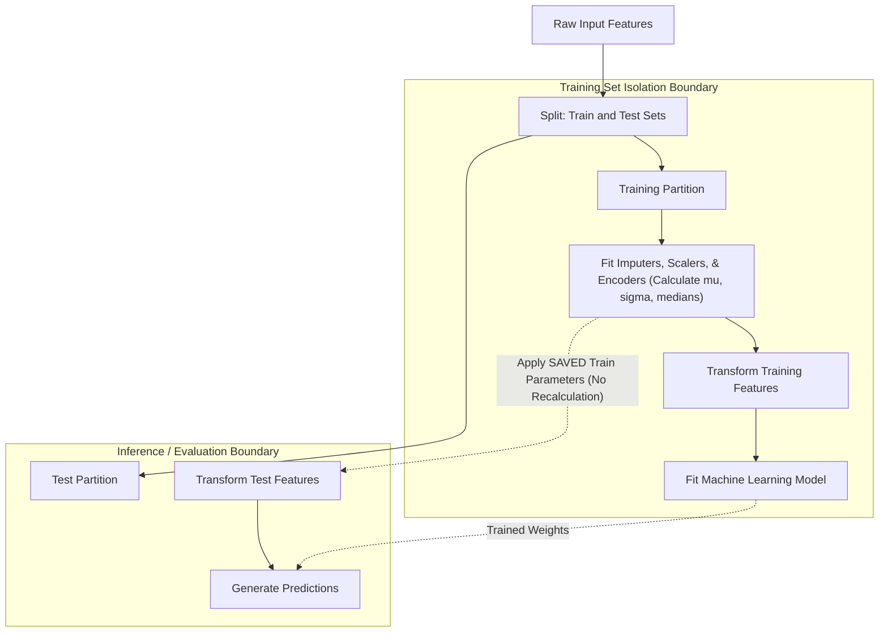

# Week 2: Data Preprocessing

## Data Preprocessing: Cleaning, Transformation, and Feature Engineering

Data preprocessing transforms raw, imperfect empirical records into structured numerical arrays suitable for statistical modeling. Raw data collections exhibit missing values, measurement noise, extreme outliers, non-standardized scales, and unencoded categorical factors that degrade model convergence and distort geometric distance metrics. Establishing rigorous data imputation protocols, non-linear distribution transformations, cardinality-aware encodings, and strict validation boundaries prevents data leakage while optimizing machine learning pipelines.

## Data Cleaning and Missing Value Imputation

### The Taxonomy of Missing Data Mechanisms

- Understanding why data points are missing dictates the appropriate mathematical remediation strategy:
  - **Missing Completely at Random (MCAR):** The probability of an attribute missing is independent of both observed attributes and unobserved target values:
    $$P(M \mid Y_{\text{obs}}, Y_{\text{mis}}) = P(M)$$
    Missingness represents an unbiased random subsample; listwise deletion yields unbiased parameter estimates but reduces sample size.
  - **Missing at Random (MAR):** The probability of missingness depends systematically on observed attributes, but is independent of the missing value itself:
    $$P(M \mid Y_{\text{obs}}, Y_{\text{mis}}) = P(M \mid Y_{\text{obs}})$$
    Imputing missing values using observed features restores unbiased estimates.
  - **Missing Not at Random (MNAR):** The probability of missingness depends directly on the unobserved value itself (e.g., high-income earners refusing to disclose wealth):
    $$P(M \mid Y_{\text{obs}}, Y_{\text{mis}}) \neq P(M \mid Y_{\text{obs}})$$
    Standard statistical imputation produces biased models; remediation requires modeling the missingness mechanism directly through explicit missingness indicators.

### Deletion Strategies Versus Statistical Imputation

- **Complete-Case Analysis (Listwise Deletion):** Discards any observation row containing one or more missing fields. If missingness affects multiple features independently, listwise deletion discards substantial data volumes, exacerbating variance and introducing selection bias if data is not MCAR.
- **Univariate Statistical Imputation:** Replaces missing coordinates with a single summary statistic calculated from observed values:
  - *Mean Imputation:* Imputes the arithmetic mean $\mu$; suitable strictly for symmetric, normally distributed continuous data, but distorts feature variance downward.
  - *Median Imputation:* Imputes the 50th percentile ($Q_2$); robust against skewed distributions and heavy-tailed outliers.
  - *Mode Imputation:* Replaces missing values with the most frequent categorical state; standard for discrete nominal attributes.
- Univariate imputation suppresses natural feature variance ($\sigma^2 \downarrow$) and artificially inflates covariance correlations, as multiple records receive identical scalar values.

### Multivariate and Algorithmic Imputation Models

- Multivariate imputation preserves feature relationships by estimating missing attributes conditionally from observed covariates:
  - **K-Nearest Neighbors (KNN) Imputation:** Identifies the $K$ most similar complete records using Euclidean distance over observed features and calculates a distance-weighted average of their attribute values:
    $$x_{ik} = \frac{\sum_{j \in N_K(i)} w_{ij} x_{jk}}{\sum_{j \in N_K(i)} w_{ij}}, \quad w_{ij} = \frac{1}{\|x_i - x_j\|_2}$$
  - **Iterative Imputer (MICE / Chained Equations):** Models each feature with missing values as a function of all other features via round-robin iterative regression. It updates missing entries sequentially across multiple cycles until convergence.

> [!Important]
> **Imputation suppresses feature variance**: replacing missing values with univariate means or medians artificially reduces variance and inflates correlation peaks; use multivariate iterative regression or KNN imputation to preserve underlying joint feature distributions.

## Outlier Detection and Treatment

### Parametric Z-Score Filtering

- The **Z-score method** measures the distance between an observation $x_i$ and the sample mean in units of standard deviation:
  $$Z_i = \frac{x_i - \mu}{\sigma}$$
- Assuming an underlying Gaussian distribution ($\mathcal{N}(\mu, \sigma^2)$), the empirical rule dictates that $99.73\%$ of observations lie within three standard deviations.
- Observations satisfying $|Z_i| > 3.0$ are flagged as statistical outliers.
- The standard Z-score is vulnerable to **masking**: extreme outliers inflate the sample mean $\mu$ and standard deviation $\sigma$, reducing their own computed Z-scores.
- **Modified Z-Score:** Substitutes the median and **Median Absolute Deviation (MAD)** to provide outlier-resistant parametric filtering:
  $$M_i = \frac{0.6745(x_i - \text{median})}{\text{MAD}}, \quad \text{MAD} = \text{median}(|x_i - \text{median}|)$$

### Non-Parametric Interquartile Range (IQR) Trimming

- John Tukey's **IQR method** operates without parametric distribution assumptions, identifying anomalies via ranking percentiles.
- Define the **Interquartile Range** as the difference between the 75th percentile ($Q_3$) and the 25th percentile ($Q_1$):
  $$\text{IQR} = Q_3 - Q_1$$
- Establish **Tukey's Fences** to isolate outlier boundaries:
  $$\text{Lower Bound} = Q_1 - 1.5 \times \text{IQR}$$
  $$\text{Upper Bound} = Q_3 + 1.5 \times \text{IQR}$$
- Observations lying outside these fences are categorized as mild outliers; replacing the multiplier with $3.0$ identifies extreme outliers.

### Winsorization and Algorithmic Isolation

- Rather than deleting rows containing outliers, which reduces sample size and introduces survival bias, practitioners deploy non-destructive treatment protocols:
  - **Winsorization (Capping):** Clamps extreme values to specific percentile boundaries (e.g., setting all values below the 1st percentile to $P_1$, and all values above the 99th percentile to $P_{99}$):
    $$x_i^{\text{capped}} = \min(\max(x_i, P_1), P_{99})$$
  - **Isolation Forests:** An unsupervised tree ensemble that isolates anomalies by recursively generating random axis-aligned splits. Because outliers occupy sparse regions of feature space, they require fewer random splits to isolate, yielding significantly shorter path lengths in isolation trees.

> [!Tip]
> **Winsorize instead of deleting**: capping outliers at predefined percentiles ($P_1$ and $P_{99}$) bounds extreme values without reducing training dataset size or discarding valuable signal.

## Feature Scaling and Non-Linear Distribution Transformations

### The Mathematical Necessity of Geometric Scaling

- Unscaled features with disparate numerical scales degrade machine learning algorithms that rely on gradient descent or geometric distance calculations:
  - **Gradient Descent Convergence:** In an unscaled objective surface, gradients along large-scale features dominate updates, creating narrow ravines that force optimizers into slow zig-zag oscillations.
  - **Distance-Based Metrics:** In algorithms relying on Euclidean distances (KNN, K-Means, SVMs, PCA), an attribute with range $[0, 100,000]$ dominates an attribute with range $[0, 1]$, making the smaller feature mathematically irrelevant:
    $$d(x, y) = \sqrt{(100,000 - 10,000)^2 + (1.0 - 0.2)^2} \approx 90,000$$
  - **Regularization Penalties:** $L_1$ and $L_2$ penalties shrink weights uniformly ($\lambda \sum w_j^2$). Features with large scales receive small weights and escape regularization, while small-scale features receive large weights and are penalized disproportionately.

### Min-Max Normalization Versus Z-Score Standardization

- **Min-Max Scaling (Normalization):** Linearly shifts and scales continuous features into a bounded interval, typically $[0, 1]$:
  $$x_{\text{norm}} = \frac{x - x_{\min}}{x_{\max} - x_{\min}}$$
  Normalization preserves exact zero values and original distribution shape, but compresses normal data into tiny sub-intervals if extreme outliers exist.
- **Z-Score Standardization:** Rescales data to have a mean of zero and a variance of one:
  $$x_{\text{std}} = \frac{x - \mu}{\sigma}$$
  Standardization does not bound features to a fixed numerical range, allowing extreme values to exist without compressing typical observations.

### Robust Scaling via Median and Interquartile Bounds

- When datasets contain unavoidable, extreme outliers, both Min-Max and Z-Score scaling yield distorted parameters because minimums, maximums, means, and variances are sensitive to extreme points.
- **Robust Scaler:** Centers features around the median and scales them by the Interquartile Range:
  $$x_{\text{robust}} = \frac{x - \text{median}(X)}{\text{IQR}(X)} = \frac{x - Q_2}{Q_3 - Q_1}$$
- Centering on the median and scaling by the 50% interquartile span prevents outliers from influencing scaling parameters.

### Power Transformations: Box-Cox and Yeo-Johnson

- Highly skewed, non-Gaussian feature distributions violate the assumptions of linear regression, logistic models, and discriminant analysis.
- **Power transformations** stabilize feature variance and map skewed distributions closer to a Gaussian bell curve:
  - **Box-Cox Transformation:** Parameterized by scalar $\lambda$, restricted strictly to strictly positive values ($x > 0$):
    $$x^{(\lambda)} = \begin{cases} \frac{x^\lambda - 1}{\lambda} & \text{if } \lambda \neq 0 \\ \ln(x) & \text{if } \lambda = 0 \end{cases}$$
  - **Yeo-Johnson Transformation:** Modifies Box-Cox to support zero and negative real values:
    $$x^{(\lambda)} = \begin{cases} \frac{(x + 1)^\lambda - 1}{\lambda} & \text{if } \lambda \neq 0, \; x \ge 0 \\ \ln(x + 1) & \text{if } \lambda = 0, \; x \ge 0 \\ -\frac{(-x + 1)^{2 - \lambda} - 1}{2 - \lambda} & \text{if } \lambda \neq 2, \; x < 0 \\ -\ln(-x + 1) & \text{if } \lambda = 2, \; x < 0 \end{cases}$$
- Optimal values for $\lambda$ are estimated via maximum likelihood estimation across candidate parameters.

> [!Important]
> **Match scalers to data distributions**: use Min-Max scaling for bounded image pixels, Z-score standardization for Gaussian distributions, Robust Scaler for heavy outlier presences, and Yeo-Johnson transformations to correct skewed data.

## Categorical Variable Encoding Strategies

### Nominal Encodings: One-Hot and the Dummy Variable Trap

- **One-Hot Encoding:** Constructs $K$ binary indicator columns for a categorical attribute possessing $K$ distinct levels.
- **The Dummy Variable Trap (Multicollinearity):** In linear regression and logistic models that include an intercept term, the sum of all $K$ indicator columns equals a vector of ones:
  $$\sum_{k=1}^K x_{ik} = 1.0$$
- This creates an exact **linear dependency** (singular matrix $X^T X$), preventing matrix inversion during normal equation solving.
- Mitigate multicollinearity by dropping one baseline category (`drop='first'`), allocating $K - 1$ columns to represent $K$ states.

### Ordinal Encodings and Structural Hierarchy

- **Ordinal Encoding:** Maps ordered categorical factors to monotonically ascending integer ranks:
  $$\text{Low} \to 0, \quad \text{Medium} \to 1, \quad \text{High} \to 2$$
- Ordinal encoding preserves rank order while allocating only a single column, saving memory.
- Applying ordinal encoding to *nominal* categories without intrinsic order (e.g., mapping countries to integers) introduces false mathematical assumptions, forcing linear models to treat Country 2 as mathematically twice the value of Country 1.

### High-Cardinality Representations: Target and Binary Encoding

- High-cardinality attributes (e.g., zip codes, product IDs with $> 1,000$ categories) cause one-hot encoding to create wide, sparse matrices that trigger memory bottlenecks and tree-splitting inefficiencies.
- **Target (Mean) Encoding:** Replaces each categorical level with the empirical mean of the target variable observed for that level:
  $$\hat{x}_c = \mathbb{E}[y \mid x = c]$$
- **Target Leakage Risk:** Using raw target means allows the target variable to leak into input features, producing extreme overfitting on rare categories.
- **Smoothed Target Encoding:** Regularizes class means with global population priors using a smoothing parameter $m$:
  $$S_c = \frac{n_c \cdot \bar{y}_c + m \cdot \bar{y}_{\text{global}}}{n_c + m}$$
  where $n_c$ is the sample count for category $c$, $\bar{y}_c$ is the category target mean, and $\bar{y}_{\text{global}}$ is the dataset-wide target mean.
- **Binary Encoding:** Converts integer ranks into binary digits and splits bits into individual columns, compressing $K$ categories into $\lceil \log_2 K \rceil$ columns.

> [!Tip]
> **Smooth target encoding on high cardinality**: replacing high-cardinality nominal variables with target means regularized by global priors ($m$) prevents sparse matrix explosion while avoiding target leakage.

## Feature Selection and Engineering Architectures

### Filter Methods: Statistical Hypothesis Tests and Mutual Information

- **Filter methods** rank and select input attributes independently of model training based on statistical associations with the target:
  - **Variance Threshold:** Drops constant or near-constant features whose variance falls below a threshold $\tau$:
    $$\text{Var}(X) = \frac{1}{N} \sum_{i=1}^N (x_i - \mu)^2 < \tau$$
  - **Pearson Correlation ($r$):** Evaluates linear association for continuous features:
    $$r = \frac{\sum (x - \bar{x})(y - \bar{y})}{\sqrt{\sum (x - \bar{x})^2 \sum (y - \bar{y})^2}}$$
  - **ANOVA F-Test:** Evaluates variance ratios between continuous features across discrete categorical classes.
  - **Chi-Square ($\chi^2$) Test:** Measures statistical independence between discrete categorical features and discrete class targets.
  - **Mutual Information (MI):** Quantifies non-linear dependency based on Shannon entropy:
    $$I(X; Y) = \iint p(x, y) \ln\left( \frac{p(x, y)}{p(x) p(y)} \right) dx \, dy$$

### Wrapper Methods: Recursive Feature Elimination (RFE)

- **Wrapper methods** treat feature selection as a search problem, evaluating subsets using an external machine learning model.
- **Recursive Feature Elimination (RFE):**
  1. Train an estimator model on the complete set of $P$ features.
  2. Compute feature importance metrics (e.g., linear regression coefficients $|w_j|$ or tree impurity gains).
  3. Prune the least important feature (or fraction of features).
  4. Retrain the model on the remaining subset and repeat until the target feature count remains.
- Wrapper methods capture feature interactions, but are computationally expensive ($O(P^2)$ model fits).

### Embedded Methods: Regularization Penalties and Permutation Importance

- **Embedded methods** integrate feature selection directly into model parameter optimization:
  - **$L_1$ Lasso Regularization:** Adds an absolute norm penalty ($\lambda \sum |w_j|$) to linear loss objectives, driving uninformative feature coefficients to exact zero during gradient descent.
  - **Tree Impurity Importance (MDI):** Evaluates total Gini impurity or variance reduction contributed by each feature across all splits in an ensemble.
  - **Permutation Feature Importance:** Measures the decrease in validation score after randomly shuffling the values of a single feature; if shuffling degrades model score significantly, the feature contains essential predictive signal.

> [!Important]
> **Filter methods are fast, while embedded methods model interactions**: use statistical filter methods (Mutual Information, Variance Threshold) for quick initial pruning, and use embedded regularizers ($L_1$ Lasso) to select interacting features during model training.

## Comparative Matrices of Preprocessing Transformations

| Scaling Technique | Mathematical Formulation | Output Numerical Range | Outlier Robustness | Optimal Algorithmic Use Case |
|---|---|---|---|---|
| **Min-Max Scaler** | $\frac{x - x_{\min}}{x_{\max} - x_{\min}}$ | Fixed: $[0, 1]$ or $[a, b]$ | **Poor** (compressed by extremes) | Neural network inputs; image pixel matrices ($[0, 255] \to [0, 1]$) |
| **Standard Scaler** | $\frac{x - \mu}{\sigma}$ | Unbounded ($\approx [-3, +3]$) | Moderate (mean/std influenced by outliers) | Linear Regression, Logistic Regression, PCA, Support Vector Machines |
| **Robust Scaler** | $\frac{x - Q_2}{Q_3 - Q_1}$ | Unbounded | **High** (uses median and IQR) | Datasets containing extreme measurement outliers or anomalies |
| **MaxAbs Scaler** | $\frac{x}{\|x\|_{\max}}$ | Fixed: $[-1, 1]$ | Poor | Sparse matrices (preserves exact zero-valued entries) |
| **Yeo-Johnson** | Piecewise power transformation | Continuous bell curve | Moderate | Highly skewed continuous variables with negative values |

### Categorical Encoding Strategies Comparison

| Encoding Method | Output Column Complexity | Preserves Order? | Multicollinearity Vulnerability | Risk of Overfitting / Target Leakage |
|---|---|---|---|---|
| **One-Hot Encoding** | Expands to $K$ (or $K-1$) columns | No (nominal) | High (requires dropping first category) | Low (purely structural representation) |
| **Ordinal Encoding** | Preserves solitary column ($1$) | **Yes** (strict integer rank) | None | Low |
| **Target Encoding** | Preserves solitary column ($1$) | No | Low | **High** (requires smoothing $m$ and K-fold out-of-fold estimation) |
| **Binary Encoding** | Compresses to $\lceil \log_2 K \rceil$ columns | No | Low | Low |
| **Frequency Encoding** | Preserves solitary column ($1$) | No | Low | Low (may assign identical values to distinct categories) |

> [!Tip]
> **Use One-Hot encoding for low cardinality, and smoothed target encoding for high cardinality**: allocate binary columns for categories with under 20 levels, and switch to target encoding with prior smoothing for variables exceeding 100 levels.

## Key Takeaways

- **Data preprocessing establishes model generalization**: machine learning models extract patterns from preprocessed numerical tensors; unhandled missing values, unscaled ranges, and unencoded factors break convergence.
- **Identify missing data mechanisms early**: MCAR allows listwise deletion without bias, while MAR requires multivariate statistical imputation, and MNAR requires modeling the missingness mechanism directly.
- **Multivariate imputation (KNN, MICE) preserves covariance relationships**, avoiding the artificial variance collapse caused by simple mean substitution.
- **Outliers distort mean and variance estimates**: use Tukey's IQR fences or Winsorization capping to bound extreme values without reducing sample size.
- **Feature scaling balances gradient updates and distance metrics**, preventing attributes with large raw scales from dominating Euclidean distances.
- **Prevent multicollinearity in one-hot encodings** by dropping the first category column (`drop='first'`) when training linear models with intercept terms.
- **High-cardinality categorical variables demand smoothed target encoding or binary encoding** to prevent wide, sparse matrix explosions.
- **Strict pipeline isolation prevents data leakage**: all preprocessing statistics (means, medians, scaling parameters, target encodings) must be estimated strictly from the training partition and applied without recalculation to validation and test splits.

> [!Tip]
> The foundational rule of data preprocessing: **transformers must be fit on training data alone**; encapsulating imputation, scaling, and encoding within unified pipeline objects guarantees that future test statistics never leak into model training.
