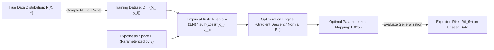
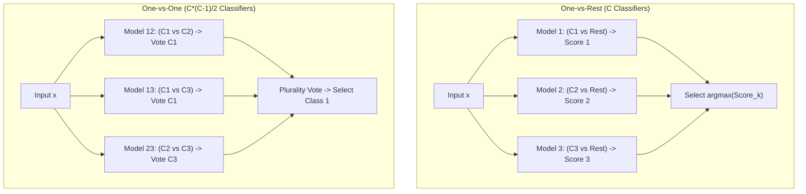

# Lesson 1: Supervised Learning Fundamentals 

## Supervised Learning Fundamentals and Problem Formulation

Supervised learning formulates predictive modeling as a mathematical optimization problem over an empirical dataset of paired feature vectors and ground-truth targets. The learning algorithm searches an unobserved hypothesis space to discover a mapping function that generalizes beyond training samples to unseen data drawn from the true data-generating distribution. Analyzing the statistical problem formulation, the foundational duality between regression and classification, the mathematical dichotomy between generative and discriminative models, and multiclass decomposition strategies establishes the analytical framework for supervised prediction.

## The Formal Mathematical Framework of Supervised Learning

### Input-Output Spaces and the Underlying Data Distribution

- Let $\mathcal{X} \subseteq \mathbb{R}^D$ denote the **input domain (feature space)**, representing the set of all possible $D$-dimensional feature vectors.
- Let $\mathcal{Y}$ denote the **target domain (label space)**, representing the set of all permissible supervisory outputs.
- Nature generates observations according to an unknown, fixed joint probability distribution $P(X, Y)$ over $\mathcal{X} \times \mathcal{Y}$.
- The learner receives an empirical training dataset $\mathcal{D}$ consisting of $N$ independent and identically distributed (i.i.d.) observations drawn from $P(X, Y)$:
  $$\mathcal{D} = \{(x^{(1)}, y^{(1)}), (x^{(2)}, y^{(2)}), \dots, (x^{(N)}, y^{(N)})\} \sim P(X, Y)^N$$

### The Hypothesis Space and Parameterized Mappings

- An algorithm predetermines a **hypothesis space** $\mathcal{H}$, defined as the family of candidate functions mapping inputs to outputs:
  $$\mathcal{H} = \{f_\theta: \mathcal{X} \to \mathcal{Y} \mid \theta \in \Theta\}$$
  where $\Theta \subseteq \mathbb{R}^P$ represents the parameter space.
- Restricting the hypothesis space (e.g., considering only linear functions $f(x) = w^T x + b$) introduces **inductive bias**, constraining the functional forms the algorithm can explore.
- A **loss function** $\ell: \mathcal{Y} \times \mathcal{Y} \to \mathbb{R}^+$ quantifies the operational penalty incurred when the model predicts $\hat{y} = f_\theta(x)$ while the true target is $y$.

### Expected Risk Versus Empirical Risk Minimization (ERM)

- The ultimate objective of supervised learning is minimizing the **expected risk (true generalization error)** across the full data distribution $P(X, Y)$:
  $$R(f_\theta) = \mathbb{E}_{(x, y) \sim P} [\ell(f_\theta(x), y)] = \int_{\mathcal{X} \times \mathcal{Y}} \ell(f_\theta(x), y) \, dP(x, y)$$
- Because the distribution $P(X, Y)$ is unobservable, evaluating $R(f_\theta)$ directly is mathematically impossible.
- The **Empirical Risk Minimization (ERM)** inductive principle approximates expected risk using the average loss observed over the training sample $\mathcal{D}$:
  $$R_{\text{emp}}(f_\theta) = \frac{1}{N} \sum_{i=1}^N \ell(f_\theta(x^{(i)}), y^{(i)})$$
- Optimization algorithms search for optimal parameter weights $\theta^*$ that minimize this empirical surrogate:
  $$\theta^* = \arg\min_{\theta \in \Theta} R_{\text{emp}}(f_\theta)$$

> [!Important]
> **Empirical Risk Minimization proxies true generalization**: because the true data-generating distribution $P(X, Y)$ is unknown, supervised learning minimizes sample loss $R_{\text{emp}}$ as a computable statistical proxy for expected generalization risk $R(f)$.

## The Core Duality: Regression Versus Classification

### Continuous Regression and Conditional Expectations

- In **regression**, the label space is continuous: $\mathcal{Y} \subseteq \mathbb{R}$ (or $\mathbb{R}^K$ for multivariate regression).
- The theoretical optimal prediction under squared error loss ($\ell(y, \hat{y}) = (y - \hat{y})^2$) is the **conditional expectation (regression function)**:
  $$f^*(x) = \mathbb{E}[Y \mid X = x] = \int_{\mathcal{Y}} y \, P(y \mid x) \, dy$$
- Common regression loss functions:
  - *Squared Loss ($L_2$ Loss):* $\ell(y, \hat{y}) = (y - \hat{y})^2$. Penalizes large residuals quadratically, estimating the conditional mean $\mathbb{E}[Y \mid X]$.
  - *Absolute Loss ($L_1$ Loss):* $\ell(y, \hat{y}) = |y - \hat{y}|$. Penalizes residuals linearly, estimating the conditional median $\text{Median}(Y \mid X)$ and providing robustness against outliers.
  - *Huber Loss:* Blends quadratic convergence near zero error with linear outlier resistance for residuals exceeding threshold $\delta$.

### Discrete Classification and Decision Boundary Geometry

- In **classification**, the label space is a discrete categorical set: $\mathcal{Y} = \{1, 2, \dots, C\}$ (or $\{-1, +1\}$ for binary tasks).
- The goal is partitioning the feature space $\mathcal{X}$ into $C$ mutually exclusive **decision regions** $\{\mathcal{R}_1, \dots, \mathcal{R}_C\}$, separated by geometric **decision boundaries**:
  $$\mathcal{R}_k = \{x \in \mathcal{X} \mid f(x) = k\}$$
- Under ideal $0-1$ loss, the optimal classifier is the **Bayes optimal classifier**, which selects the class maximizing the posterior probability:
  $$f_{\text{Bayes}}^*(x) = \arg\max_{c \in \{1, \dots, C\}} P(Y = c \mid X = x)$$
- The decision boundary separating class $j$ and class $k$ represents the geometric surface where posterior probabilities tie:
  $$\mathcal{B}_{jk} = \{x \in \mathcal{X} \mid P(Y = j \mid X = x) = P(Y = k \mid X = x)\}$$

### The Need for Convex Surrogate Loss Functions

- The natural loss function for classification is the discrete **$0-1$ misclassification loss**:
  $$\ell_{0-1}(y, \hat{y}) = \mathbf{1}[y \neq \hat{y}] = \begin{cases} 0 & \text{if } y = \hat{y} \\ 1 & \text{if } y \neq \hat{y} \end{cases}$$
- For a binary model with real-valued score $z = f_\theta(x)$ and target $y \in \{-1, +1\}$, the $0-1$ loss evaluates as a step function over the functional margin $y z$:
  $$\ell_{0-1}(y, z) = \mathbf{1}[y z \le 0]$$
- Minimizing empirical risk under $0-1$ loss across a dataset is non-convex, discontinuous, and **NP-hard**; the derivative is zero almost everywhere, making gradient-based optimization impossible.
- Supervised algorithms minimize smooth, **convex surrogate loss functions** that upper-bound the $0-1$ loss:
  - *Logistic Loss (Cross-Entropy):* $\ell_{\text{logistic}}(y, z) = \ln(1 + e^{-y z})$. Smooth and strictly convex; outputs posterior probability scores.
  - *Hinge Loss:* $\ell_{\text{hinge}}(y, z) = \max(0, 1 - y z)$. Convex and continuous, producing sparse support vector representations in SVMs.
  - *Exponential Loss:* $\ell_{\text{exp}}(y, z) = e^{-y z}$. Differentiable upper bound driving AdaBoost optimization.

> [!Tip]
> **Surrogate losses make classification computationally tractable**: because optimizing non-differentiable $0-1$ loss is NP-hard, machine learning algorithms optimize smooth convex surrogates like Cross-Entropy and Hinge loss using gradient descent.

## The Generative Versus Discriminative Modeling Paradigms

### Discriminative Modeling: Direct Boundary Estimation

- **Discriminative models** focus exclusively on learning the conditional distribution $P(Y \mid X)$ or discovering the decision boundary directly without modeling how features $X$ were generated.
- Parameter estimation maximizes conditional log-likelihood:
  $$\theta_{\text{disc}} = \arg\max_\theta \sum_{i=1}^N \ln P(Y = y^{(i)} \mid X = x^{(i)}; \theta)$$
- Examples include **Logistic Regression**, **Support Vector Machines (SVMs)**, **Decision Trees**, and **Neural Networks**.
- Discriminative models optimize classification performance directly, making efficient use of representational capacity by ignoring the complexity of feature distribution $P(X)$.

### Generative Modeling: Joint Distributions and Bayes' Inversion

- **Generative models** model the joint probability distribution $P(X, Y)$ by estimating two independent components:
  1. The **class prior probability**: $P(Y = c)$.
  2. The **class-conditional feature likelihood**: $P(X \mid Y = c)$.
- Parameters maximize the complete joint log-likelihood:
  $$\theta_{\text{gen}} = \arg\max_\theta \sum_{i=1}^N \ln P(X = x^{(i)}, Y = y^{(i)}; \theta) = \arg\max_\theta \sum_{i=1}^N \left( \ln P(X = x^{(i)} \mid Y = y^{(i)}) + \ln P(Y = y^{(i)}) \right)$$
- At inference time, the model applies **Bayes' rule** to invert the conditional distributions and evaluate class posteriors:
  $$P(Y = c \mid X = x) = \frac{P(X = x \mid Y = c) P(Y = c)}{\sum_{k=1}^C P(X = x \mid Y = k) P(Y = k)}$$
- Examples include **Naive Bayes**, **Linear Discriminant Analysis (LDA)**, **Quadratic Discriminant Analysis (QDA)**, and **Gaussian Mixture Models**.

### The Asymptotic Error and Sample Efficiency Tradeoff

- Andrew Ng and Michael Jordan (2002) formalized the foundational statistical trade-off between generative and discriminative pairs (e.g., Naive Bayes versus Logistic Regression):
  - **Sample Efficiency (Small $N$):** Generative models reach their asymptotic error rate faster, requiring only $O(\log D)$ training instances to converge because parameter estimates decouple across independent class-conditional distributions.
  - **Asymptotic Accuracy (Large $N$):** Discriminative models achieve a lower asymptotic error rate as dataset size $N \to \infty$, scaling as $O(D)$ sample complexity. If a generative model assumes incorrect distributional forms (such as feature independence in Naive Bayes), its asymptotic performance plateaus early.

> [!Important]
> **Generative models learn distributions; discriminative models learn boundaries**: generative models converge quickly on small sample sizes using Bayes' inversion, but discriminative models achieve superior classification accuracy on large datasets by optimizing boundaries directly.

## Multiclass Classification Decomposition Architectures

### One-vs-Rest (OvR) Formulation and Calibration Challenges

- The **One-vs-Rest (OvR / One-vs-All)** framework reduces a $C$-class classification problem into $C$ independent binary classification tasks.
- For each class $k \in \{1, \dots, C\}$:
  - Construct a binary dataset $\mathcal{D}_k$ where instances belonging to class $k$ receive target $+1$, and all instances belonging to the remaining $C-1$ classes receive target $-1$.
  - Train an independent binary classifier $f_k(x)$ producing a continuous confidence score $s_k(x) \in \mathbb{R}$.
- **Inference Protocol:** Evaluate an unseen query point $x$ across all $C$ models, assigning the instance to the class with the highest raw confidence score:
  $$\hat{y} = \arg\max_{k \in \{1, \dots, C\}} s_k(x)$$
- **Operational Vulnerabilities:**
  - *Class Imbalance:* Each binary sub-problem suffers from synthetic class imbalance; for a 20-class problem, the negative set is roughly 19 times larger than the positive set.
  - *Score Miscalibration:* Because the $C$ models train independently, their raw decision scores $s_k(x)$ operate on uncalibrated scales, making direct argmax comparisons vulnerable to scale distortions.

### One-vs-One (OvO) Formulation and Majority Voting Dynamics

- The **One-vs-One (OvO)** framework decomposes a $C$-class problem into all possible unique pairwise binary comparisons, allocating:
  $$M = \frac{C(C - 1)}{2} \text{ independent binary classifiers}$$
- For each unique pair of classes $(j, k)$ where $j < k$:
  - Train a binary classifier $f_{jk}(x)$ exclusively on the subset of data belonging to class $j$ (labeled $+1$) and class $k$ (labeled $-1$).
  - Instances belonging to all other classes are ignored during training.
- **Inference Protocol:** At evaluation time, pass query instance $x$ through all $\frac{C(C-1)}{2}$ pairwise classifiers:
  - Each classifier casts a discrete vote for its predicted class: $V_c = \sum_{j < k} \mathbf{1}[f_{jk}(x) = c]$.
  - The final prediction is selected via **majority voting (plurality)**:
    $$\hat{y} = \arg\max_{c \in \{1, \dots, C\}} V_c$$
- **Operational Advantages:** Each pairwise classifier trains on a small, balanced sub-dataset ($N_j + N_k \ll N$). When training algorithms scale with super-linear computational complexity (such as kernel SVMs scaling as $O(N^2)$ to $O(N^3)$), OvO trains faster than OvR despite requiring more models.

### Direct Multiclass Generalizations

- While OvR and OvO decompose multiclass problems externally, certain algorithms generalize to arbitrary $C$-class settings natively:
  - **Multinomial Logistic Regression (Softmax Regression):** Replaces binary sigmoids with a normalized exponential Softmax layer over $C$ linear score functions.
  - **Decision Trees and Random Forests:** Evaluate multi-class Gini impurity directly across multi-class distributions without binarization.
  - **Neural Networks:** Allocate $C$ neurons in the output layer paired with Categorical Cross-Entropy loss.

> [!Tip]
> **Use OvO for super-linear models and OvR for linear models**: One-vs-One evaluates pairwise subsets that accelerate $O(N^2)$ algorithms like kernel SVMs, while One-vs-Rest trains fewer total models, making it preferable for linear classifiers.

## Comparative Matrix of Modeling Paradigms and Decomposition Strategies

| Dimension | Discriminative Classification | Generative Classification | Continuous Regression |
|---|---|---|---|
| **Target Space ($\mathcal{Y}$)** | Discrete categorical: $\{1, \dots, C\}$ | Discrete categorical: $\{1, \dots, C\}$ | **Continuous real-valued**: $\mathbb{R}^K$ |
| **Probabilistic Core** | Models conditional posterior $P(Y \mid X)$ | Models joint distribution $P(X, Y) = P(X \mid Y)P(Y)$ | Models conditional expectation $\mathbb{E}[Y \mid X]$ |
| **Inference Mechanism** | Evaluates $\arg\max_y P(Y \mid X)$ directly | Applies Bayes' rule to invert likelihoods | Directly evaluates continuous function $f(x)$ |
| **Missing Feature Handling** | Difficult; requires input imputation | **Native**; marginalizes over unobserved $X$ | Requires input imputation prior to prediction |
| **Outlier Detection Utility** | Low; forces arbitrary class assignments | **High**; flags low marginal density $P(X)$ | Analyzes residual error magnitudes |
| **Asymptotic Sample Scaling** | Lower asymptotic error as $N \to \infty$ | Reaches asymptotic error bound at small $N$ | Governed by functional complexity of $f(x)$ |
| **Representative Models** | Logistic Regression, Linear SVM, MLPs | Naive Bayes, Linear Discriminant Analysis | Ordinary Least Squares, Ridge, Lasso |

### Multiclass Decomposition Tradeoffs: One-vs-Rest Versus One-vs-One

| Operational Attribute | One-vs-Rest (OvR / One-vs-All) | One-vs-One (OvO / Pairwise) |
|---|---|---|
| **Total Classifiers Trained** | Exactly $C$ binary models | $\frac{C(C - 1)}{2}$ binary models |
| **Training Dataset Size per Model** | Full training dataset ($N$ instances) | Balanced pairwise subsets ($N_j + N_k \ll N$) |
| **Synthetic Class Imbalance** | **Severe** ($1 : (C - 1)$ negative ratio) | Minimal (balanced class pairs) |
| **Inference Computational Cost** | $C$ model evaluations | $\frac{C(C - 1)}{2}$ model evaluations |
| **Decision Rule at Test Time** | Continuous confidence argmax: $\arg\max s_k(x)$ | Discrete majority voting: $\arg\max V_c$ |
| **Sensitivity to Scaling** | High (uncalibrated score outputs) | Low (uses discrete binary comparisons) |
| **Optimal Algorithmic Pairing** | Linear models; fast $O(N)$ estimators | Kernel SVMs; super-linear $O(N^2)$ models |

> [!Important]
> **Decomposition choices reflect training complexity**: OvR minimizes total model count ($C$), while OvO bounds sub-problem sample size ($\frac{2N}{C}$), making OvO the preferred strategy when base classifiers scale poorly with dataset size.

## Key Takeaways

- **Supervised learning optimizes empirical risk**: because true distribution risk $R(f)$ cannot be calculated, learning algorithms minimize sample empirical risk $R_{\text{emp}}$ over training data.
- **Regression predicts continuous expectations**, optimizing squared or absolute residuals, while **classification predicts discrete categories**, partitioning feature space into geometric decision regions.
- **Convex surrogate losses bypass NP-hard 0-1 loss**: smooth functions like Cross-Entropy and Hinge loss provide non-zero gradients that enable optimization via gradient descent.
- **Discriminative models learn decision boundaries directly** ($P(Y \mid X)$), achieving superior asymptotic accuracy on large datasets.
- **Generative models learn joint distributions** ($P(X, Y)$), using Bayes' rule to infer class posteriors while offering native missing-data marginalization and fast sample efficiency on small datasets.
- **One-vs-Rest decomposes multiclass tasks into $C$ binary models**, but introduces synthetic class imbalance and requires calibrated confidence scores.
- **One-vs-One decomposes tasks into $\frac{C(C-1)}{2}$ pairwise models**, eliminating class imbalance and accelerating algorithms with super-linear computational scaling.

> [!Tip]
> The foundational law of supervised learning: **formal problem framing dictates mathematical feasibility**; aligning the prediction domain, modeling paradigm, and convex surrogate loss with available dataset scale guarantees that empirical risk minimization yields generalizable decision boundaries.
