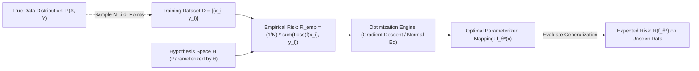

# Migration in progress
# Lesson 1: Supervised Learning Fundamentals 

## Supervised Learning Fundamentals and Problem Formulation

Supervised learning formulates predictive modeling as a mathematical optimization problem over an empirical dataset of paired feature vectors and ground-truth targets. The learning algorithm searches an unobserved hypothesis space to discover a mapping function that generalizes beyond training samples to unseen data drawn from the true data-generating distribution. Analyzing the statistical problem formulation, the foundational duality between regression and classification, the mathematical dichotomy between generative and discriminative models, and multiclass decomposition strategies establishes the analytical framework for supervised prediction.

## The Formal Mathematical Framework of Supervised Learning

### Input-Output Spaces and the Underlying Data Distribution

- Let $\mathcal{X} \subseteq \mathbb{R}^D$ denote the **input domain (feature space)**, representing the set of all possible $D$-dimensional feature vectors.
- Let $\mathcal{Y}$ denote the **target domain (label space)**, representing the set of all permissible supervisory outputs.
- Nature generates observations according to an unknown, fixed joint probability distribution $P(X, Y)$ over $\mathcal{X} \times \mathcal{Y}$.
- The learner receives an empirical training dataset $\mathcal{D}$ consisting of $N$ independent and identically distributed (i.i.d.) observations drawn from $P(X, Y)$:
  $$\mathcal{D} = \{(x^{(1)}, y^{(1)}), (x^{(2)}, y^{(2)}), \dots, (x^{(N)}, y^{(N)})\} \sim P(X, Y)^N$$

### The Hypothesis Space and Parameterized Mappings

- An algorithm predetermines a **hypothesis space** $\mathcal{H}$, defined as the family of candidate functions mapping inputs to outputs:
  $$\mathcal{H} = \{f_\theta: \mathcal{X} \to \mathcal{Y} \mid \theta \in \Theta\}$$
  where $\Theta \subseteq \mathbb{R}^P$ represents the parameter space.
- Restricting the hypothesis space (e.g., considering only linear functions $f(x) = w^T x + b$) introduces **inductive bias**, constraining the functional forms the algorithm can explore.
- A **loss function** $\ell: \mathcal{Y} \times \mathcal{Y} \to \mathbb{R}^+$ quantifies the operational penalty incurred when the model predicts $\hat{y} = f_\theta(x)$ while the true target is $y$.

### Expected Risk Versus Empirical Risk Minimization (ERM)

- The ultimate objective of supervised learning is minimizing the **expected risk (true generalization error)** across the full data distribution $P(X, Y)$:
  $$R(f_\theta) = \mathbb{E}_{(x, y) \sim P} [\ell(f_\theta(x), y)] = \int_{\mathcal{X} \times \mathcal{Y}} \ell(f_\theta(x), y) \, dP(x, y)$$
- Because the distribution $P(X, Y)$ is unobservable, evaluating $R(f_\theta)$ directly is mathematically impossible.
- The **Empirical Risk Minimization (ERM)** inductive principle approximates expected risk using the average loss observed over the training sample $\mathcal{D}$:
  $$R_{\text{emp}}(f_\theta) = \frac{1}{N} \sum_{i=1}^N \ell(f_\theta(x^{(i)}), y^{(i)})$$
- Optimization algorithms search for optimal parameter weights $\theta^*$ that minimize this empirical surrogate:
  $$\theta^* = \arg\min_{\theta \in \Theta} R_{\text{emp}}(f_\theta)$$

> [!Important]
> **Empirical Risk Minimization proxies true generalization**: because the true data-generating distribution $P(X, Y)$ is unknown, supervised learning minimizes sample loss $R_{\text{emp}}$ as a computable statistical proxy for expected generalization risk $R(f)$.

## The Core Duality: Regression Versus Classification

### Continuous Regression and Conditional Expectations

- In **regression**, the label space is continuous: $\mathcal{Y} \subseteq \mathbb{R}$ (or $\mathbb{R}^K$ for multivariate regression).
- The theoretical optimal prediction under squared error loss ($\ell(y, \hat{y}) = (y - \hat{y})^2$) is the **conditional expectation (regression function)**:
  $$f^*(x) = \mathbb{E}[Y \mid X = x] = \int_{\mathcal{Y}} y \, P(y \mid x) \, dy$$
- Common regression loss functions:
  - *Squared Loss ($L_2$ Loss):* $\ell(y, \hat{y}) = (y - \hat{y})^2$. Penalizes large residuals quadratically, estimating the conditional mean $\mathbb{E}[Y \mid X]$.
  - *Absolute Loss ($L_1$ Loss):* $\ell(y, \hat{y}) = |y - \hat{y}|$. Penalizes residuals linearly, estimating the conditional median $\text{Median}(Y \mid X)$ and providing robustness against outliers.
  - *Huber Loss:* Blends quadratic convergence near zero error with linear outlier resistance for residuals exceeding threshold $\delta$.

### Discrete Classification and Decision Boundary Geometry

- In **classification**, the label space is a discrete categorical set: $\mathcal{Y} = \{1, 2, \dots, C\}$ (or $\{-1, +1\}$ for binary tasks).
- The goal is partitioning the feature space $\mathcal{X}$ into $C$ mutually exclusive **decision regions** $\{\mathcal{R}_1, \dots, \mathcal{R}_C\}$, separated by geometric **decision boundaries**:
  $$\mathcal{R}_k = \{x \in \mathcal{X} \mid f(x) = k\}$$
- Under ideal $0-1$ loss, the optimal classifier is the **Bayes optimal classifier**, which selects the class maximizing the posterior probability:
  $$f_{\text{Bayes}}^*(x) = \arg\max_{c \in \{1, \dots, C\}} P(Y = c \mid X = x)$$
- The decision boundary separating class $j$ and class $k$ represents the geometric surface where posterior probabilities tie:
  $$\mathcal{B}_{jk} = \{x \in \mathcal{X} \mid P(Y = j \mid X = x) = P(Y = k \mid X = x)\}$$

### The Need for Convex Surrogate Loss Functions

- The natural loss function for classification is the discrete **$0-1$ misclassification loss**:
  $$\ell_{0-1}(y, \hat{y}) = \mathbf{1}[y \neq \hat{y}] = \begin{cases} 0 & \text{if } y = \hat{y} \\ 1 & \text{if } y \neq \hat{y} \end{cases}$$
- For a binary model with real-valued score $z = f_\theta(x)$ and target $y \in \{-1, +1\}$, the $0-1$ loss evaluates as a step function over the functional margin $y z$:
  $$\ell_{0-1}(y, z) = \mathbf{1}[y z \le 0]$$
- Minimizing empirical risk under $0-1$ loss across a dataset is non-convex, discontinuous, and **NP-hard**; the derivative is zero almost everywhere, making gradient-based optimization impossible.
- Supervised algorithms minimize smooth, **convex surrogate loss functions** that upper-bound the $0-1$ loss:
  - *Logistic Loss (Cross-Entropy):* $\ell_{\text{logistic}}(y, z) = \ln(1 + e^{-y z})$. Smooth and strictly convex; outputs posterior probability scores.
  - *Hinge Loss:* $\ell_{\text{hinge}}(y, z) = \max(0, 1 - y z)$. Convex and continuous, producing sparse support vector representations in SVMs.
  - *Exponential Loss:* $\ell_{\text{exp}}(y, z) = e^{-y z}$. Differentiable upper bound driving AdaBoost optimization.

> [!Tip]
> **Surrogate losses make classification computationally tractable**: because optimizing non-differentiable $0-1$ loss is NP-hard, machine learning algorithms optimize smooth convex surrogates like Cross-Entropy and Hinge loss using gradient descent.

## The Generative Versus Discriminative Modeling Paradigms

### Discriminative Modeling: Direct Boundary Estimation

- **Discriminative models** focus exclusively on learning the conditional distribution $P(Y \mid X)$ or discovering the decision boundary directly without modeling how features $X$ were generated.
- Parameter estimation maximizes conditional log-likelihood:
  $$\theta_{\text{disc}} = \arg\max_\theta \sum_{i=1}^N \ln P(Y = y^{(i)} \mid X = x^{(i)}; \theta)$$
- Examples include **Logistic Regression**, **Support Vector Machines (SVMs)**, **Decision Trees**, and **Neural Networks**.
- Discriminative models optimize classification performance directly, making efficient use of representational capacity by ignoring the complexity of feature distribution $P(X)$.

### Generative Modeling: Joint Distributions and Bayes' Inversion

- **Generative models** model the joint probability distribution $P(X, Y)$ by estimating two independent components:
  1. The **class prior probability**: $P(Y = c)$.
  2. The **class-conditional feature likelihood**: $P(X \mid Y = c)$.
- Parameters maximize the complete joint log-likelihood:
  $$\theta_{\text{gen}} = \arg\max_\theta \sum_{i=1}^N \ln P(X = x^{(i)}, Y = y^{(i)}; \theta) = \arg\max_\theta \sum_{i=1}^N \left( \ln P(X = x^{(i)} \mid Y = y^{(i)}) + \ln P(Y = y^{(i)}) \right)$$
- At inference time, the model applies **Bayes' rule** to invert the conditional distributions and evaluate class posteriors:
  $$P(Y = c \mid X = x) = \frac{P(X = x \mid Y = c) P(Y = c)}{\sum_{k=1}^C P(X = x \mid Y = k) P(Y = k)}$$
- Examples include **Naive Bayes**, **Linear Discriminant Analysis (LDA)**, **Quadratic Discriminant Analysis (QDA)**, and **Gaussian Mixture