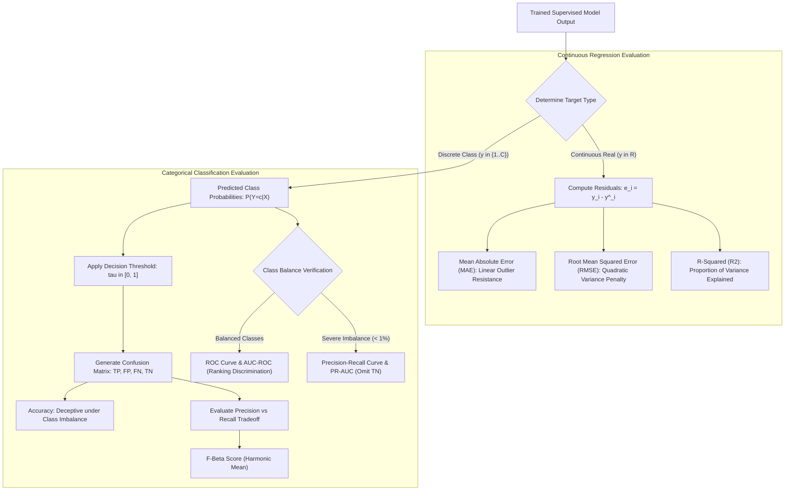

# Migration in progress
# Lesson 2: Summary and Assessment
## Classification and Prediction: Module Summary and Assessment

Supervised learning provides the mathematical framework for learning functional mappings from labeled empirical observations. Depending on whether target variables are continuous real numbers or discrete categorical symbols, supervised modeling divides into regression and classification. Evaluating model behavior requires understanding the limitations of basic accuracy heuristics, calibrating decision thresholds, analyzing trade-off curves, and diagnosing error distributions. Synthesizing formal problem formulations, discriminative versus generative modeling paradigms, confusion matrix derivations, and regression metrics prepares machine learning practitioners to select, train, and validate supervised prediction pipelines.

## Synthesis of Core Week 3 Foundations

### The Mathematical Duality: Regression and Classification

- **Supervised learning objective:** Searches a hypothesis space $\mathcal{H} = \{f_\theta: \mathcal{X} \to \mathcal{Y}\}$ to discover parameters $\theta^*$ minimizing the empirical surrogate of true generalization risk:
  $$\min_\theta R_{\text{emp}}(f_\theta) = \min_\theta \frac{1}{N} \sum_{i=1}^N \ell(f_\theta(x^{(i)}), y^{(i)})$$
- **Regression duality ($\mathcal{Y} \subseteq \mathbb{R}$):** The model estimates a continuous response surface $f(x)$, approximating the conditional expectation $\mathbb{E}[Y \mid X = x]$ under squared loss ($L_2$) or the conditional median $\text{Median}(Y \mid X = x)$ under absolute loss ($L_1$).
- **Classification duality ($\mathcal{Y} \in \{1, \dots, C\}$):** The model partitions the feature space into discrete decision regions bounded by geometric decision boundaries. Because discrete $0-1$ misclassification loss ($\mathbf{1}[y \neq \hat{y}]$) is non-convex and NP-hard to optimize, algorithms optimize convex surrogate losses:
  - *Cross-Entropy Loss:* Minimizes negative log-likelihood, outputting calibrated posterior probabilities.
  - *Hinge Loss:* Maximizes geometric margins, producing sparse support vector representations.

### Probabilistic Modeling: Discriminative Versus Generative Formulations

- **Discriminative models:** Directly estimate the posterior class distribution $P(Y \mid X)$ or learn decision hyperplanes directly (e.g., Logistic Regression, SVMs, Decision Trees, Neural Networks). They achieve lower asymptotic error on large datasets by focusing parameters strictly on boundary discrimination.
- **Generative models:** Model the joint distribution $P(X, Y) = P(X \mid Y)P(Y)$, learning class priors and class-conditional feature distributions before applying Bayes' theorem to evaluate posteriors (e.g., Naive Bayes, Linear Discriminant Analysis). They converge to their asymptotic error bound faster on tiny datasets ($O(\log D)$ sample complexity) and support native missing-feature marginalization.

### Decomposition Architectures: One-vs-Rest and One-vs-One

- **One-vs-Rest (OvR / One-vs-All):** Trains $C$ binary classifiers, each separating one class from the remaining $C-1$ classes combined. Predictions evaluate via continuous score argmax: $\hat{y} = \arg\max s_k(x)$. OvR minimizes total models trained, but introduces synthetic class imbalance ($1:(C-1)$) and requires calibrated output scores.
- **One-vs-One (OvO / Pairwise):** Trains $\frac{C(C-1)}{2}$ binary classifiers across all unique class pairs. Predictions evaluate via majority voting: $\hat{y} = \arg\max V_c$. OvO trains on small, balanced subsets ($N_j + N_k \ll N$), making it faster than OvR for algorithms with super-linear computational complexity like kernel SVMs ($O(N^2)$).

> [!Tip]
> **Match modeling paradigms to data scale**: deploy generative models like Naive Bayes when data is limited and missing attributes occur, and deploy discriminative models like Logistic Regression or Gradient Boosted Trees to achieve superior asymptotic boundary precision on large datasets.

## The Supervised Evaluation Architecture

> [!Important]
> **Class imbalance invalidates accuracy and ROC curves**: accuracy masks minority failure, and ROC curves become deceptively optimistic because massive True Negative counts suppress the False Positive Rate; evaluate Precision-Recall curves and Macro-F1 on imbalanced targets.

## Comprehensive Supervised Evaluation Metrics Matrix

| Evaluation Metric | Target Domain | Mathematical Formulation | Bounded Range | Outlier Sensitivity | Primary Diagnostic Role |
|---|---|---|---|---|---|
| **Accuracy** | Classification | $\frac{\text{TP} + \text{TN}}{\text{TP} + \text{TN} + \text{FP} + \text{FN}}$ | $[0.0, \; 1.0]$ | Minimal | Baseline check strictly on balanced classes; subject to the accuracy paradox |
| **Precision** | Classification | $\frac{\text{TP}}{\text{TP} + \text{FP}} = P(Y = 1 \mid \hat{Y} = 1)$ | $[0.0, \; 1.0]$ | Sensitive to low $\tau$ | Measures False Alarm cost; critical when False Positives are expensive |
| **Recall (Sensitivity)** | Classification | $\frac{\text{TP}}{\text{TP} + \text{FN}} = P(\hat{Y} = 1 \mid Y = 1)$ | $[0.0, \; 1.0]$ | Sensitive to high $\tau$ | Measures Missed Detection cost; non-negotiable in safety and medical diagnosis |
| **$F_1$-Score** | Classification | $2 \cdot \frac{\text{Precision} \cdot \text{Recall}}{\text{Precision} + \text{Recall}}$ | $[0.0, \; 1.0]$ | Low | Balanced harmonic mean; robust against class imbalance |
| **AUC-ROC** | Classification | $\int_0^1 \text{TPR}(\text{FPR}) \, d(\text{FPR})$ | $[0.0, \; 1.0]$ | Invariant to prevalence | Evaluates threshold-independent ranking discrimination power |
| **AUC-PR** | Classification | $\int_0^1 \text{Precision}(\text{Recall}) \, d(\text{Recall})$ | $[0.0, \; 1.0]$ | High on rare classes | Standard ranking metric on highly skewed rare-event datasets |
| **MAE** | Regression | $\frac{1}{N} \sum \|y_i - \hat{y}_i\|$ | $[0.0, \; \infty)$ | **Low (Linear)** | Measures average magnitude in physical units; robust against outliers |
| **RMSE** | Regression | $\sqrt{\frac{1}{N} \sum (y_i - \hat{y}_i)^2}$ | $[0.0, \; \infty)$ | **High (Quadratic)** | Heavily penalizes large variance errors; standard for continuous modeling |
| **$R^2$ Score** | Regression | $1 - \frac{\sum (y_i - \hat{y}_i)^2}{\sum (y_i - \bar{y})^2}$ | $(-\infty, \; 1.0]$ | High | Measures proportion of target variance explained relative to sample mean |

> [!Tip]
> **Use RMSE when large errors are dangerous and MAE when costs are linear**: RMSE squares residuals, heavily penalizing occasional large deviations, while MAE provides intuitive linear error tracking that resists outlier distortion.

## Assessment Preparation

### Conceptual Review Questions

- **Question 1 (The Mathematical Breakdown of the Accuracy Paradox):** Why does classification accuracy fail as an evaluation metric in rare-event detection, and how does the $F_1$-score resolve this failure?
  - *Answer:* Accuracy evaluates the ratio of correct predictions across both classes: $\text{Accuracy} = \frac{\text{TP} + \text{TN}}{\text{Total}}$. In an imbalanced dataset where the positive class prevalence is $0.1\%$ ($10$ positives out of $10,000$ records), a trivial dummy classifier predicting negative for every sample achieves $\text{Accuracy} = \frac{0 + 9990}{10000} = 0.999$ ($99.9\%$). The metric is dominated by True Negatives, masking the fact that the model missed 100% of the positive class ($\text{Recall} = 0\%$). The $F_1$-score resolves this by taking the harmonic mean of precision and recall: $F_1 = 2 \cdot \frac{\text{Precision} \cdot \text{Recall}}{\text{Precision} + \text{Recall}} = \frac{2\text{TP}}{2\text{TP} + \text{FP} + \text{FN}}$. The $F_1$ equation completely omits True Negatives ($\text{TN}$) from both numerator and denominator; if a dummy model predicts zero True Positives ($\text{TP} = 0$), $F_1$ evaluates to exactly zero, exposing total model failure.
- **Question 2 (Prevalence Invariance in ROC Versus PR Curves):** Explain mathematically why the Receiver Operating Characteristic (ROC) curve is invariant to class distribution shifts, while the Precision-Recall (PR) curve changes when the positive class prevalence drops.
  - *Answer:* The axes of the ROC curve are True Positive Rate ($\text{TPR} = \frac{\text{TP}}{\text{TP} + \text{FN}}$) and False Positive Rate ($\text{FPR} = \frac{\text{FP}}{\text{TN} + \text{FP}}$). The denominator of TPR depends strictly on actual positive instances ($P = \text{TP} + \text{FN}$), and the denominator of FPR depends strictly on actual negative instances ($N = \text{TN} + \text{FP}$). Because both metrics normalize exclusively within their respective class totals, altering the ratio of positive to negative samples in a test set does not change TPR or FPR at any threshold, keeping the ROC curve invariant. In contrast, the PR curve plots Precision ($\frac{\text{TP}}{\text{TP} + \text{FP}}$) against Recall ($\frac{\text{TP}}{\text{TP} + \text{FN}}$). The denominator of Precision combines both True Positives and False Positives. If positive prevalence drops (e.g., from 10% to 0.1%), the pool of actual negative samples expands massively, generating more False Positives for any fixed threshold. The denominator ($\text{TP} + \text{FP}$) inflates, causing Precision to drop across all recall thresholds and lowering the PR curve.
- **Question 3 (The Penalty Mechanism of Adjusted $R^2$):** Why does standard $R^2$ increase monotonically when adding irrelevant features to a multiple linear regression model, and how does Adjusted $R^2$ correct this behavior?
  - *Answer:* Standard $R^2$ evaluates as $R^2 = 1 - \frac{\text{SS}_{\text{res}}}{\text{SS}_{\text{tot}}}$. In ordinary least squares, adding a new feature gives the optimization algorithm an additional degree of freedom to fit training variations. By properties of linear projections, the residual sum of squares cannot increase when expanding feature count ($\text{SS}_{\text{res, new}} \le \text{SS}_{\text{res, old}}$). Because $\text{SS}_{\text{tot}}$ is a fixed constant, $R^2$ increases (or stays constant) even if the added feature is random noise. **Adjusted $R^2$** penalizes feature count by dividing sums of squares by their respective degrees of freedom:
    $$R^2_{\text{adj}} = 1 - \left[ \frac{\text{SS}_{\text{res}} / (N - p - 1)}{\text{SS}_{\text{tot}} / (N - 1)} \right] = 1 - \left[ \frac{(1 - R^2)(N - 1)}{N - p - 1} \right]$$
    where $p$ is the feature count and $N$ is the sample size. Adding a feature increases $p$, which decreases the denominator $(N - p - 1)$, scaling the penalty ratio upward. Adjusted $R^2$ increases if and only if the new feature reduces $\text{SS}_{\text{res}}$ by an amount greater than what would be expected by random chance.
- **Question 4 (Voting Ambiguity in One-vs-One Multiclass Classification):** What is the Condorcet voting paradox in One-vs-One multiclass classification, and how do practical implementations resolve circular ties?
  - *Answer:* In One-vs-One classification, $\frac{C(C-1)}{2}$ binary models cast pairwise votes. When evaluating a query instance, pairwise decisions can form a circular voting cycle (e.g., Classifier 12 votes for Class A over Class B; Classifier 23 votes for Class B over Class C; Classifier 13 votes for Class C over Class A). Each class receives exactly one vote ($V_A = 1, V_B = 1, V_C = 1$), producing a tie where no majority class exists. Practical implementations resolve cyclic ties by using continuous confidence calibration: instead of counting discrete binary votes ($\{0, 1\}$), the algorithm sums the underlying continuous probability estimates or signed margin distances generated by each pairwise classifier:
    $$\hat{y} = \arg\max_c \sum_{j \neq c} P(Y = c \mid Y \in \{c, j\}, x)$$

### Applied Analytical Scenarios

- **Scenario A (Threshold Calibration in Sepsis Clinical Alerting):** An intensive care predictive model outputs continuous sepsis risk probabilities $\hat{p} \in [0, 1]$. Using default threshold $\tau = 0.50$, the model achieves $92\%$ Precision and $48\%$ Recall. Clinical audits reveal that ICU staff are missing early septic shock events, leading to patient deaths.
  - *Diagnosis:* The classification threshold is set too high for a clinical setting where False Negatives are catastrophic. While a 50% threshold keeps False Positives low (h