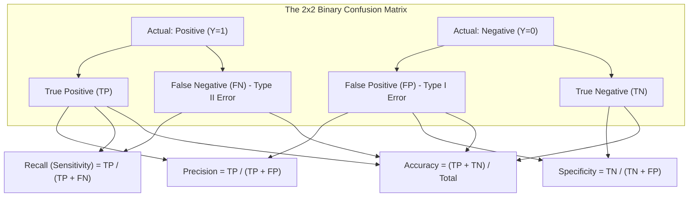

# Week 3: Introduction to Classification and Prediction

## Introduction to Classification and Prediction: Foundations and Evaluation

Supervised learning constructs parameterized functions that map input feature vectors to observed target outputs. Depending on the nature of the target variable, supervised tasks divide into numeric prediction (continuous regression) and discrete pattern categorization (classification). Evaluating predictive models requires moving beyond crude accuracy heuristics toward formal statistical metrics, trade-off curves, and loss formulations tailored to operational costs. Examining model paradigms, multiclass decomposition strategies, threshold calibration, and regression metrics establishes the analytical toolkit for supervised model evaluation.

## Foundations of Supervised Prediction

### Continuous Regression Versus Categorical Classification

- **Supervised prediction** operates on empirical datasets consisting of feature vectors paired with verified targets:
  $$\mathcal{D} = \{(x^{(1)}, y^{(1)}), (x^{(2)}, y^{(2)}), \dots, (x^{(N)}, y^{(N)})\}, \quad x^{(i)} \in \mathbb{R}^D$$
- The mathematical nature of target space $\mathcal{Y}$ dictates the learning task:
  - **Regression (Numeric Prediction):** The target variable is continuous real-valued: $\mathcal{Y} \subseteq \mathbb{R}$. The model estimates a continuous response surface:
    $$\hat{y} = f(x; \theta) \in \mathbb{R}$$
    Applications include property valuation, algorithmic load forecasting, and asset volatility estimation.
  - **Classification (Pattern Categorization):** The target variable is a discrete, categorical symbol chosen from a finite set of $C$ mutually exclusive classes: $\mathcal{Y} \in \{1, 2, \dots, C\}$. The model partitions feature space into discrete decision regions bounded by decision surfaces:
    $$\hat{y} = \arg\max_{c \in \{1, \dots, C\}} P(Y = c \mid x)$$
    Applications include fraud detection, medical diagnosis, and object recognition.

### Discriminative Versus Generative Modeling Paradigms

- Supervised classification algorithms approach class posterior estimation through two distinct probabilistic paradigms:
  - **Discriminative Models:** Directly model the posterior class probability distribution $P(Y \mid X)$ or map inputs straight to decision boundaries without modeling feature generation:
    $$f(x) = \arg\max_y P(Y = y \mid X = x)$$
    Examples include Logistic Regression, Support Vector Machines (SVMs), Decision Trees, and Multi-Layer Perceptrons. Discriminative models generally achieve higher classification accuracy on large datasets because they optimize class separation directly without expending capacity to model feature distributions $P(X)$.
  - **Generative Models:** Model the joint probability distribution $P(X, Y)$ by estimating the class-conditional feature distribution $P(X \mid Y)$ alongside the class prior $P(Y)$, deriving posteriors via **Bayes' theorem**:
    $$P(Y = y \mid X = x) = \frac{P(X = x \mid Y = y) P(Y = y)}{P(X = x)} = \frac{P(X = x \mid Y = y) P(Y = y)}{\sum_c P(X = x \mid Y = c) P(Y = c)}$$
    Examples include Naive Bayes, Linear Discriminant Analysis (LDA), and Gaussian Mixture Models. Generative models handle missing features naturally, detect out-of-distribution anomalies, and support synthetic data generation.

### Multiclass Extension Strategies: One-vs-Rest and One-vs-One

- Many foundational classifiers (such as standard Support Vector Machines and Perceptrons) are strictly binary algorithms designed for two-class problems ($y \in \{-1, +1\}$).
- Binary classifiers generalize to $C$-class problems ($C > 2$) using heuristic decomposition schemes:
  - **One-vs-Rest (OvR / One-vs-All):** Trains $C$ separate binary classifiers. Classifier $k$ trains by treating class $k$ as the positive class ($+1$) and all remaining $C-1$ classes combined as the negative class ($0$). At inference, all $C$ classifiers evaluate the input, and the class yielding the highest confidence score wins:
    $$\hat{y} = \arg\max_{k \in \{1, \dots, C\}} f_k(x)$$
  - **One-vs-One (OvO):** Trains a distinct binary classifier for every unique pair of classes, allocating $\frac{C(C - 1)}{2}$ independent classifiers. Classifier $f_{jk}$ trains exclusively on data belonging to class $j$ and class $k$. At inference, all pairwise models evaluate the input, and the class receiving the most **majority votes** is selected.

> [!Important]
> **Decomposition trades training count for sample complexity**: One-vs-Rest trains $C$ classifiers on full datasets ($N$), while One-vs-One trains $\frac{C(C-1)}{2}$ classifiers on smaller pairwise subsets ($N_j + N_k$), scaling better when individual algorithms exhibit super-linear time complexity.

## The Confusion Matrix and Core Classification Metrics

### The Four Confusion Outcomes: TP, FP, FN, and TN

- In binary classification with positive ($1$) and negative ($0$) classes, evaluating model predictions against true labels yields four fundamental operational outcomes:
  - **True Positive (TP):** Ground truth is positive, and model predicts positive (correct detection).
  - **True Negative (TN):** Ground truth is negative, and model predicts negative (correct rejection).
  - **False Positive (FP - Type I Error):** Ground truth is negative, but model predicts positive (false alarm).
  - **False Negative (FN - Type II Error):** Ground truth is positive, but model predicts negative (missed event).

### The Accuracy Paradox in Imbalanced Regimes

- **Classification Accuracy** measures the ratio of correct predictions to total observations:
  $$\text{Accuracy} = \frac{\text{TP} + \text{TN}}{\text{TP} + \text{TN} + \text{FP} + \text{FN}}$$
- **The Accuracy Paradox:** When evaluating imbalanced datasets, accuracy fails completely as a diagnostic metric.
- Consider a rare disease detection task where prevalence is $0.1\%$ ($10$ sick patients out of $10,000$). A naive dummy classifier that predicts negative for every patient achieves a stellar accuracy of $99.9\%$:
  $$\text{Accuracy} = \frac{0 + 9990}{10000} = 0.999$$
- Despite high accuracy, the model exhibits a **Recall of 0%**, missing every sick patient.

### Precision, Recall, and Specificity

- **Precision (Positive Predictive Value):** The fraction of positive predictions that are truly positive:
  $$\text{Precision} = \frac{\text{TP}}{\text{TP} + \text{FP}} = P(Y = 1 \mid \hat{Y} = 1)$$
  Precision reflects the cost of False Positives; high precision is required in email spam filtering, where marking an important work email as spam carries high operational cost.
- **Recall (Sensitivity / True Positive Rate):** The fraction of actual positive instances correctly captured:
  $$\text{Recall} = \text{TPR} = \frac{\text{TP}}{\text{TP} + \text{FN}} = P(\hat{Y} = 1 \mid Y = 1)$$
  Recall reflects the cost of False Negatives; high recall is non-negotiable in malignant tumor detection, where missing an active illness can prove fatal.
- **Specificity (True Negative Rate):** The fraction of actual negative instances correctly identified:
  $$\text{Specificity} = \text{TNR} = \frac{\text{TN}}{\text{TN} + \text{FP}} = P(\hat{Y} = 0 \mid Y = 0)$$
- **False Positive Rate (FPR / Fall-out):** The fraction of true negatives incorrectly flagged as positive:
  $$\text{FPR} = 1 - \text{Specificity} = \frac{\text{FP}}{\text{TN} + \text{FP}}$$

### The F-Beta Metric and Harmonic Balancing

- Precision and recall exist in direct tension; shifting decision thresholds to maximize recall inevitably increases False Positives, degrading precision.
- The **$F_\beta$-Score** evaluates the weighted **harmonic mean** of precision and recall, preventing models from masking poor performance in one metric with high values in the other:
  $$F_\beta = (1 + \beta^2) \frac{\text{Precision} \cdot \text{Recall}}{\beta^2 \text{Precision} + \text{Recall}}$$
- **$F_1$-Score ($\beta = 1.0$):** Gives equal balance to precision and recall:
  $$F_1 = 2 \times \frac{\text{Precision} \cdot \text{Recall}}{\text{Precision} + \text{Recall}} = \frac{2\text{TP}}{2\text{TP} + \text{FP} + \text{FN}}$$
- **$F_2$-Score ($\beta = 2.0$):** Weights recall twice as heavily as precision (favored in medical diagnosis and safety systems).
- **$F_{0.5}$-Score ($\beta = 0.5$):** Weights precision twice as heavily as recall (favored in automated document redaction and marketing outreach).

### Multiclass Aggregation: Macro, Micro, and Weighted Averaging

- In multiclass classification ($C > 2$), precision and recall evaluate independently per class $k$. Aggregating into a single global metric uses three distinct averaging schemes:
  - **Macro-Averaging:** Computes the unweighted arithmetic mean of metrics across all classes:
    $$\text{Metric}_{\text{macro}} = \frac{1}{C} \sum_{k=1}^C \text{Metric}_k$$
    Treats all classes equally, meaning poor performance on a tiny minority class impacts the score as heavily as errors on the dominant majority class.
  - **Micro-Averaging:** Aggregates global $\text{TP}, \text{FP}$, and $\text{FN}$ counts across all classes before calculating the metric:
    $$\text{Precision}_{\text{micro}} = \frac{\sum_k \text{TP}_k}{\sum_k \text{TP}_k + \sum_k \text{FP}_k}$$
    In multi-class settings where each sample has a single label, Micro-Accuracy, Micro-Precision, and Micro-Recall are mathematically identical.
  - **Weighted-Averaging:** Averages per-class metrics weighted by class support ($N_k$):
    $$\text{Metric}_{\text{weighted}} = \sum_{k=1}^C \left( \frac{N_k}{N} \right) \text{Metric}_k$$

> [!Tip]
> **Use Macro-F1 to detect minority class failure**: while Micro-F1 and Accuracy reflect majority class dominance, Macro-F1 weights all classes equally, immediately exposing models that fail on rare categories.

## Threshold Tuning and Diagnostic Curves

### Decision Thresholds and Probability Calibration

- Classifiers output continuous posterior probability scores: $\hat{p}(x) = P(Y = 1 \mid x) \in [0, 1]$.
- Converting probabilities into binary classifications requires a **decision threshold** $\tau \in [0, 1]$:
  $$\hat{y} = \begin{cases} 1 & \text{if } \hat{p}(x) \ge \tau \\ 0 & \text{if } \hat{p}(x) < \tau \end{cases}$$
- Default software implementations set $\tau = 0.5$.
- Decreasing the threshold ($\tau \downarrow$) makes the model classify positive more aggressively, increasing **Recall** while capturing more False Positives (degrading **Precision**).
- Increasing the threshold ($\tau \uparrow$) makes the model conservative, increasing **Precision** while generating more False Negatives (degrading **Recall**).

### The Receiver Operating Characteristic (ROC) and AUC-ROC

- The **Receiver Operating Characteristic (ROC)** curve plots model discrimination across all possible decision thresholds $\tau \in [0, 1]$:
  - **Vertical Axis:** True Positive Rate ($\text{TPR} = \text{Recall}$).
  - **Horizontal Axis:** False Positive Rate ($\text{FPR} = 1 - \text{Specificity}$).
- The point $(0, 0)$ corresponds to threshold $\tau = 1.0$ (predicts all negative).
- The point $(1, 1)$ corresponds to threshold $\tau = 0.0$ (predicts all positive).
- The diagonal identity line connecting $(0, 0)$ to $(1, 1)$ represents the performance of an uninformative **random classifier**.
- **Area Under the ROC Curve (AUC-ROC):** Evaluates overall discriminative ability independent of threshold choice:
  $$\text{AUC-ROC} = \int_0^1 \text{TPR}(\text{FPR}) \, d(\text{FPR}) \in [0, 1]$$
- **Probabilistic Meaning:** AUC-ROC equals the exact probability that a randomly drawn positive instance ranks higher in predicted score than a randomly drawn negative instance.
- **Invariance:** ROC curves are invariant to class distribution shifts; changing positive prevalence does not alter TPR or FPR because denominators contain strictly within-class instances.

### The Precision-Recall (PR) Curve for Imbalanced Targets

- In heavily skewed datasets (e.g., fraud rates $< 0.1\%$), True Negatives ($\text{TN}$) outnumber positives by orders of magnitude.
- Because $\text{FPR} = \frac{\text{FP}}{\text{TN} + \text{FP}}$, a massive $\text{TN}$ denominator keeps FPR tiny even when the model generates thousands of False Positives. Consequently, the ROC curve appears deceptively optimistic.
- The **Precision-Recall (PR) Curve** plots Precision (vertical axis) against Recall (horizontal axis) across all thresholds $\tau$:
  $$\text{Precision} = \frac{\text{TP}}{\text{TP} + \text{FP}} \quad \text{vs} \quad \text{Recall} = \frac{\text{TP}}{\text{TP} + \text{FN}}$$
- Because the PR curve omits True Negatives entirely, a flood of False Positives immediately pulls Precision down, exposing model deficiencies on imbalanced data.
- **Area Under the PR Curve (AUC-PR / Average Precision):** The standard metric for ranking models on rare-event detection.

> [!Important]
> **Use PR curves on imbalanced data**: ROC curves become deceptively optimistic on rare targets because massive True Negative counts suppress the False Positive Rate; Precision-Recall curves omit True Negatives, highlighting false alarms accurately.

## Continuous Prediction: Regression Evaluation Metrics

### Mean Absolute Error (MAE) and Outlier Robustness

- **Mean Absolute Error (MAE)** measures the average magnitude of absolute residuals:
  $$\text{MAE} = \frac{1}{N} \sum_{i=1}^N |y_i - \hat{y}_i|$$
- MAE is expressed in the identical physical units as the target variable $y$.
- It penalizes prediction errors linearly ($|e|$), providing high **robustness to outliers**; an isolated extreme error does not disproportionately dominate the metric.

### Mean Squared Error (MSE) and Root Mean Squared Error (RMSE)

- **Mean Squared Error (MSE)** measures the average squared difference between predictions and targets:
  $$\text{MSE} = \frac{1}{N} \sum_{i=1}^N (y_i - \hat{y}_i)^2$$
- Squaring errors penalizes large residuals quadratically; a residual of $10$ units produces an error penalty of $100$, whereas a residual of $2$ produces a penalty of $4$.
- **Root Mean Squared Error (RMSE):** Takes the square root of MSE to restore original physical units:
  $$\text{RMSE} = \sqrt{\text{MSE}} = \sqrt{\frac{1}{N} \sum_{i=1}^N (y_i - \hat{y}_i)^2}$$
- By mathematical property of norms, $\text{RMSE} \ge \text{MAE}$; the gap between RMSE and MAE increases as the variance of individual error magnitudes widens.

### The Coefficient of Determination (R-Squared) and Adjusted R-Squared

- The **Coefficient of Determination ($R^2$)** quantifies the proportion of target variance explained by the model relative to a naive horizontal baseline predicting sample mean $\bar{y}$:
  $$R^2 = 1 - \frac{\text{SS}_{\text{res}}}{\text{SS}_{\text{tot}}} = 1 - \frac{\sum_{i=1}^N (y_i - \hat{y}_i)^2}{\sum_{i=1}^N (y_i - \bar{y})^2}$$
- **Interpretation:**
  - $R^2 = 1.0$: Model predicts targets perfectly with zero residual variance ($\text{SS}_{\text{res}} = 0$).
  - $R^2 = 0.0$: Model performs identically to predicting the constant sample mean $\bar{y}$.
  - $R^2 < 0.0$: Model performs worse than the simple sample mean on out-of-sample data.
- **Adjusted $R^2$:** Adding irrelevant input features to an ordinary least squares regression model artificially inflates standard $R^2$. Adjusted $R^2$ penalizes model complexity using feature count $p$:
  $$R^2_{\text{adj}} = 1 - \left[ \frac{(1 - R^2)(N - 1)}{N - p - 1} \right]$$

### Percentage Metrics: MAPE and Symmetric MAPE

- **Mean Absolute Percentage Error (MAPE):** Evaluates relative percentage error:
  $$\text{MAPE} = \frac{100\%}{N} \sum_{i=1}^N \left| \frac{y_i - \hat{y}_i}{y_i} \right|$$
- **Pathologies of MAPE:**
  - Undefined when any true target equals zero ($y_i = 0$, division by zero).
  - Asymmetric penalty: heavily penalizes over-predictions while under-penalizing under-predictions (an estimate cannot drop below zero, bounding maximum under-prediction error at 100%, while over-prediction error is unbounded).
- **Symmetric MAPE (sMAPE):** Bounds relative error by dividing by the average of actual and predicted absolute values:
  $$\text{sMAPE} = \frac{100\%}{N} \sum_{i=1}^N \frac{|y_i - \hat{y}_i|}{(|y_i| + |\hat{y}_i|) / 2}$$

> [!Tip]
> **Use RMSE to penalize large errors and MAE for linear costs**: RMSE is sensitive to extreme errors due to quadratic squaring, while MAE provides intuitive average error tracking that resists outlier distortion.

## Comparative Matrices of Modeling and Evaluation Paradigms

| Dimension | Discriminative Classification | Generative Classification | Continuous Regression |
|---|---|---|---|
| **Target Variable Type** | Discrete categorical ($y \in \{1, \dots, C\}$) | Discrete categorical ($y \in \{1, \dots, C\}$) | **Continuous real-valued** ($y \in \mathbb{R}$) |
| **Probability Modeled** | Conditional Posterior $P(Y \mid X)$ | Joint Distribution $P(X, Y) = P(X \mid Y)P(Y)$ | Conditional Expectation $\mathbb{E}[Y \mid X]$ |
| **Handling Missing Features** | Difficult; requires prior imputation | **Native**; marginalizes over missing $X$ | Requires imputation prior to evaluation |
| **Outlier Detection Capability** | Poor; assigns arbitrary class regions | **High**; flags low $P(X)$ instances as novel | Evaluates residual magnitude $|y - \hat{y}|$ |
| **Sample Efficiency** | Higher asymptotic accuracy on large $N$ | Reaches asymptotic error faster on tiny $N$ | Depends on underlying feature complexity |
| **Representative Models** | Logistic Regression, SVM, Random Forest | Naive Bayes, Linear Discriminant Analysis | Linear Regression, Ridge, Gradient Boosting |

### Classification Versus Regression Performance Metrics

| Task Family | Evaluation Metric | Mathematical Definition | Primary Diagnostic Value | Outlier Sensitivity |
|---|---|---|---|---|
| **Classification** | **Accuracy** | $\frac{\text{TP} + \text{TN}}{\text{Total}}$ | Global baseline on balanced datasets | Minimal; masks minority class collapse |
| **Classification** | **Precision** | $\frac{\text{TP}}{\text{TP} + \text{FP}}$ | Quantifies False Alarm frequency | Sensitive to low decision thresholds |
| **Classification** | **Recall** | $\frac{\text{TP}}{\text{TP} + \text{FN}}$ | Quantifies missed detection frequency | Sensitive to high decision thresholds |
| **Classification** | **F1-Score** | $2 \cdot \frac{\text{Prec} \cdot \text{Rec}}{\text{Prec} + \text{Rec}}$ | Harmonic balance of precision and recall | Low; robust against class imbalance |
| **Classification** | **AUC-ROC** | $\int \text{TPR} \, d(\text{FPR})$ | Threshold-independent ranking power | Invariant to class distribution shifts |
| **Regression** | **MAE** | $\frac{1}{N} \sum \|y - \hat{y}\|$ | Unbiased average error in physical units | **Low**; linear penalty resists extremes |
| **Regression** | **RMSE** | $\sqrt{\frac{1}{N} \sum (y - \hat{y})^2}$ | Heavily penalizes large variance errors | **High**; quadratic squaring magnifies spikes |
| **Regression** | **$R^2$ Score** | $1 - \frac{\text{SS}_{\text{res}}}{\text{SS}_{\text{tot}}}$ | Proportion of target variance explained | High; squared residuals sensitive to outliers |

> [!Important]
> **Match metrics to operational costs**: in fraud or illness detection where misses are catastrophic, optimize for Recall and PR-AUC; in regression settings where extreme errors trigger safety failures, optimize for RMSE over MAE.

## Key Takeaways

- **Supervised learning divides into classification and regression**: classification partitions feature space into discrete categorical decision regions, while regression estimates continuous numerical response surfaces.
- **Discriminative models estimate boundaries directly** ($P(Y \mid X)$), while **generative models estimate joint distributions** ($P(X, Y)$), using Bayes' theorem to infer class posteriors.
- **Accuracy is deceptive under class imbalance**: the accuracy paradox occurs when a dummy classifier predicts the majority class exclusively, yielding high accuracy while completely failing on the minority class.
- **Precision measures false alarm costs**, while **Recall measures missed detection costs**; the $F_\beta$-score balances them harmonically.
- **ROC curves evaluate ranking discrimination** across all operational decision thresholds, while **Precision-Recall curves are mandatory for rare-event detection** where True Negatives dominate.
- **AUC-ROC represents ranking probability**: it evaluates the exact probability that a randomly chosen positive instance ranks higher than a randomly chosen negative instance.
- **Regression metrics evaluate residual errors**: MAE penalizes deviations linearly to maintain outlier robustness, while RMSE squares deviations to heavily penalize large errors.
- **The $R^2$ metric measures variance explained** relative to a naive mean baseline, while Adjusted $R^2$ penalizes unnecessary feature expansion.

> [!Tip]
> The foundational law of supervised evaluation: **metric choice governs model behavior**; optimizing an algorithm for accuracy on imbalanced data produces degenerate models, while aligning objective metrics with operational costs ensures that machine learning systems deliver practical value.
